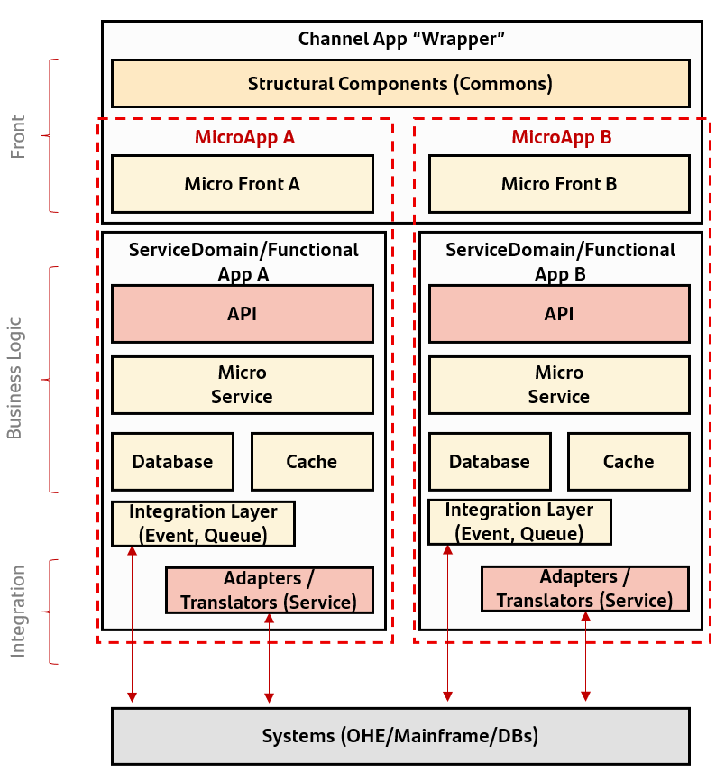

## DMS1 - Functional architecture model

A Microservices Functional Architecture Model has been defined.

Description:

- Front: composed by the app wrapper, common components and micro frontends. It embeds multiple customer journeys through microapps.
- Business Logic : composed by APIs, microservices and data. It has business logic around the product.
- Integration: can be composed by event brokers and queues. It allows communication between microapps. Optionally, it provides an
anti-corruption layer to interact with Systems.

Benefits:

- Microapps creates reusable customer journeys in multiple channels and countries.
- Integration layer creates a common pattern to integrate apps and adapters/translators implements a common interface with other systems.

{: .image-popup align="center" style="width:100%"}
