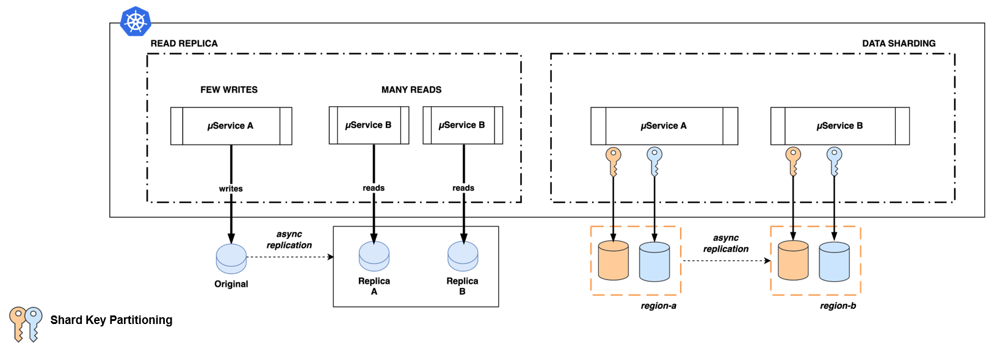

## DMS2 - Resiliency Patterns Definition

A set of resiliency patterns for execution have been defined describing context and providing libraries to implement the patterns when possible:

- Rate limit/throttling, Retry, Circuit breaker, Bulkhead, Compensated transactions, Saga, Read Replica, Sharding, CQRS

{: .image-popup align="center" style="width:100%"}
