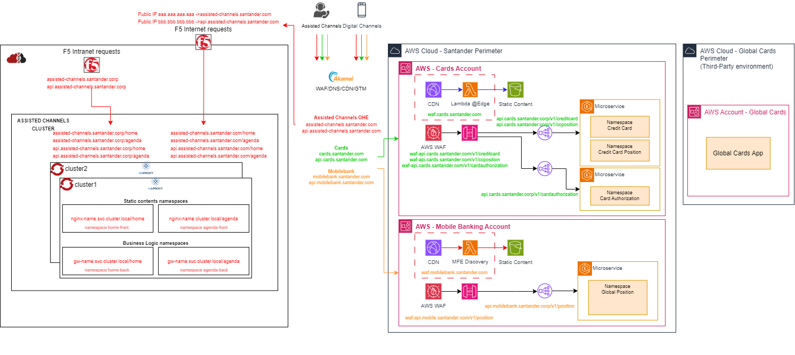
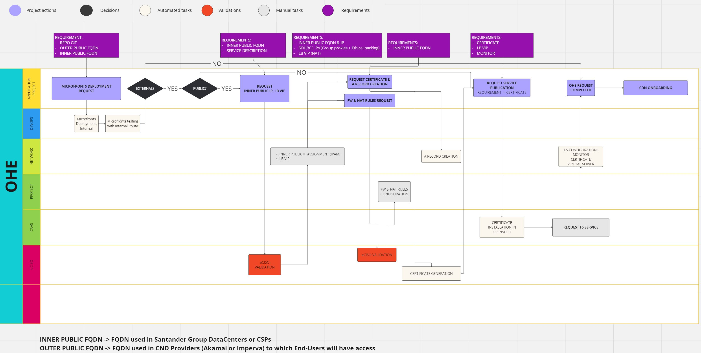
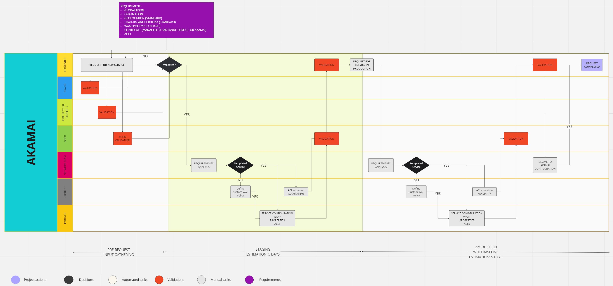

## DN1 - Endpoint Publishing Process

Currently, the process of publishing endpoints on the internet is very complex, since they have to be exposed one by one in each of the different layers (balancers and WAF).
This is expensive in time and effort, already involving a large number of teams, creating a high amount of tickets that must be opened and executed.

### Objectives

- **Simplicity**: No complex configurations based on context path processing are used at GLB and LTM level. Layer 7 routing only applied on ingresses, gateways, CDN and reverse proxies.
- **Ease of operations**: Most actions are performed only one time, when a new OHE infrastructure or AWS account is provisioned.
- **Portability**: Workloads can be moved from OHE to AWS with minimal or no impacts to the customer.

### Key points

- A subdomain corresponds to a Business Domain (Cards) or Product (Assisted Channels).
- A cluster pair in OHE or an account in AWS corresponds to 1 subdomain.
- If some APIs or microfronts of a certain Business Domain or Product are deployed in different infrastructures, each of them requires a different subdomain.
- If the same APIs or microfronts are deployed in several infrastructures (looking for resiliency or scalability), only one subdomain is required.
- Easier CORS management. Cookies can be shared between subdomains as explained in [RFC-6265](https://datatracker.ietf.org/doc/html/rfc6265#section-5.1.3).

### Attention points

- Required to grant that any new asset has passed an ethical hacking before to its public exposition to internet
- It is necessary to work on a fine-grained solution that allows traffic to be redirected in case of a failure of a specific service in one of the clusters (healthcheck at pods/replicaset level).
Vendors currently provide solutions that need to be reviewed in order to solve this problem, such as [f5 Control ingress services.](https://www.f5.com/es_es/products/automation-and-orchestration/container-ingress-services)

### Steps to publish an endpoint in internet (high level)

1. **Ingress – Service routing and load balancing between replicas**. Required to assign a unique DNS entry associated to each service exposed (one time per service exposed, and will be automatically managed in Gluon).
2. **LTM internet endpoints**. Required to assign a public IP associated to each subdomain (one time per cluster pair or account).
3. **LTM intranet endpoints**. Required to assign a unique private DNS entry and private Ips associated to each cluster pair (one time per cluster pair or account)
4. **GLB endpoint publication**. Required to register each subdomain in public certificate, CNAME and GLB (one time per cluster pair or account).

{: .image-popup align="center" style="width:100%"}

### Steps to publish an endpoint

| Requester | Description | Validator | Executor | Inputs | Type of operation |
|----------|----------|----------|----------|----------|----------|
| Project | Microfronts deployment Request | N/A | DevOPS | GIT Repository / Public FQDN - External / Public FQDN - Internals - Region | Automated |
| Project | Public IP & LB VIP request | eCISO | NETWORK | Public FQDN - Internals - Region / Description | Manual |
| Project | Certificate & A record request | N/A | NETWORK | Public FQDN - Internals - Region / Public IP | Automated |
| Project | FW & NAT rules  | eCISO | Protect | Public IP / Source IPs (Group Proxies & Ethical Hacking) / LB VIP | Manual |
| Project | Service Publication | N/A | CaaS | Certificate / LB VIP / Monitors | Automated |

#### OHE (Workflow)

{: .image-popup align="center" style="width:50%"}

#### Akamai (Workflow)

{: .image-popup align="center" style="width:50%"}
