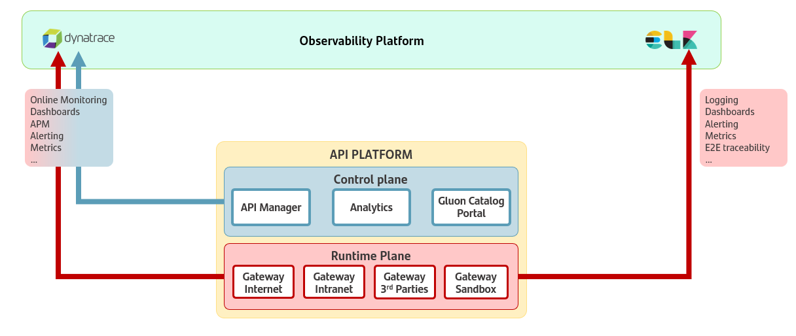

# DOB1 - APIs Observabilty

## Introduction

### API Management Platforms and Observability

The goal of this design guide is to establish the observability strategy for all APIS deployed in Santander Group.

Several API Management platforms are certified, but no global solutions are available to provide the required observability capabilities.
There are some local solutions that can be evolved to be used for logging and traceability headers management at a global level.

### Certified Platforms

- [IBM API Connect v10](../../reference-architecture/observability/apis/ibmapisobservability.md)

- [Apigee OPDK](../../reference-architecture/observability/apis/apigeeapisobservability.md)

- [AWS API Gateway](../../reference-architecture/observability/apis/awsapisobservability.md)

## Approach for API Platforms

Conceptually, the approach will follow the same principles for all the API Platforms:

- Logs must be sent asynchronously to ensure that the logging process does not impact the performance of the API runtime.
- Native log formats must be used to not overload the API runtime plane with unnecessary processing.
- It must be granted that logs generated by the API platforms natively will be enriched with all the required info to meet the global standard log.
- All tecnhologies will sent the enriched native log to the kafka topics provided by the local observability platform.
- After being sent to Kafka, logs must be transformed and adapted to the standard log format (currently [GLOBALOG v4](https://santandernet.sharepoint.com/sites/SantanderPlatforms/SitePages/ObservabilityArch/OBS%20GLOBALOG%20previous%20versions/OBS-Fundamentals-GLOBALOG-v4_0_0-structure.aspx)).
The adapted logs will then be ingested into Elasticsearch.
- Traceability headers X-B3 and W3C, must be properly managed in all API requests and responses to enable end-to-end traceability.

By following this approach, API platforms can achieve a high level of observability, ensuring that logs are efficiently collected, enriched, and analyzed.

## High Level View

{: .image-popup align="center" style="width:80%"}

The image represents an API observability high level view that includes several components:

### **Core Components**

  - **API Platform**:

     - **Control Plane**:
         - **API Manager**: Central block of the API platform which allows to manage APIs lifecycle.
         - **Analytics**: This building block provides the info required for observability purposes.
         - **Gluon Catalog Portal**: It enables developers to find, deploy and consume APIs easily, fostering API adoption and collaboration.

     - **Runtime Plane**:
         - **Gateway Internet**: Routes API traffic from the internet. It acts as the entry point for external API consumers, ensuring secure and efficient handling of incoming requests.
         - **Gateway Intranet**: Routes API traffic within the internal network. It facilitates communication between internal services and APIs, ensuring seamless integration within the organization's infrastructure.
         - **Gateway 3rd Parties**: Manages API traffic to and from external third-party services. It ensures secure and reliable communication with external partners and services, enabling integration with external ecosystems.
         - **Gateway Sandbox**: Used for testing and development purposes, handling sandbox traffic for APIs. It provides a safe environment for developers to test and validate their APIs before deploying them to production.

  - **Local observability platform**: It represents an alerting and monitoring system which ensures that all observability data is collected, correlated, and analyzed in a unified manner.
      - **Observability and Monitoring (1) Dynatrace**:
        - **Online Monitoring, Dashboards, APM (Application Performance Monitoring), Alerting, and Metrics**: APM is used to monitor the APIs performance in real-time, providing dashboards, setting up alerts for potential issues,
        and collecting performance metrics.
        It is useful to identify and resolve performance issues quickly.

      - **Logging and Traceability (2) ELK (Elasticsearch, Logstash, Kibana)**:
         - **Logging, Dashboards, Alerting, Metrics, and End-to-End (E2E) Traceability**: This part of the observability platform is responsible for centralized logging, allowing detailed analysis of API logs.
         It also provides dashboards for visualizing log data, setting up alerts for specific events or thresholds, collecting metrics, and enabling end-to-end traceability of the APIs.
