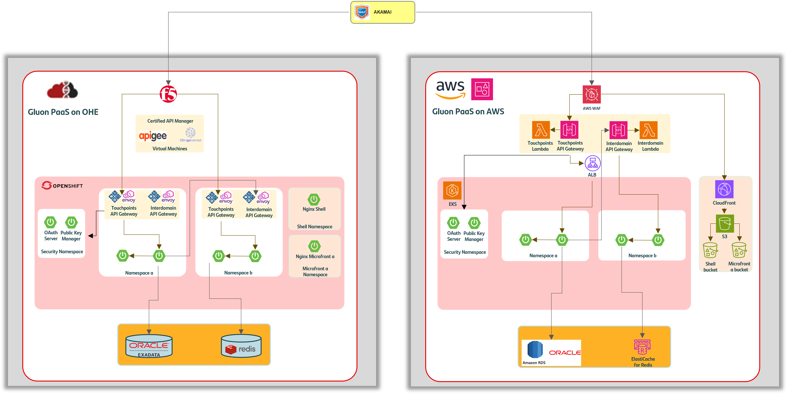

# Gluon Architecture Framework

Discover reference architectures, design guidance, and best practices for building, migrating, and managing your Gluon workloads.

## Introduction

The Gluon Architecture Framework provides recommendations and describes best
practices to help architects, developers, administrators, and other cloud
practitioners design and operate Gluon applications that are secure, efficient,
resilient, high-performing, and cost-effective.
The Gluon Architecture Framework is our version of a well-architected framework.

 

- ### :fontawesome-solid-file-contract: Design guides

    ---

    Build architectures using recommended patterns and practices.

     

    [:octicons-arrow-right-24: Design guides](guides/index.md){ .md-button }

- ### :fontawesome-solid-city: Reference architectures

    ---

    Discover existing reference architectures and deploy or adapt cloud topologies to meet your specific needs.

     

    [:octicons-arrow-right-24: Reference Architectures](reference-architecture/index.md){ .md-button }

 

---

## :fontawesome-solid-building-columns: Gluon Architecture Framework principles

- ### :fontawesome-solid-check: Description

    ---

    New end2end technical architecture for Digital Channels and Assisted channels (micro-fronts, APIs and microservices)

- ### :fontawesome-solid-bullseye: Objective

    ---

    Maximizing reusability across Santander group entities using Gluon as enabler.

- ### :fontawesome-solid-people-group: Sponsorship

    ---

    Global CTO and Global Supply CIO

To standardize the end-to-end tech architecture for channels we are following these principles:

1. :fontawesome-solid-diagram-project: **Channels are 100% stateless based on Micro-Frontends** (no BFF, session or data in the channel level).
2. :fontawesome-solid-cloud: **APIs are published in a GLB service** (Imperva, Akamai, …) to enable dynamic load balancing between
different CSP (private or cloud). **100% of the APIs exposed to channels in a certified API Gateway** (OHE: Apigee or IBM API Connect v10,
AWS/Azure: native API gateway). **All the APIs published** in the gateways should come **from Gluon and 100% aligned with the Gluon Global Catalog**
3. :fontawesome-solid-people-group: **Technical services and middleware required** to optimize the infrastructure **(cache, databases,
message queues, …)** should have a standard access model (through Gluon) and **a detailed technical standard**.
4. :fontawesome-solid-shield-halved: **Business logic is organized in namespaces**. Every **access to the microservices from the API layer** would
be **secured**. **Calls from microservices** in one namespace to another should **go always through an API** (no direct east-west connections) and
use HTTPS/GRPC protocols. Maximum **size of the microservice pods** deployed should be compliant **with the best practices. K8S standard methods**
would be allowed in the container management platforms.
5. :fontawesome-solid-database: All the **access to data from the microservices** should **go through standard architecture services**
provided by Gluon, with different flavors depending on the persistence.
6. :fontawesome-solid-route: **100% of calls** should **be traceable including the channel** (and its device information), and also must
cover **both technical and functional monitoring**, being fully available for teams in charge of observability and resolution of incidents.
7. :fontawesome-solid-gears: **100% of the infrastructure and security provisioning** should be **automated both in private and public cloud**
through a single set of Gluon standard services

---

## :octicons-package-16: Gluon Architecture Framework Capabilities

End to End use cases requires a set of capabilities that are provided by Gluon Architecture Framework.
These capabilities are grouped in the following categories:

- ### Micro-frontends

    ---

    Segregate the UI into small and independent functionalities, and integrate them with events
    within their application container or Shell.

    [:octicons-arrow-right-24: Design guides](guides/mfe/index.md)
     
    [:octicons-arrow-right-24: Reference architectures](reference-architecture/index.md)

- ### APIs

    ---

    All the capabilities required for exposing and managing APIs considering both use cases (touchpoint and inter-domain APIs)

    [:octicons-arrow-right-24: Design guides](guides/apis/index.md)
     
    [:octicons-arrow-right-24: Reference architectures](reference-architecture/index.md)

- ### Microservices

    ---

    Use cases capabilities related to Microservices (Auto-scaling, Multi-Env. Config, REST, gRPC, Rate Limiter, Caching, etc.)

    [:octicons-arrow-right-24: Design guides](guides/ms/index.md)
     
    [:octicons-arrow-right-24: Reference architectures](reference-architecture/index.md)

- ### Data

    ---

    Complete Data products and services for the end-to-end use cases.

    [:octicons-arrow-right-24: Design guides](guides/data/index.md)
     
    [:octicons-arrow-right-24: Reference architectures](reference-architecture/index.md)

- ### Security

    ---

    the E2E security we will be using to support in Santander

    [:octicons-arrow-right-24: Design guides](guides/security/index.md)
     
    [:octicons-arrow-right-24: Reference architectures](reference-architecture/index.md)

- ### Observability

    ---

    End to end tracing, monitoring, and logging capabilities.

    [:octicons-arrow-right-24: Design guides](guides/obs/index.md)
     
    [:octicons-arrow-right-24: Reference architectures](reference-architecture/index.md)

