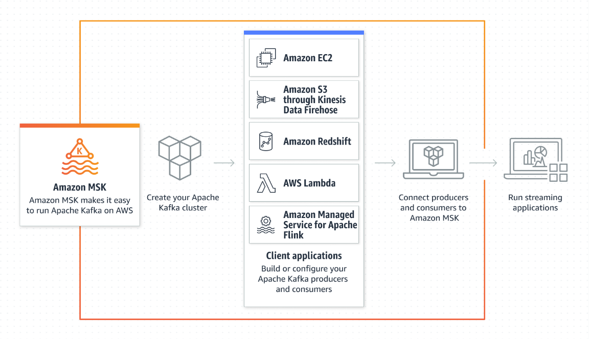
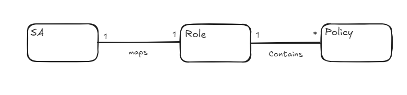

# AWS MSK

## Introduction

Amazon Managed Streaming for Apache Kafka (Amazon MSK) makes it easy to ingest
and process streaming data in real time with fully managed Apache Kafka.



### What is AWS MSK?

Amazon MSK is a fully managed service that makes it easy for you to build and run
applications that use Apache Kafka to process streaming data. Amazon MSK is 100%
compatible with Apache Kafka, which enables you to quickly migrate your existing
Apache Kafka workloads to Amazon MSK with confidence or build new ones from
scratch. The service offers highly available, secure, and durable clusters that are
capable of handling hundreds of megabytes of read and write traffic per second.

When creating a cluster, you must choose a cluster type from two options: provisioned or serverless.
Choosing the best cluster type for each workload depends on the type of workload and your DevOps preferences:

- **MSK Provisioned**: Amazon MSK provisioned clusters offer more flexibility in how you scale, configure, and optimize your cluster.
- **MSK Serverless**: Amazon MSK Serverless, on the other hand, makes scaling, load management, and operation of the cluster easier for you.

## Reference Architecture

### Architecture Diagram

The following diagram illustrates the big picture for deploying an Amazon MSK cluster to be used by Amazon EKS.
This is most common use case for Gluon applications that require a Kafka cluster for event-driven applications.


The most important aspect of this architecture are the following:

1. **Multi-VPC Connectivity**: The architecture allows for multiple VPCs managed by AWS
to connect to the MSK cluster (Only for MSK provisioned). Clients from multiple VPCs
can connect to the MSK serverless cluster using private connectivity.
This is useful when you have applications running in different VPCs that need to communicate with the Kafka cluster.
2. **IAM Authentication**: The architecture uses [EKS pod identity](https://santandernet.sharepoint.com/sites/SantanderPlatforms/SitePages/EKS-Pod-Identity.aspx)
to provide the ability to manage credentials for your applications.

A more detailed diagram of the architecture design is shown below:


??? note "Amazon MSK managed VPC connection (Greyed out icons in the diagram)"
    After the multi-VPC connectivity is enabled on your cluster, Amazon MSK will create the NLB and VPC endpoint service infrastructure
    required for private connectivity. Amazon MSK will vend a new set of bootstrap broker strings that can be used for private connectivity (only for MSK provisioned)

### Amazon MSK multi-VPC connectivity

One of the key features of this architecture is the ability to connect to your Kafka cluster from multiple VPCs.
This is useful when you have applications running in different VPCs that need to communicate with the Kafka cluster.
We will use Amazon Managed Streaming for Apache Kafka (Amazon MSK) multi-VPC private connectivity (powered by AWS PrivateLink)
and cluster policy support for MSK clusters to simplify connectivity of your Kafka clients to your brokers.

??? warning "Multi-VPC connectivity is only supported by MSK Provisioned"
    MSK Serverless does not support managed multi-VPC connectivity. You will need to use shared VPC endpoints (since landing zone 4.0) to connect
    to the MSK Serverless cluster from multiple client VPCs. For more information, see the [Amazon MSK Serverless connectivity patterns](https://aws.amazon.com/es/blogs/big-data/secure-connectivity-patterns-for-amazon-msk-serverless-cross-account-access/).

The following are the high-level steps to configure a provisioned cluster:

1. Enable the multi-VPC private connectivity feature for a subset of authentication schemes that are enabled for your MSK cluster.
2. If a Kafka client is in an AWS account that is different than the cluster, attach a resource-based policy to the MSK cluster to authorize IAM principals for creating cross-account connectivity.
3. Share the cluster ARN with the IAM principal associated with the Kafka client that needs to create the cross-account access to MSK cluster.

The following are the high-level steps to configure the clients:

1. Create a managed VPC endpoint for the client VPC that needs to connect privately to the MSK cluster.
2. Update the VPC endpoint’s security group settings to enable outbound connectivity to the MSK cluster.
3. Set up the client to use the cluster’s connection string to connect privately to the cluster.

#### IAM Authentication

With Cluster policy support, cross-account access control is easy because you can attach a cluster policy to your clusters
to specify which cross-account clients principals have what permissions on resources within the cluster. Further, as we'll
be using IAM client authentication, you can also leverage the cluster policy to centrally control clients’ permissions to
perform operations on the cluster.

For more detailed information on how to configure the cluster and clients, see the [Amazon MSK multi-VPC private connectivity documentation](https://aws.amazon.com/es/blogs/big-data/connect-kafka-client-applications-securely-to-your-amazon-msk-cluster-from-different-vpcs-and-aws-accounts/).

### Schema Registry

The AWS Glue Schema registry allows you to centrally discover, control, and evolve data stream schemas. A schema defines the structure and
format of a data record. With AWS Glue Schema registry, you can manage and enforce schemas on your data streaming applications.

For more information, see the [AWS Glue Schema Registry](https://docs.aws.amazon.com/glue/latest/dg/schema-registry.html).

In this architecture we could use another schema registry like Confluent Schema Registry or the one that the entity already has in place.

## Security

Will cover the identity securitization for the workloads in the pods at two levels: the identity of the workloads within the Kubernetes Cluster
through a proper strategy of service accounts implementation and the federation of those service accounts with an OIDC provider.

When thinking about security of applications that are running within a cluster, there is a main topic that has to be covered to be sure of
having a secure workload: the identity of the application in runtime and how this instance of the application connects to other dependencies of
the solution.

By providing a specific identity to a pod can resolve the issue of having this sensitive data in memory or in disk, and also can provide the
ability to audit all accesses that the application is doing between all the dependencies.

For more information about EKS and AKS security Cyber team recommendations, see the following links:
[EKS Pod Identity](https://santandernet.sharepoint.com/sites/SantanderPlatforms/SitePages/EKS-Pod-Identity.aspx) and [AKS Pod Identity](https://santandernet.sharepoint.com/sites/SantanderPlatforms/SitePages/AKS--POD-identity.aspx).

As you can see this security model is a common scenario for Kubernetes clusters in Public Clouds.

### EKS Pod Identity

Amazon EKS provides a Kubernetes native way to associate IAM roles with pods. This feature allows you to use IAM roles for service accounts to
assign fine-grained IAM permissions to applications running on Amazon EKS.

EKS Pod Identity provide the following benefits:

1. **Least privilege** – You can scope IAM permissions to a service account, and only Pods that use that service account have access to those permissions.
2. **Credential isolation** – A Pod's containers can only retrieve credentials for the IAM role that's associated with the service account that the container uses. A container never has access
to credentials that are used by other containers in other Pods.
3. **Auditability** – Access and event logging is available through AWS CloudTrail to help ensure retrospective auditing.

#### Relation between Roles, Service Accounts and Policies



Example:

1. **Service Account**: `SA.entity.app1_comp1` (is annotated with 2)
2. **IAM Role**: `arn:aws:iam::<account-id>:role/msk_entity_app1_comp1` (has policies 3 and 4)
3. **Policy 1**: `arn:aws:iam::<account-id>:policy/entity_app1_RW_policy`
4. **Policy 2**: `arn:aws:iam::<account-id>:policy/entity_app2_R_policy`

In this example, the service account `SA.entity.app1_comp1` is annotated with the role `arn:aws:iam::<account-id>:role/msk_entity_app1_comp1`
and the role can produce and consume events to/from app1 topic and consume events from app2 topic.

??? note "Public Cloud naming conventions"
    Policies and roles will be created following the Public cloud naming convention. For service account naming conventions, see
    the [Naming conventions and Service Accounts](#naming-conventions-and-service-accounts) section.

### Client Authentication

#### SASL-OAUTHBEARER Mechanism

The ability to authenticate to Kafka with an OAuth 2 Access Token is desirable given the popularity of OAuth. "OAUTHBEARER" is the SASL mechanism for OAuth 2.

We recommend using the **SASL/OAUTHBEARER** mechanism for authentication with MSK clusters. This mechanism is commonly used in cloud
environments and products like MSK, Confluent platform (no cloud) and Azure Event Hubs, and is supported by the Kafka clients from multiple programming languages.

In the case of Java clients you could also use AWS_MSK_IAM mechanism if needed. For more information on how to configure clients for IAM access
control, see the [Configure clients for IAM access control](https://docs.aws.amazon.com/msk/latest/developerguide/configure-clients-for-iam-access-control.html#:~:text=Use%20the%20S20ASL_OAUTHBEARER%20mechanism%20to%20configure).

??? warning "Gluon frameworks impacted"
    Gluon frameworks needs to implement this new functionality in order to be able to connect to the MSK cluster with this mechanism.

??? note "Kafka OAuth 2.0 Authentication"
    The SASL/OAuthBearer mechanism provided through MSK Server brokers is built on [KIP-255 OAuth Authentication via SASL/OAUTHBEARER](https://cwiki.apache.org/confluence/pages/viewpage.action?pageId=75968876)

## Deployment

### Prerequisites

EKS Pod Identity agent is required to be installed in the EKS cluster. The agent is
responsible for managing the association between IAM roles and Kubernetes service accounts.

### IaC Deployment with Terraform

The preferred tool for all the infrastructure automation for the Amazon MSK cluster is Terraform. Also, IAM policies, roles
and topic creation will be done using Terraform.

Terrafom is used by most of the countries using MSK at this moment.

### Application Deployment

Steps to deploy an application that uses Amazon MSK:

1. Annotate the Service Account with the IAM role ARN that you want to associate with the service account.

    ```yaml
    apiVersion: v1
    kind: ServiceAccount
    metadata:
        name: my-service-account
        namespace: default
        annotations:
            eks.amazonaws.com/role-arn: arn:aws:iam::<account-id>:role/<iam-role-name>
    ```

2. Deployment configuration. The following is an example of a deployment configuration that uses the service account.

    ```yaml
    apiVersion: apps/v1
    kind: Deployment
    metadata:
        name: my-deployment
    spec:
        replicas: 1
        selector:
            matchLabels:
                app: my-app
        template:
            metadata:
                labels:
                    app: my-app
            spec:
                serviceAccountName: my-service-account
                containers:
                - name: my-container
                  image: my-image
    ```

## Provisioned vs Serverless

MSK provisioned clusters offer more flexibility in how you scale, configure, and optimize your cluster. MSK Serverless, on the other hand, is a
cluster type that makes it easier for you to run Apache Kafka clusters without having to manage compute and storage capacity.

Our recommendation is to start with MSK Serverless if your application does not require broker-level custom configurations, and your application
throughput needs don’t exceed the quotas for the MSK Serverless cluster type. Sometimes it’s best to split your workloads between multiple MSK
Serverless clusters, but if that is not possible, you may need to consider an MSK provisioned cluster. To operate an optimized MSK provisioned
cluster, you need to have Kafka competency within your organization.

For MSK quotas and limits, see the [Amazon MSK quotas and limits](https://docs.aws.amazon.com/msk/latest/developerguide/limits.html).

## Naming conventions and Service Accounts

### Events and commands naming conventions

- Events: `[ENTITY][LENV]?.[ACRONYM-APPLICATION].[RESOURCE].[ACTION-PAST]`
- Commands: `[ENTITY][LENV]?.[ACRONYM-APPLICATION].[RESOURCE].[ACTION-INFINITVE]`

Naming tokens meaning:

- **Entity**: Acronym of the entity owner of the application.
- **LENV**: (Optional) The logical environment for the same MSK cluster.
- **ACRONYM-APPLICATION**: The acronym of the application in Gluon.
- **RESOURCE**: Resource in with the business event or command occurs (BIAN BUSINESS DOMAIN or BIAN SERVICES DOMAIN Depending on the event gobernance)
- **ACTION**: Describes the action or fact about the resource.

### Topics naming conventions

`[ENTITY][LENV]?.[ACRONYM-APPLICATION].*`

- **Entity**: Acronym of the entity owner of the application.
- **LENV**: (Optional) The logical environment for the same MSK cluster.
- **ACRONYM-APPLICATION**: The acronym of the application in Gluon.

### Services accounts

Service accounts will be used by automation pipelines in Github actions and by the applications running in the EKS cluster.

- **sa_global_automation**: Service account for global automation tasks (must be aligned with existing Gluon application 360 Service accounts)
- **`SA_[ENV]_AUTOMATION`**: Service account for automation tasks in a specific environment (must be aligned with existing Gluon application 360 Service accounts)
- **`SA.[ENTITY][LENV]?.[ACRONYM-APPLICATION].[SHORT-NAME-COMPONENT]?.[ENV]?`**: Service account for the applicattion component.

Service accounts are annotated with the IAM role ARN that you want to associate with the service account. The roles will be
created automatically during the gluon onboarding process and/or the subscription process.

??? note "Public Cloud naming conventions"
    Policies and roles will be created following the Public cloud naming convention.

## Additional tools

In addition to this, it'd be great to have a tool that can help us to rebalance your Amazon MSK cluster, detect and fix anomalies,
and monitor the state and health of the cluster.

Please refer to the [Cruise Control for Apache Kafka with Amazon MSK](https://docs.aws.amazon.com/msk/latest/developerguide/cruise-control.html)
documentation for more information.

## Architecture Scope

The use cases that need Amazon Managed Service for Apache Flink to query and analyze the data is out of the scope of this architecture.

### MSK Connectors

With Amazon MSK Connect, a feature of Amazon MSK, you can run fully managed Apache Kafka Connect workloads on AWS. This feature makes it
easy to deploy, monitor, and automatically scale connectors that move data between Apache Kafka clusters and external systems such as databases,
file systems, and search indices.

MSK Connect is fully compatible with Kafka Connect, enabling you to lift and shift your Kafka Connect
applications with zero code changes.

The architecture and design of the connectors will be defined by use case and the entity's requirements. It's out of the scope of the current
version of the reference architecture.
