# Confluent Cloud Architecture on AWS

- [1. Introduction](#1-introduction)
    - [1.1 Objective](#11-objective)
    - [1.2 Scope](#12-scope)
- [2. What is Confluent Cloud](#2-what-is-confluent-cloud)
    - [2.1 Overview](#21-overview)
    - [2.2 Capabilities](#22-capabilities)
- [3. Architecture](#3-architecture)
    - [3.1 Technical View](#31-technical-view)
    - [3.2 Deployment Topology](#32-deployment-topology)
    - [3.3 Networking](#33-networking)
    - [3.4 Security](#34-security)
    - [3.5 Observability](#35-observability)
    - [3.6 Architectural constraints](#36-architectural-constraints)
- [4. Resilience](#4-resilience)
- [5. Events lifecycle in Confluent Cloud](#5-events-lifecycle-in-confluent-cloud)
- [6. Best Practices](#6-best-practices)
- [7. Exit Plan](#7-exit-plan)
- [8. References](#8-references)

---

## 1. Introduction

### 1.1 Objective

This page provides a detailed technical reference architecture (TRA) for deploying Confluent Cloud on AWS, including guidelines and best practices for networking, security, and deployment.

### 1.2 Scope

This TRA is based on the [Confluent Cloud TRA for Azure](https://santandernet.sharepoint.com/sites/cybertoolbox/Data/Shared%20Documents/Files/TRAs/Common/TRA_Confluent%20Cloud%20v1.4.docx?d=we1ebe37067844fc4a5b42c626787cae9&csf=1&web=1&e=F9PN2F).

The main goal is to adapt the same architecture to AWS environments.

---

## 2. What is Confluent Cloud

### 2.1 Overview

Confluent Cloud is a fully managed SaaS provided by Confluent, meaning that Confluent manages all the underlying infrastructure and maintenance.

You are responsible for configuring your Kafka cluster, Flink processors, and Schema Registry. Other components, such as Producers, Consumers and Connectors, are managed within your AWS environment.

Kafka enables multiple data producers to publish streaming data to categorized topics, while data consumers can independently read from these topics at their own pace, functioning similarly to a message queue system or enterprise messaging system.

### 2.2 Capabilities

Confluent Cloud offers the following key capabilities:

- **Managed Kafka Infrastructure**:  
  Confluent Cloud manages Apache Kafka infrastructure and operations, including broker replacement, data replication, patching, auto-scaling, partition rebalancing, metrics visibility, and supports Kafka version upgrades.

- **Connector Management**:  
  Confluent offers a wide range of source and sink connectors. As mentioned before, these connectors must be deployed in Santander environments for better control and compliance.

- **Automatic Partition Reassignment**:  
  Automatically reassigns partitions with consumers to optimize performance.

- **Tiered Storage**:  
  Allows long-term event retention in low-cost storage such as S3. However, this feature is restricted due to cybersecurity policies that prohibit long retention in SaaS solutions.

- **Kafka Connect**:  
  Enables the use of open-source connectors to integrate services as sources or destinations for Kafka clusters. This component must be managed within your Santander AWS environment.

- **Cluster Linking and Replication**:  
  Confluent Cloud supports replicating events and topic configurations between clusters.
  Cluster Linking allows direct communication between clusters without re-generating events, enabling integration between on-premise Confluent platforms and Confluent Cloud.
  Schema Registry synchronization between clusters is also supported.

- **Integration with AWS Services**:  
  Seamlessly integrates with AWS services such as EC2, Lambda, ECS, and EKS for Producers and Consumers.

- **Schema Registry**:  
  Manages event schemas, supports creating references to other schemas, and allows metadata tagging. It also enforces encryption rules (e.g., PII) and ensures compliance with schema definitions for Producers, Consumers, and Topics.

- **Stream Processing with Flink**:  
  Enables true streaming and micro-batching transformations between topics within the same or different clusters.

#### Confluent Cloud clusters types

Confluent Cloud offers clusters designed for sending and consuming events with configurable retention periods and reliable real-time delivery. It provides various cluster types, each with distinct features to meet different needs:

<table style="border-collapse: collapse; width: 100%; text-align: left;">
  <thead>
    <tr>
      <th>Category</th>
      <th>Feature</th>
      <th>Basic</th>
      <th>Standard</th>
      <th>Enterprise</th>
      <th>Dedicated</th>
    </tr>
  </thead>
  <tbody>
    <tr>
      <td rowspan="5">Kafka</td>
      <td>Kafka ACLs</td>
      <td>Yes</td>
      <td>Yes</td>
      <td>Yes</td>
      <td>Yes</td>
    </tr>
    <tr>
      <td>Exactly Once Semantics</td>
      <td>Yes</td>
      <td>Yes</td>
      <td>Yes</td>
      <td>Yes</td>
    </tr>
    <tr>
      <td>Fully-managed replica placement</td>
      <td>Yes</td>
      <td>Yes</td>
      <td>Yes</td>
      <td>Yes</td>
    </tr>
    <tr>
      <td>Key-based compacted storage</td>
      <td>Yes</td>
      <td>Yes</td>
      <td>Yes</td>
      <td>Yes</td>
    </tr>
    <tr>
      <td>Topic management</td>
      <td>Yes</td>
      <td>Yes</td>
      <td>Yes</td>
      <td>Yes</td>
    </tr>
    <tr>
      <td rowspan="3">Connect</td>
      <td>Fully-Managed Connectors</td>
      <td>Yes</td>
      <td>Yes</td>
      <td>Yes</td>
      <td>Yes</td>
    </tr>
    <tr>
      <td>Custom Connectors</td>
      <td>Yes</td>
      <td>Yes</td>
      <td>Yes</td>
      <td>Yes</td>
    </tr>
    <tr>
      <td>View and consume Connect logs</td>
      <td>Yes</td>
      <td>Yes</td>
      <td>Yes</td>
      <td>Yes</td>
    </tr>
    <tr>
      <td rowspan="2">Stream Processing</td>
      <td>Flink</td>
      <td>Yes</td>
      <td>Yes</td>
      <td>Yes</td>
      <td>Yes</td>
    </tr>
    <tr>
      <td>ksqlDB</td>
      <td>Yes</td>
      <td>Yes</td>
      <td>No</td>
      <td>Yes</td>
    </tr>
    <tr>
      <td rowspan="3">Governance</td>
      <td>Stream Governance</td>
      <td>Yes</td>
      <td>Yes</td>
      <td>Yes</td>
      <td>Yes</td>
    </tr>
    <tr>
      <td>Stream Catalog</td>
      <td>Yes</td>
      <td>Yes</td>
      <td>Yes</td>
      <td>Yes</td>
    </tr>
    <tr>
      <td>Stream Lineage</td>
      <td>Yes</td>
      <td>Yes</td>
      <td>Yes</td>
      <td>Yes</td>
    </tr>
    <tr>
      <td rowspan="3">Networking</td>
      <td>Public networking</td>
      <td>Yes</td>
      <td>Yes</td>
      <td>No</td>
      <td>Yes</td>
    </tr>
    <tr>
      <td>Private networking</td>
      <td>No</td>
      <td>No</td>
      <td>Yes</td>
      <td>Yes</td>
    </tr>
    <tr>
      <td>Cluster Linking</td>
      <td>Yes</td>
      <td>Yes</td>
      <td>Yes</td>
      <td>Yes</td>
    </tr>
  </tbody>
</table>

There is also a cluster type called "Freight" which is currently supported only on AWS and is **out of scope for this version of the architecture**, so its use is not allowed until a thorough security assessment has been completed.

It is recommended to consult the official Confluent Cloud documentation to review all features of the cluster types offered and their limits: [Confluent Cloud Cluster Types](https://docs.confluent.io/cloud/current/clusters/cluster-types.html)

From this architecture, it is recommended to use **Enterprise** or **Dedicated** clusters for production environments due to their support for private connections.

If your DNS does not support forwarding information between on-premise and cloud clusters, a **Dedicated Cluster** is recommended. Once Confluent resolves this issue, **Enterprise** clusters are preferred due to their cost-effectiveness.

#### Schema Registry

##### Overview

Schema Registry is a schema container separate from the Kafka cluster that defines the structure of events and validates them against topics.

It ensures compatibility and consistency for Producers, Consumers, Connectors, and Processors by validating events against schemas.

Schema Registry integrates with Kafka through:

- **Schema ID validation**
- **Connectors with converters**
- **Confluent REST Proxy**
- **Confluent CLI**
- **Confluent Console**

It is included in **Essential** or **Advanced Stream Governance** packages, offering features like validation, compatibility checking, evolution, and versioning. This reduces the risk of data compatibility issues, corruption, and loss.

Schema Registry supports **Avro**, **Protobuf**, and **JSON Schema** formats. **Avro** is recommended, while **JSON** is suggested only for CDC or services that do not support Avro.

##### Features

Schema Registry provides:

- **REST Service**: For validating, storing, and retrieving schemas in Avro, JSON Schema, and Protobuf formats.
- **Serializers and Deserializers**: Plug into Kafka clients to handle schema storage and retrieval for Kafka messages.

With Schema Registry, you can define:

- Message structure
- Format type
- Relationships between fields
- Constraints or rules

##### Compatibility Check

Schema Registry supports various compatibility types:

<table style="border-collapse: collapse; width: 100%; text-align: left;">
  <thead>
    <tr>
      <th>Compatibility Type</th>
      <th>Allowed Changes</th>
      <th>Check Against</th>
      <th>Upgrade First</th>
    </tr>
  </thead>
  <tbody>
    <tr>
      <td>BACKWARD</td>
      <td>Delete fields, Add optional fields</td>
      <td>Last version</td>
      <td>Consumers</td>
    </tr>
    <tr>
      <td>BACKWARD_TRANSITIVE</td>
      <td>Delete fields, Add optional fields</td>
      <td>All previous versions</td>
      <td>Consumers</td>
    </tr>
    <tr>
      <td>FORWARD</td>
      <td>Add fields, Delete optional fields</td>
      <td>Last version</td>
      <td>Producers</td>
    </tr>
    <tr>
      <td>FORWARD_TRANSITIVE</td>
      <td>Add fields, Delete optional fields</td>
      <td>All previous versions</td>
      <td>Producers</td>
    </tr>
    <tr>
      <td>FULL</td>
      <td>Add optional fields, Delete optional fields</td>
      <td>Last version</td>
      <td>Any order</td>
    </tr>
    <tr>
      <td>FULL_TRANSITIVE</td>
      <td>Add optional fields, Delete optional fields</td>
      <td>All previous versions</td>
      <td>Any order</td>
    </tr>
    <tr>
      <td>NONE</td>
      <td>All changes are accepted</td>
      <td>Compatibility checking disabled</td>
      <td>Depends</td>
    </tr>
  </tbody>
</table>

**Recommendations**:

- Use **BACKWARD_TRANSITIVE** for commands.
- Use **FORWARD_TRANSITIVE** for events.
- Use **FULL_TRANSITIVE** for CDC.

##### Stream Governance Packages

Schema Registry is included in **Essential** package. To enable **PII Encryption**, the **Advanced** package is required, as it includes support for data rules. The following table compares their features:

<table style="border-collapse: collapse; width: 100%; text-align: left;">
  <thead>
    <tr>
      <th>Feature</th>
      <th>Essentials</th>
      <th>Advanced</th>
    </tr>
  </thead>
  <tbody>
    <tr>
      <td>Schema Registry</td>
      <td>✔</td>
      <td>✔</td>
    </tr>
    <tr>
      <td>Schema Registry SLA</td>
      <td>99.5%</td>
      <td>99.99%</td>
    </tr>
    <tr>
      <td>Schema Registry calls per second</td>
      <td>Read: 75, Write: 25</td>
      <td>Read: 75, Write: 25</td>
    </tr>
    <tr>
      <td>Data Rules</td>
      <td>No</td>
      <td>✔</td>
    </tr>
    <tr>
      <td>Number of data contracts included</td>
      <td>100</td>
      <td>20,000</td>
    </tr>
    <tr>
      <td>Stream Catalog Tags</td>
      <td>✔</td>
      <td>✔</td>
    </tr>
    <tr>
      <td>Stream Catalog Business Metadata</td>
      <td>No</td>
      <td>✔</td>
    </tr>
    <tr>
      <td>Stream Catalog REST API</td>
      <td>✔</td>
      <td>✔</td>
    </tr>
    <tr>
      <td>Stream Catalog GraphQL API</td>
      <td>No</td>
      <td>✔</td>
    </tr>
    <tr>
      <td>Data Portal</td>
      <td>✔</td>
      <td>✔</td>
    </tr>
    <tr>
      <td>Stream Lineage (last 10 minutes)</td>
      <td>✔</td>
      <td>✔</td>
    </tr>
    <tr>
      <td>Stream Lineage (last 7 days)</td>
      <td>No</td>
      <td>✔</td>
    </tr>
    <tr>
      <td>AsyncAPI Specification Export/Import</td>
      <td>✔</td>
      <td>✔</td>
    </tr>
  </tbody>
</table>

Schema Registry is deployed in the same region and environment as the Kafka cluster.

*Limitations*:

- Upgrading to **Advanced** is possible, but downgrading to **Essentials** requires deleting the cluster and starting over. Schema Registry must only be deleted when the environment it belongs to is going to be deleted.

- API rate limits apply to the Catalog API (not designed for continuous requests).

##### Subject Naming Strategies

When creating a Schema Registry, you can specify a **subject naming strategy** to integrate schemas with topics:

<table style="border-collapse: collapse; width: 100%; text-align: left;">
  <thead>
    <tr>
      <th>Strategy</th>
      <th>Description</th>
    </tr>
  </thead>
  <tbody>
    <tr>
      <td>TopicNameStrategy</td>
      <td>Derives the subject name from the topic name (default).</td>
    </tr>
    <tr>
      <td>RecordNameStrategy</td>
      <td>Derives the subject name from the record name, grouping logically related events with different structures under a subject.</td>
    </tr>
    <tr>
      <td>TopicRecordNameStrategy</td>
      <td>Derives the subject name from the topic and record name, grouping logically related events with different structures.</td>
    </tr>
  </tbody>
</table>

*Recommendation*: Use **TopicNameStrategy**.

##### Schema Contexts in Confluent Schema Registry

A **schema context** in Confluent Schema Registry is a grouping of subject names and schema IDs, allowing a single Schema Registry cluster to host multiple contexts.

Each context acts as a separate "sub-registry," ensuring that subject names and schema IDs are unique within their respective contexts.

Most REST APIs accept a subject name, such as `POST /subjects/{subject}/versions`. These APIs now support a query parameter named `subject` (e.g., `?subject`), enabling the use of qualified subject names. For example: `/schemas/ids/{id}?subject=:.mycontext:mysubject`

##### Validations

Producers, consumers, connectors, and processors can validate events serialized and deserialized using Schema Registry.

In Confluent Cloud, **Schema ID Validation** enables brokers to verify that data produced to a Kafka topic uses a valid schema ID registered in Schema Registry, following the subject naming strategy.

##### Reference Schemas

Other schemas can be referenced within a schema along with their versions:

- **JSON Schema**: The name is the value in the `$ref` field of the referenced schema.
- **Avro**: The name is the full name of the referenced schema, as specified in the `name` field.

##### Data Contracts

A **data contract** is a formal agreement between upstream and downstream components on the structure and semantics of data in motion. It includes:

- **Structure**: Defined by the schema, specifying fields and their types.
- **Integrity Constraints**: Data quality rules or declarative constraints (e.g., age must be a positive integer).
- **Metadata**: Additional information about the schema, such as ownership or sensitive data indicators.
- **Rules/Policies**: Enforce encryption if required or handle invalid data (e.g., sending invalid messages to a dead letter queue).
- **Change/Evolution**: Supports versioning and migration rules to accommodate breaking changes.

**Tags** can annotate schemas or their parts, either inline or externally. Metadata can include glossary terms, business attributes, ownership, and contact information.

##### Rules

Rules define constraints or transformations for data contracts. More info:

- [Rules](https://docs.confluent.io/platform/current/schema-registry/fundamentals/data-contracts.html#rules)
- [Data Quality Rules](https://docs.confluent.io/platform/current/schema-registry/fundamentals/data-contracts.html#data-quality-rules)
- [Field-Level Transformations](https://docs.confluent.io/platform/current/schema-registry/fundamentals/data-contracts.html#field-level-transforms)

#### Replication

Cluster data replication in Confluent Cloud operates at the top level, enabling the creation of mirror topics in the destination cluster with the same configuration as the source.

This functionality facilitates event transmission between clusters and is particularly useful for:

- **Real-time event consumption**: When strict real-time requirements exist, especially for geographically distant data.
- **Disaster recovery and resilience**: Ensuring data availability across regions.
- **Cluster migrations**: Seamless migration of data between clusters.
- **Data sharing**: Controlled sharing of data across clusters.

**Important**: Data replication between different entities must be approved by the relevant teams, considering the confidentiality level of the data.

Confluent Cloud offers two replication methods, Confluent Replicator and Cluster linking:

##### Confluent Replicator

A connector that replicates topics between clusters, recreating events and preserving topic configurations from their origins (e.g., partitions, replication factors, retention, etc...).  

[Features - official documentation](https://docs.confluent.io/platform/current/multi-dc-deployments/replicator/index.html#features)

Limitations and requirements:

- Requirements: Requires deployment in Santander AWS Landing Zone or OHE clusters.
- [Limitations - official documentation](https://docs.confluent.io/platform/current/multi-dc-deployments/replicator/index.html#limitations)

##### Confluent Cluster Linking

Directly mirrors source topics to destination clusters without recreating events.  

Features:

- Exact mirroring of partitions and offsets.
- No duplicate records.
- REST API and CLI support for dynamic updates.
- Built-in support for authentication and authorization.

Limitations:

- Requires Confluent Server for the destination cluster.
- Source and destination clusters must meet specific version requirements.
- When implementing cluster linking between different entities, communication must pass through firewalls to ensure proper security and compliance.

More details of Cluster Linking [here](https://docs.confluent.io/platform/current/multi-dc-deployments/cluster-linking/index.html)

Recommendations:

- Use **Cluster Linking** for communication within the same entity.
- Use **Replicator** when Cluster Linking is not feasible due to capacity limitations.

##### Schema Linking

**Schema Linking** synchronizes schemas across two Schema Registry clusters. It works alongside Cluster Linking to keep schemas and topic data in sync.

Components:

1. **Schema Contexts**: Independent groupings of schema IDs and subject names, allowing multiple "sub-registries" within a single Schema Registry cluster.
2. **Schema Exporters**: Export schemas from one Schema Registry cluster to another.

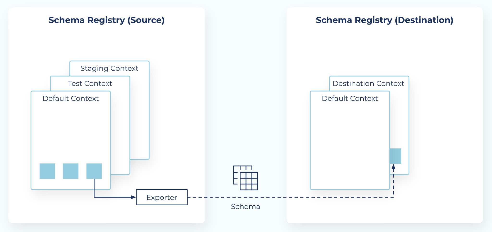

See [more](https://docs.confluent.io/cloud/current/sr/schema-linking.html)

#### Connectors

Confluent Cloud offers managed connectors to read and write events to/from target services.

Limitations:

- Cybersecurity policies prohibit managing connectors directly in Confluent Cloud. Connectors must be always deployed in Santander AWS Landing Zone.
- Connections must be private to send or read events.

For more details, refer to the [Confluent Connectors Portfolio](https://www.confluent.io/product/connectors/).

#### Processing

Confluent Cloud provides a serverless processing layer with **ksqlDB** and **Flink** for event transformations.

##### ksqlDB

A fully managed SQL-based stream processing platform.  

Features:

- Web interface for managing queries.
- Integration with Schema Registry.
- SQL-based Connect integration.
- Available in AWS, Azure, and Google Cloud.

Limitations:

- No support for UDFs.
- Limited to 40 persistent queries and 100 push queries per cluster.

[More info - official documentation](https://docs.confluent.io/cloud/current/ksqldb/overview.html)

##### Flink

Flink is a scalable stream processing framework for complex, low-latency applications.  

Features:

- Fully managed and serverless.
- Integrated with RBAC and Schema Registry.
- SQL, Python Table API, and Java Table API support.

Limitations:

- Flink clusters can only process topics within the same region (Confluent Cloud restriction)
- Santander prohibits Flink from consuming topics across different environments, even though Confluent Cloud supports it.

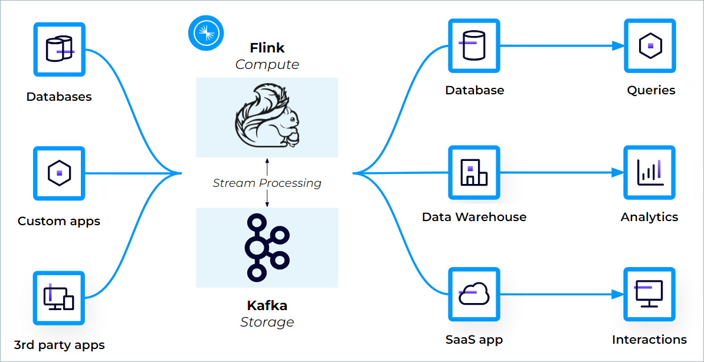

[More info - official documentation](https://docs.confluent.io/cloud/current/flink/overview.html)

---

## 3. Architecture

### 3.1 Technical view

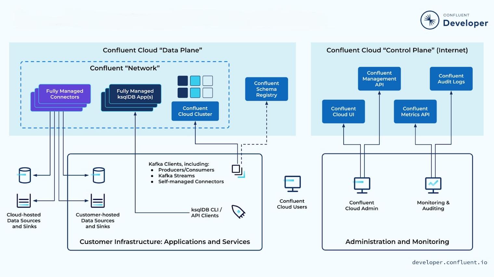

### 3.2 Deployment topology

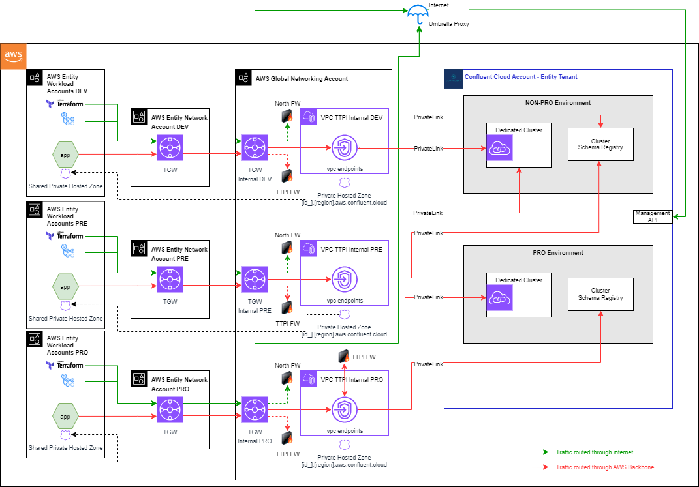

### 3.3 Networking

#### Connectivity Overview

This section describes the connectivity to Confluent Cloud resources across two planes:

- **Data Plane Architecture**: Explains how service clients connect to Confluent Cloud, including communication protocols. This is divided into three scenarios based on the client’s hosting location: OHE or AWS.

- **Control Plane Architecture**: Details how service administrators configure and manage the lifecycle of Confluent Cloud resources.

To ensure strong network isolation, create distinct VPCs, subnets, and segments for each environment, and implement appropriate security measures.

#### Supported Networking Solutions

Confluent Cloud supports the networking options listed [here](https://docs.confluent.io/cloud/current/networking/overview.html).

**Note**: Only **Enterprise** and **Dedicated** clusters are allowed in production environments.

The network design leverages PrivateLink endpoints to securely connect to Confluent Cloud, ensuring compliance with Santander Group's security standards.

This architecture requires traffic to pass through at least two virtual network peerings and a firewall perimeter.

#### Data Plane Architecture

##### AWS Connectivity

AWS workload accounts communicate with Confluent Cloud clusters through AWS backbone.

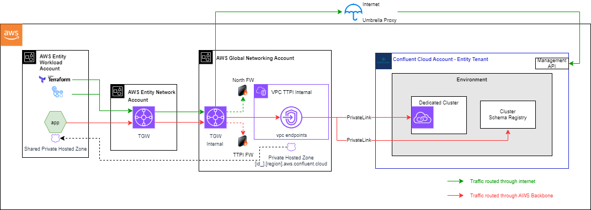

- Confluent clusters must be accessed via AWS PrivateLink, which must be properly configured in the existing TTPI VPC inside the Global Networking Account of the Regional LZ.
- In Confluent, when the PrivateLink is configured, a DNS domain similar than [privatelinkId].[region].aws.confluent.cloud will be created.
- In TTPI VPC of the Global Networking account, a private hosted zone must be created pointing to the previous DNS.
- The private hosted zone must be shared with the workloads accounts so that they obtain connectivity with the Confluent Cloud cluster.

##### On-premises Connectivity

On-premises clients (e.g., microservices, Kafka Streams) communicate with Confluent Cloud clusters and Schema registries using private links. The process is as follows:

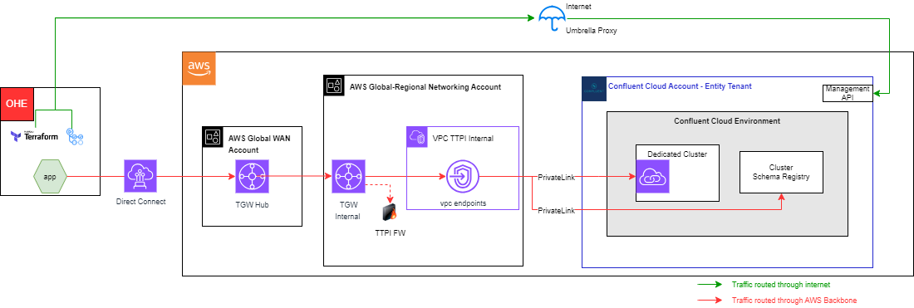

- The client sends a recursive request to the local resolver to resolve the bootstrap server in the cloud.
- If the local resolver lacks the answer, it sends an iterative request to the Root Zone. The Root Server responds with the private zone authoritative server information.
- The authoritative DNS server provides a Type A resolution for the bootstrap server.
- On-premises clients reach the resource’s Private Link through the Direct Connect that connects on-premises GSNet networks to AWS. This traffic always passes through the Transit Firewall perimeter.
- The Private Link is deployed in a TTPI (Third Trusted Party Interconnection) subnet, ensuring it is reachable from on-premises GSNet networks.
- The Private Link enables private connectivity to Confluent Cloud via AWS's backbone.
- Public clusters should not be exposed through secure public endpoints or VPC peering.
- Confluent Cloud cannot communicate with other SaaS solutions over the Internet or third parties. Communication is restricted to Santander's Cloud Landing Zone or OHE on-premises, initiated from these environments.
- IP whitelisting must be configured in Confluent Cloud to restrict access to producers and consumers.

#### Control Plane Architecture

The Control Plane manages the configuration, monitoring, and lifecycle of Confluent Cloud resources. Administrators can use tools like CLI, CI/CD workflows, and APIs to interact with the Control Plane. Typical activities are:

- Provisioning and managing Confluent Cloud resources.
- Monitoring resource health and performance.
- Tracking access via audit logs.

By default, the Control Plane is exposed to the Internet. To enhance security, IP filtering should be enabled to restrict access to trusted networks.

##### IP Filtering

IP Filtering restricts access to Confluent Cloud management APIs (`api.confluent.cloud`) to trusted source networks. Requests from untrusted IPs are denied.

Steps to Implement IP Filtering:

- Create IP groups with trusted origins: [Create IP Group](https://docs.confluent.io/cloud/current/access-management/access-control/ip-filtering/manage-ip-groups.html#create-ip-group).

- Create IP filters: [Create IP Filter](https://docs.confluent.io/cloud/current/access-management/access-control/ip-filtering/manage-ip-filters.html#create-ip-filter).

- Test connectivity from trusted and untrusted origins.

**Note**: Add IP ranges to allow access from the Internet (proxy SaaS) or on-premises networks.

### 3.4 Security

This architecture must follow the Security Controls for Public Cloud defined [here](https://santandernet.sharepoint.com/sites/SantanderPlatforms/SitePages/Cloud_Security_29853642.aspx).

In this case, Confluent Cloud must be compliance with the following controls:

| **Control Category** | **Control**                                      | **Control Type**         |
|-----------------------|-------------------------------------------------|--------------------------|
| FOUNDATION (F)        | SF1: IAM on all accounts                        | Control Plane            |
| FOUNDATION (F)        | SF2: MFA on user accounts                       | Control Plane            |
| FOUNDATION (F)        | SF3: Platform Activity Logs & Security Monitoring | Control Plane            |
| FOUNDATION (F)        | SF5: Authenticate all connections               | Data Plane               |
| FOUNDATION (F)        | SF6: Isolated environments at network level     | Data Plane               |
| FOUNDATION (F)        | SF8.1: Privileged Access Management             | Control Plane            |
| FOUNDATION (F)        | SF8.2: Service Accounts                         | Control Plane            |
| APPLICATION (P)       | SP1: IAM - Assets identification and tagging    | Control Plane, Data Plane|
| APPLICATION (P)       | SP4: Service Logs & Security Monitoring         | Control Plane            |
| APPLICATION (P)       | SP5: Network Security                           | Data Plane               |
| APPLICATION (P)       | SP7: Encrypt data in transit over public interconnections | Data Plane               |
| APPLICATION (P)       | SP13: Data Loss Prevention                      | Data Plane               |
| BASIC (B)             | SB4: Production real data in non-production environments | Data Plane               |
| MEDIUM (M)            | SM1: IAM                                        | Control Plane, Data Plane|
| MEDIUM (M)            | SM2: Encrypt data at rest                       | Data Plane               |
| MEDIUM (M)            | SM3: Encrypt data in transit over private interconnections | Control Plane, Data Plane|
| MEDIUM (M)            | SM5: Production real data in non-production environments | Data Plane               |
| ADVANCED (A)          | SA1: IAM                                        | Control Plane, Data Plane|
| ADVANCED (A)          | SA2: Encrypt data at rest                       | Data Plane               |
| ADVANCED (A)          | SA3: Encrypt data in transit over private interconnections | Control Plane, Data Plane|
| ADVANCED (A)          | SA4: Santander managed keys                     | Data Plane               |
| ADVANCED (A)          | SA7: MFA on user access to data                 | Control Plane            |
| ADVANCED (A)          | SA8: Production real data in non-production environments | Data Plane               |

#### Identity

The security aspects related with identity can be divided based on the plane that the resource accessed belongs:

   - Control Plane, solving all related with how administration roles can securely manage the resources lifecycle
   - Data Plane, focuses on defining how applications interact with and access Confluent Cloud resources in a protected manner.

##### Control Plane

###### IAM (SF1, SF2, SF5, SF8.2, SP1, SM1, SA1, SA7)

Access to resources must always be secured using proper identity management, avoiding any unidentified public access. All privileged users must enable Multi-Factor Authentication (MFA) in Entra ID to access Confluent Cloud.

Confluent Cloud supports Single Sign-On (SSO) and private connectivity to ensure secure access between an AWS VPC and Confluent Cloud. An inbound PrivateLink can be configured from an AWS VPC to a Confluent Cloud cluster for enhanced security [(link)](https://docs.confluent.io/cloud/current/networking/azure-overview.html#private-networking-solutions).

###### Single Sign-On (SSO) Configuration with Microsoft Entra ID

Enable SAML-based authentication with Microsoft Entra ID as the identity provider to allow single sign-on (SSO) for the Confluent Cloud frontend application.

Only users with the **OrganizationAdmin** role can view and modify SSO settings. Steps to Configure SSO:

- Open the [Confluent Cloud Console](https://confluent.cloud/settings/org/sso).
- Navigate to the **Single Sign-On** page.
- Click **Enable SSO**.
- Set the **SSO Identifier** as required.

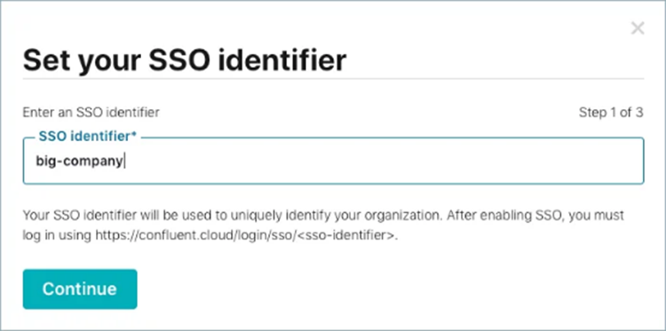

- Configure identity provider SAML values in the next page.

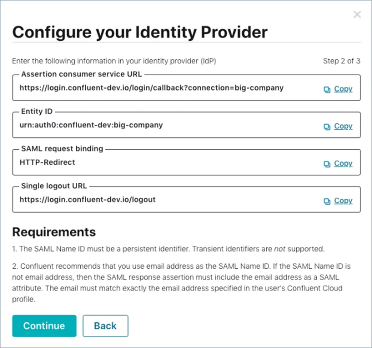

- After updating the SAML settings for your identity provider, the **Configure SSO Settings** page will appear. If a SAML metadata file is available, click *Upload* to upload the file from the identity provider.

Otherwise click *enter manually* to input the values provided by your IDP.

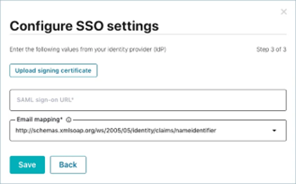

- Disable IDP-initiated SSO.

For detailed instructions, refer to the official [SSO Configuration Guide](https://docs.confluent.io/cloud/current/security/authenticate/user-identities/user-idps/sso/enable-sso.html).

###### User & Group Provisioning

In Confluent Cloud, when SSO is enabled, **Just-in-Time (JIT) provisioning** automatically creates a user account the first time someone logs in using their SSO credentials.

At this point, the user has no access to resources. In Santander, **group mappings** must be used to grant access to resources based on Entra ID groups.

[JIT Provisioning](https://docs.confluent.io/cloud/current/security/authenticate/user-identities/user-idps/sso/jit-provisioning.html)

###### Group Mapping

A **group mapping** is a set of rules that maps user groups in Entra ID to Confluent Cloud RBAC roles. When an SSO user signs in to Confluent Cloud, the platform automatically assigns the RBAC roles mapped to the user’s Entra ID groups.

To enable RBAC group mappings in Confluent Cloud:

- Configure Entra ID to include group information in the SAML assertion.
- Create the corresponding group mappings in Confluent Cloud to assign the appropriate roles.

Follow the official [Group Mapping Guide](https://docs.confluent.io/cloud/current/security/authenticate/user-identities/user-idps/sso/group-mapping/enable-group-mapping.html) to enable and manage group mappings.

###### Default Group Mapping

When SSO is enabled, a default group mapping (`all-sso-users`) is applied to all SSO user accounts. This binds them to two predefined RBAC roles:

- FlinkDeveloper
- DataDiscovery

These roles provide default user permissions to access Confluent Cloud resources. In Santander, these default permissions **must be disabled** by administrators. For more information, see [Default User Permissions](https://docs.confluent.io/cloud/current/security/authenticate/user-identities/user-idps/sso/default-user-permissions.html).

###### Types of Group Mapping

Confluent Cloud supports two types of group mapping:

- Basic Mapping: Direct, case-sensitive string matches between Entra ID groups and Confluent Cloud roles or ACLs. Suitable for straightforward use cases.

- Advanced Mapping: Uses *Common Expression Language (CEL)* expressions for greater flexibility, enabling granular control by evaluating group names, attributes, or relationships.

See [Examples](https://docs.confluent.io/cloud/current/security/authenticate/user-identities/user-idps/sso/group-mapping/manage-group-mappings.html#examples).

According Santander Policies, it is strictly prohibited to create local users or groups in Confluent Cloud that do not exist in Entra ID. It means that Users in groups cannot be managed directly in Confluent Cloud.

[Group Mapping](https://docs.confluent.io/cloud/current/security/authenticate/user-identities/user-idps/sso/group-mapping/enable-group-mapping.html)

###### Trusted Domains

In Santander, it is required to add a **trusted domain** to allow SSO-authenticated users to access both the Confluent Cloud organization and the Confluent Support portal using their existing credentials.

This ensures a seamless authentication experience across Confluent services while maintaining centralized identity management.

Although trusted domains are not mandatory for accessing the Confluent Cloud console, they are essential for enabling SSO access to support and other related resources.

For more information, see [Manage Trusted Domains](https://docs.confluent.io/cloud/current/security/authenticate/user-identities/user-idps/sso/manage-trusted-domains.html).

###### Role Based Access Control (RBAC)

Confluent Cloud uses Role-Based Access Control (RBAC) to provide a granular and secure approach for managing data access in streaming environments.

By assigning roles to users and groups, permissions can be effectively controlled for accessing and managing data resources.

Confluent Cloud provides predefined RBAC roles to simplify user provisioning and access management across organization, environment, and cluster levels.

However, these roles have certain limitations that must be considered when designing secure, least-privilege environments:

- Broad Permissions: Predefined roles such as `DeveloperRead`, `DeveloperWrite`, `Operator` and admin roles (`OrganizationAdmin`, `EnvironmentAdmin`, `CloudClusterAdmin`) often grant broad permissions that may exceed the principle of least privilege.

These roles are required for access via CLI or UI but may conflict with strict data isolation requirements.

- Cluster-Level Access: Roles granting cluster-level access (even read-only) implicitly allow visibility into all producers and consumers within the Kafka cluster.

This access cannot be scoped further, which may pose challenges for environments requiring strict data isolation.

- Credential Lifecycle Management: Role bindings do not enforce automated lifecycle control over associated credentials. For example, API keys created for Kafka clusters remain valid even after the role binding is removed.

Manual revocation of keys and service accounts is necessary to maintain security.

###### Enhancing Access Control with ACLs and RBAC

In Confluent Cloud, access control can be strengthened by combining *Access Control Lists (ACLs)* with *Role-Based Access Control (RBAC)*.

Both mechanisms can be applied simultaneously to users and service accounts, and are evaluated together to determine access permissions for Kafka resources.

*Key Benefits*:

- Granular Permissions: ACLs allow fine-grained control over specific Kafka resources, such as topics, consumer groups, and transactional IDs.
- Layered Security: Combining ACLs with RBAC ensures that permissions are scoped appropriately while maintaining flexibility for administrative roles.

*Recommendations*:

- Use ACLs to enforce resource-specific permissions for producers and consumers.
- Regularly audit role bindings and API keys to ensure compliance with security policies.
- Implement manual revocation processes for credentials when role bindings are removed.

For more information, refer to the [Confluent Cloud RBAC Documentation](https://docs.confluent.io/cloud/current/access-management/rbac.html).

###### Role and Permission Mapping

The table below summarizes the relationships between roles, permissions, resources, and accounts:

  <table style="border-collapse: collapse; width: 100%; text-align: left;">
      <thead>
        <tr>
          <th style="width: 20%; text-align: left;">Service/User</th>
          <th style="width: 30%;">Permission</th>
          <th style="width: 25%;">Resources</th>
          <th style="width: 25%;">Subscription/OHE</th>
        </tr>
      </thead>
      <tbody>
        <tr>
          <td rowspan="2" style="text-align: left; vertical-align: middle;">Producer (Service)</td>
          <td>Write Event/Command</td>
          <td>Topic</td>
          <td>Confluent Cloud</td>
        </tr>
        <tr>
          <td>Read Schema</td>
          <td>Schema Registry</td>
          <td>Confluent Cloud</td>
        </tr>
        <tr>
          <td rowspan="2" style="text-align: left; vertical-align: middle;">Consumer (Service)</td>
          <td>Read Event/Command</td>
          <td>Topic</td>
          <td>Confluent Cloud</td>
        </tr>
        <tr>
          <td>Read Schema</td>
          <td>Schema Registry</td>
          <td>Confluent Cloud</td>
        </tr>
        <tr>
          <td rowspan="2" style="text-align: left; vertical-align: middle;">Connector Sources (Service)</td>
          <td>Write Event/Command</td>
          <td>Topic</td>
          <td>Confluent Cloud</td>
        </tr>
        <tr>
          <td>Read Schema</td>
          <td>Schema Registry</td>
          <td>Confluent Cloud</td>
        </tr>
        <tr>
          <td rowspan="2" style="text-align: left; vertical-align: middle;">Connector Sink (Service)</td>
          <td>Read Event/Command</td>
          <td>Topic</td>
          <td>Confluent Cloud</td>
        </tr>
        <tr>
          <td>Read Schema</td>
          <td>Schema Registry</td>
          <td>Confluent Cloud</td>
        </tr>
        <tr>
          <td rowspan="2" style="text-align: left; vertical-align: middle;">Processor (Service)</td>
          <td>Read and Write Events</td>
          <td>Topic</td>
          <td>Confluent Cloud</td>
        </tr>
        <tr>
          <td>Read Schema</td>
          <td>Schema Registry</td>
          <td>Confluent Cloud</td>
        </tr>
        <tr>
          <td rowspan="3" style="text-align: left; vertical-align: middle;">Data Engineers (Group Users)</td>
          <td>Manage Application (Create, Update, Delete Scripts and Logical Business)</td>
          <td>Producers, Consumers, Connectors</td>
          <td>AWS workload account</td>
        </tr>
        <tr>
          <td>Manage Processor (Create, Update, Delete)</td>
          <td>Processor Engine</td>
          <td>Confluent Cloud</td>
        </tr>
        <tr>
          <td>Read, Write Schema (only owner schema)</td>
          <td>Schema Registry</td>
          <td>Confluent Cloud</td>
        </tr>
        <tr>
          <td rowspan="2" style="text-align: left; vertical-align: middle;">Dev/Ops with Terraform Service (Group Users)</td>
          <td>Deploy and Maintain Applications</td>
          <td>Producers, Consumers, Connectors</td>
          <td>AWS workload account</td>
        </tr>
        <tr>
          <td>Deploy and Maintain</td>
          <td>Clusters, Processors, Environment, Organization</td>
          <td>Confluent Cloud</td>
        </tr>
      </tbody>
  </table>

###### PAM (SF8.1)

Privileged accounts pose specific risks due to their ability to control a wide range of assets compared to non-privileged accounts. All privileged accounts require *Privileged Access Management (PAM)*.

When creating an organization in Confluent Cloud, the first user must be created in the Confluent Cloud console. This user is managed or guarded by Cybersecurity. Afterward:

- Create the remaining users using *Azure Active Directory (AAD)*.
- Assign administrator permissions to one user using RBAC.
- Once an admin user is created, the initial user in the Confluent Cloud console must be deleted.

If synchronization between AAD and Confluent Cloud breaks in the future, and a new user needs to be created in Confluent Cloud, contact the Confluent Cloud Teams to initiate AAD connection restoration.

*Administrative Roles*: Confluent Cloud provides several administrative roles, including:

- Account Admin
- Billing Admin
- Cloud Cluster Admin
- Data Steward
- Environment Admin
- Network Admin
- Organization Admin
- Resource Key Admin
- Resource Owner

In Santander, PAM is required for all these roles to ensure secure usage.

*References*:

- [PAM – Santander](https://santandernet.sharepoint.com/sites/SantanderPlatforms/SitePages/Privileged-Access-Management.aspx#)
- [PAM - CyberArk Architecture](https://santandernet.sharepoint.com/sites/SantanderPlatforms/SitePages/PAM---Cyberark-Architecture.aspx)
- [PAM - PIM Architecture](https://santandernet.sharepoint.com/sites/SantanderPlatforms/SitePages/DP-PAM-004%20-%20Azure%20PaaS%20PAM%20(CSP%20Control%20Plane).aspx)

###### IGA

*SailPoint* is used as the Identity Governance and Administration (IGA) platform to secure, monitor, and regulate user access to applications and data. It facilitates identity governance, provisioning, and compliance with legal requirements.

By automating processes such as user onboarding, access requests, and permission reviews, SailPoint ensures that the right people have access to the right resources at the right time.

In Santander, the management of members in **Entra ID groups** synchronized with Confluent Cloud must be handled through SailPoint.

##### Data Plane

###### IAM (SF1, SF5, SF8.2, SM1, SA1)

Applications must use *OAuth* as the preferred protocol for user authorization and authentication when interacting with Confluent Cloud resources outside of the UI.

Confluent OAuth supports the OAuth 2.0 protocol for authentication and authorization, enabling delegated access to resources and data on behalf of applications.

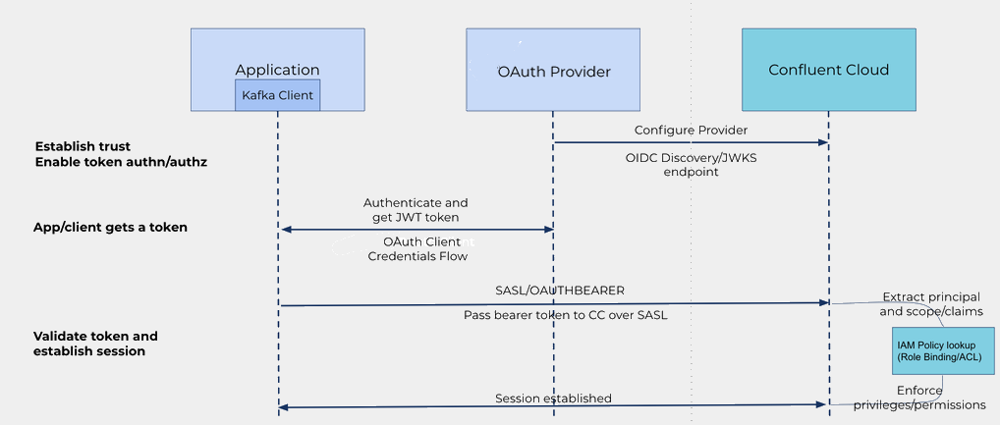

*Configure OAuth*:

- In the Confluent Cloud Console, navigate to the *Workload identities* tab under *Accounts & Access* at [Confluent Cloud Console](https://confluent.cloud/settings/org/workload_identities).
- Click *Add identity providers*.
- Enter the provider name, description, tenant ID from Azure, issuer URI, and JWKS URI.
- Edit your Azure application manifest to set the `accessTokenAcceptedVersion` attribute to `2` to use the v2 token instead of the default legacy v1 token. Example:

For details, follow the steps in [Configure the application manifest](https://learn.microsoft.com/en-us/entra/identity-platform/reference-app-manifest).

All Kafka clients must authenticate Confluent Cloud clusters using the OAuth 2.0 protocol. See the followink links for more info:

- [Add an OAuth/OIDC Identity Provider on Confluent Cloud](https://docs.confluent.io/cloud/current/security/authenticate/workload-identities/identity-providers/oauth/identity-providers.html#add-an-oauth-oidc-identity-provider-on-ccloud)
- [Configure Kafka clients for OAuth](https://docs.confluent.io/cloud/current/security/authenticate/workload-identities/identity-providers/oauth/configure-clients-oauth.html#configure-clients-for-oauth-oidc-on-ccloud)

For workload identity, use the OAuth/OIDC protocol to authenticate with Confluent Cloud resources using short-lived credentials (JSON Web Tokens).

Also use identity pools to map groups and other attributes to policies (RBAC or ACLs). OAuth can be configured using the Confluent Cloud Console, CLI, or REST API.

Steps to Configure Workload Identity [here](https://docs.confluent.io/cloud/current/security/authenticate/workload-identities/identity-providers/oauth/identity-providers.html)

Steps to add an Identity Pool via UI [here](https://docs.confluent.io/cloud/current/security/authenticate/workload-identities/identity-providers/oauth/identity-pools.html#add-identity-pool)

Steps to add an Identity Pool via API [here](https://docs.confluent.io/cloud/current/api.html#tag/Identity-Pools-(iamv2))

JWKs URI of the Identity Provider must be properly managed in Confluent Cloud. Refresh intervals configured must be validated with CISO, and manual refreshes can be executed if needed.

See more info [here](https://docs.confluent.io/cloud/current/security/authenticate/workload-identities/identity-providers/oauth/manage-oauth-configs.html#refresh-the-jwks-uri)

###### Manage Topics and Schemas

- *Schema Management*: The developer proposing the definition of an event must generate a schema and publish it in the Schema Registry once authorized.
The Schema Owner must have schema management permissions in the registry and is also responsible for the data producer.

- *Topic Management*: Schemas are implemented in topics. To use a schema, it must be deployed in the cluster with the Cluster Owner's authorization.
The configuration and management of the topic are the responsibility of the owner who starts using the topic.

#### Networking

##### Encryption in Transit (SP7, SB3, SA3)

###### Control Plane

Data transmitted within private networks must be protected with encryption. The *Cryptography Standard* specifies approved encryption algorithms, key lengths, and other security parameters.

Clients must support *Transport Layer Security (TLS) 1.2 or later* and cipher suites with *Perfect Forward Secrecy (PFS)*.

- All connections must use private links from Santander Cloud Accounts or on-premises environments to read/write data to Confluent Cloud environments.

- Communication between Kafka clusters and Schema Registry is encrypted in transit using SSL.

- Metadata within Kafka clusters is encrypted with TLS 1.2 in *Zookeeper* and *Kraft mode*.

In Kraft mode, the controllers are inside the brokers and the communication is among broker instances. With Zoekeeper, controller and metadata are out of the broker in different mathines but the connectivity is also encrypted.

###### Data Plane

Data in transit over private connections, such as those within a VPC or traffic between brokers in Confluent Cloud, requires encryption.

Encryption is recommended at the *application layer (TLS)* instead of lower network layers. Confluent Cloud supports *TLS/HTTPS connections*, encrypting events in transit between service components and other services.

Communication between Producers, Consumers, and Connectors and the Schema Registry (deployed in Confluent Cloud) is encrypted. The Schema Registry can currently be accessed via PrivateLink using HTTPS protocol.

##### Ingress Network Policies (SP5)

Ingress policies must be enforced to control traffic flow, ensuring secure access and preventing unauthorized requests. These policies define rules for external traffic interactions with internal services, ensuring compliance with security standards.

Key Components:

- *IP Group*: List of CIDR blocks specifying trusted source networks.
- *IP Filter*: Associates IP groups with resource scopes and operation groups.
- *Resource Scope*: Defines the scope of resources covered by IP filters at Organization or Environment level.
- *Operation Group*: Specifies allowed operations for an IP filter.

Steps to Implement IP Filtering:

- Create IP groups representing trusted source networks.
- Create IP filters associating allowed IP groups with resource scopes and operation groups.

*References*:

- [IP Filtering](https://docs.confluent.io/cloud/current/access-management/access-control/ip-filtering.html)
- [Manage IP Groups](https://docs.confluent.io/cloud/current/access-management/access-control/ip-filtering/manage-ip-groups.html)
- [Manage IP Filters](https://docs.confluent.io/cloud/current/access-management/access-control/ip-filtering/manage-ip-filters.html)

##### PrivateLink

In Santander, *AWS inbound PrivateLink* is mandatory for Confluent Cloud. While available for both *Dedicated* and *Enterprise* clusters, the *Dedicated* option offers stronger isolation and security guarantees.

- Private connectivity through AWS backbone ensures traffic never traverses the public internet.
- Private endpoints align with Santander's internal security posture and compliance standards.

References:

- [PrivateLink for Dedicated Clusters](https://docs.confluent.io/cloud/current/networking/private-links/aws-privatelink.html#cloud-networking-privatelink-aws)
- [PrivateLink for Serverless Products](https://docs.confluent.io/cloud/current/networking/aws-platt.html#cloud-networking-privatelink-aws-esku)

##### Private Networking for Schema Registry

Confluent Cloud supports private connectivity to Schema Registry using *PrivateLink*, available on AWS and Azure. This allows client applications within Santander VPCs to securely access the Schema Registry without sending traffic over the public internet.

- A *PrivateLink Attachment* must be created in each region where a Kafka cluster is deployed.
- If public access remains enabled, IP filtering must be used for restricting access to approved IP ranges only.

References:

- [Private Networking for Schema Registry](https://docs.confluent.io/cloud/current/sr/fundamentals/sr-private-link.html)

##### Egress Network Policies (SP5)

Egress policies must be enforced to control outbound traffic, allowing communication within the internal network while restricting access to external resources, such as the internet.

These policies ensure secure internal communication while preventing unauthorized access.

All outbound traffic must originate from Santander, except for KMS to ensure the proper routing and security controls.

##### Isolation Between Environments (SF6, SB4, SM5, SA8)

Network isolation is critical for securing the *Data Plane*. Environments must be segregated using VPCs and isolated network resources.

- *Environment Segregation*: DEV, PRE, and PRO environments must be deployed on distinct accounts.
- *Data Transfer Restrictions*: Data cannot be transferred between environments (e.g., DEV to PRE or PRO).

Environment Options:

1. *Three Environments*: DEV, PRE, and PRO provide better classification but are more expensive.
2. *Two Environments*: PRO and NonPRO are cost-effective but require logical separation using tags and naming conventions.

#### Data

##### Encryption at Rest (SB2)

Encryption at rest safeguards data stored on physical devices. Confluent Cloud supports data encryption and integrates with *AWS Key Management Service (KMS)* to ensure data security at rest.

Within Kafka clusters, *Disk Encryption* is applied to topics, where retention periods must be configured. Once the retention period expires (recommended: 7 days), events are automatically removed from the cluster.

For long-term storage, *Infinite Storage* allows Confluent Cloud to store expired events in a data lake. These events are encrypted using customer-managed keys (Key Encryption Keys, KEK) in AWS KMS.

Infinite storage is only available when the *Dual-Lock Encryption Model* is enabled, ensuring that customers retain full control over encryption keys.

Schemas stored in the *Schema Registry* are encrypted at rest using AWS KMS. All communication with the Schema Registry is encrypted in transit using TLS.

Additionally, Confluent Cloud offers *Field-Level Encryption (CSFLE)* to secure sensitive fields within events. Fields are encrypted using KEKs, which are master keys used to encrypt and decrypt Data Encryption Keys (DEKs).

Only users with access to KEKs can decrypt sensitive data.

To implement field-level encryption, rules must be defined in the Schema Registry. For example, a PII tag can be created and associated with a specific encryption key in AWS KMS.

Producers encrypt events using DEKs, and consumers decrypt the fields using the same DEKs. To enable this, KEKs must be created in AWS KMS, DEKs must be registered in Confluent Cloud, and rule sets must be configured.

Confluent Cloud supports two CSFLE policies:

- *CSFLE Shared with Confluent Cloud*: In this policy, Confluent Cloud can access KEKs stored in AWS KMS. Access can be revoked at any time. This solution is recommended when processing encrypted fields in services like Flink.
- *CSFLE Not Shared with Confluent Cloud*: In this policy, Confluent Cloud cannot access KEKs. Only producers and consumers have access to DEKs, ensuring stricter security.

This approach is recommended by Cybersecurity when field processing is not required within Confluent Cloud.

###### Dual-Lock Encryption Model

To ensure the confidentiality and integrity of sensitive data, robust encryption practices must be implemented. A critical component of these practices is the management of encryption keys, which are essential for encrypting and decrypting data.

Santander has adopted a *Dual-Lock Encryption Model* where the organization retains control over the root encryption key used to secure data at rest. This model introduces an additional layer of protection through dual encryption:

- *Data Encryption Keys (DEKs)*: Short-lived keys managed by the provider to encrypt data.
- *Key Encryption Keys (KEKs)*: Master keys fully managed by the customer in their own KMS, following an envelope encryption scheme.

This design combines software-based encryption (DEKs) with customer-controlled hardware-backed key protection (KEKs), ensuring strong data isolation and enabling key revocation at any time.

Currently, enabling this model requires that the KEK be shared via a public API over the internet.

This approach does not align with Santander's internal security policies, which prohibit the transmission of sensitive key material outside of private, trusted channels.

While a more secure integration method (e.g., **PrivateLink**) is being developed or made available by the provider, Santander recommends submitting a temporary security waiver.

This waiver would allow limited, controlled usage of this encryption pattern in non-critical environments, with strict monitoring and periodic review until a compliant mechanism is in place.

Encryption key management approved by Santander must comply with the following requirements:

- *FIPS 140-2 Compliance*: Cryptographic keys must be managed in a cryptographic module that complies with FIPS 140-2.
- *Key Rotation*: All keys must be periodically rotated, as defined by Global CISO policies (e.g., every 1 year).
- *Key Backup*: There must be a backup of cryptographic keys, and the backup must also be encrypted.
- *Key Storage*: Keys must be stored in *AWS Key Management Service (KMS)*.
- *Access Governance*: Access to keys (creation, modification, or deletion) must be governed by policies (e.g., IAM roles), logged, audited, and monitored.

References:

- [Bring Your Own Key (BYOK)](https://docs.confluent.io/cloud/current/security/encrypt/byok/byok-aws.html)

##### Production Data (SM2, SA2, SA4)

Access to prod. data must be limited to production environments. Sensitive data (PII, Confidential, Restricted-Confidential, or Secret) must not be used in non-pro environments. If required, obfuscation or anonymization techniques must be applied.

##### Masking of Sensitive Data (SP13)

Confidential data must be masked and tagged as sensitive to ensure protection and compliance. Data masking is required for restricted confidential data, with exceptions supported by a risk assessment.

In Confluent Cloud, data masking can be achieved using *Single Message Transforms (SMTs)*, which anonymize or obfuscate sensitive fields before writing data to external systems.

**References**:

- [MaskField SMT](https://docs.confluent.io/platform/current/connect/transforms/maskfield.html)

#### SDLC

##### Secure Software Development Lifecycle (SP2, SP3.1, SP8, SP10)

The *Secure Software Development Lifecycle (SDLC)* ensures robust security practices throughout all development phases, from design to deployment. This includes:

- Code reviews
- Continuous security testing
- Vulnerability identification
- Regular updates

All processes connecting to Confluent Cloud must follow SDLC guidelines to ensure security, reliability, and compliance.

*References*:

- [Secure Software Development Lifecycle Portal](https://santandernet.sharepoint.com/sites/SantanderPlatforms/SitePages/Secure-Software-Development-Lifecycle.aspx)

#### Guardrails

##### Audit Logs (SP4)

Confluent Cloud provides *Control Center Monitor* to track user and application access, detect anomalies, and proactively identify security risks. Audit logs include information about user actions, timestamps, and system responses.

- Audit logs are retained for 7 days in a specific cluster. For longer retention, it is required to ingest logs into other services.

References:

- [Audit Logs](https://docs.confluent.io/cloud/current/monitoring/audit-logging/cloud-audit-log-concepts.html)

##### SIEM Integration (SF3)

Integrating Confluent Cloud with *Security Information and Event Management (SIEM)* solutions enables effective monitoring and analysis of security events within your data lake environment.

All resources deployed in your workload accounts (e.g., Producers, Consumers, or Connectors) are stored in *AWS Cloudwatch* and must be integrated with SIEM

To integrate Confluent Cloud with SIEM, contact with Cyber entity cyber team. More info [here](https://santandernet.sharepoint.com/sites/SantanderPlatforms/SitePages/PC_DP-AWS-001_SIEM_Integration_180746342.aspx?web=1)

##### Risk Assessment

The following table outlines key cloud security controls and the risks they mitigate:

<table style="border-collapse: collapse; width: 100%; text-align: left;">
  <thead>
    <tr>
      <th style="width: 30%; text-align: left;">Control Category</th>
      <th style="width: 70%; text-align: left;">Risk Mitigated</th>
    </tr>
  </thead>
  <tbody>
    <tr>
      <td>SF1, SP1, SM1 & SA1 - IAM on all accounts</td>
      <td>
        <ul>
          <li>Data Breaches</li>
          <li>Malicious insider – abuse of high privilege roles</li>
          <li>Insufficient Identity, Credential and Access Management</li>
          <li>Interfaces and API compromise</li>
          <li>Advanced Persistent Threats (APTs)</li>
          <li>Social engineering attacks</li>
        </ul>
      </td>
    </tr>
    <tr>
      <td>SF2 - MFA on user accounts</td>
      <td>
        <ul>
          <li>Insufficient Identity, Credential and Access Management</li>
          <li>Data Breaches</li>
          <li>Social engineering attacks</li>
          <li>Malicious insider – abuse of high privilege roles</li>
          <li>Advanced Persistent Threats (APTs)</li>
        </ul>
      </td>
    </tr>
    <tr>
      <td>SF5 - Authenticate all connections</td>
      <td>
        <ul>
          <li>Data Breaches</li>
          <li>Insufficient Identity, Credential and Access Management</li>
        </ul>
      </td>
    </tr>
    <tr>
      <td>SM2 & SA2 - Encrypt data at rest</td>
      <td>
        <ul>
          <li>Data breaches</li>
          <li>Insecure or ineffective deletion of data</li>
        </ul>
      </td>
    </tr>
    <tr>
      <td>SM3 & SA3 - Encrypt data in transit over private interconnections</td>
      <td>
        <ul>
          <li>Data breaches</li>
        </ul>
      </td>
    </tr>
    <tr>
      <td>SB4, SM5 & SA8 - Production real data in non-production environments</td>
      <td>
        <ul>
          <li>Data breaches</li>
          <li>Insecure or ineffective deletion of data</li>
        </ul>
      </td>
    </tr>
    <tr>
      <td>SF6 & SP5 - Isolated environments at network level</td>
      <td>
        <ul>
          <li>Data Breaches</li>
          <li>Distributed denial of service (DDoS)</li>
          <li>Network segmentation</li>
          <li>Advanced Persistent Threats (APTs)</li>
        </ul>
      </td>
    </tr>
    <tr>
      <td>SF8.1 & SF8.2 - Privileged User Accounts & Service Accounts</td>
      <td>
        <ul>
          <li>Insufficient Identity, Credential and Access Management</li>
          <li>Extend control on organization resources by privilege credential theft</li>
          <li>Gain financial advantage through identity theft</li>
          <li>Information gathering or fraud through social engineering</li>
          <li>Targeted attacks (APTs)</li>
          <li>Social engineering attacks</li>
          <li>Malicious insider – abuse of high privilege roles</li>
        </ul>
      </td>
    </tr>
    <tr>
      <td>SF3 & SP4 - Platform Activity Logs, Service logs & Security Monitoring</td>
      <td>
        <ul>
          <li>Data breaches</li>
          <li>Interfaces and API compromise</li>
          <li>Malicious insider – abuse of high privilege roles</li>
          <li>Advanced Persistent Threats (APTs)</li>
          <li>Limited security logs monitoring and alerts detection</li>
          <li>Lack of incident response capability</li>
          <li>Insufficient Identity, Credential and Access Management</li>
          <li>Social engineering attacks</li>
        </ul>
      </td>
    </tr>
    <tr>
      <td>SA4 - Santander managed keys</td>
      <td>
        <ul>
          <li>Loss of encryption keys</li>
          <li>Data Breaches</li>
        </ul>
      </td>
    </tr>
    <tr>
      <td>SA7 – MFA on user access to data</td>
      <td>
        <ul>
          <li>Insufficient Identity, Credential and Access Management</li>
          <li>Social engineering attacks</li>
          <li>Data Breaches</li>
          <li>Malicious insider – abuse of high privilege roles</li>
          <li>Advanced Persistent Threats (APTs)</li>
        </ul>
      </td>
    </tr>
  </tbody>
</table>

### 3.5 Observability

Confluent Cloud metrics can be integrated with external monitoring services such as *Dynatrace* for cluster monitoring and alerting. To enable this, configure an API Key in Confluent Cloud to access metrics.

Example request:

```json
{
  "aggregations": [
    { "metric": "io.confluent.kafka.server/received_bytes" }
  ],
  "filter": {
    "field": "resource.kafka.id",
    "op": "EQ",
    "value": "lkc-XXXXX"
  },
  "granularity": "PT1M",
  "group_by": ["metric.topic"],
  "intervals": ["2019-12-19T11:00:00-05:00/2019-12-19T11:05:00-05:00"],
  "limit": 25
}

```

Example Response:

```json

{
  "data": [
    { "timestamp": "2019-12-19T16:00:00Z", "metric.topic": "test-topic", "value": 72.0 },
    { "timestamp": "2019-12-19T16:01:00Z", "metric.topic": "test-topic", "value": 139.0 },
    { "timestamp": "2019-12-19T16:02:00Z", "metric.topic": "test-topic", "value": 232.0 },
    { "timestamp": "2019-12-19T16:03:00Z", "metric.topic": "test-topic", "value": 0.0 },
    { "timestamp": "2019-12-19T16:04:00Z", "metric.topic": "test-topic", "value": 0.0 }
  ]
}

```

Some key metrics to monitor are the following:

- *Cluster Load Metrics*: Indicate overall cluster load. High values (>70%) may cause latency or throttling.

- *CKU Count Metric*: Shows the capacity of Dedicated clusters. Adjust CKUs as needed.

- *Hot Partition Metrics*: Identify partitions with disproportionate load. Address by adding partitions or redistributing traffic.

- *Consumer Lag*: Measures how far consumers are behind producers. High lag may require scaling the cluster.

- *Unsupported Client Versions*: Use only supported Kafka client versions to avoid issues.

- *Client Throttling*: Occurs when client requests exceed cluster capacity. Throttling ensures stability.

- *Producer Latency*: High buffer usage or wait times may indicate the need to expand cluster capacity.

Monitor cluster sizing carefully, as increasing CKUs raises costs.  
[Cluster Sizing Guide](https://docs.confluent.io/cloud/current/clusters/resize.html#cloud-cluster-expand)

Confluent Cloud supports **notifications** for account, billing, and service events. Only users with the *OrganizationAdmin* role can manage notifications; other roles can only view them.

Notifications can be integrated via email and managed through the Cloud Console or REST API.

[Configure Notifications](https://docs.confluent.io/cloud/current/monitoring/configure-notifications.html)

### 3.6 Architectural constraints

#### Specific architectural constrains

In this section, we outline the main constraints to comply with Santander's strategy when working with Confluent Cloud. These constraints may evolve as requirements and technology change, so regular validation is necessary to identify updates.

##### Events Communication

Confluent Cloud will only be in charge of communication by events between the different services with which it can be integrated and on a temporary basis. It can only be applied for batch planning and only for real time use cases.

Cybersecurity policies prohibit infinite event storage. For historical event maintenance, data must be ingested into your AWS storage account.

##### Restricted SaaS Communication

Confluent Cloud cannot directly communicate with other SaaS solutions. All traffic must pass through Santander's AWS Landing Zone to ensure Cybersecurity controls are applied.

##### Connector Management Restrictions

Full management of connectors in Confluent Cloud is not allowed. Cybersecurity policies prohibit sending data directly from SaaS solutions to Santander's AWS Landing Zone.

##### Deployment Requirements

Producers, Connectors, and Consumers must be deployed within Santander's AWS Landing Zone and connect to Confluent Cloud using AWS PrivateLink to ensure secure and controlled communication.

#### General architectural Constraints

In this section, we describe the main constraints to consider when planning to work with Confluent Cloud. These constraints are defined by Confluent at the time this document was written and should be regularly validated as technology evolves.

##### Shared Resource Model

Confluent Cloud should be treated as a shared resource across different business units within an entity.

A single cluster should not be created for each use case or domain unless justified by specific requirements that must be previously reviewed and approved by Data Architecture team:

- **Availability**: Use cases requiring high availability or low latency may need more resources. The physical distance between data producers, consumers, and the cluster can impact real-time performance.
- **Security**: Sensitive data requiring isolation may require separate clusters to ensure compliance with network segmentation policies.
- **Volumetry**: High data volumes or extended retention periods may require that the information be worked in isolation to avoid putting the performance and service of other applications at risk.
- **Processing Time**: Use cases with strict response time requirements may need dedicated resources to meet processing demands.
- **Retention**: Exceptional retention requirements may demand specific configurations and resources to ensure proper behavior.

##### Event Storage and Retention

Clusters in Confluent Cloud should not be used as a database. Event storage times should be kept short to avoid performance degradation.

- **Availability Zones**: A minimum of 2 availability zones is mandatory, but 3 availability zones are recommended for critical business resilience.

##### Validation Processes

To ensure functionality, validation processes must be implemented both before producing events and during their consumption.

##### Cluster and Subscription Restrictions

- Clusters must reside in a single region and within a single account. It means that brokers cannot be distributed across multiple regions or accounts.
- Confluent manages the subscription, which is not included in Santander's AWS Landing Zone. Integration must be achieved through private connections.

##### Reference Links

For more detailed information on these constraints, refer to the following Confluent documentation:

- [Confluent Service Quotas](https://docs.confluent.io/cloud/current/quotas/service-quotas.html)
- [Confluent API Quotas](https://docs.confluent.io/cloud/current/quotas/quotas.html)

---

## 4. Resilience

### 4.1 High availability

#### Santander SLA category

This section specifies the *Santander SLA category* applicable to Confluent Cloud resources deployed on AWS, based on the technical and security requirements described above.

SLA categories are defined at the country level to ensure alignment with local regulatory and operational needs. However, all SLAs must remain compliant with Santander's Global Corporate Policies.

When selecting the SLA category for a Confluent Cloud resource, consider factors such as availability, security, data protection, and compliance requirements.

Ensure that the chosen SLA meets both local and global standards for reliability and governance.

Global Corporate Policies draft the following:

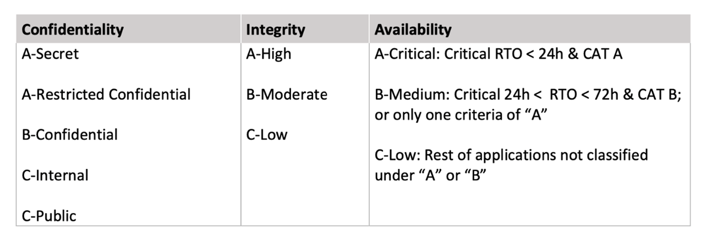

#### High Availability and Recovery Capabilities

##### Kafka Resilience

For high availability in Confluent Cloud on AWS, Kafka clusters must be deployed across multiple Availability Zones (AZs)—minimum 2, recommended 3.

Topics are replicated three times, distributing partitions across all brokers. Each partition has a leader and followers; if a leader fails, Zookeeper or Kraft mode automatically elects a new leader.

You can configure the minimum number of in-sync replicas and use acknowledgments (acks) for write operations. If a broker fails, the cluster rebalances and continues operating.

Kafka clients should be configured to handle rebalance events automatically.

##### Confluent Cloud Resilience

Confluent Cloud consists of a global control plane and multiple regional data planes.

Data planes operate independently and are not affected by control plane failures.

Confluent Cloud uses a "mothership" Kafka cluster for communication between control and data planes, leveraging change data capture (CDC) with Debezium connectors.

This architecture ensures reliable, recoverable, and auditable communication.

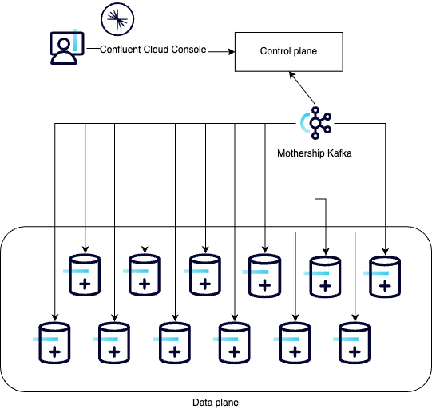

##### RPO and RTO

- *RPO (Recovery Point Objective)*: Zero, when using a replication factor of 3 and at least 2 in-sync replicas across 3 AZs.
- *RTO (Recovery Time Objective)*: Near zero, as cluster rebalance and failover are immediate; for a single AZ failure, RTO is typically less than one second if clients are properly configured.

High availability requires at least 2 [CKUs](https://docs.confluent.io/cloud/current/clusters/cluster-types.html#cluster-provisioning-and-scaling) for dedicated clusters and 1 CKU for enterprise clusters in production.

##### High Availability for Stream Processing

- *Flink*: Managed by Confluent, Flink jobs are auto-scaled and distributed across AZs. Compute pools are regional and shared among statements, providing high availability.
- *ksqlDB*: Start with 4 CSUs (Confluent Streaming Units); for high availability, use at least 8 CSUs (spread across AZs).

Storage is split between user-available and replica data for resilience. Failover and replication are managed automatically, with short unavailability windows during failures.

##### Schema Registry

Schema Registry is deployed as a multi-zone cluster, with all nodes leader-eligible and behind a load balancer. Storage is also multi-zone, protecting schema data from zonal failures.

##### Producers, Consumers, and Connectors

These components are deployed in Santander's AWS Landing Zone. High availability must be managed within each workload account, using multiple AZs.

### 4.2 Backup and restore

Confluent Cloud is a managed SaaS platform, which means that backup and restore operations for the core managed components—Kafka clusters, Schema Registry, and Stream Processing services—are handled by Confluent as part of their service offering.

Confluent is responsible for ensuring data durability, availability, and disaster recovery for these managed resources, including automated replication across multiple availability zones and regular internal backups in accordance with their SLA.

**Key points:**

- **Kafka Data:** Confluent Cloud automatically replicates topic data across multiple availability zones (minimum 2, recommended 3) to ensure durability and high availability.
Data is protected against hardware failures and zonal outages. Customers do not have direct access to Confluent’s internal backup mechanisms.
- **Schema Registry:** Schemas are stored redundantly and protected by Confluent. No manual backup is required for schemas managed in Confluent Cloud.
- **Stream Processing (Flink, ksqlDB):** State and metadata for managed stream processing jobs are also protected by Confluent’s internal mechanisms.

#### Santander responsibility

While Confluent manages the backup and restore of the core SaaS components, **Santander is responsible for implementing backup and restore strategies for all components deployed in their own AWS infrastructure**, including:

- **Producers, Consumers, and Connectors:** Any application, connector, or integration deployed in Santander’s AWS Landing Zone must have its own backup and restore procedures.
This includes configuration files, secrets, deployment manifests, and any stateful data not managed by Confluent Cloud.
- **Configuration and Infrastructure as Code:** All infrastructure and configuration (e.g., Terraform, CloudFormation, Kubernetes manifests) should be version-controlled and regularly backed up to enable rapid recovery or redeployment.
- **Custom Connectors and Integration Logic:** Any custom connector or integration logic deployed in Santander infrastructure must have its source code and configuration properly backed up, so they can be restored or redeployed as needed.

#### Recommendations

- **Export critical data:** In some cases, long-term retention or external backup of Kafka topics is required (e.g., for compliance).
To do that, implement a process to export data from Confluent Cloud to secure storage in Santander’s AWS accounts (such as S3) using approved connectors or consumers.

- **Test recovery procedures:** Regularly test the restore process for all customer-managed components to ensure business continuity.
- **Review Confluent SLAs:** Understand the backup, retention, and disaster recovery guarantees provided by Confluent Cloud, and align internal policies accordingly.

**Summary:**  
Backup and restore of managed components in Confluent Cloud are handled by Confluent as part of the SaaS offering. Santander is responsible for the backup and restore of all workloads, configurations, and integrations deployed in its own AWS infrastructure.

### 4.3 Disaster recovery

#### Geo-Disaster Recovery

For disaster recovery, deploy clusters in different AWS regions. Use *Cluster Linking* or *Replicator* to synchronize topics and configurations between clusters.

Cluster Linking provides byte-for-byte replication and globally consistent offsets without needing Kafka Connect.

**Disaster Recovery Patterns:**

- *Active-Passive*: The backup cluster only receives replicated data; producers and consumers switch to the backup cluster during failover. After recovery, use truncate-and-restore to reinstate the original cluster.
- *Active-Active*: Both clusters are active in different regions, replicating topics bidirectionally. Consumers can read from either region, and failover is seamless. Unique global consumer group names are required to maintain offsets.

Cluster Linking requires dedicated clusters as the destination. Permissions must be configured for reading and writing ACLs and topic descriptions.

This architecture ensures high availability, resilience, and disaster recovery for Confluent Cloud on AWS.

---

## 5. Events lifecycle in Confluent Cloud

This section is reserved to describe how to manage the lifecycle of events specifically within Confluent Cloud on AWS.

For a detailed overview of the generic event management journey, please refer to the documentation at [Events Lifecycle](../../../../components/software/events/life-cycle/index.md)

---

## 6. Best Practices

- Resource Management: Use tags and naming conventions for easy identification.
- Cost Optimization: Monitor usage and scale resources appropriately.
- Security and Compliance: Implement IP filtering and SSO.
- Monitoring and Alerting: Use Confluent Cloud metrics and logs for proactive monitoring.

### Naming Conventions and Rules

To ensure consistency and scalability, follow these naming conventions:

| **Element** | **Naming** | **Example** |
|-------------|------------|-------------|
| **TOPIC** | `[ENTITY].[LENV].[APPID].[RESOURCE].[ACTION-PAST]`<br>`[ENTITY].[LENV].[APPID].[RESOURCE].[ACTION-INFINITIVE]` | `SDS.D1.APMT0000000000.RESOURCE_EXAMPLE.CREATED`<br>`SDS.D1.APMT0000000000.RESOURCE_EXAMPLE.CREATE` |
| **ENTITY** | Use acronyms to identify the entity | - `SDS` for Santander Digital Services<br>- `SCQ` for Santander Consumer HQ |
| **LENV** | Logical Environment<br>- `"D1"` for Development (notices that D1 and I1 will be in the same cluster)<br>- `"I1"` for Pre-Production (notices that D1 and I1 will be in the same cluster)<br>- `"P1"` for Production<br>(number is just in case additional environments are required) | `D1` |
| **APPID** | APM CIID from APM Technical application | `APMT0100022370` |
| **RESOURCE** | Resource in which the business event succeeds or resource where the command succeeds.<br>Note: Must describe functional objects in the service domain | `CURRENTACCOUNT` |

### Environments Model

The recommended option is to have 3 separated environments.

As an alternative, a strategy that can help to saving costs is to have a PRO environment and a NON-PRO (DEV-CER-PRE topics will share same cluster, but a certain level of separation can be implemented using the naming convention proposed below.).

---

## 7. Exit Plan

Santander policies require that any SaaS supporting business activities can be replaced or replicated efficiently, with minimal disruption, within a maximum of 90 days if a move to another cloud environment is needed.

For Confluent Cloud on AWS, the recommended exit plan is to migrate to Confluent Platform. This involves exporting data and configurations from Confluent Cloud and importing them into Confluent Platform.

Producers and consumers connected to the Confluent Cloud cluster should be stopped and reconfigured to start producing and consuming in the new Confluent Platform cluster.

This approach ensures a secure and controlled termination, transfer to another vendor, or reintegration if the service is discontinued.

---

## 8. References

Links to official Confluent Cloud documentation and other relevant resources:

   - [Public Cloud - AWS Regional Landing Zone documentation](https://santandernet.sharepoint.com/sites/SantanderPlatforms/SitePages/AWS-Regional-Landing-Zone.aspx)
   - [Confluent Cloud documentation](https://docs.confluent.io/cloud/current/index.html)
   - [AWS PrivateLink for Confluent Cloud](https://docs.confluent.io/cloud/current/networking/privatelink.html)
   - [Terraform generic provider for Confluent Cloud](https://registry.terraform.io/providers/confluentinc/confluent/latest/docs)

---
