# 1. Platform

• Confluent Platform is a Kafka open-source event streaming platform founded by Kafka’s original creators on LinkeIn.

• It facilitates the creation of real-time data channels and streaming applications by integrating data from multiple sources and locations into a single one
central event streaming platform.

• Confluent presents a series of parts/components that enable the creation of End-to-End pipelines by providing complete Enterprise solutions.

• The most prominent components are:

  - Kafka Streams & KSQL
  - Kafka Connectors
  - Schema Registry
  - Rest Proxy
  - Replicator

• In addition, there are specific components for monitoring the architecture and the implementation of security at any level, both at the component level (connector, topic, streams, etc.) and at the level of connectivity and data.

## Why?

• It allows a global monitoring and administration of all the topics created for each of the projects that are implemented on the platform, being able to perform these operations on several clusters of Kafka.

• It provides tools (Kafka connect) for the implementation of end-to-end pipeline so that the transfer of information from a source to a destination bbdd or consumer streaming (sink) is done in an agile way.

• The concept of data flow incorporated by Confluent provides the possibility of performing transformations, aggregations and treatment in time windows using a simple and familiar language (KSQL)

• Versions of the metadata of the data structures processed thus ensuring their compatibility (Schema Registry).

• Flexible, scalability and parallelization of real-time executions.

• It provides high platform availability through mechanisms such as Auto-Balance and Replicator.

• Kerberos-compatible security tools and LDAP ACLs for security implementation at both component level (Kafka, ZK,
connects, etc) as at the level of communications and data.

• Deployment of the platform both on-premises and in the cloud (AZURE, AWS and Google cloud)

• Availability of kubernetes operators for your CD/CI.

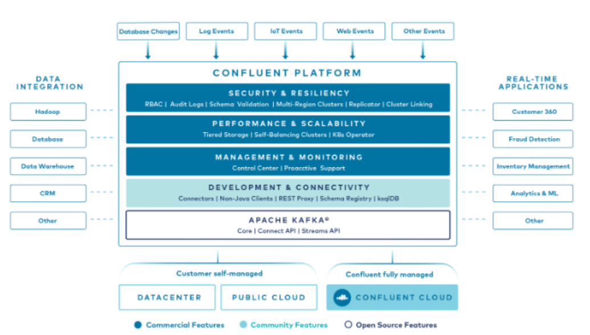

## Apache Kafka

Apache Kafka is a distributed, partitioned and replicated message storage system, which provides the functionality of a high-performance messaging service based on the publisher/subscriber model.
Its read and write speed makes it an excellent tool for real-time communications (streaming).

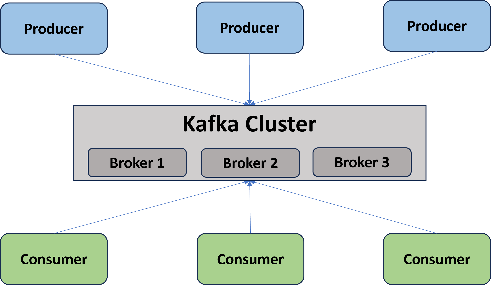

## Features

• Categorize posts published in **topics** as a messaging service.

• **Distributed**: It is divided into several nodes for execution, which work together when working within a cluster. This provides horizontal scalability and fault tolerance.

• It is easily **scalable** (no downtime ).

• **Durability**: Messages persist on disk and are replicated within the cluster to prevent data loss and ensure fault tolerance. Every broker can
manage terabytes of messages without impact.

• **Fast: For client-server communication** it uses its own TCP-based protocol, simple and efficient, which provides high speed writes and readings with high performance.

• **Accessible:** You can build clients in many languages: Java, Scala, .NET, Python, Ruby, PHP, C++, …

### Topics and partitions

- Topics are organized into partitions and messages within the partition are uniquely identifiable by assigning a sequential “offset” number (allowing constant performance).

- The partitions are distributed on the brokers of the Kafka cluster, so that each broker is responsible for handling the data and requests of the partitions it contains.

- Partitions are replicated to a configurable number of brokers in the Kafka cluster, providing the system with fault tolerance.

- Each partition has a broker that acts as a “leader”, which handles all read and write requests for that partition, and 0 or more brokers that act as “followers”, replicating the leader passively.

- In the event of a leader's fall, one of the followers automatically becomes the new leader (high availability).
 Each server acts as a leader for some of the partitions and as a follower for others,
balancing the cluster load correctly.

- The Kafka cluster stores all published messages (whether consumed or not) for a configurable period of time, without affecting performance.

- Each broker can manage terabytes of messages without impact.

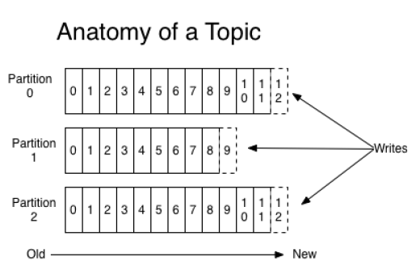

## Produces and consumers

• Publishers write messages in one of the partitions belonging to the topic applied in the publication.

 - You can use a round-robin scheduling method or some semantic partition function to select the partition on which the message will be published, in order to balance the load.

• These messages are identified by the “offset” that the system assigns to them within your partition.

• The Kafka cluster will store all published messages, whether or not they were consumed, for a configurable period of time, after which they will be deleted for release
space.

 - The performance will be constant with respect to the size of the stored data allowing to have large quantities of traces stored without posing a problem.

• Consumers store and manage internally the position (“offset”) of the next message to be consumed in the partition.

 - It allows to consume messages in linear or disordered order.

 - They can reset the “offset” to a previous one, thus allowing message reprocessing, without impacting the cluster or other consumers.

• To generalize both messaging topologies, Kafka introduces the concept of “consumer group”.

• Each consumer belongs to a single consumer group, and messages published in a topic are distributed to a single consumer in the group subscribed to the topic.

 - A single consumer group: Queue with load balancing among consumers.

 - N consumer groups with a consumer: Publisher/Subscriber.

• Commonly, each consumer group is composed of a consumer cluster that provides tolerance to
failures and easy scalability.

• For greater parallelization and load balancing, each partition of a topic is assigned to a single consumer in the consumer group.

• There can therefore be no more consumers in a group than partitions in a topic.

• Kafka provides total order of message consumption only within a topic partition.

• This is achieved if the topic has a single partition, which implies a single consumer in the consumer group.

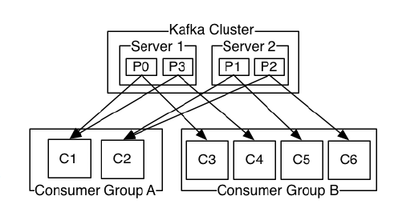

## Components - Kafka streams

A stream is a constant flow of data that is evaluated and processed individually.

Flow computing is a programming model that is based on processing data in real time aiming to increase the speed of data processing. In this context the Kafka solution is the Kafka Streams API.

Kafka Streams is a library for the processing, processing and transformation of data in real time that allows operations on flows having as input and output Topics of Kafka.

*Kafka Streams is the solution incorporated in the confluent platform but there are other alternatives such as Spark Streaming, Flink or Storm.
Kafka Stream use cases are multiple:

  • Data transformation

  • Pattern detection

  • Fraud detection

  • Monitoring and alerts

  • Data migration

KSQL is the SQL streaming engine for Kafka, executing continuous queries (transformations that run continuously as new data passes through them) on data streams in Kafka topics.

The Apache Kafka Streams API is available on the platform through a Java QUE library
it can be used to build distributed applications and microservices with the following characteristics:

1. Scalable
2. Elastic
3. And with fault tolerance since input and output data are stored in an Apache Kafka cluster.

It provides the writing and deployment of standard Java and Scala applications on the client side with the benefits of Kafka's cluster technology on the server side.

An advanced specific technical profile is required for code, logical and DSL-level implementations.

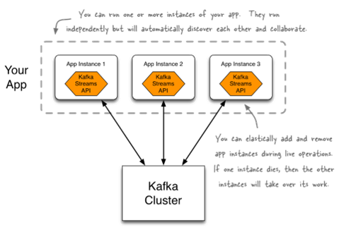

## Components - KSQL

• It is the SQL streaming engine for Apache Kafka® that provides a powerful and easy-to-use interactive SQL interface for processing flows in Kafka, without the need to write code in a programming language such as Java or Python.

• KSQL is scalable, elastic, fault-tolerant and in real time.

• KSQL supports a wide range of transmission operations, including data filtering, transformations, aggregations, joins, windows…, etc.

• KSQL is based on Kafka Streams, so a KSQL application communicates with a Kafka cluster like any other Kafka Streams application.

• KSQL queries are executed continuously.
• KSQL has a console client, which we can use to launch queries about Kafka topics. It brings us very easily to the world of data flows, consulting with SQL language (this query, is scalable, distributed and in real time)

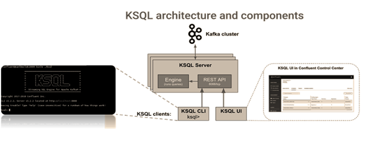

KSQL works with two basic concepts: Stream and Table.

• *Stream: Is a sequence (data stream) of structured data (“facts”)*. Facts (“facts”) are immutable, it is possible to insert new facts in the stream, but they cannot be deleted or updated. If you want to persist the output of a Kafka topic would be
done using this syntax:

    CREATE STREAM clickstream (time bigint, _time vachar, ip varchar, request varchar, status int, userid varchar) WITH (kafka_topic = ‘clickstream’, value_format = ‘json’)

• *table: It is a view of a stream and represents a collection of facts (“facts”), facts in a table can be modified*, and existing ones can be updated or deleted:

    CREATE TABLE SUMIP as SELECT ip, sum(bytes)/1024 as kbytes FROM CLICKSTREAM WINDOW SESSION (300 second) GROUP BY ip;

## Components - Kafka Connect API

It is the framework that integrates Kafka with other external systems such as databases , key value stores, search indexes and file systems. To copy data between Kafka and other systems users use different Kafka connectors to pull or push.

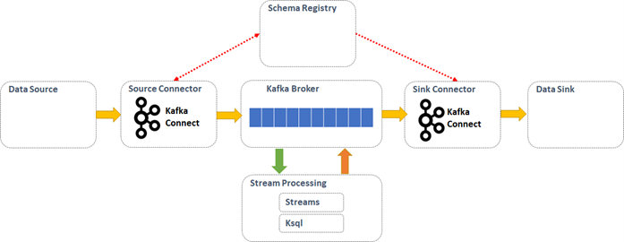

• The Kafka Connect API is an interface that facilitates, simplifies and automates the integration of different data sources in both the data entry (source) part of the data. as in the final part of the pipeline when storing or serving the results
of the processing in real time (sink).

• To transfer or copy data between Kafka and other systems, users use different Kafka connectors to pull or push.

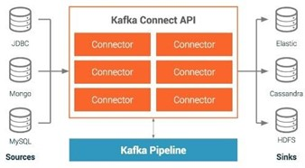

• The Confluent platform provides from the Confluent Hub (<https://www.confluent.io/hub/>) a repository of connectors to which it supports both the platform itself and those contributed by different partners.

## Components - Schema Registry

Confluent Schema Registry, is the component of the Confluent platform that provides a distributed storage layer for schemas, thus allowing the publication of topic metadata, in addition to verifying that the sent messages validate with the defined schema.
Likewise, it enables the following features:

• Rest interface to store and retrieve Avro, json and protobuf schemas.

• Stores a history of all schemas based on a specific subject name strategy, which provides multiple compatibility configurations.

• It provides multiple compatibility configurations and allows the evolution of schemas for each of the created topics.

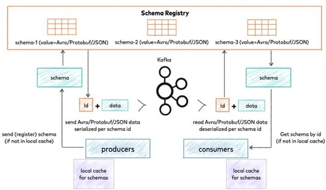

An important aspect of data management is the evolution of the schema.

After defining the initial schema, applications may need to evolve over time. When this happens, it is essential that consumers

intermediates can handle the data encoded with the old and the new schema without problems.
The types of schema changes allowed for different compatibility types, for a given topic:

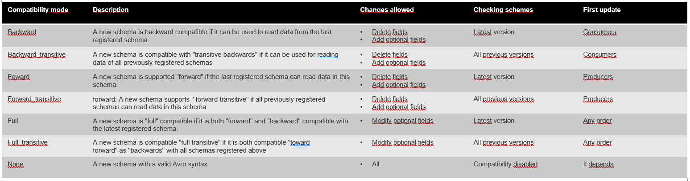

## Components - Kafka Replicator

Kafka Replicator is a component of the Confluent platform that allows the integration replication of topics from one cluster to another. This ability, in addition to copying messages, also preserves the configuration (replication factor , partitioning...).
The main features to take into account are:

• Dynamic creation of topics in the target cluster with matching partition count and replication factors.

• Automatic change of topic size when new partitions are added in the source topic.

• Automatic reconfiguration of topics.

• Filtering topics to replicate using whitelist, blacklist and regular expressions.

Kafka Replicator allows you to establish SSL security for communication with Kafka brokers. It also supports SSL and SASL for authentication.

Currently the authentication mechanism in Kafka brokers is through Kerberos (GSSAPI).

Broadly speaking, Kafka Replicator acts as a consumer of the Kafka topics of origin. Periodically asynchronously checks if in the source cluster there has been any change in the configuration of the topics (number of partitions, number of replicas, etc.).
For this it is necessary that the following requirements are met:

• Kafka Replicator must have permissions to create and modify topics in the target cluster.

• The default topic settings must match in the source and destination clusters.

• The target Kafka cluster must have a similar capability to the source cluster.

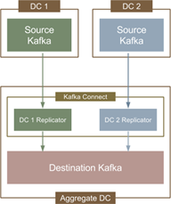

On the other hand some of the functionalities provided by Kafka Replicator as opposed to Kafka MirrorMaker are:

• New partitions are detected and replicated automatically.

• Identical topic configuration between the two groups.

• Filter, modify and route ad-hoc events.

• Self-scale, that is, increases replication processes as Kafka traffic increases with a single configuration.

• Redirects events to avoid infinite replication loops in active-active configurations.

• Single point of administration to replicate more than one cluster.

• Monitoring of the replication state through the user interface.

## Components - Control Center

### Capabilities

The Control center is a web tool to manage and monitor Apache Kafka allowing the management of the components that integrate the confluent platform. Among its capabilities we highlight:

  - View and manage permissions your own permissions and manage permissions for which you have permission around RBAC.

  - Management topics; add and modify the properties of them.

  - Allows you to add or delete streams and tables.

  - You can create and edit schemes for topics

  - Allows validation of Schemas.

  - Compare versions of schemas

  - It is allowed to add a connector to a Connect cluster with RBAC turned on or off.

  - Configuration and parameterization of Connect.

  - Execution management on connectors (launch, stop, pause).

  - Allows the creation of replicas through the Replicator

  - Allows you to change the properties at the cluster and broker level.

With Control Center we can detect problems when moving data, including delayed, duplicated or lost messages.

By adding lightweight code to customers, streaming monitoring can count all messages sent and received in a streaming application.

Control Center uses Kafka to send metrics information. In this way flow monitoring metrics are transmitted quickly and reliably.

### Architecture

The Control Centre consists of the following parts:

• Metrics interceptors that collect metrics data on customers (producers and consumers).

• Kafka to move metric data.

• The Control Center application server for analyzing transmission metrics.

Below are two environments that use Kafka to transport messages. In one of them is using control center while the other installation lacks this component.

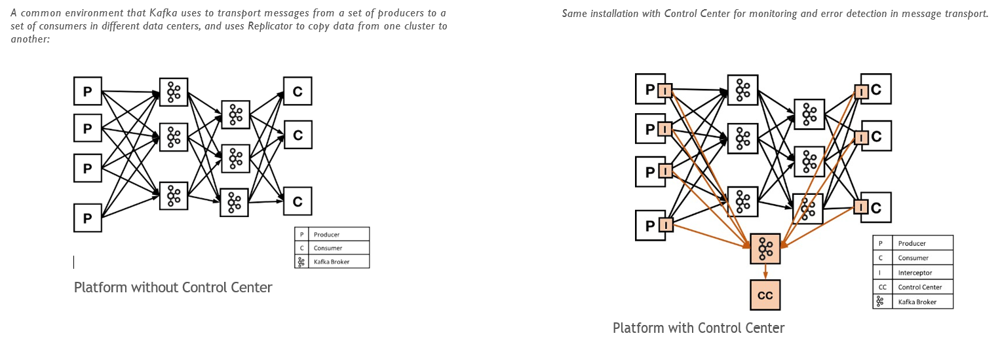

## Components - MQTT Proxy

MQTTT Proxy provides a scalable and lightweight interface that allows MQTT customers to produce messages to Apache Kafka directly, in a native way
From Kafka which avoids redundant replication and lag increase.

## Components - Clients

The confluent platform offers the possibility of creating clients producers or consumers of
Kafka messages written in different languages:

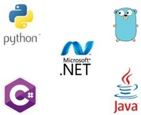
