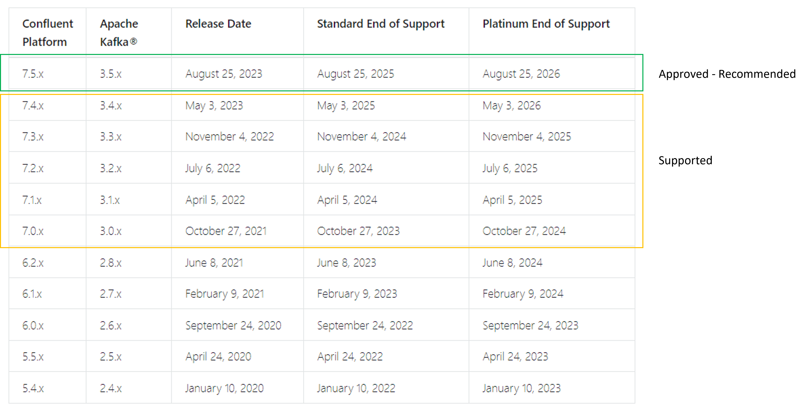
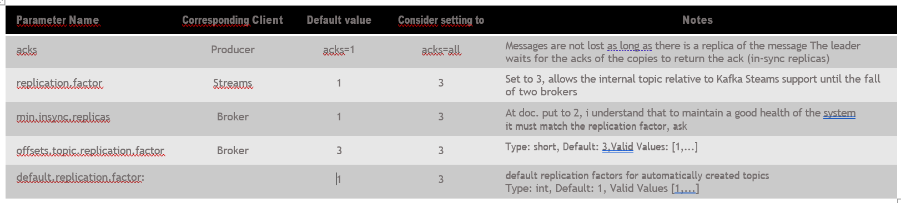
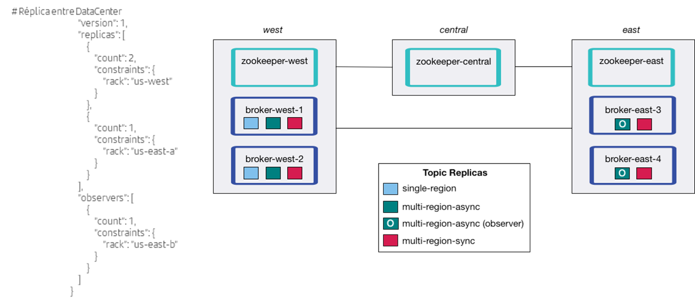
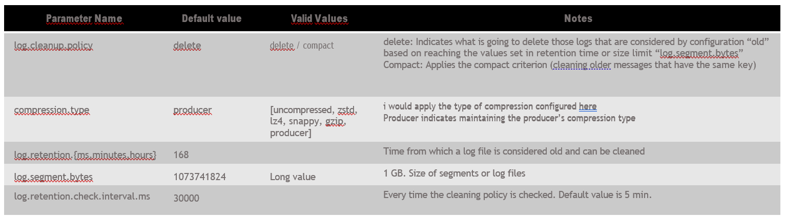

# 2. Install and Configuration

## Install and upgrade

### System Requirements

The version recommended is 7.5.x or higher.

Below is a chart showing the compatibilities between the confluent platform and Apache Kafka as well as the release date and end of support for each of the versions.

On the Confluent documentation site you can find the system requirements for the installation of Confluent Platform on-premise:

  - Hardware
  - Software
  - Newtowrk
  - Ports
  - Sizing

<https://docs.confluent.io/platform/7.5/installation/system-requirements.html>

### Preparation environment

Consider the following guidelines when preparing for an update:

• Always back up all configuration files before updating. This includes all directories and files that are inside
confluent-vx.x.x/etc(/kafka, /kafka-rest, /schema-registry, etc).

• Read the documentation and write an update plan:

    <https://docs.confluent.io/current/installation/upgrade.html>

• Backup your logs-kafka data before performing upgrade operations. The location will be defined in the files:

    confluent-vx.x.x/kafka/server.properties in the log.dirs=/tmp/kafka-logs confluent-vx.x.x/kafka/zookeeper.properties property in the datadir=/tmp/zookeeper property

### Upgrade

Stop all active services in the installation before starting, on each of the nodes in your cluster, by running the scripts in charge of each service in confleunt-vx.x.x/bin:

    ./kafka-server-stop
    ./zookeeper-server-stop

The rest of the components can coexist within the installation. As provided in the entity will exist as PODS within our openshift so they must be stopped, deleted and lifted with the image corresponding to the new version.

### Installation

Download the package to the new installation you are going to deploy:

   <https://docs.confluent.io/platform/7.5/installation/available_packages.html>

Stop and delete Pods with previous versions, and upload the images to harbor, of the corresponding versions,
Unzip the corresponding tar in your installation directory, keeping the files and directories, for now, from the previous installation.

Once this is done, you can raise the services again, from the /bin directory of the new installation, but in principle running with the property files of the previous version. As long as the opposite is not specified in RELEASES notes.

### Testing

Check that everything works correctly, remember that in control-center by default you will only see the metrics of the last 15 minutes after an upgrade, although this can be modified:

    https://docs.confluent.io/current/control-center/installation/upgrade.html#controlcenter-upgrade
  
    confluent.metrics.topic.skip.backlog.minute

Finally, when we have confirmed the correct operation, move the configuration files corresponding to the updated services, to the corresponding directory within the new installation:

    mv backup/etc/kafka/server.properties confluent-VX.x.x/ect/kafka 
    
    mv backup/etc/kafka/zookeeper.properties confluent-VX.x.x/ect/kafka

Once this is done, restart the services pointing to the correct path of the new installation, and remove the directory of the previous installation.

For the compression through a practical script, you can attend to the implementation of an update made in Azure and documented in Confluence publicly:

    https://confluence.ci.gsnet.corp/pages/viewpage.action?pageId=190518426

## High availability

1. Resilience At the Cluster level, the pillar on which it is based is the replication factor of the messages in the different brokers of the cluster.
2. It is recommended minimum set to 3, this gives us the ability to fall up to two brokers
3. In the case of Kafka Streams that creates internal topics it is necessary to configure at the level of Kafka Streams this replication factor
4. At the producer level it is recommended to set the ack

## Disaster Recovery

1. MultiRegion Cluster
    1. Option 1, Mount a multi DC cluster
    2. Option 2, mount two clusters, one on each DC and synchronize by Observer
        1. In cluster 1, we configure acks=all so that leaders and followers have the data synchronously copied.

2. Features offered in this area
    1. Fetch messages from followers, currently, messages are consumed from the partition leader
        1. It can be configured so that customers can fetch the followers
    2. Observer is a type of replica in which the broker marked as observer acts as a follower replica but does not join the ISR so it does not block the leader and is produced asynchronously.
        1. With the Fetch option of follower, you can set messages consumption policies of observer brokers.
        2. Faced with the fall of all brokers in a Datacenter, we can change the Observers of the Passive Datacenter to Leader of partitions and therefore receive and offer messages.
        If the copy with Observer is delayed there may be loss of messages because the offset is more advanced than the synchronized messages.

3. Partition reassignment, confluent offers partition reassignment capabilities in brokers.

4. Selection of the leader at the broker level for topics. This allows you to automatically manage the active datacenter.

## Durability of messages

1. Logs, is understood by logs to the files where all messages are stored in the machines (brokers)
2. From this point of view you can configure the management of log files for durability, rotating, compression, etc. To do this, there are a series of properties that we discuss below:

## Scalability

Depending on the data load, sometimes it is necessary to scale our kafka cluster by adding more nodes/brokers, and sometimes decommissioning nodes in view of an oversized cluster.

Adding servers to a Kafka cluster is a manual process, you only assign a unique ID to the broker and in the file server.properties and zookeeper.properties you add all
the machines of the cluster.

However, these new servers will not be automatically assigned any data partitions, so unless the partitions move to them, they will not do any work until new topics are created.

These tasks in Kafka are performed using the OpenSource script/tool kafka-reassign-partitions. Confluent Platform also includes the confluent-rebalance tool which has the following advantages:

• Minimizes data movement.

• Balance data at cluster and topic level (rather than just topic level).

• Balances disk usage in brokers (in addition to balancing the number of leaders and replicas in racks and brokers).

• Supports broker(s) decommissioning.

## Rebalancing

• **Rebalancing when adding a new Broker:**

    ./bin/confluent-rebalancer execute --zookeeper localhost:2181 --metrics-bootstrap-server sanlbeclomi0001.santander.pre.corp:9092,sanlbeclomi0002.santander.pre.corp:9092,sanlbeclomi0003.santander.pre.corp:9092 --throttle 10000000 –verbose

It will give us a replication plan and accept it will start automatically with it.

• **Check Status:**

    ./bin/confluent-rebalancer status --zookeeper localhost:2181

• **Decomision of a Node:**

    ./bin/confluent-rebalancer execute --zookeeper localhost:2181 --metrics-bootstrap-server sanlbeclomi0001.santander.pre.corp:9092,sanlbeclomi0002.santander.pre.corp:9092,sanlbeclomi0003.santander.pre.corp:9092 --throttle 100000 --remove- broker-ids 1

It will give us a replication plan and accept it will start automatically with it.

• **Check Status:**

    ./bin/confluent-rebalancer status --zookeeper localhost:2181
