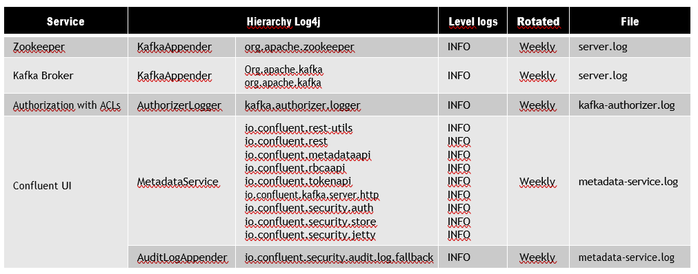
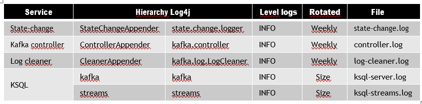
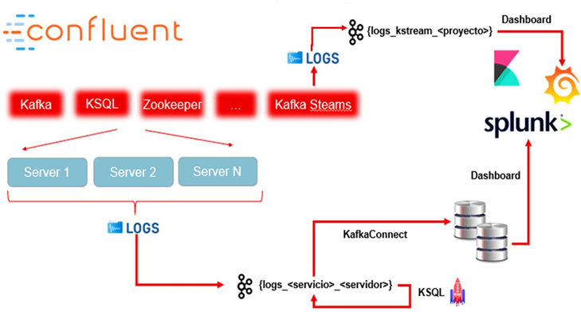
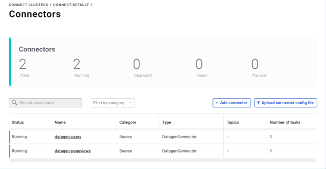
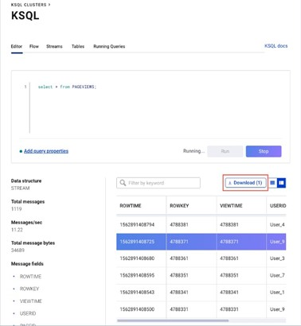
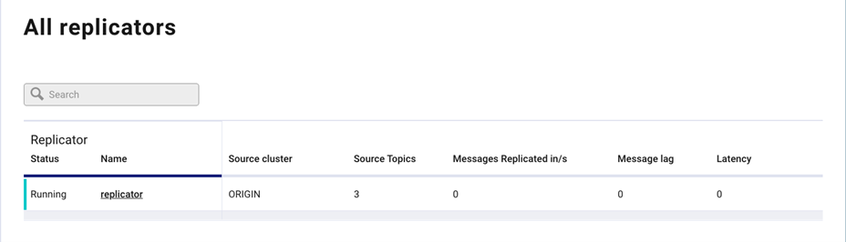
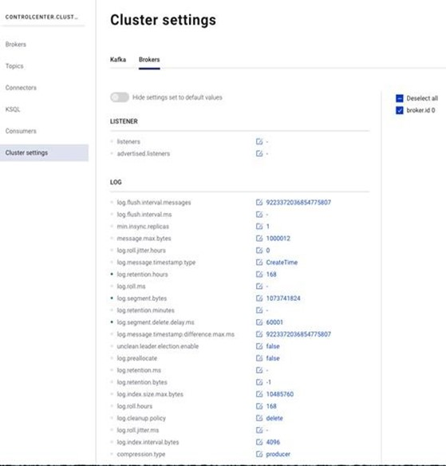

# 3. Observability

## Management of Logs

In Confluent the components that register traces of logs are:

• **Authorizer:** This piece allows you to limit access to the different components (Kafka, schema registry…) by using ACL.

• **Rest-utils:** Confluent REST Utils provides a framework and utilities for building Rest Java API using Jersy, Jackson, Jetty and Hibernate. From ACL…

• **Rest:** Confluent Rest proxy provides an interface for communicating with Kafka and performing management and operation actions such as reading/writing
events.

• **Metadata API:** Groups different metadata groups such as authorization, authentication, RBAC-based roles, administration.

• **RBCA API:** Allows to perform CRUD operations on roles and different user groups.

• **Audit:** This piece allows you to audit the accesses to each of the topics of Kafka using Confluent Server Authorizer.

• **State change:** Reports the different changes that have occurred in Kafka, this includes topics, brokers and replicas.

• **Kafka controller:** Provides information regarding Kafka, rebalancing between brokers, generation of replicas, etc.

• **Log cleaner:** GroupsReports on the different processes of deleting Kafka logs that have been carried out.

The following table shows a summary of each of the services, with the log level defined, rotated and the file to which the traces are currently destined:

## Logs -  Proposed implementation solution

From architecture the proposed solution is a dump of logs to a topic(s) of Kafka. Once in these topics perform the exploitation to the different systems that are considered.
For the first part, the dump of the logs to a topic of Kafka is necessary to edit the file log4j including the following properties:

## Monitoring - Control Center

Allows us to monitor the **health** of the system, can monitor different clusters as well as the rest of components that run around the platform such as Kstreams, KSQL, Connect, Schema Registry,..

Cluster, offers information about brokers, topics, partitions and replication as well as Throughput of the messages produced and consumed.

### Brokers

 We will get info. Related to data production and consumption of messages, partitions and replicas, active brokers, zookeeper status and disk and system usage (CPU and network), fetch latencies

### Topics

You will have access to internal topics if needed:

 - You could inspect a topic by accessing messages, search for an offset or timestamp on a partition.

 - Metrics that allow us to know the latency between consumer and topic, or number of requests with error, etc.

### Connect

 - It will allow us to visualize the connectors of the clusters of connect existing.
 - For a certain connector visualize its characteristics.
 - Status, topics for sink connector if applicable, tasks involved in the connector

### KSQL

Its monitoring is enabled by default.

• Set to control-center.properties the KSQL clusters to be monitored, for this purpose:

    confluent.controlcenter.ksql.enable=true confluent.controlcenter.ksql.<name of cluster>.url = <list of urls> confluent.controlcenter.ksql.<name of cluster>.advertised.url = <list of urls>

• At the cluster level of KSQL, we will see properties, streams and tables involved, visualize messages

• Streams, Tables Get the DESCRIBE, make queries on the Stream, associated topics, replicas and partitions

• Queries running, get the EXPLAN of the query

### Replicator

• Monitor tasks, throughput messages, information related to the connect workers involved in replication

• Metrics of both origin and destinations, topics involved, etc..

### Consumer

It will give us a replication plan and accept itoffer metrics and information related to all consumer groups of the topics.

The Control center of the confluent platform allows you to manage the components:

• **RBAC:** View your own permissions and manage those for which you have permission.

• **Topics:** It allows the management of topics; add and modify the properties of them. Enable schema validation.

• **KSQL:** Streams, Tables in KSQL. New ones can be added or deleted.

• **Schema Registry:** Schemes can be created and edited for topics. Compare versions of schemas.

• **Connect:** A connector can be added to a Connect cluster with RBAC turned on or off:

- Configure said connect, edit properties
- Throw it and stop it or pause it
- To access the connect clusters it is necessary in the Control Center to configure the property:

    confluent.controlcenter.connect.name.cluster = "list of URLs"

• **Replicator:** Creation of replicas of topics between clusters.

• **Cluster Settings:** You can change properties at cluster level or broker level. Those properties marked as read-only require the cluster to be restarted.

Editing can be disabled from the control center, for this:

    confluent.controlcenter.broker.config.edit.enable=false

### Alerts

From the control center we can define alerts:

- Consumer Group, at this level you can set alerts with the following metrics:

    • Average latency (ms)

    • Consumer lag, consumer lead

    • Consumption difference

    • Maximum latency (ms)

- Topic Trigger, at the topic level you can set alerts:

    • Bytes in, bytes out

    • Production request count

    • Under-replicated topic partitions

    • Amount of under-replicated topic partitions.It lets us know if a kafka broker fell while storing a partition of a topic

- Broker/cluster trigger

    • Cluster down

    • URP (under-replicated partitions)

    • Active controller count

In addition , you can configure the notification of alerts:

    • Via Email (SMTP)

    • Using webhooks to link to Slack for example.

    • Configuring access via API Rest to get alerts
    
            . GET /2.0/alerts/history

### Metric Server

• Control Center can get server metrics aggregated by cluster, broker, or topic.

• They are exposed via JMX so any system that accesses via JMX to the metrics could build a dashboard from the info.

• The platform publishes a series of MBeans at the level of Topic, Broker, Producer, Consumer, Global Metrics.

• Edit the server.properties and set

    metric.reporters=io.confluent.metrics.reporter.ConfluentMetricsReporter confluent.metrics.reporter.bootstrap.servers=broker1:9092,broker2:9092,broker3:9092

• The jar of metrics must be in the following routes:

    <install path>/share/java/kafka/confluent-metrics-VX.X.X.jar
    <install path>/share/java/confluent-rebalancer/confluent-metrics-VX.X.X.jar

• By default, traces are left in server.log, to configure, take into account:

    ./etc/kafka/log4j.properties
    log4j.logger.io.confluent.metrics.reporter.ConfluentMetricsReporter=DEBUG

• Metrics can also be stored in the default topic _confluent-metrics

• You can consume this topic in real time to verify that you are receiving metrics
