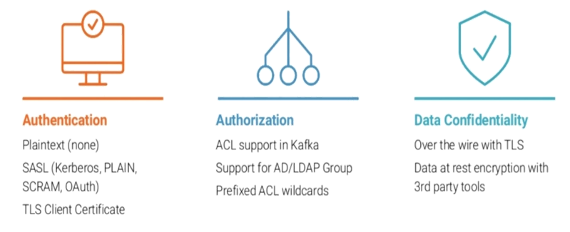
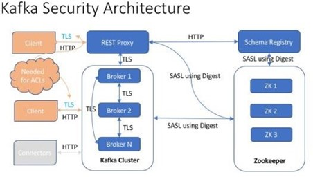
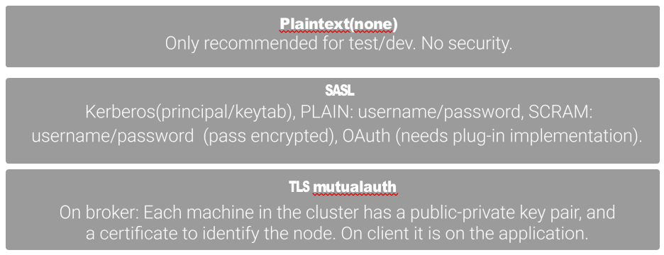
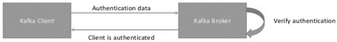
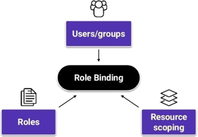
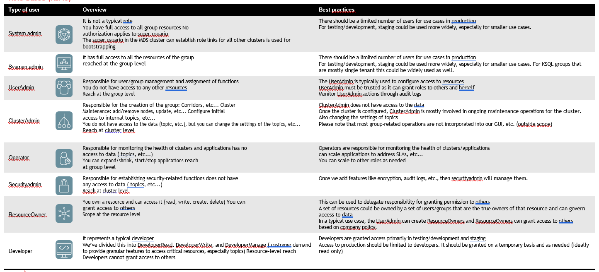
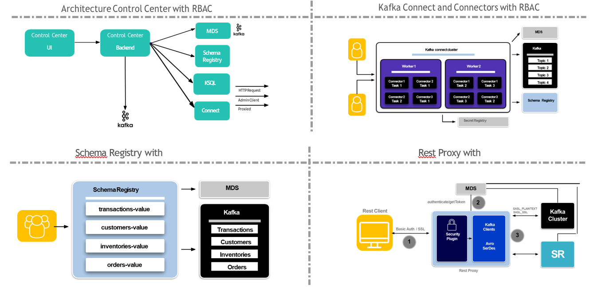
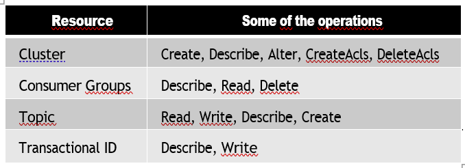
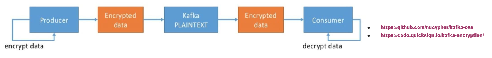
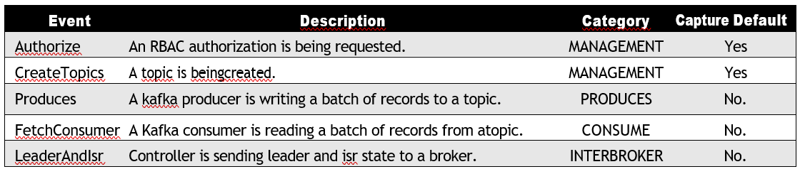

# 4. Security

## Introduction

Safety is based on four levels

• Authentication.

• Authorization.

• Encryption of communications.

• Security in storage.

• Audit.

### Kafka Security Architecture

## Authentication

There are 3 types of authentication:

In the case of Santander the option will be SASL with Kerberos.

### SASL (Simple Authentication and Security Layer)

SASL is a standard Internet method/framework for adding authentication support to connection-based protocols. Usually, an SASL negotiation works as follows:

1. First, the client requests authentication (possibly implicitly when connecting to the server).
2. The server responds with a list of compatible mechanisms.
3. The client chooses one of the mechanisms.
4. The client and server exchange data, one round trip at a time, until authentication succeeds or fails.
5. After that, the client and server know more about who is on the other end of the channel.

Kafka uses JAAS for SASL authentication.
SASL can be used with SSL which provides an encrypted channel. Some important configurations:

    Listeners: listeners=SASL_PLAINTEXT://localhost:9092, SASL_SSL://localhost:9093 security.inter.broker.protocol=SASL_PLAINTEXT java.security.auth.login.config=Jass_file (can be embedded using sasl.jaas.config.)

In Kafka there are two main mechanisms for customer authentication:

• SASL (for example, with kerberos)

• TLS/SSL (with bidirectional authentication/ client certificates).

With SASL/kerberos, customers use a ticket-based mechanism to authenticate and access other services; while TLS/SSL allows customers to present their identities to servers through certificates.

With both systems you can:

• Ensure customer identification.

• Use in conjunction with Kafka ACLs.

• Run on both a secure external port and an insecure internal port, using traffic separation in Kafka 0.10.2 (KIP-103) on different network interfaces, or use firewall rules to block traffic on the insecure port for internal clients
(more prone to errors than interface separation).

• Because authentication is only established after customers connect, and because of Kafka’s long-term connections, to immediately remove a user’s access (before their client reconnects on its own),
you must revoke access via ACL or perform a continuous denial of the group or forcibly disconnect all clients by other means, to force re-authentication.

### Kerberos

• You must run a Key Distribution Center (KDC).

• You can more easily manage and expire customer authorization with Kerberos credentials.

• If the cluster using Kerberos is exposed to the Internet, then the KDC must also be exposed to the Internet (a separate port) and be allowed to accept

Connections from all Kafka customers, which increases security risk. This is definitely not recommended if the KDC is Active Directory.

• An easier and more flexible way to revoke credentials (for example, resetting passwords).

• It can be harder to debug and resolve authentication issues.

• Kerberos does not provide in-transit data encryption itself, but can be used with TLS/SSL to encrypt traffic.

• It forces customers to renew their ticket granting tickets (TGT), for example, every 10 hours, it is safer than expiring a certificate with an expiration of one year because if someone gets their credentials,
they are useless after 10 hours, while this is not true for SSL certificates.

## Authorization

1. Via roles

    • Roles are defined by the platform and are not scalable

    • They are applicable to resources being a resource (cluster, topical, …)

2. Via ACLs

    • The ACLs can reside in zookeepeer or in the LDAP itself, here the logical thing is that they reside in Zookeeper and in LDAP remains the definition of the users and groups.

    • They are applied to users and groups

3. ACLs can be combined with roles

    • Ex: Give permissions to a group of users to a topic except to a specific user

    • Roles are used for the generic part

    • Exceptions are limited by ACLs.

4. Role-based management is simpler and more scalable for large organizations.

### Role-Based (RBAC)

RBAC is a method of controlling system access based on roles assigned to users within an organization. This method is defined around predefined roles and the privileges associated with those roles (also known as bindings roles).

Roles are a set of permissions that you can link to a resource; this link allows the privileges associated with that role to be
perform in that resource.

**The role must be given to a principal while a resource must be linked to that role.**

Using RBAC, you can manage who has access to specific Confluent Platform resources , and what actions a user can perform within that resource.

Users can change or expand roles, or let them have a role. A user can also have multiple roles.

**Permissions are associated with roles, and users or groups are assigned to the appropriate roles.**

The permissions assigned to roles tend to change relatively slowly compared to changes in the composition of users of roles. Users and groups are easily reassigned from one role to another.

RBAC implements a full authorization that is applied across all user interfaces (UI, CLI, and API of the Confluent Control Center), and across all The Confluent Platform Components (Control Center, Schema Registration, MQTT Proxy, Kafka Connect and KSQL).

RBAC leverages Confluent Platform Metadata Service to
configure and manage your RBAC deployment from a centralized configuration context, simplifying access management across Confluent Platform resources.

Like ACLs, RBAC uses principals, so it can associate any principal that is using a client with an RBAC role, that is authorized by the Confluent Server Authorizer to communicate with both the RBAC and the ACLs.

RBAC functions do not support DENY rules, and there is no difference in how DE ACLs are created and used
Kafka At the same time RBAC is used; rather, RBAC serves as an additional application layer.

Predefined role mappings determine who can access specific resources in the Confluent Platform and what actions an individual user can perform within that resource.
User administrators can add users and LDAP groups, making it easy and speedy to centrally configure authentication and authorization for the various Confluent Platform resources used in an organization.

The currently predefined roles within RBAC are:

To visualize the different roles and bindings created from the graphical interface C3 you can list some commands through the MDS service are:

• List the exsitentes roles:

    confluent iam role list

• The creation of binding from console will be done using the Metadata Services (MDS) service:

    confluent iam rolebinding create
    --Principal User<principal_user>
    --role ResourceOwner
    --resource Topic:<nombre_topic>
    --kafka-cluster-id < cluster identifier>

• List the roles linked to a principal:
confluent iam rolebinding list

    --Principal=User:<principal_user>
    --kafka-cluster-id=< cluster identifier>

• Delete a role created:
confluent iam rolebinding delete

    --Principal=User:<principal_user>
    --kafka-cluster-id=< cluster identifier >
    --role=DeveloperRead
    --resource=Topic:<nombre_topic>

• As well as the creation of the acls themselves.
kafka-acls

    --authorizer-properties zookeeper.connect=<uri>:2181
    --add --allow-principal User User<principal_user>
    --operation All --topic '*' --cluster

At the level of components that make up the Confluent solution, RBAC can be applied in the following ways:

### Based on ACLs

The use of wildcards “*” is allowed when managing ACLs

    • --group='*'

The use of presets is allowed to add ACLs at the name level “such names follow a preset pattern”

    • --topic Test- --resource-pattern-type prefixed

Granularity with ACLs is greater than with roles allowing. Give specific users permissions to specific resources even if the user belongs to a role

### Encryption of communications

Communications can be encrypted using TLS (deprecated SSL since June 2015, but called SSL by convention), and more that can be encrypted using this mechanism.

The SSL mechanism can be configured for encryption or authentication. However, you can configure only SSL encryption (by default, SSL encryption includes server authentication) and independently choose a separate mechanism for client authentication,
for example SSL, SASL, etc. It must be noted that TLS encryption, technically speaking, can be used as an encryption. it already allows one-way authentication in which the client authenticates the server certificate.

So when we refer to the term TLS authentication, we really mean two-way authentication in which the agent also authenticates the client certificate.

One of the points to keep in mind when enabling TLS is that
it can have an impact on performance due to encryption overhead.

Some recommendations:

• Sanitity Check:

    openssl s_client -debug -connect host.name:port

• Logging: Enabling debug logging:

    export KAFKA_OPTS=`-Djavax.net.debug=all` things to review:

• Review breaches of password use, for example, not respecting password construction policy.

• Check encryption errors , for example certificate not signed by the corresponding CA.

Relevant documents on security:

• JSSERefGuide

• Confluent Docs

This encryption system uses private key/certificate pairs that are used during the TLS handshake process:

• Each of the brokers needs its own private key/certificate pair, and the client uses the certificate to authenticate the broker.

• Each logical client needs a private key/certificate pair if client authentication is enabled, and the broker uses the certificate to authenticate the client

• Each broker and logical client can be configured with a truststore, which is used to determine which certificates ( broker identities or logical client) to trust
(authenticate).

The truststore can be configured in many ways:

1. Contains one or more certificates: The broker or logical client will trust any certificate listed in the truststore.

2. Contains a Certification Authority (CA): The broker or logical client will trust any certificate that has been signed by the CA in the truststore.

**Option 2 is initially the most convenient**, as adding a new broker or client does not require a change in the truststore.

However, Kafka does not initially support authentication blocking for brokers or individual clients previously trusted through this mechanism.

Certificate revocation is usually done through certificate revocation lists or the online certificate status protocol,
so you should rely on authorization to block access.

Instead, in the first case, blocking authentication would be achieved simply by removing the certificate from the broker or client from the truststore.

Currently there is no mechanism in Apache Kafka for the securization of stored data, however sometimes an automatic encryption of the physical disk is decided for this aspect.
Azure allows encryption of hard drives associated with your virtual machines:

<https://docs.microsoft.com/es-es/azure/virtual-machines/windows/encrypt-disks>

At the on-premise level there are different companies with default solutions that allow this action, such as bitlocler at the Windows level:

<https://support.microsoft.com/es-es/help/4028713/windows-10-turn-on-device-encryption>

Or some of the third-party solutions offered by confluent and with which it has a partnership:

<https://www.gemalto.com/latam/seguridad-empresarial/cifrado-de-datos>

<https://www.slideshare.net/ConfluentInc/protecting-your-data-at-rest-with-apache-kafka-by-confluent-and-vormetric>

### Audit

The audit allows obtaining information about the decisions of access to topics by users, for this, it is based on the Confluent Server Authorizer component.

Runtime decisions based on ACLs and RBAC will be recorded in audit topics

It will offer **tracking** of users in the access to the platform.

• Detect anomalous behaviors

• Detection of possible risks.

You can process the information via KSQL or send it to an external repository for exploitation (Splunk, ElasticSearch, …)

**Configuration:**

    //Enable the Confluent Server Authorizer
    • authorizer.class.name=io.confluent.kafka.security.authorizer.ConfluentServerAuthorizer 
    //Domain to achieve MDS”
    • confluent.authorizer.authority.name=mds.mycompany.com 
    // Point to a topic and machine configuration json
    • confluent.security.event.router.config 
    • confluent.security.event.logger.enable=false/true  
    • io.confluent.security.audit.log.fallback

The events related to the audit are a defined set that are generated as accesses to the cluster occur

The resources in the audit are identified via CRN (Confluent Resource Name) which is a way to uniquely represent a resource in Confluent:

    • Kafka cluster: <authority>/kafka=<kafka-cluster-id>
    crn://mds.mycompany.com/kafka=rKtuRNiDQb2k9NMml6rLfA

    • Topic: <authority>/kafka=<kafka-cluster-id>/topic=<topic-name>
    crn://mds.mycompany.com/kafka=rKtuRNiDQb2k9NMml6rLfA/topic=app1-topic

    • Consumer  group: <authority>/kafka=<kafka-cluster-id>/group=<consumer-group-name> crn://mds.mycompany.com/kafka=rKtuRNiDQb2k9NMml6rLfA/group=app1-consumer-group

    • KSQL cluster: <authority>/kafka=<kafka-cluster-id>/ksql=<ksql-cluster> crn://mds.mycompany.com/kafka=rKtuRNiDQb2k9NMml6rLfA/ksql=default_

    • Connect: <authority>/kafka=<kafka-cluster-id>/connect=<connect-cluster>/connector=<connector-name> crn://mds.mycompany.com/kafka=rKtuRNiDQb2k9NMml6rLfA/connect=ydfk/connector=sink-connector

By default, the following are audited:

  • Topics and ACLs: Create and delete

  • Requests for authorization to RBAC

  • Events that occur belonging to the category MANAGEMENT of the global event

  • The default audit topic is confluent-audit-log-events

• Confluent allows you to have different audit topics for different purposes

   • A topic for authorizations to topics

   • A topic for rejections to topics

   • Topic for management events … and thus cover retention needs, data sensitivity

• You can configure log4j in case there is an error in writing audit topics as an alternative

• You can consume the events on the fly from the shell, e.g. Using the kafka-console-conumer.
