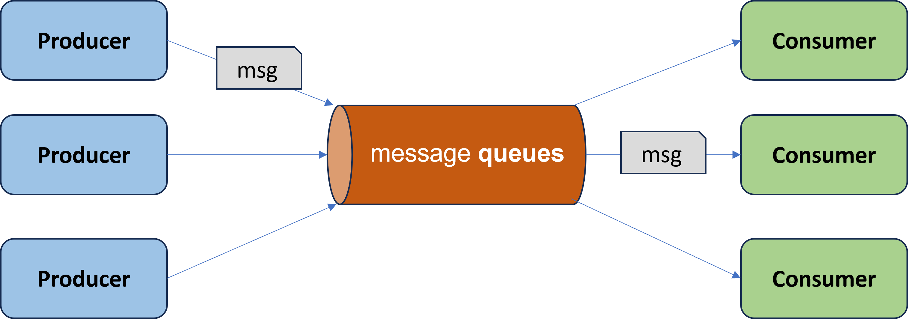
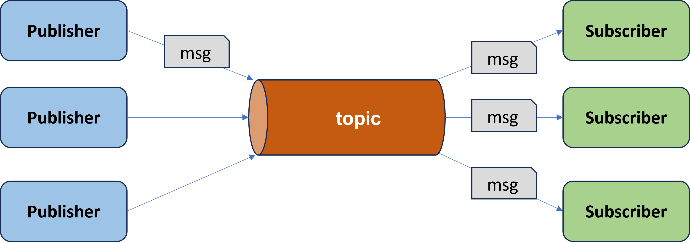
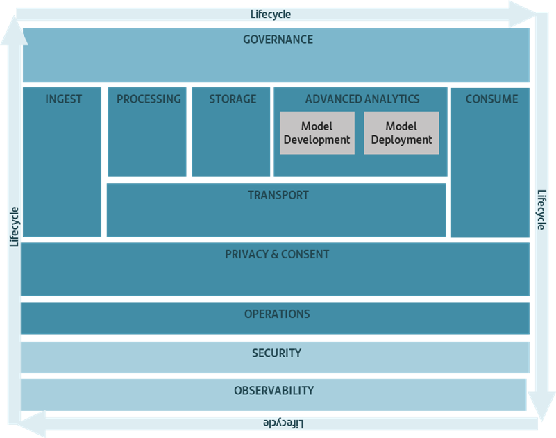
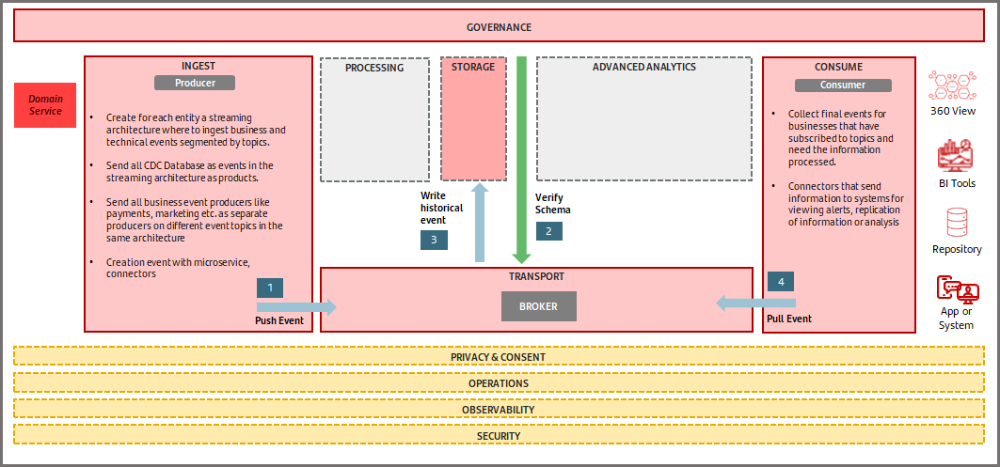
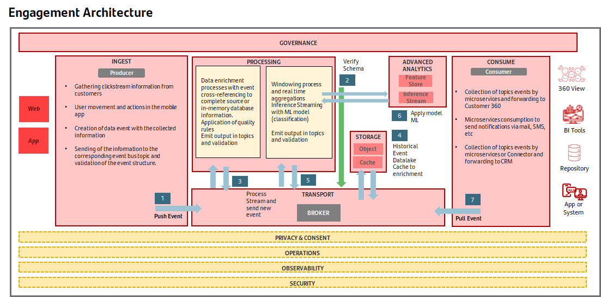
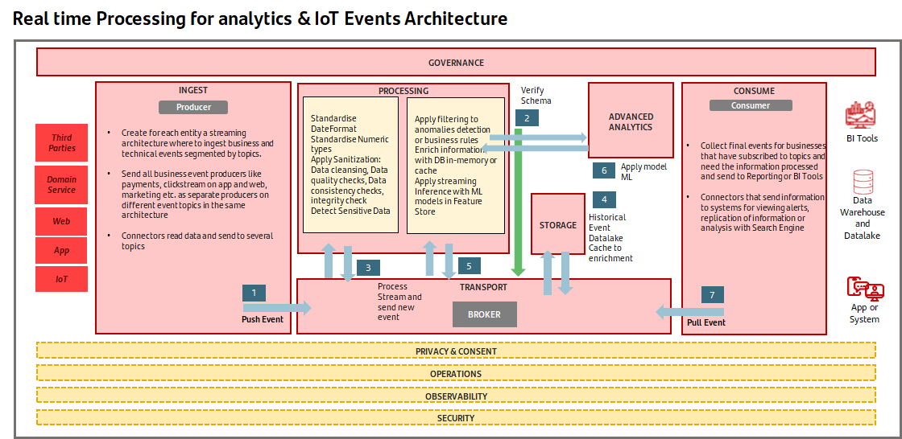
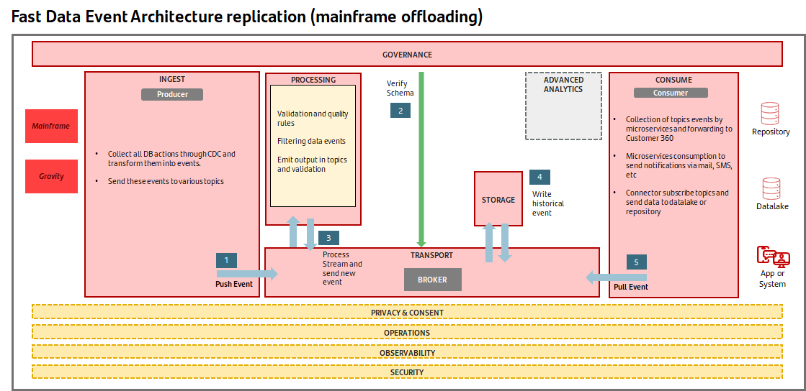
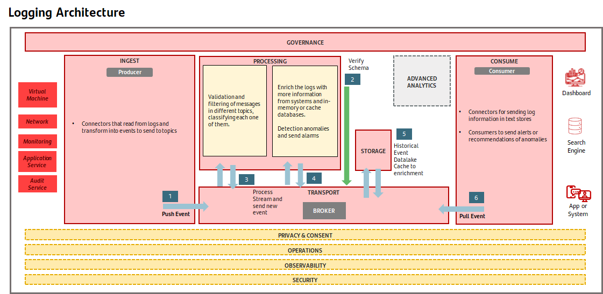
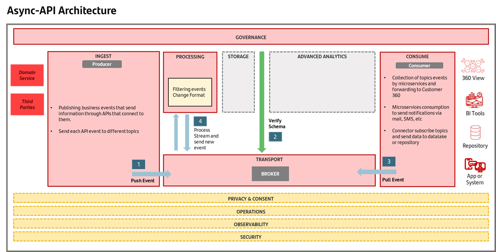

# Events Reference Architecture

  - #### [Confluent On-premise](./confluent-onpremise/index.md)
  - #### [Confluent Cloud on AWS](./confluent-cloud-aws/index.md)
  - #### [AWS MSK](./aws/index.md)

## Introduction

Events are a fundamental part of Santander's digital transformation because everything that happens around the business is an EVENT
Stream and event processing is valuable because it gives you the opportunity to execute code in response to a change at any level of detail and do so in conjunction with the knowledge of all the changes that came before.

## Capabilities

- Event-based solutions cover a pattern of software architecture that promotes the production, detection, reaction and consumption of events.
- In event-driven solutions the capture, communication, processing and permanence of events are the core structure of the solution.

### What does the Event-Driven offer?

- The main objective is to facilitate the continuous flow of information.
- Transport the information, facilitating the independence and interoperability of the components.
- It must manage the choreography between the different components of the solution.

### What are the main patterns of events solutions?

- **Pub/sub pattern**: events are written in the topic and sent to subscribers who need to be informed about it.
- **Stream pattern:** events are written in a broker topic and there is no subscription. Reading can be initiated from any of its parts.

### What is an Event?

- Everything that happens is an **EVENT**
- We can categorize the events as:

        **Context events**: Everything that happens around our client/process.

        **Action events**: All the facts that provoke the customer in his actions.

        **Business events**: All the facts that our customer produces in the use of the products. añadir building block.

## Terminology

- **Message:** It represents the fundamental unit of data, in essence it is a key/value pair.

- **Topic:** Category that applies to the destination of Kafka to which the message is directed and from which it can be recovered.

- **Partition:** Ordered and immutable sequence of messages that are continually being published. Each topic is divided into one or more partitions, where messages are stored.

- **Offset:** Sequential numerator that uniquely identifies a message within its partition.

- **Broker:** Each of the servers on which a Kafka cluster is running.

- **Producer:** Client process responsible for creating messages that are ingested in the Kafka system.

- **Consumer**: Client process that consumes messages from a queue/topic.

## Message Models

### Point-to-point model

- There are 2 types of actors: **Producers** send messages to the queue and **consumers** receive/consume them.

- A sender sends a message to a defined (named) queue, allowing it to add a priority level.

- A message is consumed by a **single consumer** (1:1), and there may be several publishers and consumers.

- Once a message is consumed, the consumer sends an acknowledgment of receipt to the queue to confirm its correct reception (ACK).

- Queues retain all sent messages until they are consumed or until they expire.

- Each queue has a unique name defined in the system and has a message input/output policy (FIFO, LIFO, …)

### Publisher/subscriber model

- There may be multiple publishers (producers) and subscribers (consumers) of a particular topic.

- Publishers send messages to a topic, and messages are consumed by all subscribers of that topic (1:N).

- The system is responsible for automatically distributing the messages that arrive from the different publishers to all consumers subscribed to the topic.

- Messages may or may not be stored in the system for a period of time.

- There are two types of configurations depending on the temporary dependency:

   - Long-lasting: Subscribers can consume pre-subscription messages (therefore requiring message storage) thus offering flexibility and reliability to queues.

   - Non-durable: Subscribers can only consume post- subscription messages.

- It is useful in situations where one group of applications wants to notify others of a particular event (for example, a CRM application, in creating a client, may need to communicate to other applications the creation of this client).

## Event Building Blocks

Lists and describes the technical and architectural capabilities involved in the event architecture:

### 1. Transport

Responsible for facilitating the transit of information between the different components, sources and destinations. It must allow all use cases to be implemented.

### 2. Ingest

Integrate data from different systems for different initiatives, avoiding redundancy and duplication. Covers all use cases (near real-time and batch ingestions).

### 3. Consume

Consumption and exploitation of data including other systems / operational databases, BI tools, inference serving, sharing, etc.

### 4. Processing

Data processing frameworks (batch, streaming and real time) and tools to transform and prepare data for the different initiatives.

### 5. Storage

Storage of information for both operational and analytical purposes. It can be structured or not, in object storage, topics or specific-purpose repositories

### 6. Advanced Analytics

Set of tools to enable analysts, engineers, developers to work on the data platform. Have deep integration with the data processing tools and data storage layer. Includes the generation of  models from training, registry, feature store, deployment, etc.

### 7. Operations

Defining and representing all the different data from the streaming, batch and replication, as well as the relationships between them.

### 8. Observability

Platform technical observability and functional monitoring of the data pipelines.

### 9. Security

Protecting digital information from unauthorized access, corruption, or theft throughout its entire lifecycle

### 10. Governance

E2E data governance: business glossary, technical catalogues, data lineage, data quality.

### 11. Privacy & Consent

Data privacy as an area of data protection that refers to the appropriate treatment of sensitive data and consent understood as the right of individuals to control how their personal data is collected and used.

## Event Architecture Pattern

### 1. Event Centric Pattern

### 2. Engagement Pattern

### 3. Real Time Processing

### 4. Fast Data Event Replication

### 5. Logging Pattern

### 6. Async-API Pattern

