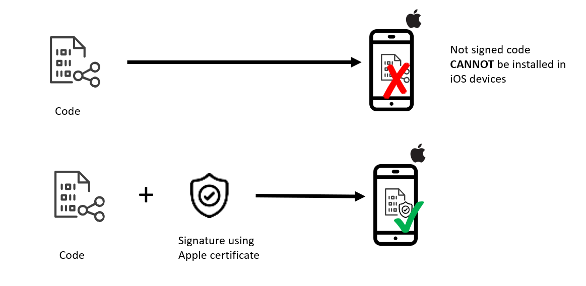
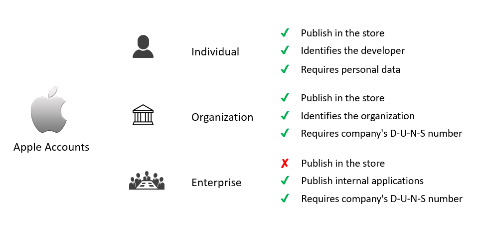
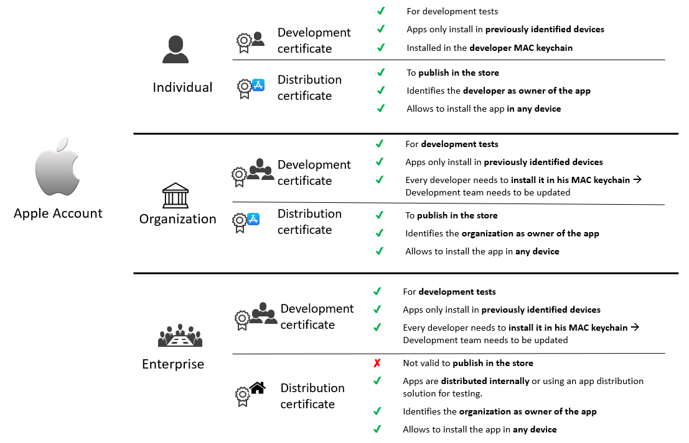
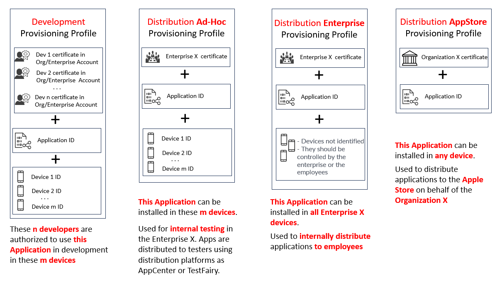
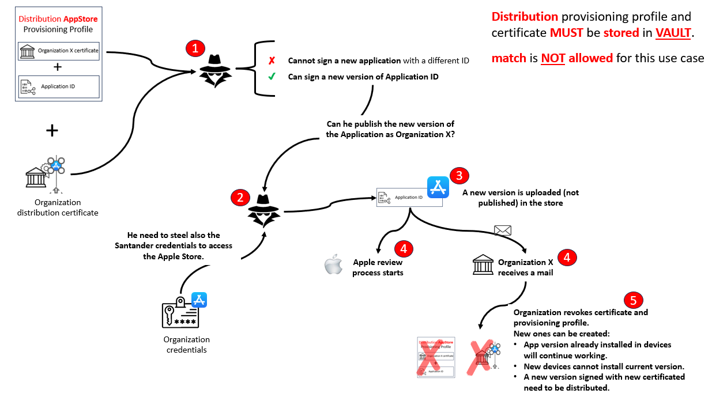
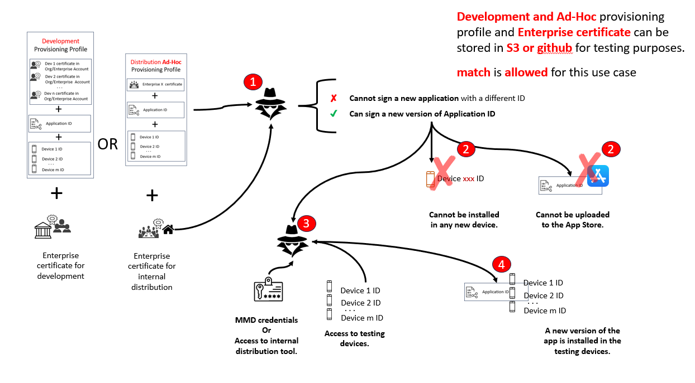
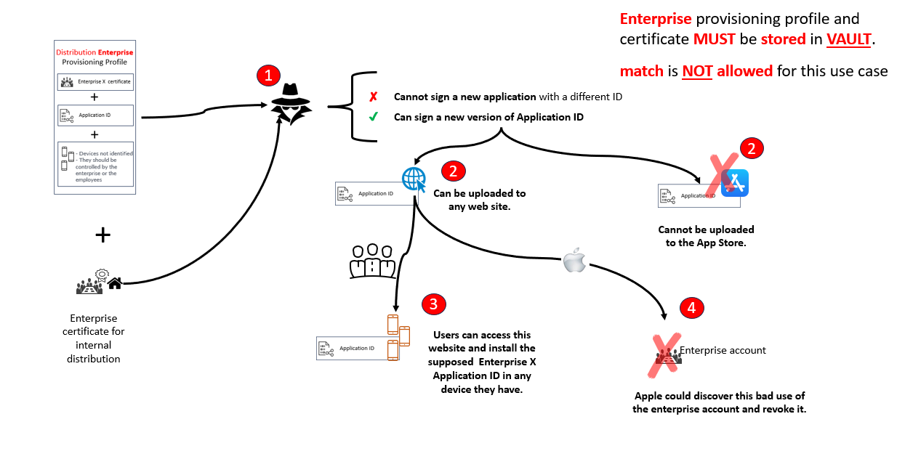

# iOS Application Signing

To install an application in an iOS device it must be signed with a certificate provided by Apple. This way, Apple can verify the identity of the developer and ensure that the application has not been
tampered with.



## Apple Accounts

To obtain a certificate, it is necessary to have an Apple Developer account that can be created at the following link: [Apple Developer](https://developer.apple.com/) and be subscribed to the Apple
Developer Program. The Apple Developer Program gives access to all resources provided by Apple, such as the ability to distribute applications in the App Store.

If your membership expires, users can still download, install, and run your applications that were signed with certificates previously created, but once those certificates expire, you will need to
have renewed your membership to get new certificates to sign updates and new applications

The complete list of resources provided by Apple can be found at the following link: [Apple memberships](https://developer.apple.com/support/compare-memberships//)

There are different types of developer accounts:

- **Individual** Account
- **Organization** Account
- **Enterprise** Account



### Individual Account

It is intended for individual developers who want to distribute applications in the App Store. Apple will require the user of the user's legal name, that will be shown in the Apple Store as the
application owner, and other personal data (card credit, phone, email...) that will be verified by Apple prior to approve the account. Once the developer has the account, he will need to subscribe to
the Apple Developer Program to have access to all Apple resources, as application distribution in the Store. Current Apple Developer Program cost is $99/year for individuals.

If the developer is not going to distribute its applications and only wants to start learning how to develop for iOS platform and test on his real devices, he can use just the individual account with
some limitations:

- Only 10 applications ids can be created simultaneously. Those ids expire after 7 days.
- Only 3 devices can be registered for testing the applications. They expire after 7 days.
- Provisioning profiles expire after 7 days which means the developer will need to rebuild the application and reinstall it on the devices. the free account that Apple provides. This account is
  limited to 100 devices

### Organization Account

It is intended for companies that want to distribute applications in the App Store. Apple only allows one account per company that must register using the company's D-U-N-S number and other data (i.e.
legal name, phone, website, email, etc) that will be verified by Apple prior to approve the account. The approval process can take an indeterminate amount of time.

Once the organization account is approved, the company can subscribe to the Apple Developer Program to have access to all Apple resources, as application distribution in the Store. Current Apple
Developer Program cost is $299/year for organizations.

All developers that work for the company need to be added to the account as members. Each member will have its own Apple ID and will be able to access the resources provided by Apple. There are
[different roles](https://developer.apple.com/help/account/manage-your-team/roles/) that can be assigned to each member:

- **Holder**: Can access all resources and manage the account. It is the person that acts on behalf of the company to accept legal agreements and renew the membership.
- **Admin**: Can access all resources but cannot manage the account neither act on behalf of the company. He can manage certificates, identifiers, and profiles.
- **App manager**: Can access all resources but cannot manage the account. He can only manage certificates, identifiers, and profiles if Admins or Holders allow it.
- **Developer**: He cannot manage certificates, only will download them. He can create and manage identifiers and profiles, if XCode Automatic Signing is enabled.
- **Financial, Marketing, Sales or Customer Support**: Profiles that does not interact with development but requires to download beta applications or access the account for the purpose indicated by
  his role.

### Enterprise Account

It is intended for companies that want to distribute applications internally for their employees, but not in the store to the public. Apple is applying a very restrictive control to provide and renew
this kind of account as there have been detected bad practices with this kind of certificates as it has been used to distribute applications that do not conform with Apple policies outside the store.
Apple has revoked this kind of certificate to those companies that have been used it in the wrong way.

## iOS Certificates

There are three types of certificates that are required to sign an iOS application:

- **Developer Certificate:**
    - Used to sign the application during development and testing.
    - It identifies the developer and is linked to the developer's Apple ID.
    - If certification expired, developers will be able to install in their devices currently signed applications, but they will not be able to sign new applications until a new certificate is obtained.

- **Distribution Certificate:**
    - Used to sign the application before it is distributed to the App Store.
    - If the certificate expires, the applications signed with will run in the devices that already have the application installed, but it will not be possible for new users to obtain the app in their
    device or to distribute new versions of the application until a new certificate is obtained and the application is signed again and uploaded to Apple Store.

- **Enterprise Certificate:**
    - Used to sign the application before it is distributed to the enterprise.
    - If the certificate expires, the applications signed with will not run and a new certificate will be needed to sign the application again and distribute it.
    - Apple issue the Enterprise certificate only to organizations that have more than a hundred employees.

All certificates are issued by Apple and linked to the developer's Apple ID. Apple certificates typically expire after 2-3 years.



## Provisioning Profiles

A provisioning profile is a file that contains information about the application (application identifier, which is the bundle id, and its certificate owner) and the devices that are allowed to run it.
It is necessary to install the application on a device.

There are three types of provisioning profiles:

- **Development Provisioning Profile:**
    - Used to install the application on a device during **development and testing**.
    - Associated with the application identifier, the development certificate for individual or for organization and the devices identifiers where the application will be tested.

- **Distribution Provisioning Profile:**
    - Used to install the application on a device before it is distributed to the **App Store**.
    - Associated with the application identifier and the distribution certificate for individual or for organization. As its target is the App Store, it does not need to specify the devices where the
    application will be installed.

- **Enterprise Ad-Hoc Provisioning Profile:**
    - Used to install the application on a device before it is distributed to a limited number of devices in the enterprise for testing purposes. Not valid to distribute in App Store.
    - Associated with the application identifier, the enterprise certificate and the devices identifiers where the application will be installed.
    - Typically used for beta testing.

- **Enterprise Distribution Provisioning Profile:**
    - Used to install an internal application in the employees' devices. Not valid to distribute in App Store.
    - Devices should be managed by the enterprise and controlled by the employees, but there is not any restriction to avoid install the app in any other device.
    - Typically used for internal applications-

Provisioning profiles expire after one year, so it is necessary to renew them periodically.



### Problem to maintain Development and Ad-Hoc distribution profiles

As it has been explained in previous section, it is required a provisional profile per application the team requires to test. That includes final applications that will go to the Apple Store, but also
all internal applications used as Sample Apps to certificate every single component developed as an isolated library. Therefore, for development and internal testing there are multiple provisioning
profiles that **require to be updated every time a testing device is added / removed or certificates or provisioning profiles expire**:

- Certificates expire every 3 years
- Provisioning profiles expire every year

The manual management of all those provisioning profiles for development and testing purposes implies an important work overload for the development teams. Note, that it is not a problem or the App
Store distribution provisioning profile due the reduced number of final application and the fact that very reduced number of people have access to these certificates and provisioning profiles, just
the users with profile App Manager, Admin or Holder.

To facilitate the management of **provisioning profiles for development and testing purposes**, the recommendation is to use Fastlane, the use of **_match_** that will allow to create all required
certificates & provisioning profiles and stores them in a separate git repository, Google Cloud, or Amazon S3. Every team member with access to the selected storage can use those credentials for code
signing. **_match_** also automatically repairs broken and expired credentials.

Parameters used in **_match_** allows us to control the provisioning profile generation:

- **force_for_new_devices**: If enabled, match will re-generate the provisioning profile if the device count has changed since the last time you ran the command.
- **force**: If enabled, match will re-generate the provisioning profile on each run.
- **readonly**: If enabled, match will run in read-only mode, preventing it from making any changes to the repository.
- **type**: The type of provisioning profile to generate. The default is development, but it can also be appstore, adhoc, enterprise, or development. Note that we **should restrict the use of
  _appstore_** as those profiles will be generated manually by the App Manager, Admin or Holder.
- **username**: The Apple ID used to generate the certificates.
- **storage_mode**: The storage mode to use. The default is git, but it can also be google_cloud or s3.
- **git_url**: The URL of the git repository where the certificates will be stored.

#### Security concerns related to the use of _match_

If someone have access to the certificate and provisioning profile, they could sign and application with the same bundle identifier the provisioning is using to identify the app. That could lead to
different situation depending on the type of certificate and provisioning profile:

- **AppStore**: **That should be restricted, distribution certificates will be managed manually** and not using **_match_**. In any case, if they have access to the certificate and provisioning
  profile, they could submit an app with same identifier for review, but only if they have also your iTunes Connect credentials to do it. Once submitted, the app it is not automatically published, it
  enter in the traditional Apple review process which takes a few days and at the same time you will receive an email notification every time a build gets uploaded, therefore you could cancel the
  submission even before your app gets into the review stage. Once detected the issue, you should revoke the current certificate, generate a new one, update the provisioning profile and re-sign the
  app to upload it to the store.



- **Development** and **Ad-hoc**: They are harmless as they can only be used to install a signed application with the same bundle id on a small subset of devices controlled by the development and QA
  team under the enterprise/organization account. This app can never go to the AppStore. New devices can be only added in Apple Developer Portal, which require to have access to the credentials.

  

- **Enterprise**: Attackers could use an In-House profile to distribute signed application to a potentially unlimited number of devices. All this would run under your company name and it could
  eventually lead to Apple revoking your In-House account. However, it is very easy to revoke a certificate to remotely break the app on all devices. Because of the potentially dangerous nature of
  In-House profiles please use match with enterprise profiles with caution, ensure your git repository is private and use a secure password.

  

## Guide to use match

Below are the detailed steps to use Fastlane Match for the first time in your organization. This guide covers initial setup, required roles and permissions, and what each team member should do.

### 1. Initial Setup (DevOps/Tech Lead)

- **Role:** DevOps engineer or Technical Lead
- **Apple Account Permissions:** Admin or App Manager (must be able to create/manage certificates and provisioning profiles)

#### a. Create a private GitHub repository

- Purpose: Store encrypted iOS certificates and provisioning profiles
- Action: Create a new private repository (e.g., `ios-certificates`) in your organization’s GitHub
- Permissions: All iOS developers must have read access. DevOps(TeachLeads with Admin or App Manager permissions in Apple Account, should have Admin access to the repo.)

Once the private GitHub repository has been created and access assigned, begin project setup as described below.

#### b. Clone the repo created with the iOS Base App Component in your MAC

Optional step, not required to generate the certificates, but necessary if the user will work also as developer in the project.

#### c. Install Fastlane on your Mac

- Run: `sudo gem install fastlane` or `brew install fastlane`

Note that the Mac can have restrictions to execute `sudo` or `brew`. If it is the case, an additional way to install fastlane is:

```sh
bundle init
bundle add fastlane --skip-install
bundle add xcodeproj --skip-install
bundle install --path vendor/bundle
```

#### d. Generate certificates and provisioning profiles

- Run:

```sh
fastlane produce git_url:"<MATCH_GIT_URL>" git_branch:"<MATCH_GIT_BRANCH>" git_basic_authorization:"<MATCH_GIT_TOKEN>"
```

The CLI command will require:

  - Apple Developer credentials. Remember it should have Admin/App Manager permissions in Apple Account
  - OTP sent by Apple
  - App Id and bundle to register in the Apple Account

See [fastlane produce documentation](https://docs.fastlane.tools/actions/produce/) for additional parameters in case the application to be registered requires additional Application Services.

#### e. Update private repo with certificates and provisioning profiles

```sh
fastlane match development git_url:"<MATCH_GIT_URL>" git_branch:"<MATCH_GIT_BRANCH>" git_basic_authorization:"<MATCH_GIT_TOKEN>"
```

### 2. Developer Setup (All Developers)

#### a. Clone the repo created with the iOS Base App Component in your MAC

Obtain the component code created on yor Mac

#### b. Install Fastlane

- Run: `sudo gem install fastlane` or `brew install fastlane`

Note that the Mac can have restrictions to execute `sudo` or `brew`. If it is the case, an additional way to install fastlane is:

```sh
bundle init
bundle add fastlane --skip-install
bundle add xcodeproj --skip-install
bundle install --path vendor/bundle
```

#### c. Download certificates and provisioning profiles

```sh
fastlane match development git_url:"<MATCH_GIT_URL>" git_branch:"<MATCH_GIT_BRANCH>" git_basic_authorization:"<MATCH_GIT_TOKEN>" --readonly
```

- Input required:
  - The encryption password (`MATCH_PASSWORD`)
  - GitHub token as the certificates repo is private

#### d. Start development

- Fastlane Match will fetch and install the correct certificates and profiles, so developers can build and run the app on their Macs without manual setup

---

### Summary Table

| Step | Who | Apple Role | What to do |
|------|-----|------------|------------|
| Create certificates repo | DevOps/Tech Lead | Admin/App Manager | Create private GitHub repo |
| Clone iOS Base App Component | DevOps/Tech Lead | Admin/App Manager | Clone project repository to Mac |
| Install Fastlane | DevOps/Tech Lead | Admin/App Manager | `sudo gem install fastlane` or bundle install |
| Create app in Apple Portal | DevOps/Tech Lead | Admin/App Manager | `fastlane produce` with git parameters |
| Generate development certificates | DevOps/Tech Lead | Admin/App Manager | `fastlane match development` with git parameters |
| Clone iOS Base App Component | All developers | Any | Clone project repository to Mac |
| Install Fastlane | All developers | Any | `sudo gem install fastlane` or bundle install |
| Download certificates/profiles | All developers | Any | `fastlane match development` with `--readonly` |

**Tip:**

- Keep the encryption password secure and share only with authorized team members.
- Only DEBUG/development certificates/profiles should be stored in the repo, as per security policy.

This process ensures all developers use the same signing files, making builds and deployments smooth and secure.
