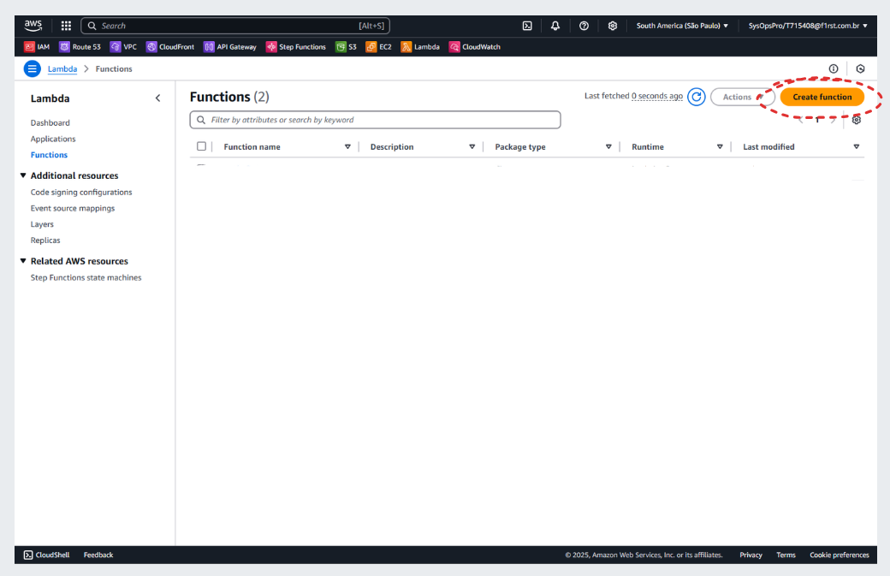
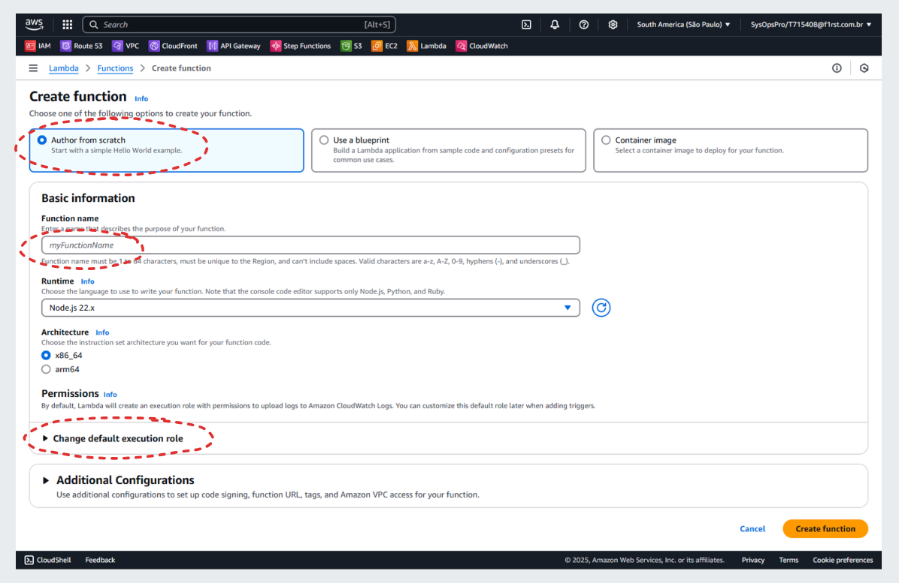
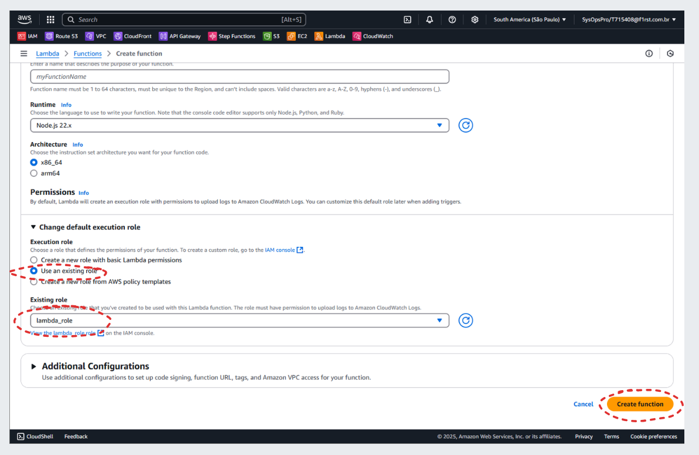
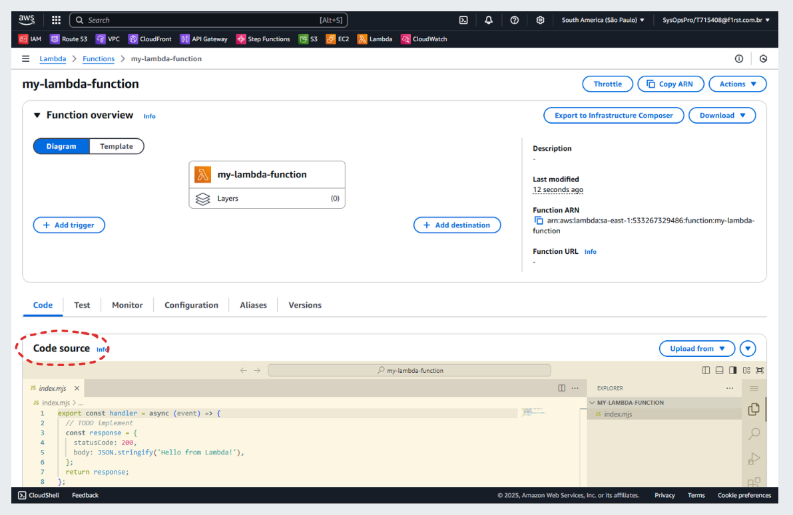
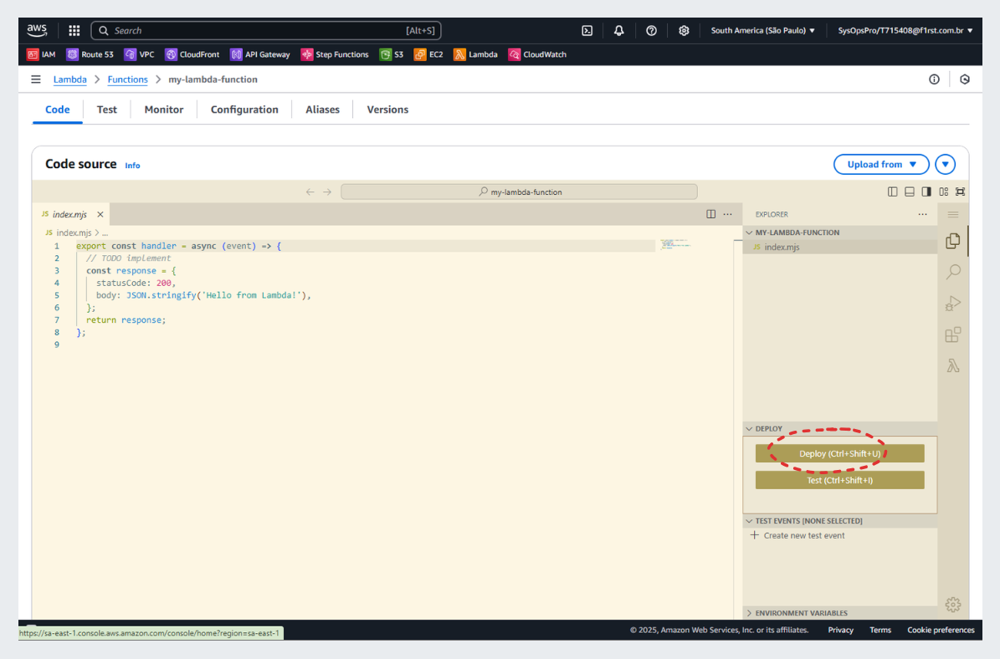

# API Gateway Lambda Function

!!! warning "Important"
    As a **Reference Architecture**, this documentation provides **general patterns and recommendations** that should be tailored and customized to meet the specific requirements of each use case.

## Overview

This document explains how to create and use an API Gateway Lambda Function, enabling integration with API Gateway to handle computations for REST API requests and responses.

## What is a Lambda Function?

The **API Gateway Lambda Function** is a serverless compute service integrated with **AWS API Gateway** to handle requests dynamically.
It allows developers to execute custom logic for API requests, such as retrieving front-end applications, processing configuration maps, or managing micro front-end components.

## How to create a Lambda Function?

The process of creating the **API Gateway Lambda Function** involves setting up a **Lambda Function** using **AWS Lambda**, integrating it with **API Gateway**, and deploying it. Below is a detailed guide to accomplish this:

<br/>

- On **Lambda** page, click on **Create function**.

    

- On **Create Function** page, start from scratch, fill **Function name** and open **Change default execution role**.

    

- Choose **"lambda_role"** for existing role field and click **Create function**

    

- On **Code source** paste the code below...

    ??? example "S3 Bucket Proxy Lambda Function"
        ```javascript
        import cf from "cloudfront";

        // This fails if there is no key value store associated with the function
        const kvsHandle = cf.kvs();

        const removeHash = (path) => {
        // if the path contains a hash, we split the path and get the first part
        return path.includes("#") ? path.split("#")[0] : path;
        };

        const removeTrailingSlash = (path) => {
        // if the path ends with "/", we remove the trailing slash
        return path.endsWith("/") ? path.slice(0, -1) : path;
        };

        const addIndexHtml = (path) => {
        // if the path is a "withoutFileName" type, we need to append "/index.html" to the path
        const pathType = pathValidator(path);

        if (
            pathType.includes("snapshotVersionWithoutFileName") ||
            pathType.includes("snapshotVersionMinimal") ||
            pathType.includes("activeVersionWithoutFileName") ||
            pathType.includes("activeVersionMinimal")
        ) {
            return `${path}/index.html`;
        }
        return path;
        };

        const pathValidator = (path) => {
        const patterns = {
            // application-name/component-name/version-number/language/file-name.extension
            snapshotVersionComplete:
            /^\/?[\w-]+\/[\w-]+\/\d+\.\d+\.\d+\/[\w-]+\/[\w-]+\.[\w]+$/,

            // application-name/component-name/version-number/language
            snapshotVersionWithoutFileName:
            /^\/?[\w-]+\/[\w-]+\/\d+\.\d+\.\d+\/[\w-]+$/,

            // application-name/component-name/version-number/file-name.extension
            snapshotVersionWithoutLanguage:
            /^\/?[\w-]+\/[\w-]+\/\d+\.\d+\.\d+\/[\w-]+\.[\w]+$/,

            // application-name/component-name/version-number
            snapshotVersionMinimal: /^\/?[\w-]+\/[\w-]+\/\d+\.\d+\.\d+$/,

            // application-name/component-name/language/file-name.extension
            activeVersionComplete: /^\/?[\w-]+\/[\w-]+\/[\w-]+\/[\w-]+\.[\w]+$/,

            // application-name/component-name/language
            activeVersionWithoutFileName: /^\/?[\w-]+\/[\w-]+\/[\w-]+$/,

            // application-name/component-name/file-name.extension
            activeVersionWithoutLanguage: /^\/?[\w-]+\/[\w-]+\/[\w-]+\.[\w]+$/,

            // application-name/component-name
            activeVersionMinimal: /^\/?[\w-]+\/[\w-]+$/,
        };

        const matchedPatterns = [];

        Object.keys(patterns).forEach((name) => {
            if (patterns[name].test(path)) {
            matchedPatterns.push(name);
            }
        });

        return matchedPatterns;
        };

        const formatConfigPath = async (path) => {
        try {
            // get the environment from the key value store
            var ENVIRONMENT = await kvsHandle.get("environment");
            if (!ENVIRONMENT) throw new Error("Error, process.env is undefined.");

            // if file is "application.properties" then we need to append the environment
            if (path.endsWith("/application.properties")) {
            path = path.replace(
                "application.properties",
                `config/${ENVIRONMENT}/application-${ENVIRONMENT}.properties`
            );
            }
            return path;
        } catch (error) {
            console.log(error);
            throw error;
        }
        };

        const formatPath = async (path) => {
        path = removeHash(path);
        path = removeTrailingSlash(path);
        path = addIndexHtml(path);
        path = await formatConfigPath(path);
        return path;
        };

        async function handler(event) {
            let path;
            
            try {
            path = await formatPath(event.request.uri);
            } catch (error) {
                console.log(error);
            }

            event.request.uri = path;
            return event.request;
        }

        ```

    

- ...and click **Deploy** to make it available

    

<br/>
