# API Gateway | Exposure

!!! warning "Important"
    As a **Reference Architecture**, this documentation provides **general patterns and recommendations** that should be tailored and customized to meet the specific requirements of each use case.

!!! tip "Attention"
    This document is part of an integrated solution comprising two key components: **Exposure** and **Storage**. AWS API Gateway serves as the **Exposure** layer, enabling secure and efficient delivery of static assets to end users.
    For the **Storage** layer, you can explore the use of [Amazon S3 Bucket](../s3-bucket.md). Together, these components facilitate the seamless deployment and delivery of web applications.

## Overview

This document outlines the steps to create and consume an **S3 Buckets Proxy API**, which is designed to facilitate the retrieval of front-end applications, their versions, and associated configuration maps.
These APIs are particularly useful in micro front-end architectures, where multiple independent front-end components are dynamically deployed and consumed.

#### Key features include

- **Dynamic Retrieval**: Automatically fetch the latest or specific versions of front-end applications.

- **Configuration Management**: Access configuration maps to separate deployment logic from application settings.

- **RESTful Design**: Leverages standard HTTP methods for scalable and stateless interactions.

The guide provides detailed instructions for creating the API, deploying it, and consuming it effectively.

<br/>

## What is the AWS Api Gateway?

**AWS API Gateway** is a fully managed service that enables developers to create, publish, maintain, monitor, and secure APIs at any scale.
It acts as a gateway to connect client applications to backend services, providing features like request transformation, authentication, throttling, and monitoring.

A **REST API** is an architectural style for designing networked applications. It uses standard HTTP methods (GET, POST, PUT, DELETE) to interact with resources, which are represented as URLs.
REST APIs are stateless, scalable, and widely used for building web services.

<br/>

## What is the S3 Buckets Proxy API?

The **S3 Buckets Proxy API** is a **REST API** designed to enable users to consume front-end applications deployed on **AWS S3 Buckets**.
It provides functionalities like retrieve the latest and older versions of front-end and micro front-end applications, as well as their associated configuration maps.

**Configuration maps**, similar to **Kubernetes ConfigMaps**, allow the separation of application deployments and configurations.

This API is particularly useful for managing micro front-end architectures, where multiple independent front-end components are deployed and consumed dynamically.

<br/>

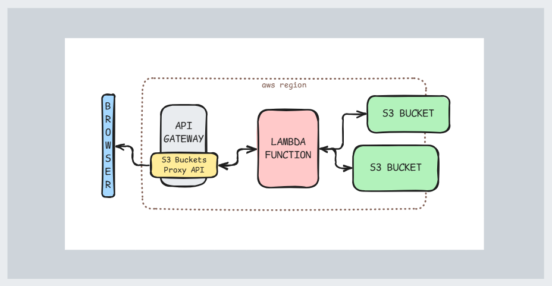

<br/>

## How to create the S3 Buckets Proxy API?

The process of creating the **S3 Buckets Proxy API** involves setting up a **REST API** using **AWS API Gateway**, configuring resources, and integrating it with a **Lambda Function**.

This API acts as a proxy to facilitate dynamic retrieval of front-end applications and their configurations stored in **S3 Buckets**. Below is a detailed guide to accomplish this.

??? example "OpenAPI json file example"

```JSON
{
    "openapi" : "3.0.1",
    "info" : {
        "title" : "Clone from s3-bucket",
        "description" : "Allows users to consume front-end applications deployed to S3 Buckets.",
        "version" : "2025-03-19T14:03:28Z"
    },
    "servers" : [ {
        "url" : "https://h22odpaell.execute-api.sa-east-1.amazonaws.com/basePath",
        "variables" : {
            "basePath" : {
                "default" : "stage"
            }
        }
    } ],
    "paths" : {
        "/{proxy+}" : {
        "get" : {
            "parameters" : [ {
            "name" : "proxy",
            "in" : "path",
            "required" : true,
            "schema" : {
                "type" : "string"
            }
            } ],
            "responses" : {
            "200" : {
                "description" : "200 response",
                "content" : {
                "application/json" : {
                    "schema" : {
                    "$ref" : "#/components/schemas/Empty"
                    }
                }
                }
            }
            },
            "x-amazon-apigateway-integration" : {
            "type" : "aws_proxy",
            "httpMethod" : "POST",
            "uri" : "arn:aws:apigateway:sa-east-1:lambda:path/2015-03-31/functions/arn:aws:lambda:sa-east-1:533267329486:function:getS3Object/invocations",
            "responses" : {
                "default" : {
                "statusCode" : "200"
                }
            },
            "passthroughBehavior" : "when_no_match",
            "cacheNamespace" : "zayh5m",
            "timeoutInMillis" : 29000,
            "cacheKeyParameters" : [ "method.request.path.proxy" ],
            "contentHandling" : "CONVERT_TO_TEXT"
            }
        }
        }
    },
    "components" : {
        "schemas" : {
        "Empty" : {
            "title" : "Empty Schema",
            "type" : "object"
        }
        }
    },
    "x-amazon-apigateway-binary-media-types" : [ "/", "text/html" ]
}
```

### Create a Lambda Function before

To use the **S3 Buckets Proxy API**, a **Lambda Function** is required to handle the integration between the API Gateway and the S3 Buckets.
This function acts as the backend logic, processing incoming requests, retrieving the appropriate resources from the S3 Buckets, and returning them to the client.

The Lambda Function ensures that the API operates efficiently and securely, enabling dynamic retrieval of front-end applications, their versions, and configuration maps.

!!! warning
    Before proceeding with the API creation, check the [API Gateway Lambda Function](./api-gateway-lambda.md) documentation.

### Create a new REST API

- On **AWS Console**, go to **API Gateway** and search for button **Create API**.

    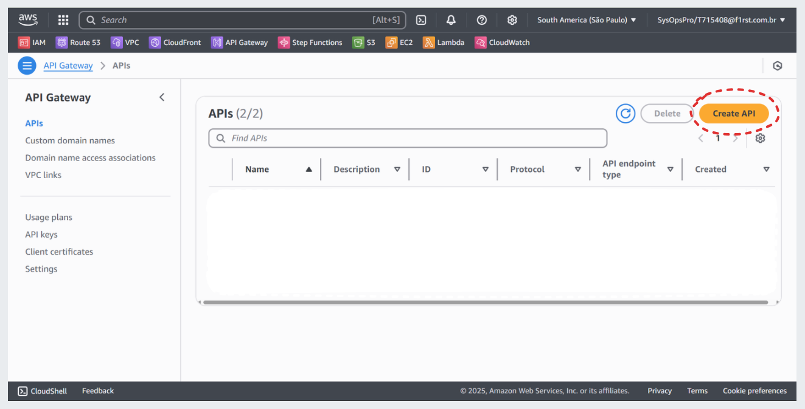

- On **Choose an API type**, select **REST API** and click **Build**.

    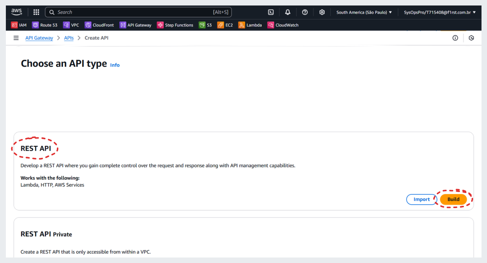

- On creation page, choose **New API**, create a name for **API name** field and click **Create API**.

    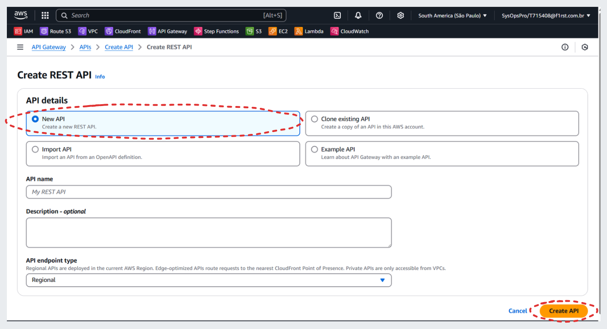

- On **API resource** page, click on **Create resource**.

    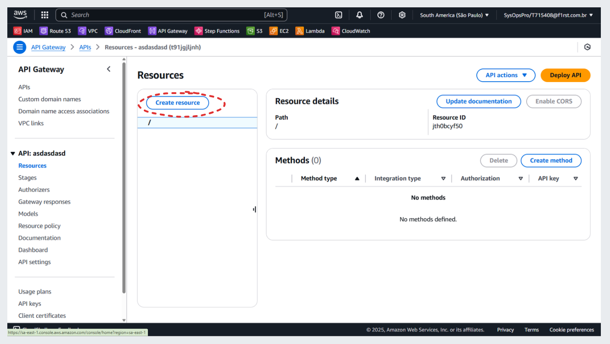

- On **Create resource** page, on **Resource name** field, complete with `{proxy+}`. This resource will act as a catch-all for incoming requests.

    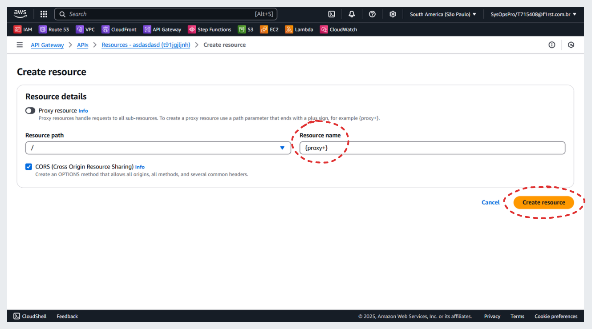

<br/>

### Add a GET Method

- Under the `{proxy+}` resource, click on **Create method**

    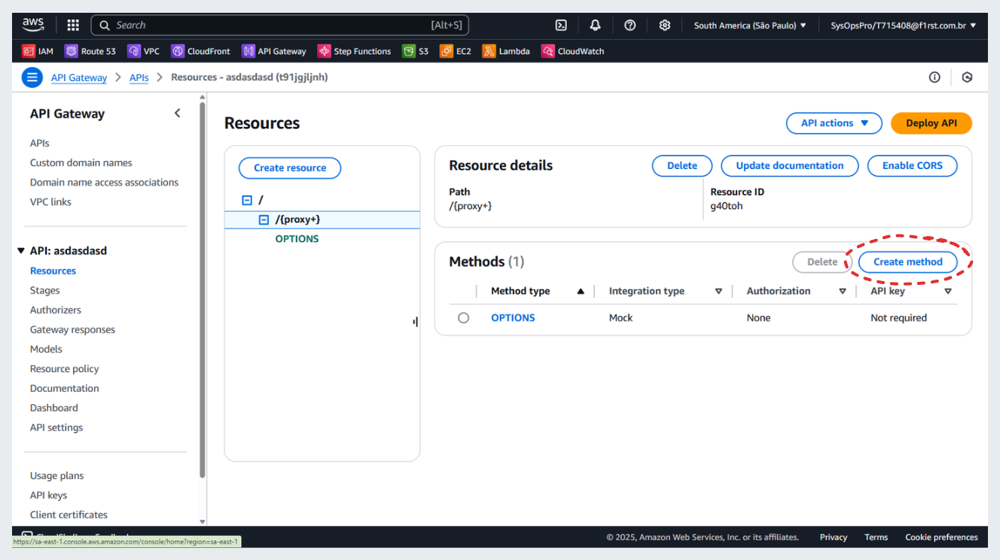

- On Create method page,
  - choose **GET** for **Method type**
  - choose **Lambda proxy** for **Integration type**
  - search for our **Lambda Function** on **Lambda Function** field
  - click on **Create Method** button

    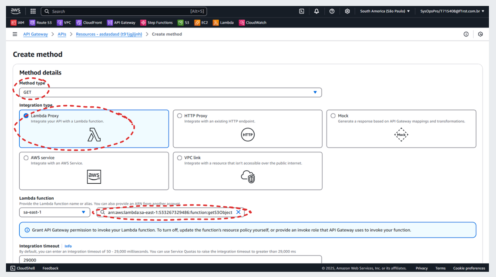

<br/>

### Deploy the API

- On Resources page, click on **Deploy API**

    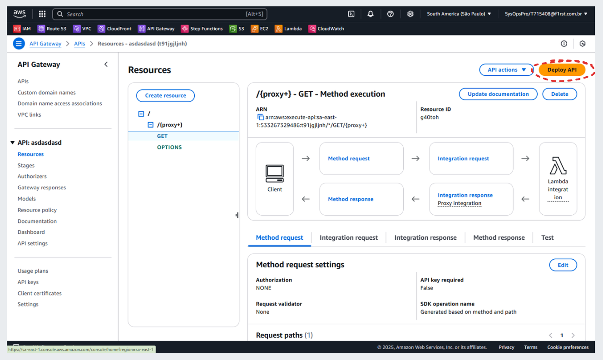

- if has no stage created, a new one must be created, select **New stage**

    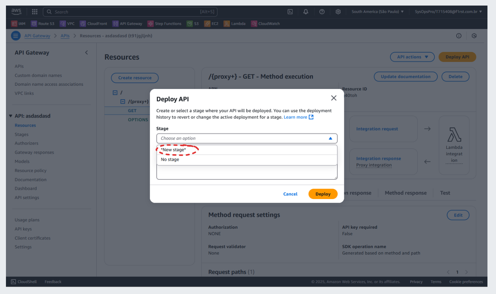

- create a name for the new stage

    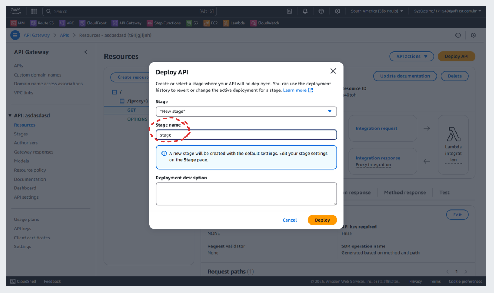

- after deploy the api, search for **Invoke URL** on **Stages** page, to test the API

    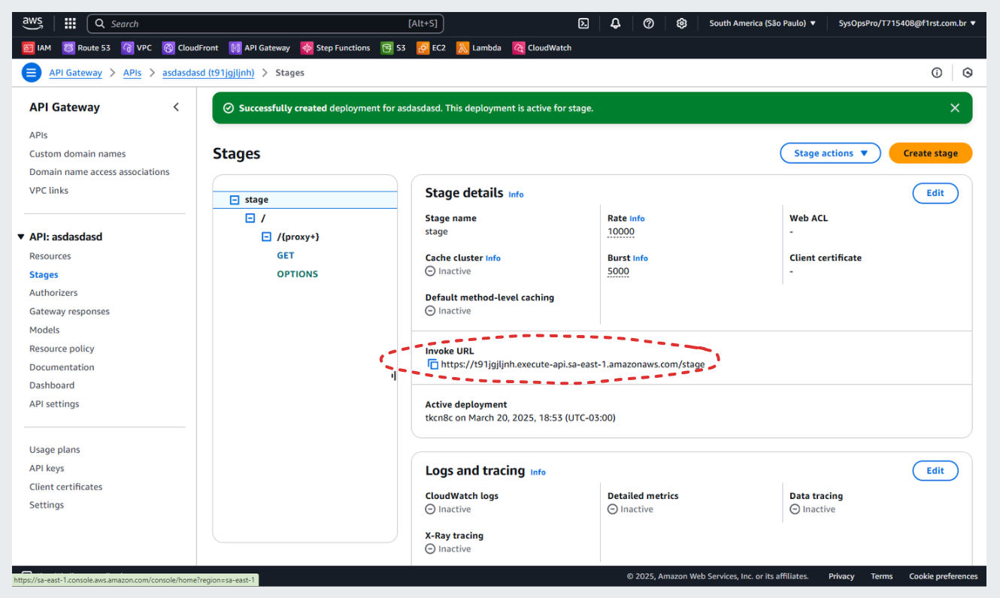

<br/>

## How to Consume the S3 Buckets Proxy API?

To open an application there are two required parameters **application name** and the **component name** and three optional parameters, **version number**, **language** and **file name**.

- If **version number** is missing, the latest version will be retrieved.
- If **language** is missing, the browser's language will be retrieved.
- If **file name** is missing, the default file **index.html**, will be retrieved
- If **file name** is equal to **application.properties**, the config map will be retrieved

<br/>

### API acceptable patterns

`(domain)/(app-name)/(comp-name)/(version-number)/(language)/(file-name.extension)`

??? "Latest Versions"
    - <www.api-domain.com/application-name/component-name>
    - <www.api-domain.com/application-name/component-name/file-name.extension>
    - <www.api-domain.com/application-name/component-name/language>
    - <www.api-domain.com/application-name/component-name/language/file-name.extension>
    - <www.api-domain.com/application-name/component-name/application.properties>

??? "Snapshot Versions"
    - <www.api-domain.com/application-name/component-name/version-number>
    - <www.api-domain.com/application-name/component-name/version-number/file-name.extension>
    - <www.api-domain.com/application-name/component-name/version-number/language>
    - <www.api-domain.com/application-name/component-name/version-number/language/file-name.extension>
    - <www.api-domain.com/application-name/component-name/version-number/application.properties>

<br/>

### Front-End Application Consumption

To consume a front-end application using the **S3 Buckets Proxy API**, the sequence of requests typically follows this flow:

- First, the user sends a request for the main application by specifying the application and component names (and optionally version, language, or file name).

- Once the main application is retrieved, it makes a subsequent request to the API to fetch its configuration map, which contains details about the micro front-ends and their versions.

- Finally, based on the configuration map, the application makes additional requests to retrieve the required micro front-end components, required by application.

<br/>

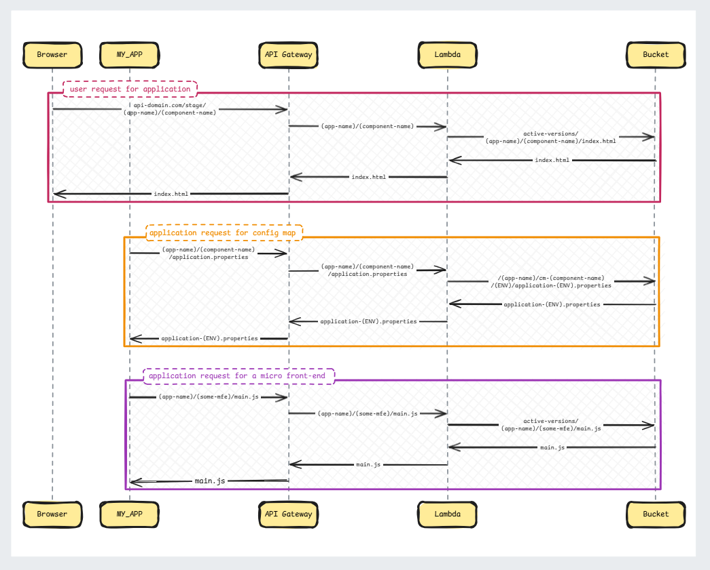

<br/>

The **S3 Buckets Proxy API** provides several features to simplify the consumption of front-end applications:

1. **Auto-Find `index.html`**  
   When a front-end application is requested, the API automatically resolves the `index.html` file if no specific file is provided in the request.

2. **Auto-Find Default Language**  
   The API can automatically determine and serve the default language for the requested application.

3. **Retrieve Specific Versions**  
   Users can request specific versions of a front-end application by specifying the version in the request.

4. **Config-Map Requests**  
   Front-end applications can request configuration maps to retrieve settings and configurations dynamically.

<br/>

### Consuming Configuration Maps

Configuration maps allow front-end applications to separate their deployment logic from their configuration.
These maps can be retrieved via the API to dynamically adjust application behavior without redeploying the application itself.

The **Config map file** can contains the list of all micro front-ends and his versions, required to run a front-end application.

#### Config Map file example

```BASH
# Please, fill the variables with the correct values for pro environment
# i.e:
# env.variable=value
applicationName=rost
componentName=rost-app-shell
version=1.0.0
domain=https://myapp.corp.br
microFrontEnd={ "list": [ { "component": "angular-bucket-mfe-01", "version": "latest", "localUrl": "http://localhost:1001" }, { "component": "angular-bucket-mfe-02", "version": "2.22.222", "localUrl": "http://localhost:1002" } ] }
```

#### How front-end application request config-map?

- request to get the latest configuration:

    `www.api-domain.com/application-name/component-name/application.properties`

- request to get a specific version:

    `www.api-domain.com/application-name/component-name/version-number/application.properties`

The API will retrieve the config map of your application's environment.

<br/>
