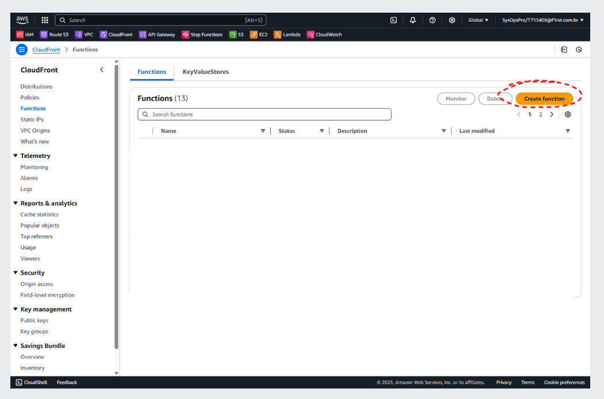
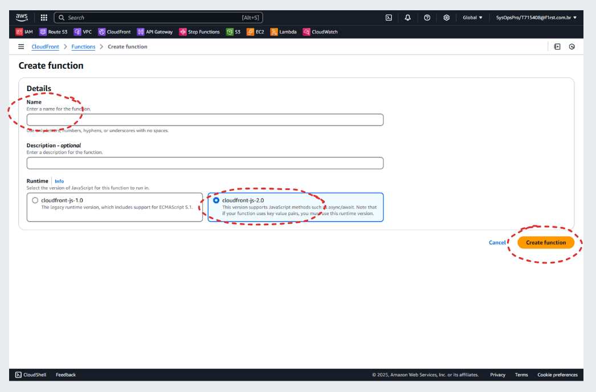
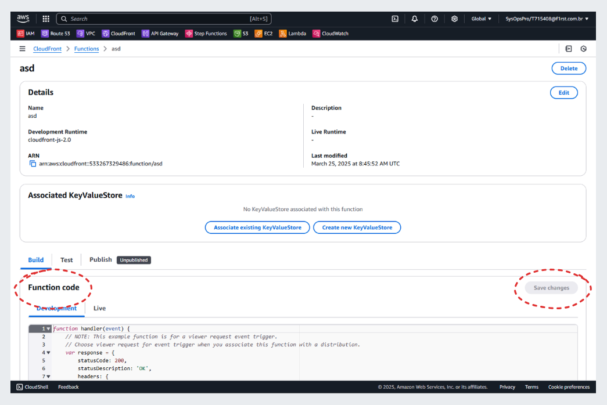
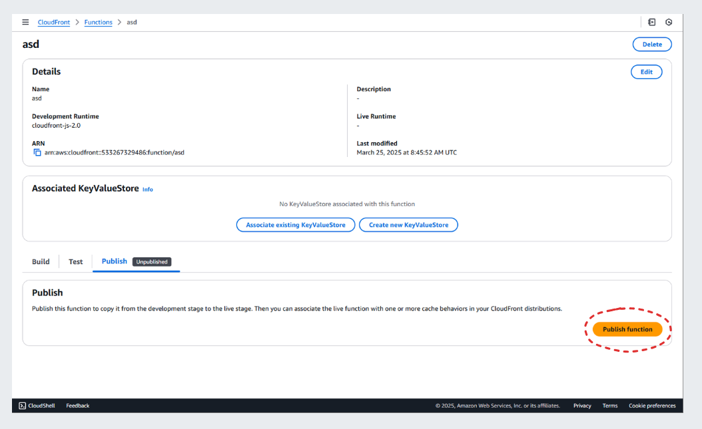

# CloudFront Function

!!! warning "Important"
    As a **Reference Architecture**, this documentation provides **general patterns and recommendations** that should be tailored and customized to meet the specific requirements of each use case.

## Overview

The **CloudFront Function** is a lightweight serverless compute feature provided by AWS CloudFront. It allows you to execute custom logic at the edge, enabling you to manipulate requests and responses with minimal latency.

## What is a CloudFront Function?

CloudFront Functions are designed to handle lightweight operations such as URL rewrites, header manipulation, and request validation. They are optimized for high performance and low latency, making them ideal for edge computing scenarios.

## How to create a CloudFront Function?

The process of creating a **CloudFront Function** involves setting up the function in the AWS Management Console, writing the function code, and deploying it. Below is a detailed guide to accomplish this:

- On **CloudFront Function** page, click on **Create function**

    

- On **Create Function** page, choose a name, the runtime 2.0 and click **Create function**

    

- On **Function** page, on **Function Code** area, paste the code below...

    ??? example "S3 Bucket Proxy CloudFront Function"
        ```javascript
        import cf from "cloudfront";

        // This fails if there is no key value store associated with the function
        const kvsHandle = cf.kvs();

        const removeHash = (path) => {
        // if the path contains a hash, we split the path and get the first part
        return path.includes("#") ? path.split("#")[0] : path;
        };

        const removeTrailingSlash = (path) => {
        // if the path ends with "/", we remove the trailing slash
        return path.endsWith("/") ? path.slice(0, -1) : path;
        };

        const addIndexHtml = (path) => {
        // if the path is a "withoutFileName" type, we need to append "/index.html" to the path
        const pathType = pathValidator(path);

        if (
            pathType.includes("snapshotVersionWithoutFileName") ||
            pathType.includes("snapshotVersionMinimal") ||
            pathType.includes("activeVersionWithoutFileName") ||
            pathType.includes("activeVersionMinimal")
        ) {
            return `${path}/index.html`;
        }
        return path;
        };

        const pathValidator = (path) => {
        const patterns = {
            // application-name/component-name/version-number/language/file-name.extension
            snapshotVersionComplete:
            /^\/?[\w-]+\/[\w-]+\/\d+\.\d+\.\d+\/[\w-]+\/[\w-]+\.[\w]+$/,

            // application-name/component-name/version-number/language
            snapshotVersionWithoutFileName:
            /^\/?[\w-]+\/[\w-]+\/\d+\.\d+\.\d+\/[\w-]+$/,

            // application-name/component-name/version-number/file-name.extension
            snapshotVersionWithoutLanguage:
            /^\/?[\w-]+\/[\w-]+\/\d+\.\d+\.\d+\/[\w-]+\.[\w]+$/,

            // application-name/component-name/version-number
            snapshotVersionMinimal: /^\/?[\w-]+\/[\w-]+\/\d+\.\d+\.\d+$/,

            // application-name/component-name/language/file-name.extension
            activeVersionComplete: /^\/?[\w-]+\/[\w-]+\/[\w-]+\/[\w-]+\.[\w]+$/,

            // application-name/component-name/language
            activeVersionWithoutFileName: /^\/?[\w-]+\/[\w-]+\/[\w-]+$/,

            // application-name/component-name/file-name.extension
            activeVersionWithoutLanguage: /^\/?[\w-]+\/[\w-]+\/[\w-]+\.[\w]+$/,

            // application-name/component-name
            activeVersionMinimal: /^\/?[\w-]+\/[\w-]+$/,
        };

        const matchedPatterns = [];

        Object.keys(patterns).forEach((name) => {
            if (patterns[name].test(path)) {
            matchedPatterns.push(name);
            }
        });

        return matchedPatterns;
        };

        const formatConfigPath = async (path) => {
        try {
            // get the environment from the key value store
            var ENVIRONMENT = await kvsHandle.get("environment");
            if (!ENVIRONMENT) throw new Error("Error, process.env is undefined.");

            // if file is "application.properties" then we need to append the environment
            if (path.endsWith("/application.properties")) {
            path = path.replace(
                "application.properties",
                `config/${ENVIRONMENT}/application-${ENVIRONMENT}.properties`
            );
            }
            return path;
        } catch (error) {
            console.log(error);
            throw error;
        }
        };

        const formatPath = async (path) => {
        path = removeHash(path);
        path = removeTrailingSlash(path);
        path = addIndexHtml(path);
        path = await formatConfigPath(path);
        return path;
        };

        async function handler(event) {
            let path;
            
            try {
            path = await formatPath(event.request.uri);
            } catch (error) {
                console.log(error);
            }

            event.request.uri = path;
            return event.request;
        }

        ```

    

- ...and click **Publish** function to make it available

    

<br/>
