# S3 Bucket | Storage

!!! warning "Important"
    As a **Reference Architecture**, this documentation provides **general patterns and recommendations** that should be tailored and customized to meet the specific requirements of each use case.

!!! tip "Attention"
    This document is part of a integrated solution comprising two key components: **Storage** and **Exposure**. The S3 Bucket serves as the **Storage** layer, providing a secure and scalable repository for static assets.
    For the **Exposure** layer, you can explore the following options to deliver content to end users: [AWS API Gateway](./api-gateway/index.md) or [AWS CloudFront](./cloudfront/index.md).
    These components work together to enable efficient deployment and delivery of web applications.

## Overview

Amazon Simple Storage Service (Amazon S3) **is an object storage service** offering industry-leading **scalability**, data **availability**, **security**, and **performance**.
Millions of customers of all sizes and industries store, manage, analyze, and protect any amount of data for virtually any use case, such as data lakes, cloud-native applications, and web/mobile apps.
With cost-effective storage classes and easy-to-use management features, you can optimize costs, organize and analyze data, and configure fine-tuned access controls to meet specific business and compliance requirements.

## What is an S3 Bucket?

Amazon S3 **Buckets are similar to file folders** and can be **used to store and access objects**. Each object has three main components:

- The object's content or data
- A unique identifier for the object
- The descriptive metadata, including the object's name, URL and size.

An object must exist within a bucket, as it can't exist alone. Each Amazon account could have hundreds of buckets, each containing numerous objects.

In our use case, an AWS account will contain different S3 Buckets per region.

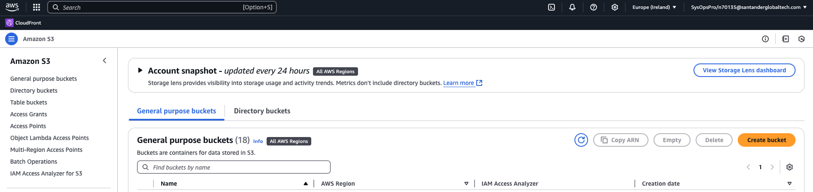

An those **S3 Buckets will contain all the Technical Applications for an specific domain** (what is a domain and how many technical applications will it contain is totally open and should the fist thing to think about).

This technical applications will be represented as a file folder in the root of the bucket:

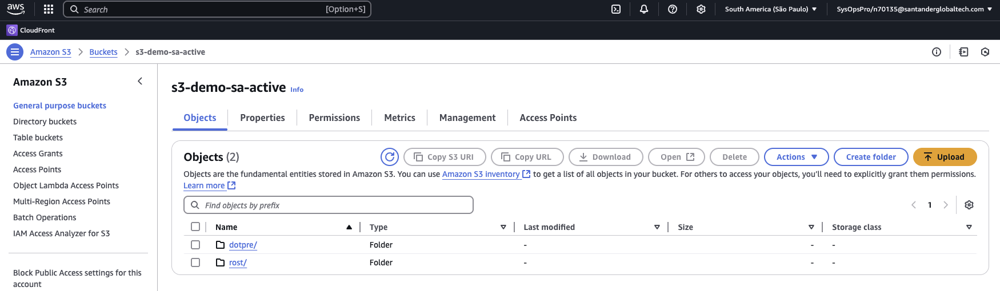

In this example, the domain contains two different Gluon Technical Applications: dotpre and rost, being their names the application-short-name for them.

The content of a application file folder will be different folders, one for each application component that has been deployed into it.
Following this example, an application folder (dotpre) will contain the following component folders:

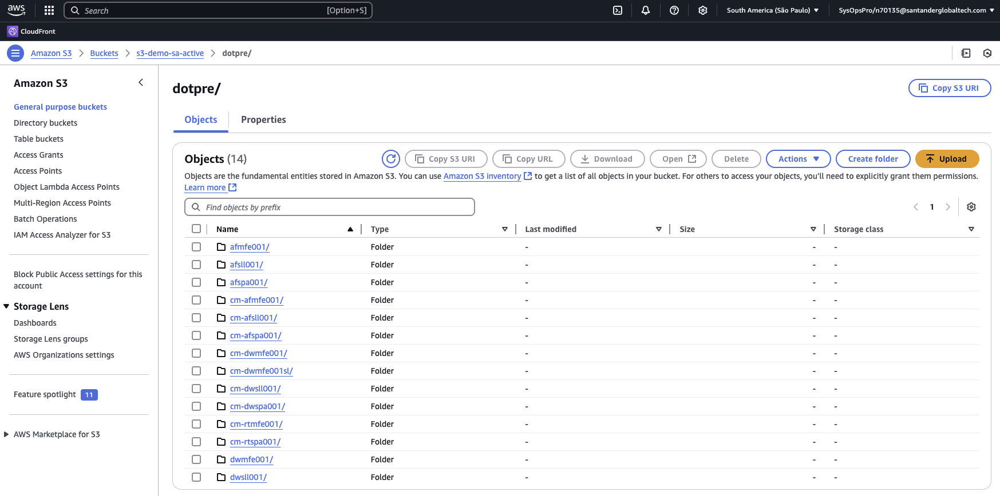

We could find two different folders here:

- Those that starts with **cm-???** that represent the **Web S3 Configuration** (same approach of Config Maps on a Kubernetes scenario) and should follow this [naming convention](#web-s3-config-naming-convention).
- The rest of them, that represent the different components in the technical application. Their names will be the component-short-name of the component.

Depending on the deployment configuration, a component folder will contains their **static files** (default scenario):

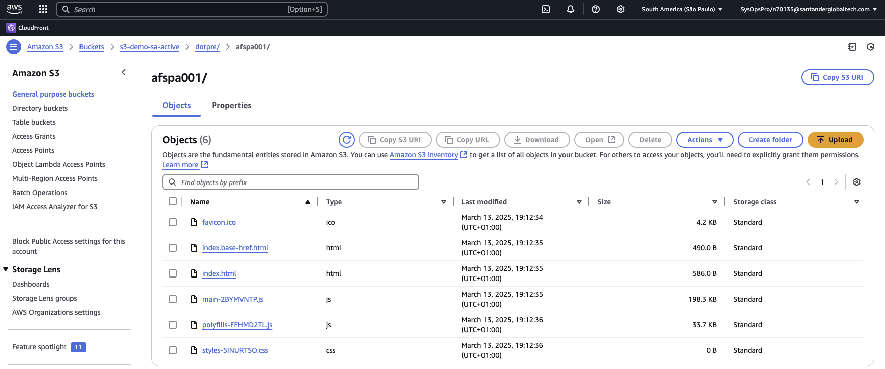

.. or several folder (each by the deployed versions) containing their static files (snapshot scenario):

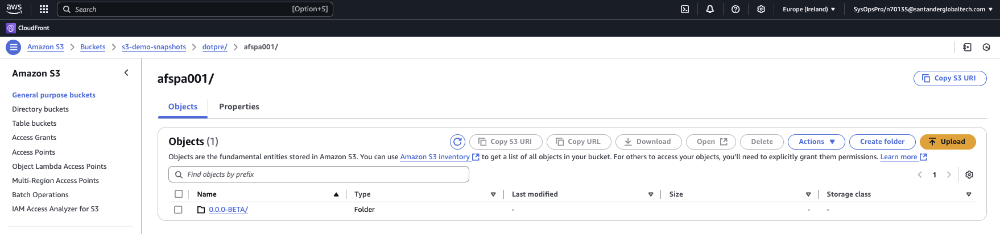

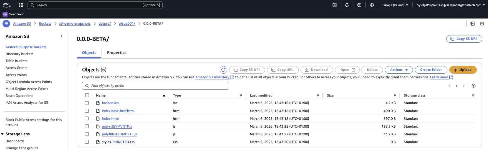

### Creation

The creation of the bucket should be performed by the DEVOPS team and, obviously, it should be created as a previous step in order to start deploying into it.

Just create it clicking in the create button:

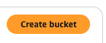

And just **remember to keet it not-public** in order to be accessible by no-one.

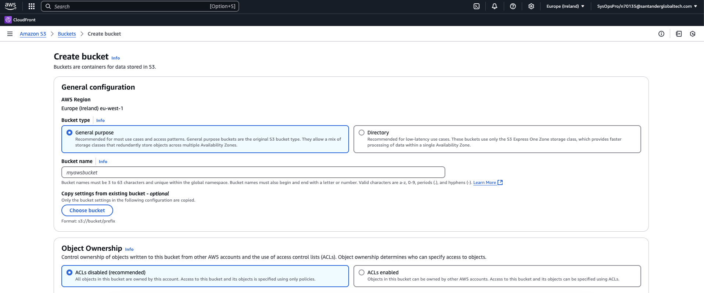

In next steps, when configuring Cloudfront or API Gateway, we will talk about the [permissions and policies](#permissions) to be applied to enable other AWS Managed Services (like Cloudfront or API Gateway) to access to it.

### Configuration

Once the S3 Bucket has been created, it should be configured. An S3 Bucket will offer different tabs in order to configure different key aspects of it.

Here we will share with you some tips to configure it correctly.

#### Properties

When the bucket is created, you'll haver different information in the 'Properties' tab:

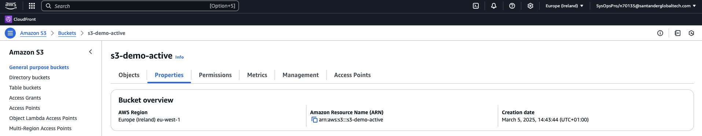

Such as:

- Bucket overview
- Bucket versioning
- Tags
- Default encryption
- Intelligent-Tiering Archive configurations
- Server access logging
- AWS CloudTrail data events
- Event notifications
- Amazon EventBridge
- Transfer acceleration
- Object Lock
- Requester pays
- Static website hosting

In our tests, we leave all the out-of-the-box configuration, putting special attention on the last one, where.. although it is counterintuitive,
the bucket **should remain the "Static Web Hosting" option as disabled**. This is because the exposure of the contents will be offered by AWS API Gateway or Cloudfront, nor the S3 Bucket itself.

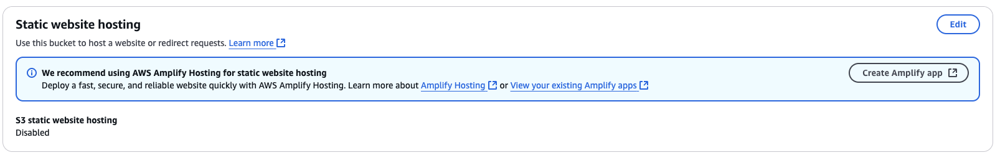

#### Permissions

In the 'Permissions' tab it is important to **Block all public access**, due the exposure of the contents will be offered by AWS API Gateway or Cloudfront, nor the S3 Bucket itself, so it should remain private.

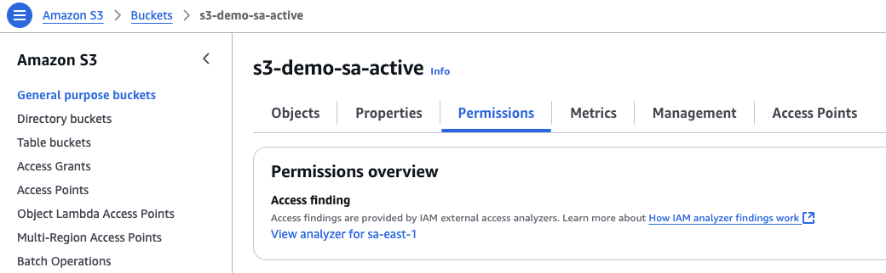

In order to allow other services to connect to it, you should configure their policies. You could do it in the 'Bucket policy' section.

##### Policy to enable access to a Cloudfront distribution

Once a [Cloudfront distribution](./cloudfront/index.md#what-is-the-aws-cloudfront) is created, next thing a DEVOPS should do is to allow it to connect to the bucket.

This could be achieved by adding the following policy to the bucket:

```JSON
{
    "Version": "2008-10-17",
    "Id": "PolicyForCloudFrontPrivateContent",
    "Statement": [
        {
            "Sid": "AllowCloudFrontServicePrincipal",
            "Effect": "Allow",
            "Principal": {
                "Service": "cloudfront.amazonaws.com"
            },
            "Action": "s3:GetObject",
            "Resource": "arn:aws:s3:::<aws-bucket-name>/*",
            "Condition": {
                "StringEquals": {
                    "AWS:SourceArn": "arn:aws:cloudfront::<aws-account-id>:distribution/<aws-distribution-id>"
                }
            }
        }
    ]
}
```

Please, note you'll have here three different variables:

**aws-bucket-name**: The bucket name. This case 's3-demo-active'.

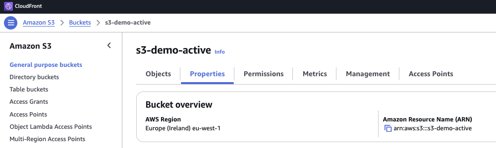

**aws-account-id**: The account id, typically a numeric string of 12 chars (without hyphens). This case '533267329486'.

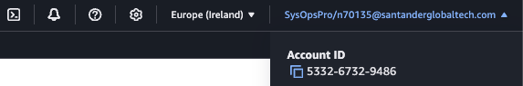

**aws-distribution-id**: The distribution id. This case 'EZP1ZRALBZGCE'.

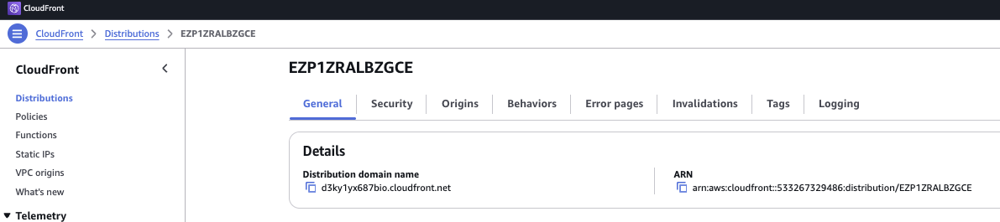

### Contents

As we mention in the introduction, the purpose of a bucket is to contain files in different folders. In our case, static files such as .js, .css,.. for different components inside different applications.

Starting from the beginning, the technical applications will be different folders in the root of the bucket:


In this sample, we have two different Gluon Technical Applications: dotpre and rost.

The folder names will be the application-short-name of them.

The content of a these application folders will be different folders too. Each inner folder will be a component of that application.

So.. imagine you have:

- An application inside 'sds' company

    - Named 'My application'
    - With 'myapp' as its short-name.

Inside that application..

- An SPA acting as a Shell

    - Named 'My shell'
    - With 'myshell' as its short-name.
    - So the repo should be something like: 'sds-myapp-myshell'.

- A microfront

    - Named 'My microfront'
    - With 'mymicrofront' as its short-name.
    - So the repo should be something like: 'sds-myapp-mymicrofront'.

- A Web S3 configuration for the SPA

    - Named 'My spa configuration'
    - With 'myshellconfig' as its short name.
    - So the repo should be something like 'sds-myapp-myshellconfig'.

- A Web S3 configuration for the microfront

    - Named 'My microfront configuration'
    - With 'mymicrofrontconfig' as its short name.
    - So the repo should be something like 'sds-myapp-mymicrofrontconfig'.

Ok, so.. if we deploy this components to S3, we will have the following structure:

``` bash
📂myapp
 ┣ 📂myshell
 | ┣ ...
 ┣ 📂cm-myshell
 | ┣ ...
 ┣ 📂mymicrofront
 | ┣ ...
 ┣ 📂cm-mymicrofront
 | ┣ ...
```

Please, note that, **although the configuration for the SPA or microfront have different names, the output folder will keep a naming convention**. You could know more about how to following and configuring it in [this section](#web-s3-config-naming-convention).

The contents of each component folder will contain the static files of each component but, depending on the deployment configuration,
a component folder could contain their static files at first level (default configuration) or an intermediate folder (one by each deployed version)
with the name of the version and then, their static files inside it.

This way, in a **default scenario**, we will have something like this:


``` bash
📂myapp
 ┣ 📂myshell
 | ┣ index.html
 | ┣ ...
```

Or, in a **snaptshot scenario**, we will have something like this:


``` bash
📂myapp
 ┣ 📂myshell
 | ┣ 📂0.1.0-BETA
 | | ┣ index.html
 | | ┣ ...
 | ┣ 📂0.1.0
 | | ┣ index.html
 | | ┣ ...
 | ┣ 📂0.2.0
 | | ┣ index.html
 | | ┣ ...
```

#### Web S3 Config

The Web S3 Config is a new configuration component template for S3 covering the same features for an S3 scenario, as the config map offer in a Kubernetes scenario.

This is:

- Offer a mechanism for SPA's and microfronts to deliver the same code, the same build, but to different environments.
- A Configmap enables the same application bundle to be delivered to different Kubernetes environments (DEV, PRE & PRO)
because the different configurations, endpoints,.. are contained in a separate file (config.json) in this Configmap component that is different by environment.
- A Web S3 Config enables the same application bundle (even if it was delivered to Kubernetes) to be delivered to different S3 Buckets environments (DEV, PRE & PRO)
because the different configurations, endpoints.. are contained in a separate file (config.json) in this Web S3 Config component that is different by environment.

The content of a Web S3 Config, typically, is just a 'config.json' file in the root of the component folder. Something like this:

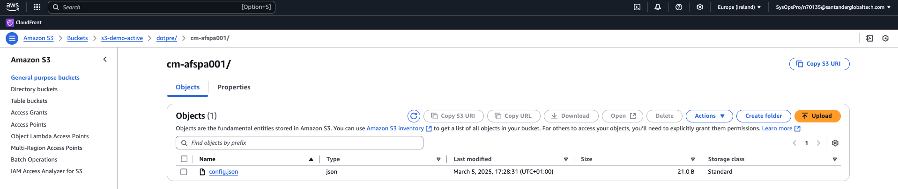

Although in the source code we have something like that:

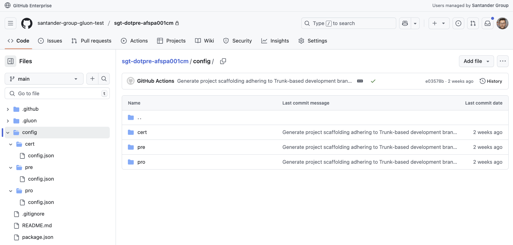

As you can see, the source code will contain different folders by environments and the workflow will be the responsible of deploying each one to the appropriate environment.

You can know a little more in the documentation of [Web S3 Config User Journey](../../../../components/configuration/s3/web-s3-config.md).

##### Web S3 Config naming convention

The naming convention for a Web S3 Config folder in the bucket should be the 'component-short-name' with the 'cm-' prefix.

i.e.: If the 'component-short-name' of a component is 'afspa001', the config component folder in S3 should be 'cm-afspa001'.

Please note that the Web S3 Config short-name and the final folder name are not related. The final folder name in S3 is just a configuration you should do it inside '.gluon/cd/values.yaml' file in the Web S3 Config component.

Something like this:

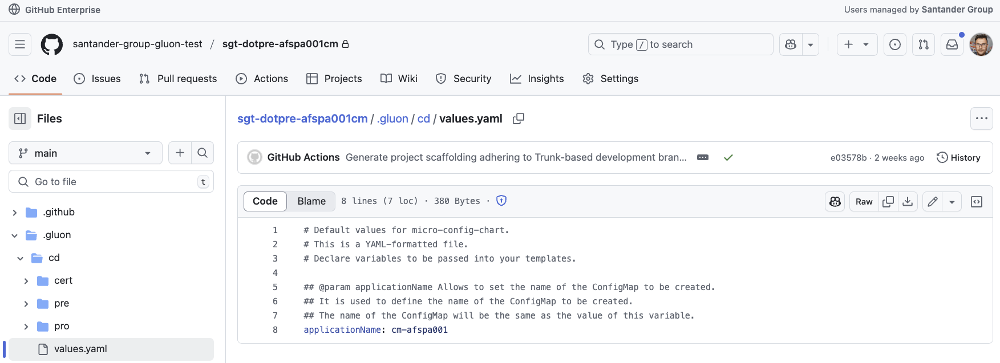

You can know a little more on [Web S3 Config User Journey](../../../../components/configuration/s3/web-s3-config.md).

#### Darwin SPA

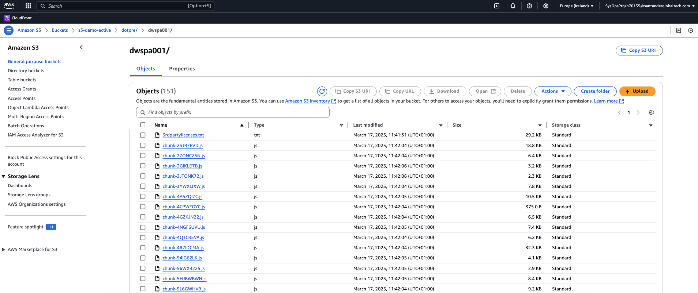

#### Darwin Shell/MFE

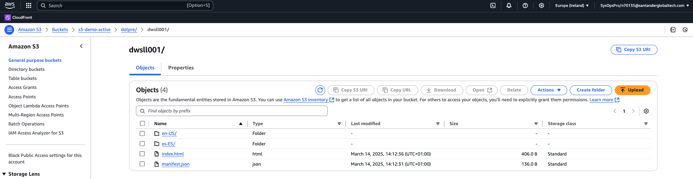

#### React Shell/MFE

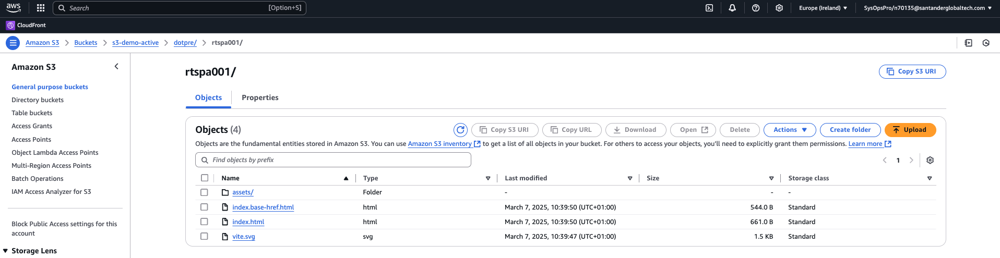

#### Configure your SPA/Microfront artifact-friendly

Ensure you are have configured the app group where the artifact will be publish in the artifact store

```bash
# NPM GROUP
NPM_APPLICATION_GROUP=santander-group-gluon-test
```

Ensure you are have configured the app version as BETA in order to overwrite in the artifact store

```bash
  "version": "0.0.2-BETA",
```

#### Troubleshootings

##### Be sure to use the front-dispatch workflow

sgt-dotpre-dwspa001/.github/workflows/cd.yml

```bash
jobs:
    call-reusable-workflow:
        name: Deploy
        uses: santander-group-shared-assets/gln-workflows/.github/workflows/front-dispatch.yml@v1
        with:
          version: ${{ inputs.version }}
          environment: ${{ inputs.environment }}
          environment-type: ${{ inputs.environment-type }}
          task-number: ${{ inputs.task-number }}
        secrets: inherit
```

##### Do not configure to same bucket for default and snapshot

This will produce both workflow executions collides and do not create what you expect. Don't do that!
