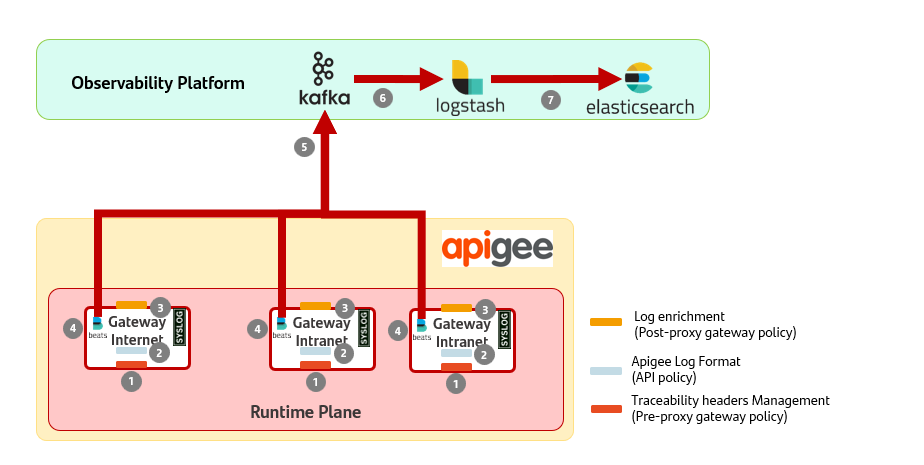
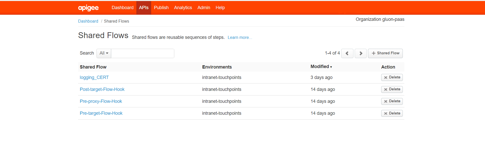
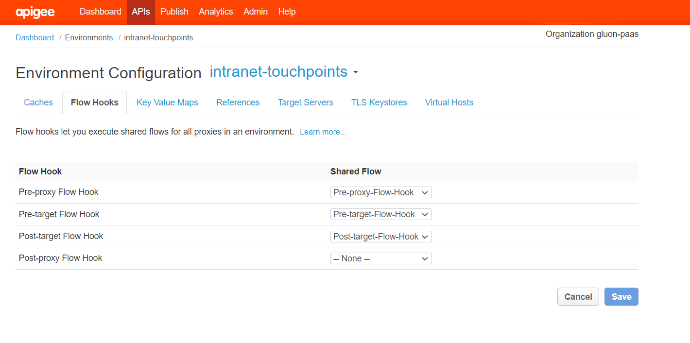
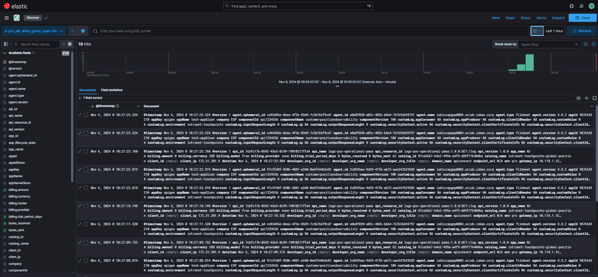
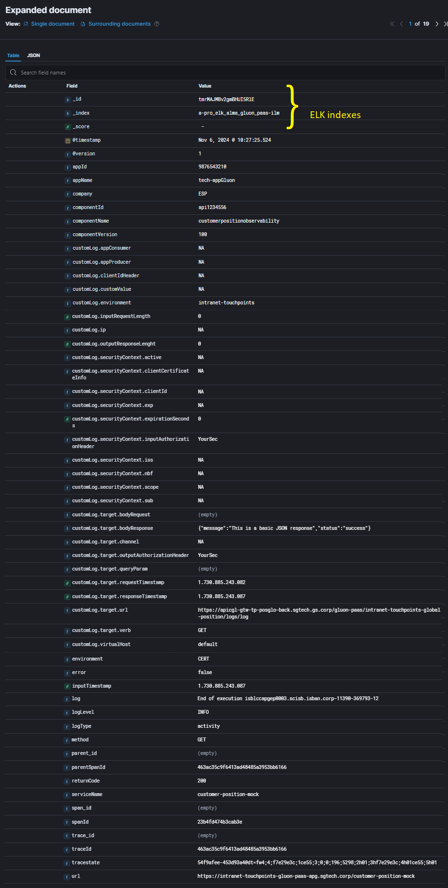
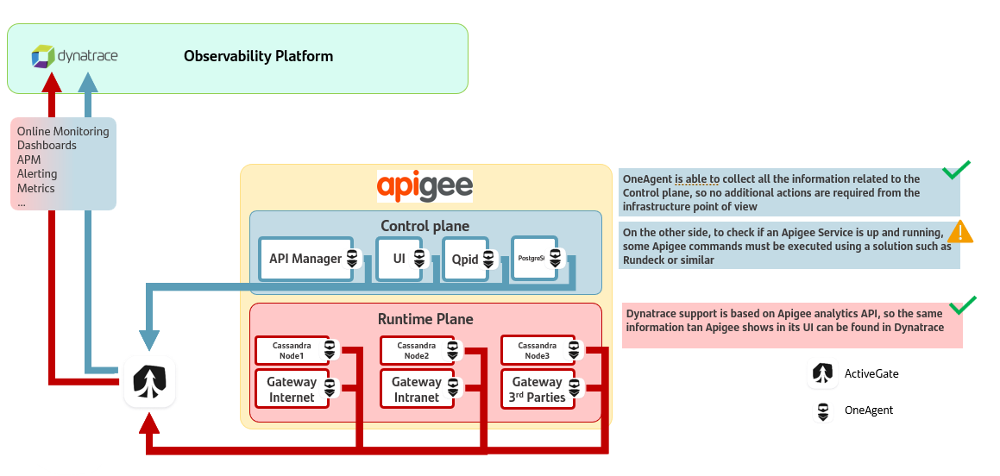

# Apigee APIs Observability

## Introduction

In this reference architecture, the integration of Apigee OPDK with the local observability platform is analyzed to provide observability, logging, and alerting capabilities.

## High Level View Logging Platform Integration

{: .image-popup align="center" style="width:80%"}

This diagram provides an explanation of the Apigee-ELK (ALMA) integration architecture.

### Steps

> This reference architecture has been based using ALMA as observability platform.

1. **Traceability Headers Management**:
     - When a new API request is received, the pre-proxy flow hook policy is executed. This policy manages traceability headers (W3C and X-B3 formats), which are essential for request tracking and correlation.

2. **API execution**:
     - During the API execution, the message logging policy is executed to generate the native log.

3. **Log Enrichment**:
     - After an API request is processed, log information is enriched with custom data configured at the API level in the post-proxy flow hook. The enriched logs are written in a syslog file inside the Apigee gateway.

4. **Data Collection with Beats**:
     - The syslog file is then collected by a beats agent (likely Filebeat) installed on the gateway's virtual machine, which retrieves logs from the file.

5. **Data Streaming to Kafka**:
     - The log information collected by beats is sent to a Kafka topic. Kafka acts as a message broker, ensuring the logs are delivered to subsequent stages reliably.

6. **Transformation with Logstash**:
     - Logstash collects the logs from Kafka, processes them from the "Apigee" format, and transforms them as needed for GlobaLog normative standards.

7. **Data Ingestion in Elasticsearch**:
     - Finally, the transformed log data is ingested into Elasticsearch, where it can be indexed and stored for future search and analysis by any stakeholders.

## Detailed Level View Logging Platform Integration

### Steps

- Add the following parameters (recovered from Gluon) to the API to comply with GlobalLog 4.0.0. Append them inside the AM-Global(Assign Message)
     - componentNameGluon
     - componentIdGluon
     - componentVersionGluon
     - appNameGluon
     - appIdGluon

```xml
<?xml version="1.0" encoding="UTF-8" standalone="yes"?>
<AssignMessage async="false" continueOnError="false" enabled="true" name="AM-GLOBAL">
    <DisplayName>AM-GLOBAL</DisplayName>
    <!-- Policy: security -->
    <AssignVariable>
        <Name>allowedScopes</Name>
        <Value>scopedimmy123</Value>
    </AssignVariable>
    <AssignVariable>
        <Name>exp</Name>
        <Value>60</Value>
    </AssignVariable>
    <AssignVariable>
        <Name>nbf-delay</Name>
        <Value>3</Value>
    </AssignVariable>
    <AssignVariable>
        <Name>introspection</Name>
        <Value>true</Value>
    </AssignVariable>
    <AssignVariable>
        <Name>aud</Name>
        <Value>APIAudience</Value>
    </AssignVariable>
    <AssignVariable>
        <Name>api-client-id</Name>
        <Value>APIClientId</Value>
    </AssignVariable>
    <AssignVariable>
        <Name>private-key-id</Name>
        <Value>apimscib-intranet</Value>
    </AssignVariable>
    <AssignVariable>
        <Name>kid</Name>
        <Value>apimscib-intranet</Value>
    </AssignVariable>
    <AssignVariable>
        <Name>jwe-private-key-id</Name>
        <Value>fromCiId</Value>
    </AssignVariable>
    <AssignVariable>
        <Name>componentNameGluon</Name>
        <Value>customerpositionobservability</Value>
    </AssignVariable>
    <AssignVariable>
        <Name>componentIdGluon</Name>
        <Value>api1234556</Value>
    </AssignVariable>
    <AssignVariable>
        <Name>componentVersionGluon</Name>
        <Value>100</Value>
    </AssignVariable>
    <AssignVariable>
        <Name>appNameGluon</Name>
        <Value>tech-appGluon</Value>
    </AssignVariable>
    <AssignVariable>
        <Name>appIdGluon</Name>
        <Value>9876543210</Value>
    </AssignVariable>
    <IgnoreUnresolvedVariables>true</IgnoreUnresolvedVariables>
    <AssignTo createNew="false" transport="http" type="request"/>
</AssignMessage>
```

- API Logging shared flow needs to include the Global Log 4.0.0 attributes as follows:

```xml
<?xml version="1.0" encoding="UTF-8" standalone="yes"?>
<MessageLogging async="false" continueOnError="true" enabled="true" name="ML-LogFile">
    <File>
        <Message>{"timestamp":{system.timestamp:0},"entity":"ESP","appKey":"apigee","environment":"CERT","logLevel":"INFO","serviceName":"{apiproxy.name}","region":"{system.region.name}","log":"End of execution {messageid}","logType":"activity","parentSpanId":"{request.header.x-b3-parentspanid}","traceId":"{request.header.x-b3-traceid}","spanId":"{request.header.x-b3-spanid}","trace_id":"{request.header.trace-id}","span_id":"{request.header.span-id}","parent_id":"{request.header.parent-id}","tracestate":"{request.header.tracestate}","error":"{is.error}","platform":"apigeeopdk","inputTimestamp":{client.received.start.timestamp:0},"method":"{arq.input_verb}","returnCode":"{message.status.code}","url":"{arq.input_url}","componentNameGluon":"{componentNameGluon:NA}","componentIdGluon":"{componentIdGluon:NA}","componentVersionGluon":"{componentVersionGluon:NA}","appNameGluon":"{appNameGluon:NA}","appIdGluon":"{appIdGluon:NA}","customLog":{"environment":"{environment.name}","virtualHost":"{virtualhost.name}","clientIdHeader":"{arq.client_id:NA}","appConsumer":"{apigee.developer.app.name:NA}","appProducer":"{arq.appkey:NA}","ip":"{request.header.incap-client-ip:NA}","inputRequestLength":{arq.request_length:0},"outputResponseLenght":{response.header.content-length:0},"customValue":"{customValue:NA}","securityContext":{"clientCertificateInfo":"{arq.client_certificate_info:NA}","inputAuthorizationHeader":"{substring(arq.input_auth,0,-12)}","active":"{claims.active:NA}","scope":"{claims.scope:NA}","sub":"{claims.sub:NA}","iss":"{claims.iss:NA}","nbf":"{jwtclaims.nbf:NA}","exp":"{jwtclaims.exp:NA}","clientId":"{claims.client_id:NA}","expirationSeconds":{Introspection.cache.timeOutInSec:0}},"target":{"url":"{target.url:NA}","verb":"{arq.target_verb:NA}","queryParam":"{arq.target_query_param:NA}","outputAuthorizationHeader":"{substring(arq.target_auth,0,-12)}","channel":"{arq.channel:NA}","bodyRequest":"{escapeJSON(arq.target_request:NA)}","bodyResponse":"{escapeJSON(arq.target_response:NA)}","requestTimestamp":{target.sent.start.timestamp:0},"responseTimestamp":{target.received.end.timestamp:0}}}}
</Message>
        <FileName>messagelogging.log</FileName>
        <FileRotationOptions rotateFileOnStartup="true">
            <FileRotationType>SIZE</FileRotationType>
            <MaxFileSizeInMB>100</MaxFileSizeInMB>
            <MaxFilesToRetain>10</MaxFilesToRetain>
        </FileRotationOptions>
    </File>
</MessageLogging>
```

- Install Shared Flows in the Apigee Organization
     - Pre-proxy Flow Hook
     - Post-target Flow Hook
     - MessageLogging Policy

{: .image-popup align="center" style="width:80%"}

- For each environment is its needed to configure the flow hooks as in the image:
{: .image-popup align="center" style="width:80%"}
- Install Filebeats in the Message Processor Virtual Machines to collect logs.
- Configure Filebeats with the following Filebeats yaml.

```yaml
###################### Filebeat Configuration #########################

# You can find the full configuration reference here:
# https://www.elastic.co/guide/en/beats/filebeat/index.html

#=========================== Filebeat inputs =============================
filebeat.config.inputs:
#  enabled: false
#  path: ${path.config}/inputs.d/*.yml
#  reload.enabled: true
#  reload.period: 10s

filebeat.inputs:
# Each - is an input. Most options can be set at the input level, so
# you can use different inputs for various configurations.
# Below are the input specific configurations.

- type: filestream
  # Change to true to enable this input configuration.
  enabled: true
  # Paths that should be crawled and fetched. Glob based paths.
  id: apigee
  paths:
    - /opt/apigee/var/log/edge-message-processor/messagelogging/gluon-paas/*/*/*/*/*.log
    #- c:\programdata\elasticsearch\logs\*
  # Exclude lines. A list of regular expressions to match. It drops the lines that are
  # matching any regular expression from the list.
  #exclude_lines: ['^DBG']
  # Include lines. A list of regular expressions to match. It exports the lines that are
  # matching any regular expression from the list.
  #include_lines: ['^ERR', '^WARN']
  # Exclude files. A list of regular expressions to match. Filebeat drops the files that
  # are matching any regular expression from the list. By default, no files are dropped.
  #exclude_files: ['.gz$']
  # Optional additional fields. These fields can be freely picked
  # to add additional information to the crawled log files for filtering
  #fields:
  #  level: debug
  #  review: 1
  ### Multiline options
  # Multiline can be used for log messages spanning multiple lines. This is common
  # for Java Stack Traces or C-Line Continuation
  # The regexp Pattern that has to be matched. The example pattern matches all lines starting with [
  #multiline.pattern: ^\[
  # Defines if the pattern set under pattern should be negated or not. Default is false.
  #multiline.negate: false
  # Match can be set to "after" or "before". It is used to define if lines should be append to a pattern
  # that was (not) matched before or after or as long as a pattern is not matched based on negate.
  # Note: After is the equivalent to previous and before is the equivalent to to next in Logstash
  #multiline.match: after

#============================= Filebeat modules ===============================
filebeat.config.modules:
  # Glob pattern for configuration loading
  path: ${path.config}/modules.d/*.yml

  # Set to true to enable config reloading
  reload.enabled: true

  # Period on which files under path should be checked for changes
  #reload.period: 10s

#==================== Elasticsearch template setting ==========================

setup.template.settings:
  index.number_of_shards: 3
  #index.codec: best_compression
  #_source.enabled: false

#================================ General =====================================

# The name of the shipper that publishes the network data. It can be used to group
# all the transactions sent by a single shipper in the web interface.
#name:

path.data: /opt/MonBeats/data
path.logs: /opt/MonBeats/log

# The tags of the shipper are included in their own field with each
# transaction published.
#tags: ["service-X", "web-tier"]

# Optional fields that you can specify to add additional information to the
# output.
fields_under_root: true
fields:
#  env: staging

#================================ Outputs =====================================

# Configure what output to use when sending the data collected by the beat.

#----------------------------- Logstash output --------------------------------

output.kafka:
  # Kafka bootstrap servers
  hosts: ["wtslcclengp0007-NAT.unix.wtes.corp:9095"]

  # Kafka topic
  topic: "pro_elk_alma_gluon_paas"

  # Kafka consumer group ID
  group_id: "pro_elk_alma_gluon_paas_PRO_10001"

  # SASL configuration
  username: "username"
  password: "password"
  sasl.mechanism: PLAIN
  ssl.verification_mode: none
  enabled: true

  # Security protocol
  # protocol: "SASL_SSL"

#================================ Processors =====================================

# Configure processors to enhance or manipulate events generated by the beat.

processors:
  #- decode_json_fields:
  #    fields: ["message"]
  #    max_depth: 1
  #    target: ""
  #    add_error_key: true
  #- add_host_metadata: ~
  #- add_cloud_metadata: ~
  #- drop_fields:
  #    fields: ["message", "ecs.version", "host", "log", "input"]


#================================ Logging =====================================

# Sets log level. The default log level is info.
# Available log levels are: error, warning, info, debug
logging.level: debug

# At debug level, you can selectively enable logging only for some components.
# To enable all selectors use ["*"]. Examples of other selectors are "beat",
# "publish", "service".
logging.selectors: ["*"]

```

- Apigee to Globalog Logstash Configuration (Observability platform)

```json
input {
  kafka {
    bootstrap_servers => "************.****.****.CORP:9096,************.****.****.CORP:9096,************.****.****.CORP:9096,************.****.****.CORP:9096"
    topics            => ["pro_elk_alma_gluon_paas"]
    group_id          => "pro_elk_alma_gluon_paas_PRO_10007"
    sasl_jaas_config  => "org.apache.kafka.common.security.plain.PlainLoginModule required username='alma_elk_read'  password='<<PASSWORD>>';"
    sasl_mechanism    => "PLAIN"
    security_protocol => "SASL_SSL"
    auto_offset_reset => "earliest"
    consumer_threads  => 4
    codec             => "json"
    decorate_events   => "basic"
    add_field         => {
      "env" => "pro"
      "logstash_host" => "************"
      "kafka" => "secured"
    }
  }
}

filter {
  json {
    source => "message"
  }

  if [appKey] == "apigee" {
    mutate {
      remove_field => ["env", "logstash_host", "kafka", "appKey", "platform", "message", "[ecs][version]", "[input][type]", "region", "host"]
      rename => {
        "entity" => "company"
        "environment" => "environment"
        "INFO" => "logLevel"
        "componentNameGluon" => "componentName"
        "componentIdGluon" => "componentId"
        "API" => "componentType"
        "componentVersionGluon" => "componentVersion"
        "appNameGluon" => "appName"
        "appIdGluon" => "appId"
        "log" => "log"
        "logType" => "logType"
        "traceId" => "traceId"
        "spanId" => "spanId"
        "parentSpanId" => "parentSpanId"
        "trace_id" => "trace_id"
        "span_id" => "span_id"
        "parent_id" => "parent_id"
        "tracestate" => "tracestate"
        "error" => "error"
        "true" => "isGluon"
        "4.0.0" => "logVersion"
        "timestamp" => "inputTimestamp"
      }
    }

    ruby {
      code => "
        event.set('inputTimestamp', LogStash::Timestamp.at(event.get('inputTimestamp').to_f / 1000).time.iso8601)
      "
    }
  }

  date {
    match => ["timestamp", "ISO8601"]
    target => "@timestamp"
  }
}

output {
  elasticsearch {
    hosts => ["http://your-elasticsearch-host:9200"]
    index => "api-gateway-logs-%{+YYYY.MM.dd}"
  }

  stdout {
    codec => rubydebug
  }
}
```

#### Globalog mapping

| Globalog field | Apigee enriched log field|
|----------------|--------------------------|
|timestamp | timestamp (needs parsing form millis) |
|company | entity |
|environment | environment |
|logLevel | "INFO" |
|componentName | componentNameGluon |
|componentId | componentIdGluon |
|componentType | "API" |
|componentVersion | componentVersionGluon |
|appName | appNameGluon |
|appId | appIdGluon |
|log | log |
|logType | logType |
|traceId | traceId |
|spanId | spanId |
|parentSpanId | parentSpanId |
|trace_id | trace_id |
|span_id | span_id |
|parent_id | parent_id |
|tracestate | tracestate |
|error | error |
|isGluon | "true" |
|logVersion | 4.0.0 |
|inputTimestamp | timestamp |
|method | method |
|returnCode | returnCode |
|url | url |
|customLog.catalog_name  | customLog.environment |
|customLog.client_id | customLog.securityContext.clientId |
|customLog.request_body | customLog.target.bodyRequest |
|customLog.response_body | customLog.target.bodyResponse |
|customLog.request_method  | customLog.target.verb |
|customLog.uri_path | customLog.target.url |

### Example

#### Enriched native log

```json
{
    "timestamp": 1730736749755,
    "entity": "ESP",
    "appKey": "apigee",
    "environment": "CERT",
    "logLevel": "INFO",
    "serviceName": "customer-position-mock",
    "region": "dc-1",
    "log": "End of execution isblccapgep0003.scisb.isban.corp-11390-322749-9",
    "logType": "activity",
    "parentSpanId": "463ac35c9f6413ad48485a3953bb6139",
    "traceId": "463ac35c9f6413ad48485a3953bb6139",
    "spanId": "f6e9b9a0fc9a10f8",
    "trace_id": "",
    "span_id": "",
    "parent_id": "",
    "tracestate": "54f9afee-453d93a4@dt=fw4;8;f7e29e3c;19628;3;0;0;29b;9303;2h01;3hf7e29e3c;4h019628;5h01",
    "error": "false",
    "platform": "apigeeopdk",
    "inputTimestamp": 1730736749749,
    "method": "GET",
    "returnCode": "200",
    "url": "https://intranet-touchpoints-gluon-paas-apg.sgtech.corp/customer-position-mock",
    "componentNameGluon": "customerpositionobservability",
    "componentIdGluon": "api1234556",
    "componentVersionGluon": "100",
    "appNameGluon": "tech-appGluon",
    "appIdGluon": "9876543210",
    "customLog": {
        "environment": "intranet-touchpoints",
        "virtualHost": "default",
        "clientIdHeader": "NA",
        "appConsumer": "NA",
        "appProducer": "NA",
        "ip": "NA",
        "inputRequestLength": 0,
        "outputResponseLenght": 0,
        "customValue": "NA",
        "securityContext": {
            "clientCertificateInfo": "NA",
            "inputAuthorizationHeader": "YourSec",
            "active": "NA",
            "scope": "NA",
            "sub": "NA",
            "iss": "NA",
            "nbf": "NA",
            "exp": "NA",
            "clientId": "NA",
            "expirationSeconds": 0
        },
        "target": {
            "url": "https://apicgl-gtw-tp-posglo-back.sgtech.gs.corp/gluon-paas/intranet-touchpoints-global-position/logs/log",
            "verb": "GET",
            "queryParam": "",
            "outputAuthorizationHeader": "YourSec",
            "channel": "NA",
            "bodyRequest": "",
            "bodyResponse": "{\"message\":\"This is a basic JSON response\",\"status\":\"success\"}",
            "requestTimestamp": 1730736749750,
            "responseTimestamp": 1730736749755
        }
    }
}
```

#### Elastic view

{: .image-popup align="center" style="width:80%"}

#### Globalog format

{: .image-popup align="center" style="width:80%"}

## High Level View Dynatrace Integration

{: .image-popup align="center" style="width:80%"}

The image represents an API observability (Apigee-Dynatrace) integration architecture that includes several components:

### Steps

1. **Apigee Deployment** :
     - Apigee is deployed on virtual machines (VMs) running a Red Hat Enterprise Linux OS (RHEL OS).
Each VM has a Dynatrace OneAgent installed to monitor and gather data about the Apigee
environment.
2. **Dynatrace Integration**:
     - OneAgent: Dynatrace's OneAgent is installed on each Apigee VM. This agent automatically
collects detailed information related to both the Control Plane and Runtime Plane of Apigee,
providing insights without additional infrastructure setup.
     - ActiveGate: Dynatrace's ActiveGate connects with the control and runtime planes of Apigee to
gather metrics, alerts, and performance monitoring data. The integration enables online monitoring,
dashboards, Application Performance Monitoring (APM), alerting, and metrics collection.
3. **Apigee Control Plane**:
     - The Control Plane manages the API Manager, UI, and Qpid components. Since the OneAgent
collects all the necessary information from the control plane, there's no need for additional
monitoring actions here.
4. **Apigee Runtime Plane**:
     - The Runtime Plane handles API traffic, with nodes like Cassandra (for data storage) and gateways
(for Internet, Intranet, and third-party APIs). To verify if Apigee services are running, specific
commands may need to be executed using a solution like Rundeck for automation.
5. **Data Synchronization and Monitoring**:
     - Dynatrace uses Apigee's analytics API to extract data, meaning the information that appears in
Apigee's analytics can also be accessed and viewed in Dynatrace's interface.

### Diagram Icons

- Green Check Mark: Indicates areas where OneAgent provides complete monitoring coverage
without additional actions.
- Yellow Warning Sign: Indicates areas where manual commands or checks (e.g., with Rundeck) are
required to confirm that services are up and running.

This architecture allows Dynatrace to monitor Apigee's health and performance, visualize metrics,
and set up alerts to ensure smooth API operation across the infrastructure.
