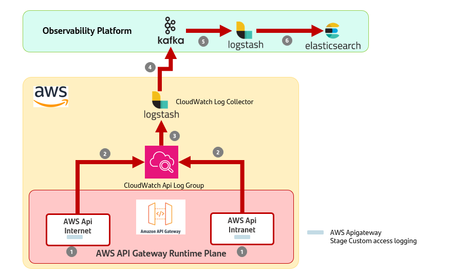

# AWS APIs Observability

## Introduction

In this reference architecture, the integration of AWS API Gateway with the local observability platform is analyzed to provide observability, logging, and alerting capabilities.

## High Level View logging platform integration

{: .image-popup align="center" style="width:80%"}

The image represents an AWS API Gateway observability high-level view that includes several components:

### Step-by-Step Explanation

1. **Log Event Generation and Enrichment**:
     - After the response has been returned to the consumer, AWS API Gateway generates asynchronously a native log which is enriched in the Stage Custom Access Logging with custom data configured at the API level (Model Template),
     allowing for more detailed and context-rich log entries.

2. **Asynchronous Log Processing**:
     - The enriched log events are sent to the analytics component (CloudWatch), which collects and processes them. As the previous step, it is done asynchronously to avoid impacting the performance of the API Gateway.

3. **Log Collection from Cloudwatch to Kafka**:
     - The Cloudwatch Log Collector peers the log information from the CloudWatch Api Log Group.

4. **Log Forwarding to Kafka**:
     - The Cloudwatch Log Collector forwards logs to a Kafka topic. Kafka serves as a distributed messaging system that allows these logs to be reliably and efficiently processed by downstream systems.

5. **ETL Processing**:
     - ETL retrieves logs from Kafka in the native format and converts them into the GlobaLog format. This step standardizes the logs (in all Api Management technologies), making them ready for ingestion into the logging platform.

6. **Elasticsearch Ingestion**:
     - Finally, the processed logs are ingested into Elasticsearch. Once stored in Elasticsearch, these logs are accessible for querying and visualization by stakeholders, enabling better insights and monitoring.

## ALMA ELK Integration Example

> The examples provided in this reference architecture have been implemented using ALMA platform.

### Prerequisites

 - AWS Api Gateway Account

 - Have an example API compliant with the Gluon standards deployed in AWS Api Gateway.

 - Have an Api Log Custom in CloudWatch

### Steps

- Add the following parameters as a mapping template the API Context to comply with GlobalLog 4.0.0:
     - componentNameGluon
     - componentIdGluon
     - componentVersionGluon
     - appNameGluon
     - appIdGluon

  Example:

```yaml
#set($context.requestOverride.componentNameGluon = "customerPositionGluon")
#set($context.requestOverride.componentIdGluon = "api1234556")
#set($context.requestOverride.componentVersionGluon = "100")
#set($context.requestOverride.appNameGluon = "tech-appGluon")
#set($context.requestOverride.appIdGluon = "9876543210")
{
    "body": "$input.json('$')"
}


```

```yaml
aws apigateway update-integration --rest-api-id i7igfnrncj --resource-id 347zlu --http-method GET --patch-operations "op='replace', path='/requestTemplates/application~1json',value='#set(\$context.requestOverride.componentNameGluon = \"customerPositionGluon\")\n#set(\$context.requestOverride.componentIdGluon = \"api1234556\")\n#set(\$context.requestOverride.componentVersionGluon = \"100\")\n#set(\$context.requestOverride.appNameGluon = \"tech-appGluon\")\n#set(\$context.requestOverride.appIdGluon = \"9876543210\")\n{\n    \"body\": \"\$input.json(\'$\')\"\n}'"


```

- Configure Api Stage to export logs to Cloudwatch as follows.

```yaml

# Step 1: Enable Access Logging
aws apigateway update-stage --rest-api-id your-api-id --stage-name your-stage-name --patch-operations op=replace,path=/accessLogSettings/destinationArn,value=arn:aws:logs:region:account-id:log-group:your-log-group-name

# Step 2: Define the Log Format
aws apigateway update-stage --rest-api-id i7igfnrncj --stage-name prod --patch-operations file://<(cat <<EOF
[
  {
    "op": "replace",
    "path": "/accessLogSettings/format",
    "value": "{\"account_id\": \"\$context.accountId\", \"account_name\": \"178635747189\", \"api_id\": \"\$context.apiId\", \"api_name\": \"ByD API\", \"api_version\": \"1.1.0\", \"app_id\": \"\$context.identity.apiKey\", \"app_name\": \"\$context.identity.apiKey\", \"bytes_received\": 0, \"bytes_sent\": 0, \"catalog_id\": \"-\", \"catalog_name\": \"intranet-client-api.apis.aws.scib.dev.corp\", \"client_id\": \"\$context.identity.apiKey\", \"client_ip\": \"\$context.identity.sourceIp\", \"datetime\": \"\$context.requestTime\", \"developer_org_id\": \"-\", \"developer_org_name\": \"-\", \"developer_org_title\": \"-\", \"domain_name\": \"\$context.domainName\", \"endpoint_url\": \"-\", \"gateway_ip\": \"-\", \"latency_info\": [{\"task\": \"Start\", \"started\": 0}, {\"task\": \"Authorize\", \"id\": \"\$context.authorize.requestId\", \"started\": \"\$context.authorize.latency\", \"result\": \"\$context.authorize.status\"}, {\"task\": \"Authorizer\", \"id\": \"\$context.authorizer.requestId\", \"started\": \"\$context.authorizer.latency\", \"result\": \"\$context.authorizer.status\"}, {\"task\": \"Authenticate\", \"id\": \"\$context.authenticate.requestId\", \"started\": \"\$context.authenticate.latency\", \"result\": \"\$context.authenticate.status\"}, {\"task\": \"Integration\", \"id\": \"\$context.integration.requestId\", \"started\": \"\$context.integration.latency\", \"result\": \"\$context.integration.status\"}], \"plan_name\": \"\$context.stage\", \"platform\": \"AWSGATEWAY\", \"request_body\": \"-\", \"request_method\": \"\$context.httpMethod\", \"request_protocol\": \"\$context.protocol\", \"resource_id\": \"\$context.httpMethod:\$context.path\", \"resource_id2\": \"\$context.resourceId\", \"response_body\": \"-\", \"space_name\": \"cib-apis\", \"status_code\": \"\$context.status\", \"tags\": \"apievent, awsapievent\", \"time_to_serve_request\": \"\$context.responseLatency\", \"transaction_id_extended\": \"\$context.extendedRequestId\", \"uri_path\": \"\$context.path\", \"xrayTraceId\": \"\$context.xrayTraceId\",\"componentNameGluon\": \"\$context.requestOverride.componentNameGluon\",\"componentIdGluon\": \"\$context.requestOverride.componentIdGluon\",\"componentVersionGluon\": \"\$context.requestOverride.componentVersionGluon\",\"appNameGluon\": \"\$context.requestOverride.appNameGluon\",\"appIdGluon\": \"\$context.requestOverride.appIdGluon\"}"
  }
]
EOF
)
```

- Deploy the Api

- Configure CloudWatch Collector (This is an example to do it in EKS)

    - Create Image (Docker File)

      ```txt
      FROM docker.elastic.co/logstash/logstash-oss:7.17.25
      RUN bin/logstash-plugin install logstash-input-cloudwatch
      RUN bin/logstash-plugin install logstash-input-cloudwatch_logs
      COPY logstash.yml /usr/share/logstash/config/logstash.yml
      ```

    - Create Deployment

      ```yaml
      apiVersion: apps/v1
      kind: Deployment
      metadata:
        name: logstash
        namespace: sgt-gluon-tp-poc-pglo-bk-pro
      spec:
        replicas: 1
        selector:
          matchLabels:
            app: logstash
        template:
          metadata:
            creationTimestamp: null
            labels:
              app: logstash
          spec:
            volumes:
              - name: config-volume
                configMap:
                  name: logstash-config
                  defaultMode: 420
              - name: log-volume
                emptyDir: {}
            containers:
              - name: logstash
                image: 533267329486.dkr.ecr.eu-west-1.amazonaws.com/gluon/logstash:7-latest
                resources: {}
                volumeMounts:
                  - name: config-volume
                    mountPath: /usr/share/logstash/pipeline/logstash.conf
                    subPath: logstash.conf
                  - name: log-volume
                    mountPath: /var/logstash/logs
                terminationMessagePath: /dev/termination-log
                terminationMessagePolicy: File
                imagePullPolicy: Always
            restartPolicy: Always
            terminationGracePeriodSeconds: 30
            dnsPolicy: ClusterFirst
            securityContext: {}
            schedulerName: default-scheduler
        strategy:
          type: RollingUpdate
          rollingUpdate:
            maxUnavailable: 25%
            maxSurge: 25%
        revisionHistoryLimit: 10
        progressDeadlineSeconds: 600
      ```

    - Create Configmap

    ```yaml
    apiVersion: v1
    kind: ConfigMap
    metadata:
      name: logstash-config
      namespace: sgt-gluon-tp-poc-pglo-bk-pro
    data:
      logstash.conf: |
        input {
          cloudwatch_logs {
            log_group => [ "api_gateway_gluon_traces" ]
            region => "eu-west-1"
            interval => 30
            start_position => 18000
            type => "aws-api-gw"
                  proxy_uri => "https://proxy.sig.umbrella.com:443"
            add_field => {"aws-accountid" => "533267329486"}
            add_field => {"env" => "prod"}
          }
        }
        filter {
          if [type] == "aws-api-gw" {
            mutate {
              add_field => {
                 "platform" => "${PLATFORM_FIELD:AWSGATEWAY}"
                 "log_group" => "%{[cloudwatch_logs][log_group]}"
                 "log_stream" => "%{[cloudwatch_logs][log_stream]}"
                 "ingestion_time" => "%{[cloudwatch_logs][ingestion_time]}"
                 "log_event_id" => "id = %{[cloudwatch_logs][event_id]}"
              }
              remove_field => [ "[cloudwatch_logs]" ]
            }
            ruby {
              code => '
                 JSON.parse(event.get("message")).each{ |k, v|
                   event.set(k,v)
                 }
                 event.remove("message")
              '
            }
            date {
              # Aws Api Gw $context.requestTime is in format CLF-formatted = Logstash grok pattern %{HTTPDATE:@timestamp} = Logstash date dd/MMM/yyyy:HH:mm:ss Z pattern.
              # https://www.elastic.co/guide/en/elasticsearch/reference/current/common-log-format-example.html
              match => ["datetime", "dd/MMM/yyyy:HH:mm:ss Z"]
              target => "datetime"
            }
            # TODO convertir a objeto los fields response_http_headers y request_http_headers
            if [request_http_headers] == "-" {
              mutate {
                remove_field => [ "[request_http_headers]" ]
                add_field => {"request_http_headers" => "{}"}
              }
            }
            if [response_http_headers] == "-" {
              mutate {
                remove_field => [ "[response_http_headers]" ]
                add_field => {"response_http_headers" => "{}"}
              }
            }
            mutate {
              gsub => [
                 "request_http_headers", "'", '"',
                 "response_http_headers", "'", '"'
              ]
              # transaction_id was a long field in Elasticsearch, but AWS manages a string and gives error => global_transaction_id was a text in Elasticsearch
              rename => { "transaction_id" => "global_transaction_id" }
            }
            json {
              source => "request_http_headers"
              target => "request_http_headers"
            }
            json {
              source => "response_http_headers"
              target => "response_http_headers"
            }
          }
        }
        output {
            if "${ENAB_STD_OUT:false}" == "true" {
              stdout {}
            }
            if "${ENAB_KAFKA_OUT:false}" == "true" {
              kafka {
                  codec => json{}
                  bootstrap_servers => "${KAFKA_BOOTSTRAP_SERVERS}"
                  topic_id => "${KAFKA_TOPIC}"
                  ssl_truststore_location => "/etc/logstash/trustore-kafka.jks"
                  ssl_truststore_password => "${TRUSTSTORE_KAFKA_PWD}"
                  security_protocol => "SSL"
                  ssl_keystore_location => "/etc/logstash/keystore-kafka.jks"
                  ssl_keystore_password => "${KEYSTORE_KAFKA_PWD}"
                  ssl_key_password => "${KEY_KAFKA_PWD}"
              }
            }
        }
    ```

!!! note
    The input Cloudwatch Plugin does not work with logstash 8.15.3 that was the latest version available during the tests.
    For further information, review these two links:
    [Logstash 7.17](https://www.elastic.co/guide/en/logstash/7.17/index.html) & [Logstash input plugin](https://www.elastic.co/guide/en/logstash/current/plugins-inputs-cloudwatch.html)
