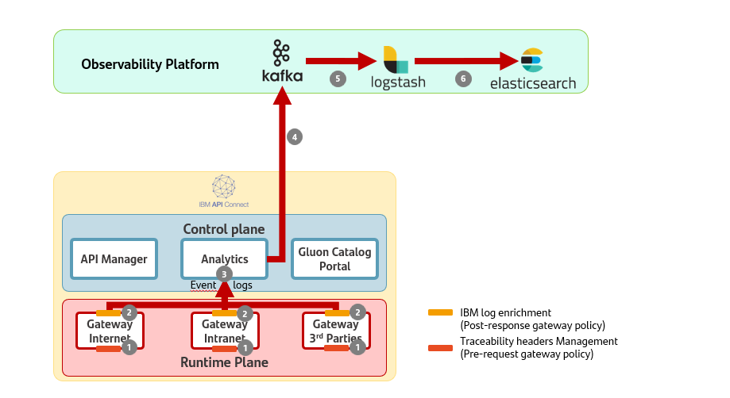
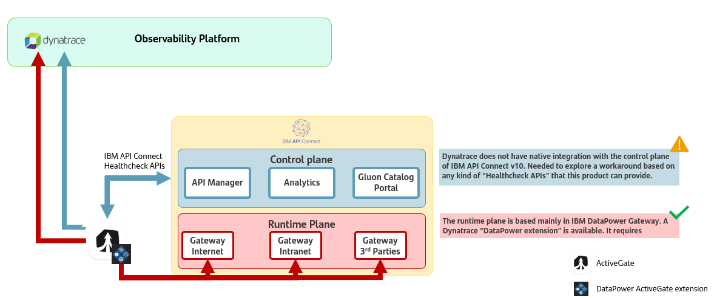

# IBM APIs Observability

## Introduction

In this reference architecture, the integration of IBM API Connect v10 with the local observability platform is analyzed to provide observability, logging, and alerting capabilities.

## High Level View Logging Platform Integration

{: .image-popup align="center" style="width:80%"}

The image represents an IBM API Connect V10 observability high-level view that includes several components:

### Steps

1. **Pre-request Policy (W3C & X-B3)**:
     - When a new API request is received, the pre-request policy is executed. This policy, among other things, manages traceability headers (W3C and X-B3 formats), which are essential for request tracking and correlation.

2. **Log Event Generation and Enrichment**:
     - After the response has been returned to the consumer, IBM API Connect generates asynchronously a native log which is enriched in the post-response policy with custom data configured at the API level,
     allowing for more detailed and context-rich log entries.

3. **Asynchronous Log Processing**:
     - The enriched log events are sent to the analytics component, which collects and processes them. As the previous step, it is done asynchronously to avoid impacting the performance of the API Gateway.

4. **Log Forwarding to Kafka**:
     - The analytics component forwards the log information to a Kafka topic. Kafka serves as a distributed messaging system that allows these logs to be reliably and efficiently processed by downstream systems.

5. **ETL Processing**:
     - ETL retrieves logs from Kafka in the native format and converts them into the GlobaLog format. This step standardizes the logs (in all Api Management technologies), making them ready for ingestion into the logging platform.

6. **Elasticsearch Ingestion**:
     - Finally, the processed logs are ingested into Elasticsearch. Once stored in Elasticsearch, these logs are accessible for querying and visualization by stakeholders, enabling better insights and monitoring.

## Detailed level view Logging Platform Integration

> The examples provided in this reference architecture have been implemented using ALMA platform.

### Steps

- Add the following parameters as properties to the API to comply with GlobalLog 4.0.0:
     - componentNameGluon
     - componentIdGluon
     - componentVersionGluon
     - appNameGluon
     - appIdGluon

  Example:

  ```yaml
  x-ibm-configuration:
    properties:
      componentNameGluon:
        value: logpocapi-gluon
      componentIdGluon:
        value: '0123456789'
      componentVersionGluon:
        value: '100'
      appNameGluon:
        value: tech-appGluon
      appIdGluon:
        value: '9876543210'
  ```

- In the API the activity log must be enables and configured both success-content and error-content with the value "payload".

```yaml
  x-ibm-configuration:
    activity-log:
      enabled: true
      success-content: payload
      error-content: payload
```

Here is an example of the api yaml artifact x-ibm-configuration section:

```yaml
x-ibm-configuration:
  properties:
    target-url:
      value: http://example.com/operation-name
      description: The URL of the target service
      encoded: false
    componentNameGluon:
      value: logpocapi-gluon
    componentIdGluon:
      value: '0123456789'
    componentVersionGluon:
      value: '100'
    appNameGluon:
      value: tech-appGluon
    appIdGluon:
      value: '9876543210'
  cors:
    enabled: true
  gateway: datapower-api-gateway
  type: rest
  phase: realized
  enforced: true
  testable: true
  assembly:
    execute:
      - gatewayscript:
          version: 2.0.0
          title: gatewayscript
          source: >-
            session.output.write({"message": "This is a basic JSON response",
            "status": "success"});
      - set-variable:
          version: 2.0.0
          title: set-variable
          actions:
            - set: response.headers.content-type
              value: application/json
              type: string
    finally: []
    catch: []
  activity-log:
    enabled: true
    success-content: payload
    error-content: payload
  buffering: true
paths:
  /log:
    get:
      responses:
        '200':
          $ref: '#/components/responses/Get200_Logs'
      summary: /log
components:
  responses:
    Get200_Logs:
      description: OK
      content:
        application/json:
          schema:
            $ref: '#/components/schemas/GetLogsResponse'
  schemas:
    GetLogsResponse:
      description: Data structure containing bank details
      type: object
      properties:
        message:
          description: Unique bank ID
          example: AAOZ
          type: string
        status:
          description: Unique bank ID
          example: AAOZ
          type: string
  securitySchemes:
    clientID:
      type: apiKey
      in: header
      name: X-IBM-Client-Id
security: []
```

- Install the pre-request policy using the next command:

```bash
apic global-policies:create FILENAME.yaml --scope catalog --catalog intranet-touchpoints-global-position --org gluon-paas --configured-gateway-service intranet-cn1-sgt-gluon-tp-poc-pglo-bk-pro-tp -s apicgl-apim.sgtech.gs.corp
```

  Pre-request-policy

```yaml
global-policy: 1.0.0
info:
  name: pre-request-global-policy
  title: Pre Request Global Policy
  version: 1.0.0
  full-custom: true
gateways:
  - datapower-api-gateway
assembly:
  execute:
    - cors:
        version: 2.0.0
        title: cors-in-preflow
    - html-page:
        version: 2.0.0
        title: html-page-in-preflow
    - client-identification:
        version: 2.0.0
        title: client-identification-in-preflow
    - ratelimit:
        version: 2.0.0
        title: ratelimit-in-preflow
    - security:
        version: 2.0.0
        title: security-in-preflow
    - gatewayscript:
        version: 2.0.0
        title: Get and Process API Observability Headers
        source: |-
          /** * @brief Custom policy to get and process API Observability Headers * * @author SCIB CTO APIs * */
          // Global Variables
          const policyVersion = "1.2.0";
          var myUuid = "";
          var validHeader = false;
          var validTraceId = false;
          var validSpanId = false;
          var validParentSpanId = false;
          var validTraceParent = false;
          var validTraceState = false;
          var traceId = "";
          var spanId = "";
          var parentSpanId = "";
          var sampled = "1"; // Denied=0 or Accepted=1 (Accepted by default)
          var traceparent = ""; // W3C Trace Context
          var traceparentFields = [];
          var w3cTraceId = "";
          var w3cParentId = "";
          var w3cSpanId = "";
          var tracestate = ""; // W3C Trace Context
          var regex16LowerHex = /^[-+]?[0-9a-f]+\.?[0-9a-f]*?$/;
          var regexTraceParent = /^([01]{2})+[-]+([0-9a-f]{32})+[-]+([0-9a-f]{16})+[-]+([0-9a-f]{2})/;

          try {
              getRequestW3CHeaders();
              validTraceParent = checkW3CHeader("traceparent",traceparent);
              validTraceState = checkW3CHeader("tracestate",tracestate);

              if (validTraceParent === true) {
                  traceparentFields = traceparent.split("-");
                  w3cTraceId = traceparentFields[1];
                  w3cParentId = traceparentFields[2];
              } else {
                  traceparent = "";
              }

              if (validTraceState === true) {
                  console.debug("Valid Trace State Header");
              } else {
                  tracestate = "";
              }
              context.message.header.set("traceparent", traceparent);
              context.message.header.set("tracestate", tracestate);
              context.set("traceparent", traceparent);
              context.set("tracestate", tracestate);
              context.set("w3cTraceId", w3cTraceId);
              context.set("w3cParentId", w3cParentId);
              context.set("w3cSpanId", w3cSpanId);

              getRequestXB3Headers();
              validTraceId = checkXB3Header(traceId);
              validSpanId = checkXB3Header(spanId);
              validParentSpanId = checkXB3Header(parentSpanId);
              if (sampled != "0")
                sampled = "1";

              if (!validTraceId && !validSpanId) {
                traceId = generate16LowerHexUUID();
                spanId = traceId;
                parentSpanId = "";
                context.set("traceId", traceId);
                context.set("spanId", spanId);
                context.set("parentSpanId", parentSpanId);
                context.set("sampled", sampled);
                parentSpanId = spanId;
                spanId = generate16LowerHexUUID();
                context.message.header.set("x-b3-traceid", traceId);
                context.message.header.set("x-b3-spanid", spanId);
                context.message.header.set("x-b3-parentspanid", parentSpanId);
                context.message.header.set("x-b3-sampled", sampled);
              } else if (validTraceId && validSpanId) {
                if (validParentSpanId === false) {
                    parentSpanId = "";
                }
                context.set("traceId", traceId);
                context.set("spanId", spanId);
                context.set("parentSpanId", parentSpanId);
                context.set("sampled", sampled);
                parentSpanId = spanId;
                spanId = generate16LowerHexUUID();
                context.message.header.set("x-b3-traceid", traceId);
                context.message.header.set("x-b3-spanid", spanId);
                context.message.header.set("x-b3-parentspanid", parentSpanId);
                context.message.header.set("x-b3-sampled", sampled);
              } else {
                if (validTraceId === true) {
                    if (validSpanId === false)
                        spanId = traceId;
                } else {
                    if (validTraceId === false)
                        traceId = generate16LowerHexUUID();
                }
                parentSpanId = "a000000000000001";

                context.message.header.set("x-b3-traceid", traceId);
                context.message.header.set("x-b3-spanid", spanId);
                context.message.header.set("x-b3-parentspanid", parentSpanId);
                context.message.header.set("x-b3-sampled", sampled);
                context.set("traceId", traceId);
                context.set("spanId", spanId);
                context.set("parentSpanId", parentSpanId);
                context.set("sampled", sampled);
              }

              console.debug("INFORMATION SENT TO ELASTIC");
              console.debug("XB3 Trace Id: " + context.get('traceId'));
              console.debug("XB3 Span Id: " + context.get('spanId'));
              console.debug("XB3 Parent Id: " + context.get('parentSpanId'));
              console.debug("XB3 Sampled: " + context.get('sampled'));
              console.debug("W3C Traceparent: " + context.get('traceparent'));
              console.debug("W3C Tracestate: " + context.get('tracestate'));
              console.debug("W3C Trace Id: " + context.get('w3cTraceId'));
              console.debug("W3C Parent Id: " + context.get('w3cParentId'));
              console.debug("W3C Span Id: " + context.get('w3cSpanId'));

              console.debug("INFORMATION SENT TO BACKEND");
              console.debug("XB3 Trace Id: " + context.message.header.get("x-b3-traceid"));
              console.debug("XB3 Span Id: " + context.message.header.get("x-b3-spanid"));
              console.debug("XB3 Parent Id: " + context.message.header.get("x-b3-parentspanid"));
              console.debug("XB3 Sampled: " + context.message.header.get("x-b3-sampled"));
              console.debug("W3C Traceparent: " + context.message.header.get("traceparent"));
              console.debug("W3C Tracestate: " + context.message.header.get("tracestate"));

          } catch (error) {
              console.error("Failed to get and process API Observability Headers: " + error);
          }

          // FUNCTIONS

          // Function to get b3 headers from the request
          function getRequestXB3Headers() {
              console.debug("getRequestXB3Headers function");
              traceId = context.get("request.headers.x-b3-traceid");
              spanId = context.get("request.headers.x-b3-spanid");
              parentSpanId = context.get("request.headers.x-b3-parentspanid");
              sampled = context.get("request.headers.x-b3-sampled");
          }
          // Function to get w3c trace context headers from the request
          function getRequestW3CHeaders() {
              console.debug("getRequestW3CHeaders function");
              traceparent = context.get("request.headers.traceparent");
              tracestate = context.get("request.headers.tracestate");
          }

          // Function to generate a 16 lower-hex UUID (Universal Unique Identifier)
          function generate16LowerHexUUID() {
              console.debug("generate16LowerHexUUID function");
              var d = Date.now();
              var uuid = 'xxxxxxxxxxxxxxxx'.replace(/[xy]/g, function (c) {
                  var r = (d + Math.random() * 16) % 16 | 0;
                  d = Math.floor(d / 16);
                  return (c == 'x' ? r : r & 3 | 8).toString(16);
              });
              return uuid;
          }

          // Function to check if the b3 header is valid
          function checkXB3Header(xB3Header) {
              console.debug("checkXB3Header function");
              validHeader = false;
              if (xB3Header == null) {
                  console.debug("xB3Header is null " + xB3Header);
              } else if (xB3Header === "") {
                  console.debug("xB3Header is empty: " + xB3Header);
              } else {
                  if (xB3Header.length === 16) {
                      console.debug("Check if xB3Header is a valid 16-hex chars string");
                      if (xB3Header.match(regex16LowerHex)) {
                          validHeader = true;
                      }
                  }
              }
              return validHeader
          }

          // Function to check if the w3c header is valid
          function checkW3CHeader(W3CHeaderName,W3CHeaderValue) {
              console.debug("checkW3CHeader function");
              validHeader = false;
              if (W3CHeaderValue == null) {
                  console.debug("W3CHeader is null " + W3CHeaderValue);
              } else if (W3CHeaderValue === "") {
                  console.debug("W3CHeader is empty: " + W3CHeaderValue);
              } else {
                  if (W3CHeaderName === "traceparent") {
                    if (W3CHeaderValue.length === 55) {
                      if (W3CHeaderValue.match(regexTraceParent)) {
                          validHeader = true;
                      } else {
                          console.debug("Traceparent does not match the regular expresion");
                      }
                    }
                  } else {
                    validHeader = true;
                  }
              }
              return validHeader
          }

```

- Install the Post-response gateway policy (It includes the five new parameters to be written into the log). It has to be appended to the current post-response policy used by the local entity.

```bash
apic global-policies:create FILENAME.yaml --scope catalog --catalog intranet-touchpoints-global-position --org gluon-paas --configured-gateway-service intranet-cn1-sgt-gluon-tp-poc-pglo-bk-pro-tp -s apicgl-apim.sgtech.gs.corp
```

Post-response policy:

```yaml
global-policy: 1.0.0
info:
  name: post-response-global-policy
  title: Post Response Global Policy
  version: 1.1.0
  full-custom: true
gateways:
  - datapower-api-gateway
assembly:
  execute:
    - log:
        version: 2.1.0
        title: log
        log-level: default
        mode: gather-only
    - gatewayscript:
        version: 2.0.0
        title: Set API Observability Headers
        source: |-
          var logs = context.get('log');
          if (logs) {
            if (!logs.observability) {
              logs.observability = {};
              logs.observability.xb3 = {};
              logs.observability.w3c = {};
            }
            logs.observability.xb3.traceId = context.get('traceId');
            logs.observability.xb3.spanId = context.get('spanId');
            logs.observability.xb3.parentSpanId = context.get('parentSpanId');
            logs.observability.xb3.sampled = context.get('sampled');
            logs.observability.w3c.w3cTraceId = context.get('w3cTraceId');
            logs.observability.w3c.w3cParentId = context.get('w3cParentId');
            logs.observability.w3c.w3cSpanId = context.get('w3cSpanId');
            logs.observability.w3c.traceparent = context.get('traceparent');
            logs.observability.w3c.tracestate = context.get('tracestate');
            //GLUONLOG 400
            logs.observability.componentNameGluon = context.get('componentNameGluon');
            logs.observability.componentIdGluon = context.get('componentIdGluon');
            logs.observability.componentVersionGluon = context.get('componentVersionGluon');
            logs.observability.appNameGluon = context.get('appNameGluon');
            logs.observability.appIdGluon = context.get('appIdGluon');
            context.set('log', logs);
          }
```

- Configure IBM Analytics Output to send logs to Kafka (This is done in the configMap apic-*yourdomain*-a7s-ingestion-offload)

```bash
output {
  kafka {
    # The address of the Kafka broker to connect to.
    bootstrap_servers => "****************.****.****.corp:9095"
    # The Kafka topic to which the logs will be sent.
    topic_id => "pro_elk_alma_gluon_paas"
    # The codec used to encode the data before sending it to Kafka.
    # In this case, the data will be encoded in JSON format.
    codec => json
    # The security protocol to use when connecting to Kafka.
    # SASL_SSL means that both SASL authentication and SSL encryption are used.
    security_protocol => "SASL_SSL"
    # The location of the SSL truststore file.
    # This file contains the CA certificates that the client trusts.
    ssl_truststore_location => "/etc/velox/external_certs/offload/ca.crt"
    # The type of the SSL truststore file.
    # In this case, it is a PEM file.
    ssl_truststore_type => "PEM"
    # The SASL mechanism to use for authentication.
    # PLAIN means that plain text username and password are used.
    sasl_mechanism => "PLAIN"
    # The JAAS configuration for SASL authentication.
    # This specifies the username and password for authentication.
    sasl_jaas_config => "org.apache.kafka.common.security.plain.PlainLoginModule required username='username' password='password';"
    # The timeout for requests to the Kafka broker, in milliseconds.
    # If a request takes longer than this time, it will be considered failed.
    request_timeout_ms => 60000
      }
     }
```

!!! note
    This configuration does not work in API Connect v10 if used without security server verification (ssl_verification_mode => "none").
    For further information, review these two links: [Configuring Offload in Kubernetes and OpenShift](https://www.ibm.com/docs/en/api-connect/10.0.8?topic=systems-configuring-offload-kubernetes-openshift) & [Logstash Kafka Output Plugin Documentation](https://www.elastic.co/guide/en/logstash/current/plugins-outputs-kafka.html)

#### Globalog mapping

| Globalog field | IBM API connect log enriched log field|
|----------------|--------------------------|
|timestamp | datetime |
|company | org_name |
|environment | env |
|logLevel | "INFO" |
|componentName | observability.componentName |
|componentId | observability.componentId |
|componentType | "API" |
|componentVersion | observability.componentVersion |
|appName | observability.appName |
|appId | observability.appId |
|log | latency_info.task |
|logType | "activity" |
|traceId | observability.xb3.traceId |
|spanId | observability.xb3.spanId |
|parentSpanId | observability.xb3.parentSpanId |
|trace_id | observability.w3c.w3cTraceId |
|span_id | observability.w3c.w3cSpanId |
|parent_id | observability.w3c.w3cParentId |
|tracestate | observability.w3c.tracestate |
|error | Depending on status_code value |
|isGluon | "true" |
|logVersion | 4.0.0 |
|method | request_method |
|returnCode | status_code |
|url | concat(request_protocol,"://,host,uri_path) |
|customLog.resource_id | resource_id |
|customLog.catalog_name | catalog_name |
|customLog.developer_org_title | developer_org_title |
|customLog.product_name | product_name |
|customLog.product_version | product_version |
|customLog.client_id | client_id |
|customLog.transaction_id | transaction_id |
|customLog.latency_info | latency_info |
|customLog.http_user_agent | http_user_agent |
|customLog.request_body | request_body |
|customLog.response_body | response_body |
|customLog.time_to_serve_request | time_to_serve_request |
|customLog.request_http_headers | request_http_headers |
|customLog.response_http_headers | response_http_headers |
|customLog.plan_name | plan_name |
|customLog.space_name | space_name |
|customLog.api_version | api_version |
|customLog.gateway_ip | gateway_ip |
|customLog.request_method | request_method |
|customLog.uri_path | uri_path |
|customLog.status_code | status_code |
|customLog.bytes_received | bytes_received |
|customLog.bytes_sent | bytes_sent |
|customLog.developer_org_name | developer_org_name |
|customLog.domain_name | domain_name |
|customLog.endpoint_url | endpoint_url |
|customLog.path_id | path_id |
|customLog.plan_id | plan_id |
|customLog.plan_version | plan_version |
|customLog.returnCode | returnCode |
|customLog.channel_tp | observability.channel_tp |

## High Level View Dynatrace Integration

{: .image-popup align="center" style="width:80%"}

The diagram explains the observability integration between IBM API Connect v10 and Dynatrace,
facilitated by key components like DataPower ActiveGate Extension and Healthcheck APIs.

1. Dynatrace Integration:
     - Dynatrace does not have native integration with the control plane of IBM API Connect v10.
     - A workaround uses Healthcheck APIs from IBM API Connect to provide status and health information.
     - Dynatrace gathers and monitors these health metrics via the Healthcheck APIs.
2. Control Plane and Runtime Plane:
     - The Control Plane manages analytics, API Manager, Gluon Catalog, and the Portal.
     - The Runtime Plane involves the API gateways handling internet, intranet, and third-party traffic.
     - Observability in the control plane is done through health checks, while the runtime plane involves
infrastructure monitoring.
3. DataPower ActiveGate Extension:
     - The Runtime Plane uses IBM DataPower Gateway for traffic handling.
     - Dynatrace's DataPower extension monitors this, requiring ActiveGate, which allows monitoring where direct integration is limited.
     - This extension provides insights into traffic patterns, health, and performance of the gateways.

**Color Codes**:

- **Blue Arrows**: Indicate Management Plane Monitoring.
- **Red arrows**: Indicate Gateway (Runtime Plane) Monitoring.

In summary, the integration uses Healthcheck APIs for control plane monitoring and the DataPower
ActiveGate extension for more in-depth runtime monitoring.
For further information on the IBM Active Gate-Dynatrace extension, please review the following link: [IBM Active Gate-Dynatrace extension](https://www.dynatrace.com/hub/detail/ibm-datapower-1/)
