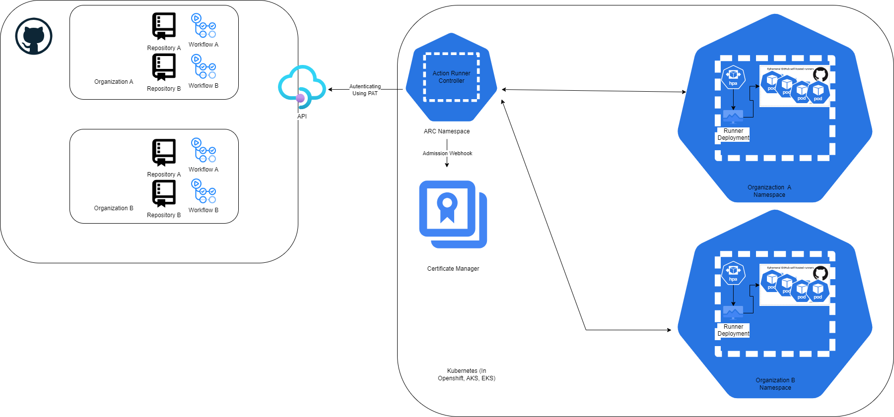
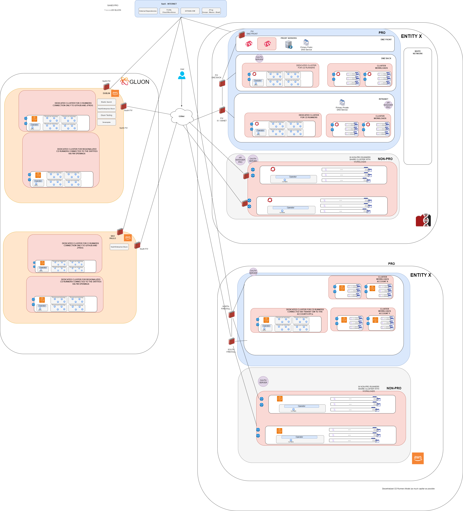

# Ephemeral Runners

Ephemeral Runners are commonly used for several reasons in CI/CD workflows.
Apart from the improvements in workflow execution time, easy updates of the
 runners avoid long maintenance windows. Here we list some other benefits.

- Valid solution for public and private cloud.
- Horizontal Autoscaling increasing the number of parallel executions.
- Provides a secure and clean environment for each job.
- Facilitate collaboration between entities, to enrich the quality of the runners
 and the versatility.

## Ephemeral Runners Architecture

To design an architecture for deploying **ephemeral GitHub runners** in a hybrid infrastructure
(private cloud with **OpenShift** and public cloud on **AWS EKS**), several factors need to be considered:

- the separation of runners for **CI** and **CD**,
- minimizing **firewall** openings,
- supporting multiple entities,
- and providing a flexible cost structure for companies with budget constraints.

The Action Runner Controller has been certified both in OpenShift and EKS kubernetes clusters.
Here’s a detailed proposal that takes all of these factors into account, with an explanation of the best solution for both **CI** and **CD** runners, along with their advantages and disadvantages.

---

## 1. CI and CD Runner Deployment

**CI** and **CD** runners serve different purposes in the DevOps workflow, so they should be separated according to their respective functions.

### CI Runners (Continuous Integration)

- **Characteristics**: CI runners are used for running unit tests, builds, and code validation in pipelines. These runners are typically ephemeral and run in response to a commit or pull request.
- **Recommended Deployment Location**:
  - **In the Public Cloud (AWS)**: The main reason is that:
    - CI tasks generally don’t rely on internal services,
    - and can be efficiently distributed across dynamic instances (such as EKS containers using spot instances to minimize the cost).
    - Even though this is the strategic approach, until the JFrog SaaS Migration has been completed and multiple Sonar instances are supported, there are several internal services still in use.
    Meanwhile this happens, OpenShift CI runners will be used, not achieving the following advantages.
  - **Advantages**:
    - **Scalability**: CI runners can easily scale based on demand, without requiring dedicated resources.
    - **Network isolation**: CI runners can be deployed in **isolated VPCs**, allowing access only to GitHub APIs and repositories, without direct access to internal organizational networks.
    - **Security**: CI runners can run within private subnets in the VPC, only exposed to the necessary tools (e.g., GitHub and any validation or scanning tools).
  - **Disadvantages**:
    - **Variable costs**: While scalable, runners in AWS incur dynamic costs based on usage, which could be a concern for entities with limited budgets.
    To minimize this impact, the proposal is to evaluate the use of spot instances.

### CD Runners (Continuous Deployment)

- **Characteristics**: CD runners are responsible for deploying code to different environments in the cloud (dev, pre, prod).
They often require access to private resources and tend to be more persistent than CI runners. To avoid firewall openings the proposal is as follows.
- **Recommended Deployment Location**:
  - **In the Private Cloud (OpenShift)**: To ensure CD runners are closer to deployment environments and can interact with Kubernetes/OpenShift clusters.
  - **In the Public Cloud (EKS)**: To ensure CD runners are closer to deployment environments and can interact with Kubernetes clusters and other AWS services.
  
- **Advantages**:
  - **Controlled access to internal environments**: CD runners can be placed within the entity private network and can securely access OpenShift/EKS clusters without issues.
  - **Cost and scalability**: OpenShift/EKS enables the efficient management of these runners, though initial infrastructure costs may be higher. However, internal resources can help control costs.
  - **Decentralization**: For entities with budget constraints, CD runners can be shared between multiple entities.
  This will impact the firewall openings to access the different clouds and the different environments.
  In case there are less budget constraints, the proposal is to have the runners distributed across different OpenShift/EKS clusters depending on the requirements of each client.
- **Disadvantages**:
  - **Management complexity**: Maintaining CD runners in OpenShift/EKS requires managing clusters and containerized workloads, which can be more complex than in all in AWS approach.
  - **Resource limitations**: For entities with many deployments, it may be necessary to adjust the cluster size to efficiently support multiple CD runners.

- The following diagram shows the different type of runners and its architecture model proposal

---

## 2. Network and Security Architecture

A key concern is the security of communication between runners (CI and CD) and the clouds (public and private), while minimizing the need to open unnecessary ports in **firewalls**.

### Distribution of Runners Between Entities

- **For CD (Continuous Deployment)**: CD runners can be distributed across multiple OpenShift/EKS clusters (multicloud and multienvironment approach).
This ensures each entity has its own runners in a secure and with a protected network.
This setup optimizes resource usage and simplifies firewall management. If only one cloud deployment is done, firewall openings within the entity are needed.
The more capilarity this deployment has, the easier firewall management.

  - **For budget-constrained companies**:
    - The entities with tighter budgets may need to use a regionalized CD runners to access its resources.
    - CD runners could be regionalized in a single OpenShift/EKS cluster but managed in a shared environment using **namespaces** or **projects** to isolate each entity deployment process.

---

## 3. Conclusion: Advantages and Disadvantages

### CI Runners (in AWS EKS using spot instances)

- **Advantages**:
  - **Dynamic scalability**.
  - **Network isolation** from internal environments.
  - **Cost adjustable** based on usage.
  - **Easy management of ephemeral runners**.
- **Disadvantages**:
  - **Variable costs**: This could be a concern for companies with budget constraints.
  - **Potential latency** when executing tasks in the public cloud.

### CD Runners (in OpenShift for Private Cloud and EKS for AWS)

- **Advantages**:
  - **Direct access to internal environments** (OpenShift/EKS clusters and deployment resources).
  - **Controlled costs** for entities with internal infrastructure.
  - **Flexibility to distribute runners** for multiple entities.
- **Disadvantages**:
  - **Management complexity**: Requires ongoing maintenance of OpenShift clusters when deployed in Private Cloud and the maintenance of the containerized workloads.
  - **Limited scalability**: For entities with large volumes of deployments, scaling OpenShift clusters can become challenging.

---

## 4. Final Recommendation

4.1 **CI**:
  Initially deployed in OpenShift clusters until migration to JFrog SaaS and multiple Sonar instances have been completed.
  Strategically deploy CI runners in AWS, using AWS Kubernetes services (EKS), with automatic scaling based on demand and using spot instances to minimize the cost impact.
  Ensure the traffic is limited to communication with GitHub and the repositories.

4.2 **CD**:
  Deploy CD runners in OpenShift and EKS, configured in separate clusters per entity and environment.
  If only one deployment in one cloud is done, firewall openings are needed internally in the entity.
  For entities with limited budgets, centralize CD runners in a single cluster using security techniques like namespaces for isolation is the recommended option.
  This solution minimizes firewall rule exposure and optimizes cost, while maintaining high levels of security and scalability.
  To access resources in non-routable addressing, a deployment in the same cloud is needed.

---

## 5. Operating Model proposed

1.**Cluster Provisioning**:

- Deployed by Cloud Platforms team both in OpenShift and in AWS Kubernetes services (EKS).
- Deployed by **Cloud Platforms Team** in AWS Kubernetes services **EKS**.
- For **CI clusters**, traffic is limited to **communication with GitHub and the repositories**: Initially Sonar, Nexus and JFrog via proxy afterwards.
- For **Decentralized CD clusters**, **traffic to multicloud and multienvironment per entity** needs to be opened inside the entity network.
- For **Regionalized CD clusters**, **traffic to multicloud and multienvironment per entity** needs to be opened from outside the entity network.

2.**GitHub runners Operator** : Deployed by Cloud Platforms Team as part of the cluster provisioning.

3.**Runners Operation** : Managed by the Middleware Team.

4.**Firewall opening requests** : Managed by the Middleware Team.

5.**Runner image lifecycle** : Requirements managed by the Gluon Platform Team and image build managed by Middleware Team.
