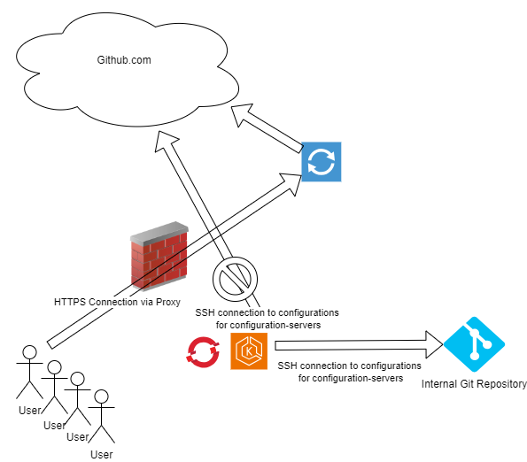

# GitHub Comms Architecture

When using Github.com with Gluon, local users should connect to GitHub via HTTPS protocol using Web Browsing proxies.

Activating GitHub IP Allow list to restrict the access to GitHub to known IP address for the proxies, will involve other comms apart from this may be impacted.

Local users formerly using SSH to access GitHub Enterprise or GitHub.com to work with the repos, should clone them again to use them via the proxies and via HTTPS protocol.

Some services could be using GitHub.com as repository for Operational configurations used by Configuration services deployed with Gluon. This is a bad practise as **Gluon and GitHub.com must not be part of the Operational Execution of the Business services**.

As shown in the diagram, those configuration services deployed with Gluon normally in Kubernetes clusters as OCP and EKS should point to local Git repositories.

These local Git Repositories are intended to provide the support for the Operational phase, avoiding Gluon and/or GitHub.com to be critical for the production of any of these services.

To identify these Git repositories, **Middleware Platform teams** should be contacted to provide this information.
