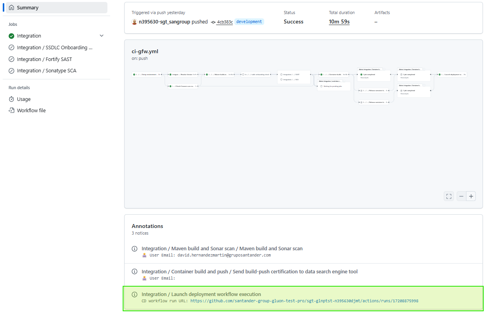

### What's Changing?

We've improved the traceability between integration and deployment workflows by
implementing automatic deployment workflow execution link generation. Now, when
an integration workflow triggers a deployment workflow, the system will:

- Wait a few seconds for the deployment workflow to initialize
- Query the GitHub API to retrieve the newly created deployment workflow
  execution
- Display a direct link to the deployment workflow execution in the integration
  workflow summary

The following screenshot demonstrates the new traceability feature in action.
You can see how the integration workflow now automatically displays a direct
link to the triggered deployment workflow execution, eliminating the need for
manual navigation to track the deployment process:

This enhancement ensures complete end-to-end visibility throughout the CI/CD
process, making it easier to track and follow deployment executions directly
from the integration workflow.

### Why Is This Important?

Previously, when integration workflows triggered deployment workflows, users
lost traceability because:

- The GitHub workflow dispatch API only returns a `204` status code without
  execution details
- Users had to manually navigate to the Actions tab to find the corresponding
  deployment execution
- Linking specific integration runs to their deployment executions was
  difficult, especially for historical analysis
- Support teams faced challenges when troubleshooting deployment issues
  initiated from integration workflows

This improvement provides **immediate value** by:

- **Streamlining developer experience**: Direct access to deployment status
  without manual navigation
- **Enhancing support capabilities**: Clear audit trail for troubleshooting and
  incident resolution
- **Improving operational visibility**: Complete workflow chain visibility for
  better monitoring and reporting

The enhancement maintains the existing workflow behavior while adding valuable
traceability information that benefits both development teams and support
operations.
