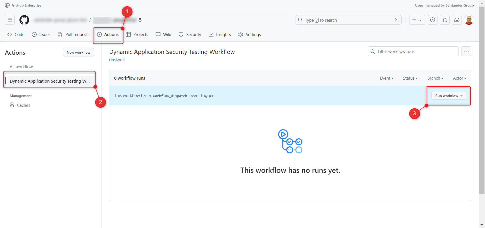
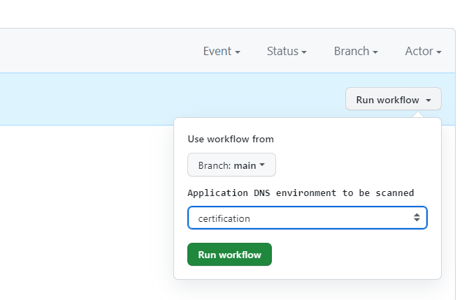
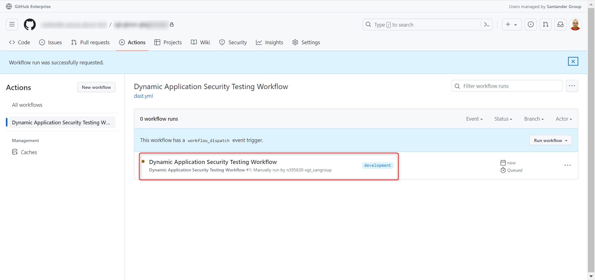

# Dynamic Application Security Testing

## Introduction

The Dynamic Application Security Testing (DAST) is a process that allows you to
scan your application to detect vulnerabilities in the application's runtime
environment. The DAST process is executed by the workflow defined in the
`.github/workflows/dast.yaml` file. This workflow is configured to be executed on
demand and it's triggered by the user when needed.

## Configuration

The configuration file is located under the `.gluon/security` folder and it's
named `dast.yaml`. The configuration file is used by the workflow to retrieve the
DNS of the application to be scanned. The configuration file is structured as
follows:

```yaml
dast:
  configuration:
    certification:
      dns: ${CERTDNS}
      timeout: 120
    preproduction:
      dns: ${PREDNS}
      timeout: 120
```

The placeholder variables are replaced by the values provided in the component
creation process. You can change its values as you need.

timeout: This argument sets the max time, in seconds, the system will wait for
a response before considering the request failed. Here, a 120-second timeout is
set for the certification and preproduction configurations.

## Workflow description

You can locate the workflow to run the DAST under the `.gluon/workflows` folder
by identifying the `dast.yaml` file among the other possible workflows stored
there. This workflow is configured to be executed on demand as we can see in the
`on` section of the workflow file:

```yaml
on:
  workflow_dispatch:
    inputs:
      environment:
        type: choice
        description: Application DNS environment to be scanned
        options:
          - certification
          - preproduction
```

As you can see too, the workflow is configured to receive an input parameter
called `environment`. This parameter is used to identify the environment to be
scanned and the corresponding configuration property seen before.

In the second part of the workflow, we can see the different steps executed by
the workflow:

```yaml
jobs:
  call-reusable-workflow:
    name: Dynamic Application Security Testing Workflow
    uses: santander-group-shared-assets/gln-workflows/.github/workflows/dast.yml@v1
    with:
      environment: ${{ inputs.environment }}
      component: ${{ github.event.repository.name }}
    secrets: inherit
```

In this case is a single call to a reusable workflow identified by the
`uses` property. This reusable workflow is stored in the
`santander-group-shared-assets/gln-workflows` repository and it's located under
the `.github/workflows/dast.yml` path. Although in this case, the reusable
workflow is configured by two params, here is a full list of available
configuration parameters:

| Parameter          | Description                                                    | Default value            | Required |
|--------------------|----------------------------------------------------------------|--------------------------|----------|
| dast-runner        | The runner to be used to execute the DAST process.             | dast-runner              | false    |
| runner             | The runner to be used to execute the workflow.                 | base-runner      | false    |
| timeout-minutes    | The timeout in minutes to break the job.                       | 60                       | false    |
| component          | The component created.                                         | empty                    | true     |
| environment        | The environment to be scanned.                                 | empty                    | true     |
| criteria           | The criteria to be used to break the pipeline.                 | High                     | false    |

## Workflow execution

Go to the Actions tab in the GitHub repository and select the workflow you want
to execute. In this case, we will execute the DAST workflow. Click on the
workflow named `Dynamic Application Security Testing Workflow` and then click
on the `Run workflow` button.



You will be asked to provide two different inputs:

* **A branch**: The branch to retrieve the configuration file from.
* **The environment**: The environment to be scanned. This parameter determines
  the DNS to be retrieved from the configuration file from the corresponding
  environment section.



Once you have selected the branch and the environment, click on the
`Ru workflow` button. The workflow will be executed and you will be able to see
a new workflow run in the current window. Click on the workflow run to see the
details of the execution. You will see the different steps executed by the
workflow and the corresponding logs.



### Workflow execution runners

As the DAST workflow is high demanding in terms of resources, it's executed in a
dedicated runner. This runner is a virtual machine with a given label,
`dast-runner`, that needs to be configured in the GitHub organization where the
component repository is created.

The workflow performs other operations not as much resources demanding as the
DAST process. These operations are executed in a different runner, the default
one labeled as `base-runner`.

## Workflow results

Stored in the Fortify SCA server. Refer to the
[Fortify section](../../../../application/security/SSDLC/ssc-platform/ssc-fortify-platform.md) of this user
documentation to know about it.
