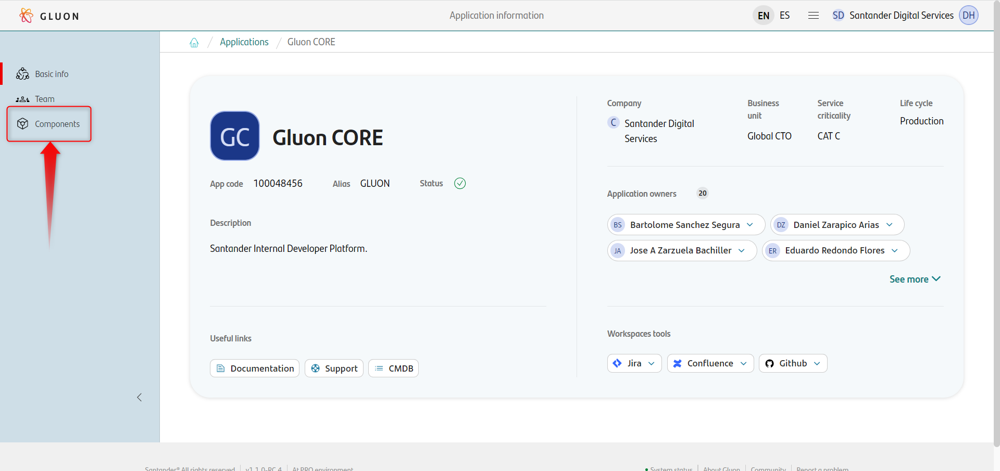
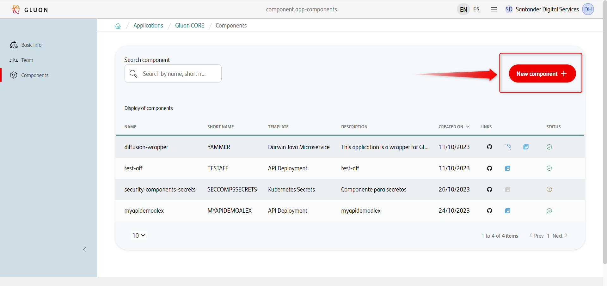
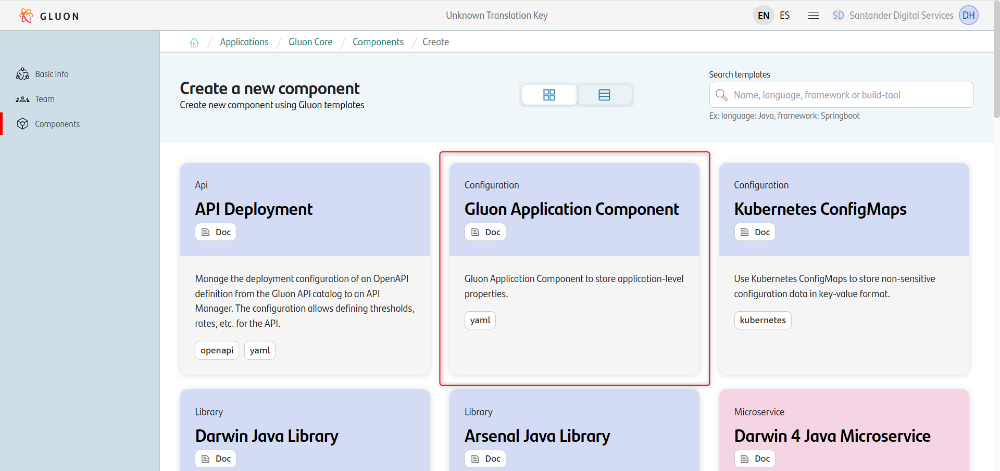
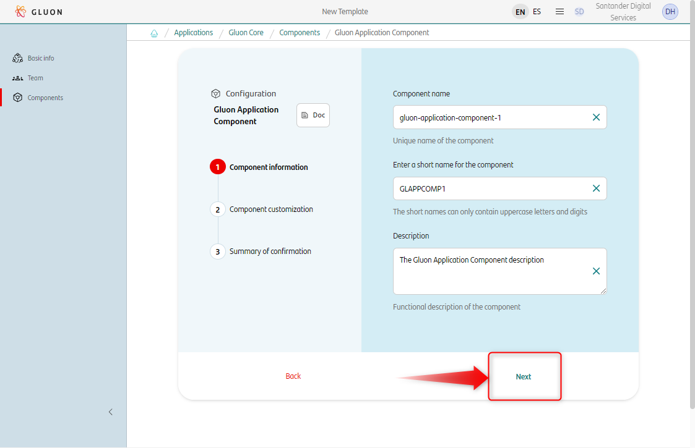
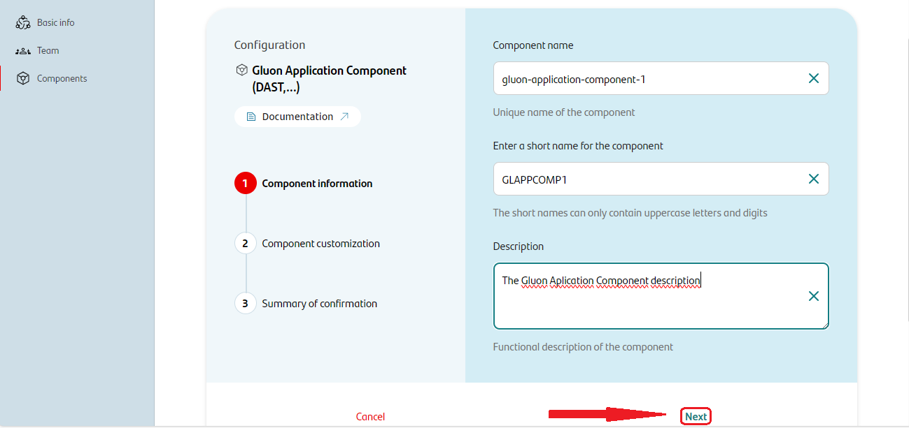
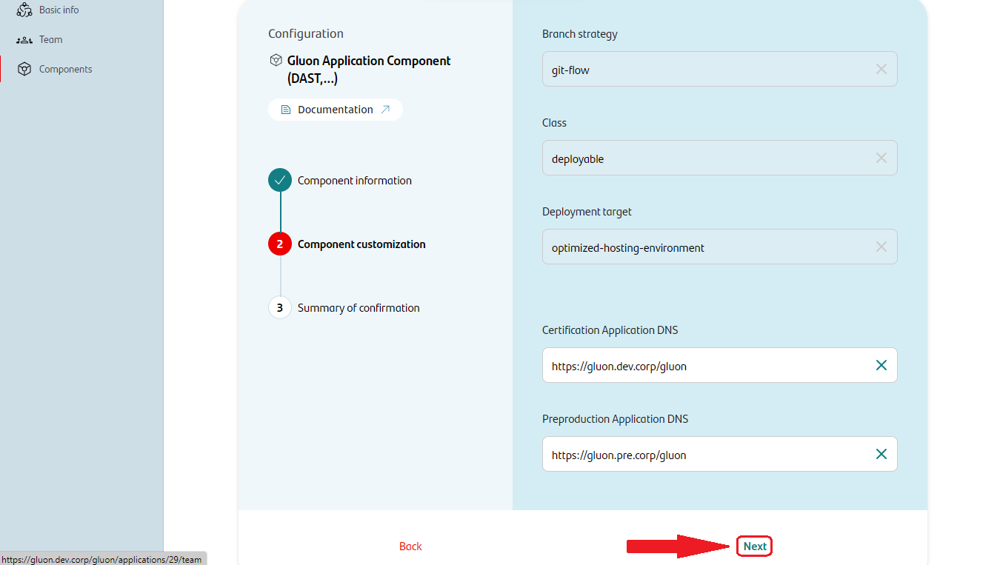
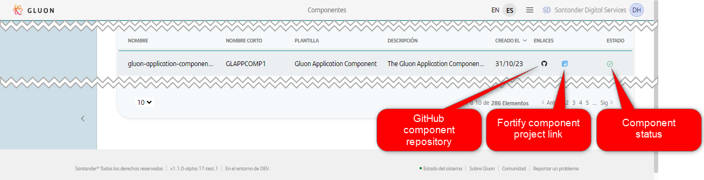

# Gluon Application Component

## What is a Gluon Application Component?

The Gluon Application Component is intended to provide a place to set up all the
functionalities and properties of a Gluon technical application. Those
processes or configurations specific to a single component will be associated
with its component. So, this application-type component houses those
configurations that do not fit at the component level and are inherent to the
Gluon application construct. As an example of this configuration or
process, you can find the DAST type security analysis that is not applied to a
single component and is must be executed to all the components that make up an
application.

## Gluon Application Component Functionalities

As described before, the Gluon Application Component purpose is to manage APM
technical application level configurations and processes. At this moment, the
list of available processes and functionalities you can run with a Gluon
Application Component is:

* [DAST](./dast/index.md): Dynamic Application Security Testing.

## How to create an Application Component

As usual in the component creation process, you must access the
[Gluon Portal](https://gluon.gs.corp/gluon) and click on an existing
application. Once in the application details, click on the *Components section*
in the left menu.

You will see the list of components bound to the application. Click on the
*New component* button and select the **Gluon Application Component** option.

You will be asked to provide a *name* for the component, the *short name* and
the *component description*. Once you have provided the information, click on
the *Next button*.

You will be asked to provide the necessary information to configure the
[DAST](./dast/index.md) process consisting of the DNS of the application in the
two commonly used environments: certification and preproduction.
Once you have provided the information, click on the *Next button*.

You have arrived at the summary confirmation page, where you can review the
information provided. If everything is correct, click on the
*Create component* button.

The component will be created, and you will be redirected to the components list
page, where you will see the new component and the component creation process
status, as well as the links to the repository and the Fortify project.

Now, you can go to the component's repository to continue with the component
configuration options like the
[DAST configuration](./dast/index.md#configuration)  or the
[DAST execution process](./dast/index.md#workflow-execution).

## Gluon Application Component repository structure

The Gluon Application Component repository is created with two branches:

* main
* develop

The main branch is the one that contains the stable version of the component,
while the develop branch is the one that contains the latest version of the
component, including the latest changes and updates.
<!-- The movement of the code
from one branch to another is explained in the
[branch strategy section](#gluon-application-component-branch-strategy) as well
as in the [versioning section](#gluon-application-component-versioning). -->

<!-- ## Gluon Application Component lifecycle

Not defined yet.

## Gluon Application Component branch strategy

Not defined yet.

## Gluon Application Component versioning

Not defined yet. -->

## How is created a Gluon Application Component?

This part of the documentation describes technically the process of creating a
Gluon Application Component. If you are not interested in the technical details,
you can skip this section.

In the following diagram, you can see the process of creating a Gluon
Application Component and the main actors involved.

The actors:

* The **user**: It means you. The person who is creating the component.
* The **Gluon Portal**: This is the web application that allows you to create
  the component.
* **Component Manager** and its APIs: These are the Gluon part managing the
  components creation process and coordination. The central piece.
* **Application360**: This is the Gluon part in charge of creating the basic
  structure for the component repository and providing the user's workflows
  needed to manage the component.

The process:

* Before starting the process, and for each component available in the Gluon
  Portal, there is a template in the Component Manager that contains the basic
  information of the component, the way it is displayed in the Gluon Portal,
  and the information needed to execute the scaffolding process to generate the
  basic structure in the component's repository, as well as the information
  required to know if a component creation also needs an onboarding process in
  Fortify or SonarQube.
* First, you, the user, access the Gluon Portal and follow the steps described
  in the *[How to create an Application Component section](#how-to-create-an-application-component)*
  to create the component.
* When the user finishes the form fulfillment, the component manager is notified
  and starts the component creation process by selecting the template from its
  database and making the calls to all the APIs to create the repository in
  GitHub and the onboarding process in Fortify.
* The repository is created from a repository template. This template has an
  initialization workflow. The initialization workflow is executed when the
  repository is created. You can also run this workflow manually in case of any
  technical problem that prevents the automatic execution.
* The initialization workflow makes a call to a reusable workflow with all the
  parameters needed. Finally, the scaffolding action is executed.
* The scaffolding action retrieves all the information needed from the component
  manager and creates the basic structure of the repository. When finished, a
  call to the component manager is made to notify the end of the process.
* In the scaffolding process, the action configures all the files in the
  repository with the information provided by the component manager and the user
  in the Gluon Portal.
* We also include in scaffolding process we launch an initial analysis in Sonar
  to have a reference to distinguish the new code in next cycles.
* The component manager, when it receives the notification of the end of the
  scaffolding process, updates the component status in the Gluon Portal and
  notifies the user that the component has been created.
