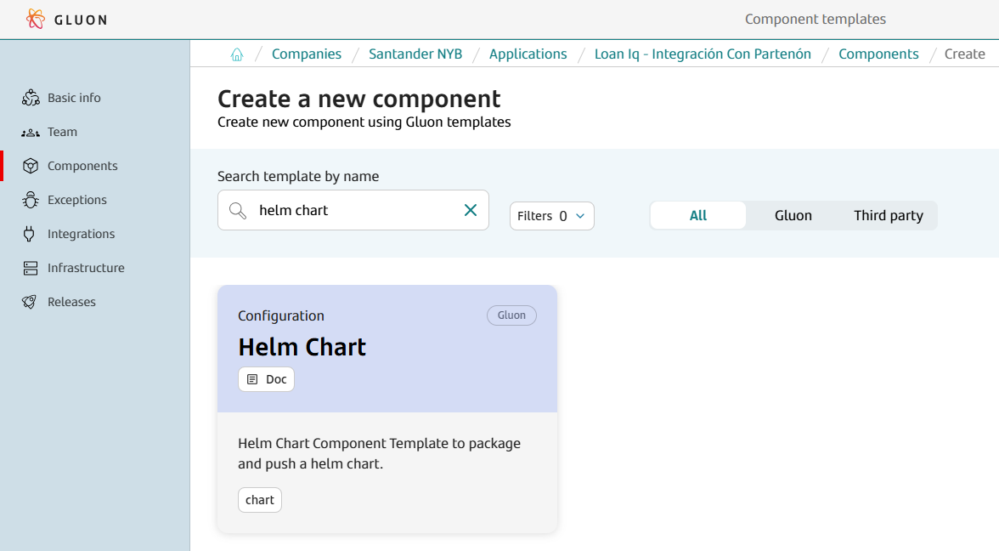
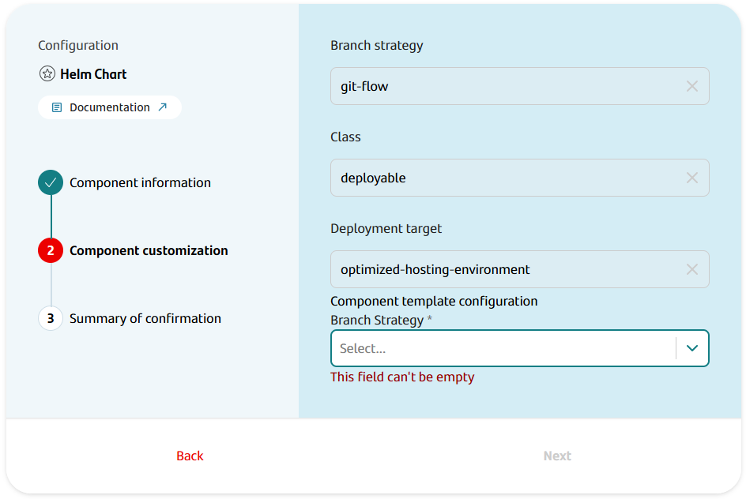
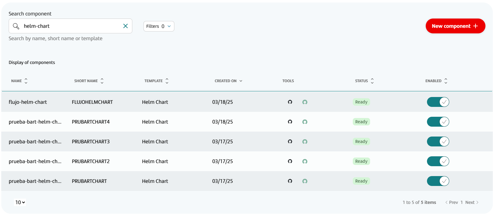

## Introduction

The purpose of this documentation is to provide a **step-by-step guide** on how to orchestrate the integration of Helm chart within the GLUON platform.

This guide will allow you to understand how to package and push to registry our Helm chart through the GLUON processes.

All push will be done in a registry (Harbor/JFROG).

## Create Component

### Gluon Portal

First, you have to [**onboard your application.**](../../../application/application-management/index.md)
Once you have your application created, you can start creating your component.

To create a component,
follow the steps described in [**Component Management**](../../../application/component-management/create-component.md),
searching for the component to be created.

You have to select the type of component you want to create,
in this case you are going to create a **Helm Chart**.



???+ remember

    To follow the naming convention visit [Repository Naming Convention](../../../application/component-management/create-component.md#repository-naming-convention).

The user can customize the type of application that they want to create.
For this example, we have created a Helm chart component with the following characteristics:



Helm chart Template Parameters:

| **Input**                                  | **Required** |       **Default value**       | **Description**                                                                                                                               |
|--------------------------------------------|:------------:|:-----------------------------:|-----------------------------------------------------------------------------------------------------------------------------------------------|
| **Branch Strategy**                        |     true     |                               | Git branching model that involves the use of feature branches and multiple primary branches.                                                  |

Once the component is created,
we can see under the application that there is a new repository created with the name of the component.



We have the following links in:

| Item              | Link                                     | Role Permission                                                                                                                                                                                                                  |
|-------------------|------------------------------------------|----------------------------------------------------------------------------------------------------------------------------------------------------------------------------------------------------------------------------------|
| GitHub Repository | Link to the repository created in GitHub | Developer (RW) /Technical Lead (Maintain) [All roles explained](https://docs.github.com/es/organizations/managing-user-access-to-your-organizations-repositories/managing-repository-roles/repository-roles-for-an-organization) |

### Helm chart Template

#### Git Flow

##### Branches

When you create the component from the Gluon Portal, the component is created with the default values of the template from the scaffolding workflow.

- Create a **main** branch with .github folder (workflows and CODEOWNERS files).
- Create a **development** branch with a simple Chart.yaml file and with the structure of files and folders to configure your Helm chart.

???+ warning "Recommendation"

    You can create your feature branches from **develop** or **development** branch.

##### Structure

The generated Helm chart has a structure similar to the following.

```text
📂.github
┣ 📂workflows
┃ ┣ 📜ci-gfw.yml
┃ ┣ 📜version-validation.yml
┃ ┣ 📜release-gfw.yml
┃ ┗ 📜update-component-workflow.yml
┗ 📜CODEOWNERS
📂.gluon
┣ 📂cd
┃ ┣ 📂cert
┃ ┃ ┗ 📜cd.yml
┃ ┣ 📂pre
┃ ┃ ┗ 📜cd.yml
┃ ┗ 📂pro
┃ ┃ ┗ 📜cd.yml
┗ 📂ci
┃ ┗ 📜properties.env
📂templates
 | ┗ 📜dummy-template.yaml
📜.helmignore
📜Chart.yaml
📜README.md
📜values.yaml
```

## Local Running

??? abstract "Cloning your repository"

    ### Cloning your repository

    Once we have the device properly configured, the first step is to clone the project locally.

    To do so, visit [**How to clone de project**](../../../application/component-management/create-component.md#cloning-a-repository).

### Configure your Chart.yaml

It is necessary to configure some information in **Chart.yaml**.

In the file "*Chart.yaml*" we will add the following information:

``` yaml title="Chart.yaml" hl_lines="3 13 18" linenums="1"

apiVersion: v2
# Component name
name: my-component
# This is the chart version. This version number should be incremented each time you make changes
# to the chart and its templates, including the app version.
# Versions are expected to follow Semantic Versioning (https://semver.org/)
version: 1.0.0-SNAPSHOT
# This is the version number of the application being deployed. This version number should be
# incremented each time you make changes to the application. Versions are not expected to
# follow Semantic Versioning. They should reflect the version the application is using.
appVersion: 1.0.0
# Component description
description: |
  My description
# Application charts are a collection of templates that can be packaged into versioned archives
# to be deployed.
type: application
sources:
# Github repositoty url
  - https://...
```

## Infrastructure

You have to request the following infrastructure resources.

### Registry

- Project: You need a project in the registry (**Harbor** , **JFrog**) to upload your chart.
- Credentials: **user/password** with privileges to upload charts to the project.

### How to configure your registry environment

## Infrastructure

The company
used to create the components must have been provided the [Gluon Open Application Model](../../../application/ci-cd/cd/cd-rm/index.md).
The deployment model uses the [`oam-application-definition.yaml`](../../../application/ci-cd/cd/cd-rm/gluon-application-model-oam/oam-config-and-params/oam-example.md) file
to manage infrastructure and registries in a standardized way across different platforms.

### OAM Configuration

To push a Helm Chart, the parameters of the target infrastructure must be configured in the **Gluon Application Model** component of the technical application,
[**configuring the data**](../../../components/software/backend/snippets/oam-configuration.md) necessary depending on the type of Registry used.

### Configure environments

By default, the component is created with the folders cert, pre, and pro, which cover the most common use case.
Each of these folders corresponds to an environment in which
you want to push the Helm chart.

For it to work correctly,
the name of the folder must exactly match the name of the "name" property (in the example shown below,
it would be the cert value) of the oam-application-definition.yml file of the Gluon Application Model component.

So, to define a deployment environments,
it is necessary to describe the `name` and `type` fields:

- `name`: The name of the environment. Each Application could give a different name to the environments. It must be
  unique in the oam file.
- `type`: The type of the environment. The values allowed are `certification`, `preproduction`, and `production`.

Below is an example of the configuration of a certification environment, called cert, where one infrastructure have been configured to deploy for
Amazon Elastic-Kubernetes Service Cluster and push a artifact to Amazon Elastic Container Registry. Many properties have been omitted for this example, but for it to work correctly, the rest of the
mandatory data must be configured.

``` yaml title="oam-application-definition.yml"
environments:
  - name: cert
    type: certification
    infrastructures:
      - id: CI00000000001
        properties:
          type: KUBERNETES
          apiServer: https://api.ccc00alm.ccc.pre.cn0.paas.cloudcenter.corp:6443
          namespace: project-cert-pre
          credentialsId: CERT_PRE_TOKEN
          artifact-store: CI000000000002
          (...)

      - id: CI000000000002
        type: ARTIFACT-STORE
        properties:
          type: harbor
          registry: registry.global.ccc.srvb.bo.paas.cloudcenter.corp
          project-path: project-cert
          usernameId: USERNAME_SECRET
          passwordId: PASSWORD_SECRET
          snapshots: true
          (...)
```

The next step is to configure the `cd.yml` file,
where you can set up the infrastructures where the Helm chart will be uploaded for that environment.
For each one, the following properties must be configured:

| **Property**       | **Description**                                                             | **Example**                    |
|--------------------|-----------------------------------------------------------------------------|--------------------------------|
| ci_id              | Identifier of the infrastructure in the oam-application-definition.yml file | CI00000000001                  |

> !IMPORTANT - Considerations:
>
> - The ci_id referenced must be of type ARTIFACT-STORE.
> - The workflow will deploy on all infrastructures that are included in the cd.yml file of the environment in which it is going to be executed.
> - The infrastructures included in the cd.yml file must be registered in the environment in the oam-application-definition.yml file.

Following the previous example from the oam-application-definition.yml file, the content of the `cd.yml` file to push on Harbor would be as follows:

``` yaml title="cd.yml"
- ci_id: CI00000000002
```

For getting
to know
how to configure the `Gluon Open Application Model` repository
associated with the company where the component is generated,
the following documentation is available:

- [How to configure the Gluon Open Application Model (OAM)](../../../application/ci-cd/cd/cd-rm/gluon-application-model-oam/oam-config-and-params/gluon-application-model-oam-config.md)
- [All the parameters available by type of infrastructure component](../../../application/ci-cd/cd/cd-rm/gluon-application-model-oam/oam-config-and-params/gluon-application-model-oam-params.md)

## Component Configuration

### Branches

{!
   include-markdown "../../snippets/configuration/maven-configuration.md"
   start="<!--Start Gitflow Branches-->"
   end="<!--End Gitflow Branches-->"
!}

### Configuration Files

- **properties.env**: Properties with the CI configuration
- **Chart.yaml**: Chart configuration to push to registry
- **values.yaml**: Declare variables to be passed into your templates
- **templates/**: Templates files
- **Continuous Deployment files**: Configuration with the infrastructure identifiers and values of deployment. There is a file by environment (cert, pre, pro).

### Secrets Configuration

##### Registries Infrastructure

For accessing to the **Harbor** and **Artifactory** Artifacts Stores,
it is necessary to create authentication secrets for these keys:

- usernameId
- passwordId

## Package and Push your Helm chart

### Git Flow

Now we are going to describe the steps that a user has to perform in order to make a complete cycle, from the package process to the push through the DEV, PRE and PRO environments.

The cycle explained below is based on **GitFlow**

#### Pull Request from Feature to Development

We will start working on the "Feature" branches of our GitHub repository, and we will be integrating our changes into the integration branch (develop or development)

#### Push to Development

When approving the Pull Request of the previous step on the integration branch (development/develop) we will generate a push event on this branch and therefore the ci-gfw.yml workflow will be executed automatically.

Next, we detail which steps are executed in this workflow:

##### Integration workflow

- **Setup environment variables**:Load the properties defined in properties.env file and in the configuration project.
- **Resolve version**: Resolve the version of the component.
- **Helm package and push**: Package and upload the chart to the certification environment
- **Send data to elasticsearch** related with the registries where the chart has been published.

??? info "Helm chart CI workflow code"

    ```yaml linenums="1"
    name: Integration
      on:
        push:
          branches:
            - development
            - develop
    
    jobs:
      call-reusable-workflow:
        name: Integration
        uses: santander-group-shared-assets/gln-workflows/.github/workflows/helm-chart-ci-gfw.yml@v1
        secrets: inherit
    ```

If everything works correctly, we will have our chart uploaded to the registry in certification environment as SNAPSHOT (e.g '1.0.0-SNAPSHOT').

#### Pull Request from the development branch to the main branch

When we are ready to promote our Helm chart, we will create a Pull Request from the integration branch (develop or development) to the main branch.

This event will launch the **version-validation.yml workflow**.

#### Version validation workflow

- **Setup environment variables**: Load the properties defined in properties.env file and in the configuration project. The configuration project is obtained according to the secrets defined here.
- **Get version**: Get release version.
- **Check release**: Check if release version exits in Github.

#### Push to the main branch

When we approve the PR of the previous step on the main branch, we will generate a push event on this branch,
and therefore the release-gfw.yml workflow will be executed automatically.

##### Release workflow

- **Setup environment variables**: Load the properties defined in properties.env file and in the configuration project. The configuration project is obtained according to the secrets defined here.
- **Resolve version**: Resolve the version of the component.
- **Helm package and push**: Package and upload the chart to the certification environment
- **Send data to elasticsearch** related with the registries where the chart has been published.
- **Generate tag and release**: Create the release tag and generate the GitHub Release.

??? info "Release workflow code"

    ```yaml linenums="1"
    name: Release
    on:
      push:
        branches:
          - main
          - master
    jobs:
      call-reusable-workflow:
        name: Release
        uses: santander-group-shared-assets/gln-workflows/.github/workflows/helm-chart-release-gfw.yml@v1
        secrets: inherit
    ```

At the end of the workflow, a GitHub Release has been created using the GitHub Tag generated within the Release workflow (e.g '1.0.0').

A new Helm chart has been pushed to the container registry to three environments (certification, preproduction, production), using the same name as the tag created (e.g '1.0.0').

## Changelog

### Version 1.0.0

- Initial version
