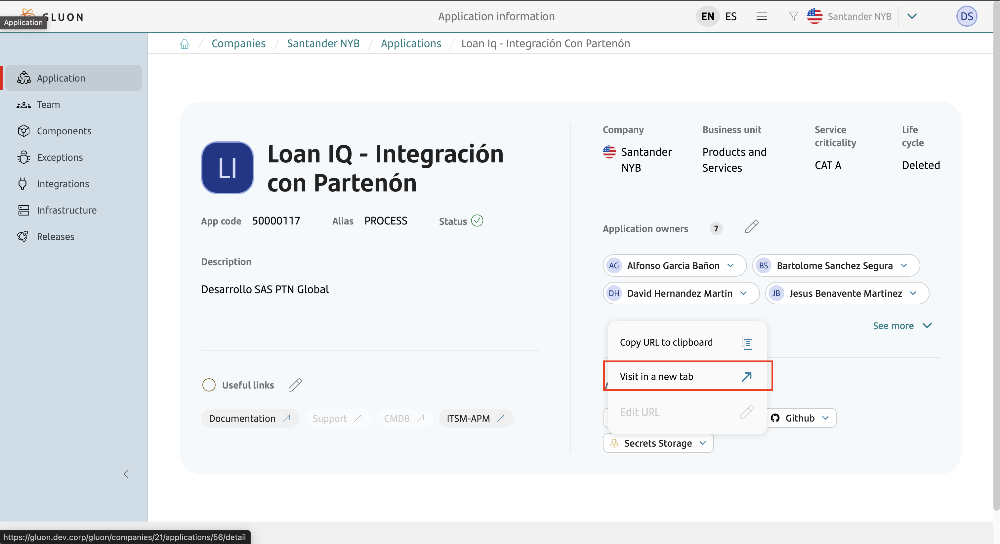
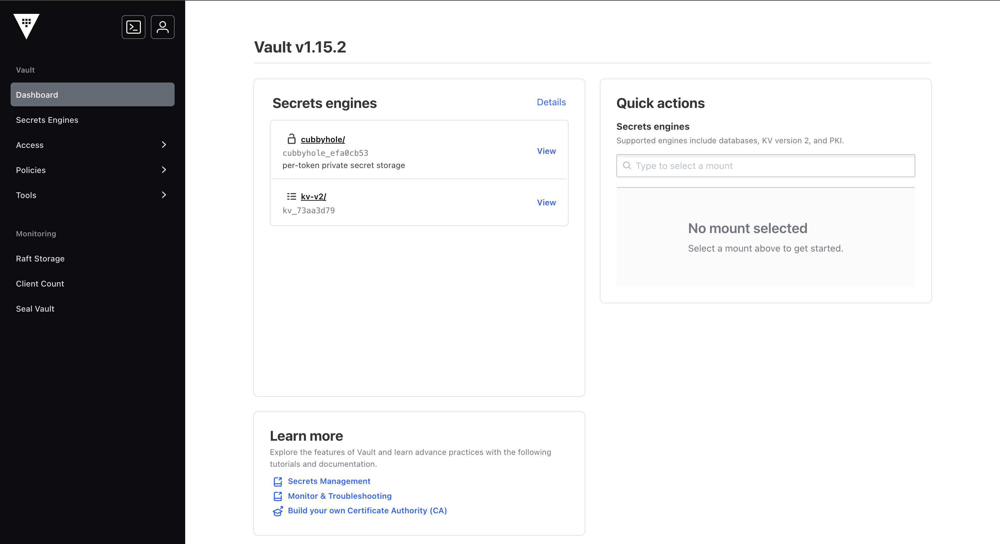
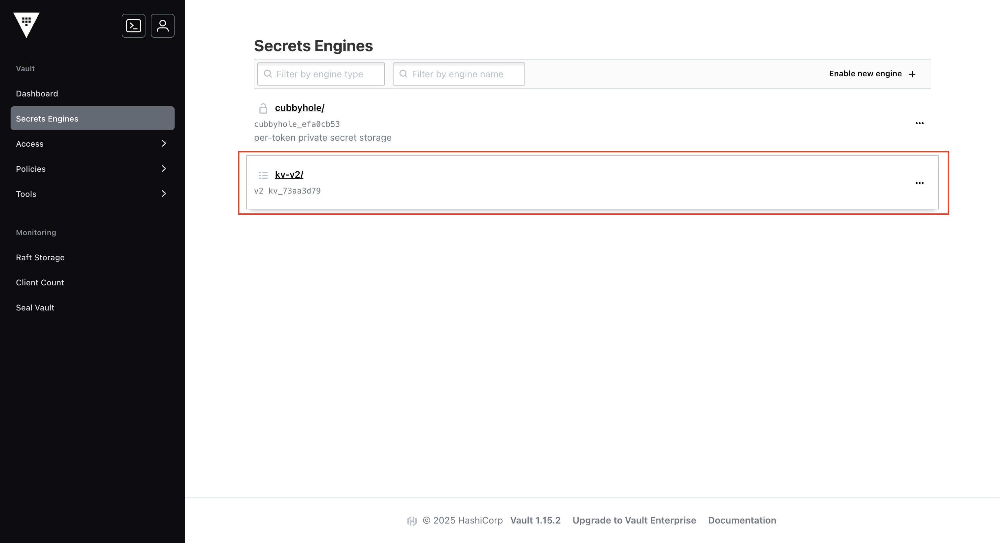
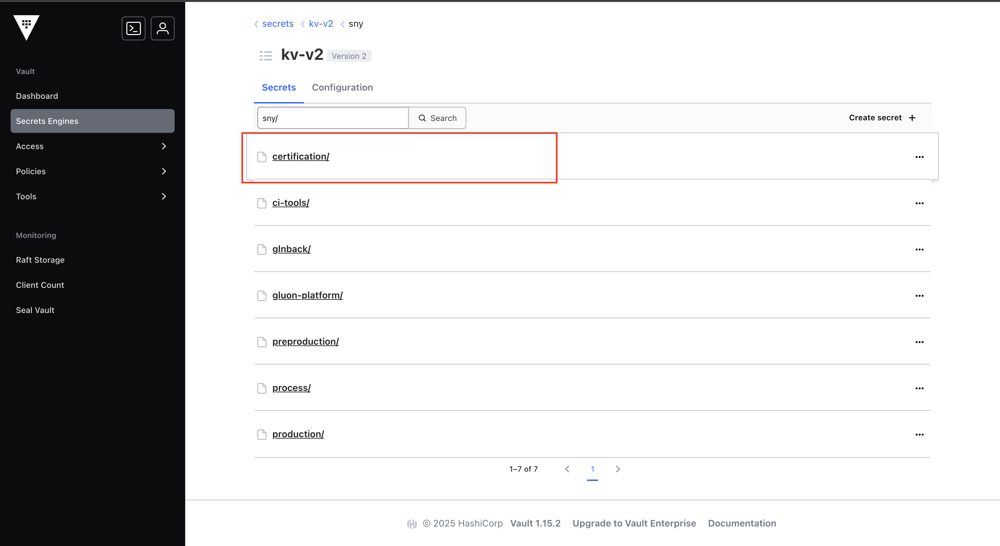
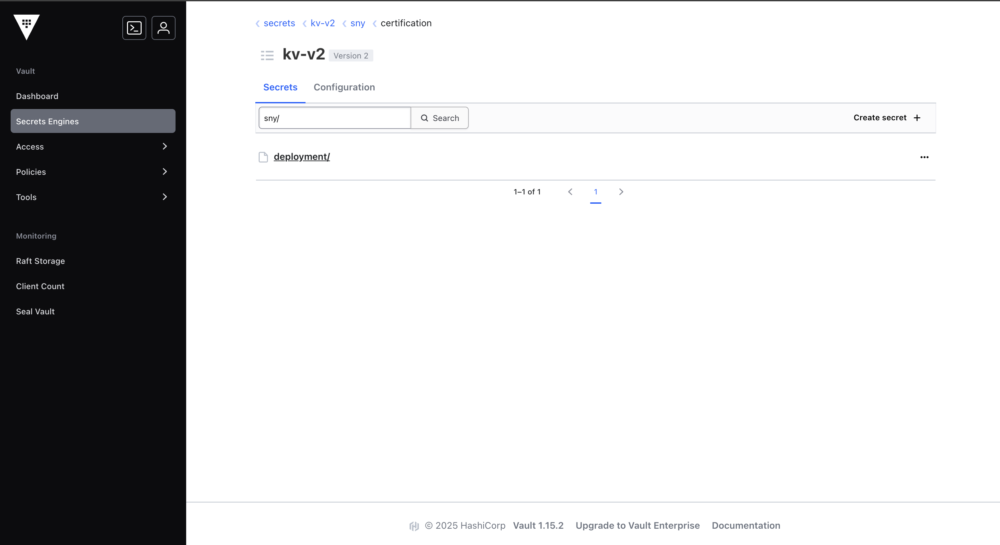
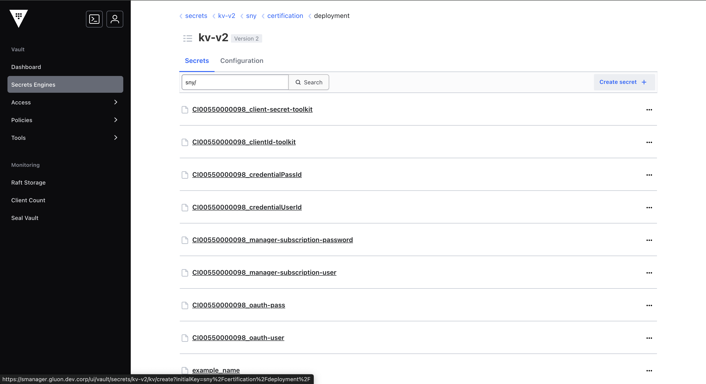
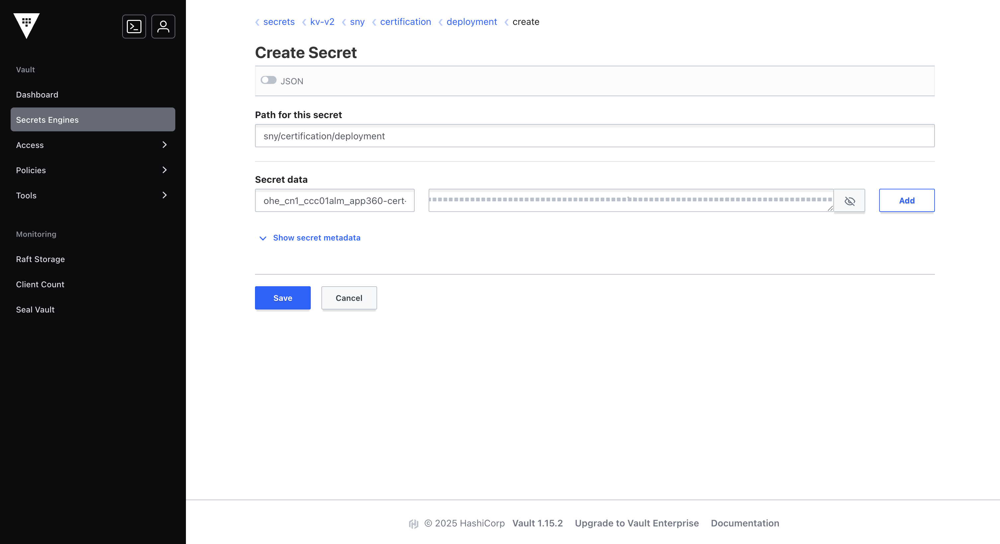

# Helm config

## Authentication

The (**gln-helm-deploy-application-action**) is an automated tool designed to simplify and standardize the deployment of applications using Helm across multiple environments and cloud providers.
It is widely used in CI/CD pipelines to ensure consistency, security, and flexibility in deployment processes.

This action is built to be highly configurable, supporting various authentication methods and integration with secret management systems such as HashiCorp Vault and GitHub Secrets.
It enables deployments to environments like OHE, Azure, and AWS, using authentication via basic credentials (username/password), token, or kubeconfig.

### How it works

The (**gln-helm-deploy-application-action**) performs the following key steps:

- Automated deployments to development, staging, and production environments.
- Support for multiple cloud providers with different authentication strategies.
- Seamless integration with GitHub Actions pipelines or other CI/CD tools.

### Authentication examples with VAULT

Below is an example of how to configure action using different authentication types with secrets retrieved from **HashiCorp Vault**.

The (**gln-helm-deploy-application-action**) supports the following authentication types:

- **authType**: `token`
- **authType**: `basic` (username/password)
- **authType**: `kubeconfig`

When `credentialsFromVault: true` is set, the action retrieves the necessary credentials from Vault and injects them into the deployment context.

???+ warning

    By default, `credentialsFromVault` is set to `false` in the OAM configuration.
    To enable Vault integration, you must explicitly set `credentialsFromVault: true`.

Config OAM using a **token** stored in Vault.

#### OAM Example Token

```yaml
- name: test
  type: pro
  infrastructures:
    - id: CI00000000013
      type: KUBERNETES
      properties:
        type: KUBERNETES
        apiServer: https://api.example.cluster:6443
        namespace: app360-cert-pre
        application: application-name-cluster
        chartPath: ./.gluon/cd
        valuesFile: "[ values-cert-oc-harbor.yaml ]"
        authType: token
        credentialsFromVault: true
        artifact-store: CI00000001004
```

Config OAM using a **basic** stored in Vault.

#### OAM Example Basic

```yaml
- name: test
  type: pro
  infrastructures:
    - id: CI00000000013
      type: KUBERNETES
      properties:
        type: KUBERNETES
        apiServer: https://api.example.cluster:6443
        namespace: app360-cert-pre
        application: application-name-cluster
        chartPath: ./.gluon/cd
        valuesFile: "[ values-cert-oc-harbor.yaml ]"
        authType: basic
        credentialsFromVault: true
        artifact-store: CI00000001004

```

Config OAM using a **kubeconfig** stored in Vault.

#### OAM Example Kubeconfig

```yaml
- name: test
  type: pro
  infrastructures:
    - id: CI00000000013
      type: KUBERNETES
      properties:
        type: KUBERNETES
        apiServer: https://api.example.cluster:6443
        namespace: app360-cert-pre
        application: application-name-cluster
        chartPath: ./.gluon/cd
        valuesFile: "[ values-cert-oc-harbor.yaml ]"
        authType: kubeconfig
        credentialsFromVault: true
        artifact-store: CI00000001004

```

## Vault Secret naming convention

Below is an example that establishes the standardized naming convention for all authentication secrets managed in **HashiCorp Vault**.
The convention is applied consistently across all supported cloud providers **OpenShift (OHE)**, **AWS**, and **Azure** and is constructed using a combination
of the cloud provider, region, cluster name, namespace, and, when applicable, the credential subtype.
This approach ensures clarity, consistency, and scalability in secret management across different environments.

### General format

The standard format for secret names is:

- `cloud`: Cloud provider (e.g., `ohe`, `aws`, `azure`)
- `region`: Cloud region (e.g., `bo1`, `eu-west-1`, `westeurope`)
- `cluster_name`: Name of the Kubernetes cluster
- `namespace`: Kubernetes namespace
- `credential-subtype`: Type of credential (e.g., `kubeconfig`, `basic_user`, `basic_pass`, `token`)

???+ Remember

    - In the vault, the secret key structure must follow the example:
    - **Example**: `cloud_region_cluster_name_namespace_credential-type_credential-subtype`

---

### OpenShift (OHE)

#### Example infrastructure

- **Cloud**: `ohe`
- **Region**: `bo1`
- **Cluster Name**: `cib01`
- **Namespace**: `almnextgen-adoption`

#### Secret names

- **kubeconfig**: `ohe_bo1_cib01_almnextgen-adoption_kubeconfig`
- **basic**:
    - **user**: `ohe_bo1_cib01_almnextgen-adoption_basic_user`
    - **pass**: `ohe_bo1_cib01_almnextgen-adoption_basic_pass`
- **token**: `ohe_bo1_cib01_almnextgen-adoption_token`

### AWS

#### Example infrastructure

- **Cloud**: `aws`
- **Region**: `eu-west-1`
- **Cluster Name**: `sgtd1aireksgluondeksd001`
- **Namespace**: `app360-dev`

#### Secret name

- **kubeconfig**: `aws_eu-west-1_sgtd1aireksgluondeksd001_app360-dev_kubeconfig`
- **basic**:
    - **user**: `aws_eu-west-1_sgtd1aireksgluondeksd001_app360-dev_basic_user`
    - **pass**: `aws_eu-west-1_sgtd1aireksgluondeksd001_app360-dev_basic_pass`
- **token**: `aws_eu-west-1_sgtd1aireksgluondeksd001_app360-dev_token`

### Azure

#### Example infrastructure

- **Cloud**: `azure`
- **Region**: `westeurope`
- **Cluster Name**: `cibd1weuaksdevopscrit003`
- **Namespace**: `test-namespace`

#### Secret name

- **kubeconfig**: `azure_westeurope_cibd1weuaksdevopscrit003_test-namespace_kubeconfig`
- **basic**:
    - **user**: `azure_westeurope_cibd1weuaksdevopscrit003_test-namespace_basic_user`
    - **pass**: `azure_westeurope_cibd1weuaksdevopscrit003_test-namespace_basic_user`
- **token**: `azure_westeurope_cibd1weuaksdevopscrit003_test-namespace_token`

???+ remember "Best Practices"

    - Avoid including sensitive information in the secret name.
    - Use environment-specific namespaces to prevent collisions.

---

#### How to configure secrets in Vault

This section provides step-by-step instructions for configuring authentication secrets in **HashiCorp Vault**, following the naming convention described above.

???+ information

    The application is created from the `Portal`. By accessing the Applications section, a new button labeled **"Secrets Storage"** is available. This option is visible to all users who are members of the company and the application. But only company owners are allowed to execute it, regular members can see the link but cannot perform the action. Once the secret storage is created, the Vault path is shown to the user and a link to access the generated structure, which is organized per application. The structure is created based on the fact that each application is associated with a specific namespace.



---

#### 1. Access the Vault UI

Log in to the Vault web interface using your credentials.



---

#### 2. Navigate to the secrets engine

Go to the **Secrets** section and select the appropriate secrets engine (e.g., `kv`, `kv-v2`, etc.).



---

#### 3. Access path environment

???+ information

    In case of deployment, the folders are organized by environment. In this example, we will select the **certification** folder. However, if you wish to create credentials for your application in other environments, simply select **preproduction** or **production**, as shown in the image.



---

#### 4. Access path deployment

Select the `deployment` folder to proceed with the secret **registration**.



#### 5. Create secret

Select **Create Secret** in the top-right corner



#### 6. Configure secret

???+ remember "Recommendation"

    Remember to create the key following the naming convention, and the value should be one of the types already mentioned: `token`, `basic`, or `kubeconfig`: [Vault Secret naming convention](#vault-secret-naming-convention)



---

### GitHub configuration examples

Below is an example of how to configure action using different authentication types with secrets retrieved from **GitHub Secrets**.

---

#### Overview

The action supports the following authentication types when using GitHub Secrets:

- **authType**: `token`
- **authType**: `basic` (username/password)
- **authType**: `kubeconfigFile`

---

### Configuration Example

#### 1. GitHub Secrets

???+ warning

    To use authentication with GitHub Secrets, the `credentialsFromVault` property must be set to `false` or removed from the OAM file.

- **token**:
    - **credentialsId**: `DEPLOY_TOKEN`
- **basic**:
    - **credentialUserId**: `DEPLOY_USER`
    - **credentialPassId**: `DEPLOY_PASSWORD`
- **kubeconfigFile**:`DEPLOY_KUBECONFIG`

---

#### Authentication with GitHub Secrets in OAM

Config OAM using a **basic** stored in GitHub Secrets.

#### OAM Example Basic

```yaml
- name: test
  type: pro
  infrastructures:
    - id: CI00000000013
      type: KUBERNETES
      properties:
        type: KUBERNETES
        apiServer: https://api.example.cluster:6443
        namespace: app360-cert-pre
        application: application-name-cluster
        chartPath: ./.gluon/cd
        valuesFile: "[ values-cert-oc-harbor.yaml ]"
        credentialUserId: DEPLOY_USER
        credentialPassId: DEPLOY_PASSWORD
        authType: basic
        artifact-store: CI00000001004
```

Config OAM using a **token** stored in GitHub Secrets.

#### OAM Example Token

```yaml
- name: test
  type: pro
  infrastructures:
    - id: CI00000000013
      type: KUBERNETES
      properties:
        type: KUBERNETES
        apiServer: https://api.example.cluster:6443
        namespace: app360-cert-pre
        application: application-name-cluster
        chartPath: ./.gluon/cd
        valuesFile: "[ values-cert-oc-harbor.yaml ]"
        credentialsId: DEPLOY_TOKEN
        authType: token
        artifact-store: CI00000001004
```

Config OAM using a **kubeconfig** stored in GitHub Secrets.

#### OAM Example Kubeconfig

```yaml
- name: test
  type: pro
  infrastructures:
    - id: CI00000000013
      type: KUBERNETES
      properties:
        type: KUBERNETES
        apiServer: https://api.example.cluster:6443
        namespace: app360-cert-pre
        application: application-name-cluster
        chartPath: ./.gluon/cd
        valuesFile: "[ values-cert-oc-harbor.yaml ]"
        kubeconfigFile: DEPLOY_KUBECONFIG
        artifact-store: CI00000001004
```

???+ remember "Best Practices"

    - Always use **uppercase**, **hyphen-free**, and **special character-free** keys to ensure consistency.
    - Avoid including sensitive information in the secret key.
    - The variable name in the OAM file must always match the name of the corresponding GitHub Secret.
