# IAM Journey

## Introduction

The purpose of this documentation is to provide a step-by-step guide on how to deploy an IAM component on the GLUON platform.

## What is IAM?

AWS Identity and Access Management (IAM) is a web service that helps you securely control access to AWS resources. With IAM, you can manage permissions that control which AWS resources users can access.
You use IAM to control who is authenticated (signed in) and authorized (has permissions) to use resources. IAM provides the infrastructure necessary to control authentication and authorization for your AWS accounts.

## How to create a IAM component in Gluon

In order to create a new IAM component in the Gluon platform, the next steps must be followed:

* Once logged in the Gluon portal, the first thing that needs to be done is to ensure that the **Company** that we're using is the one that wants to be used to deploy the IAM Component:
    

* Now, select **Applications**, to see all the available applications within this company:<br>
    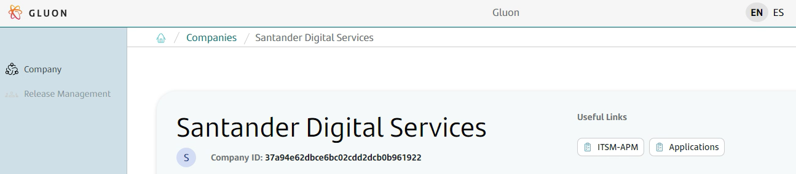

* Choose the desired application and select the **Components** option from the menu located on the left side of the screen:<br>
  

* Click on **New Component**:<br>
  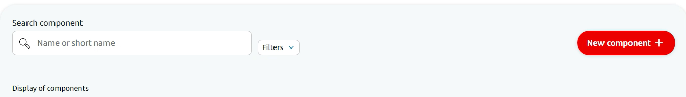

* Search for **IAM** component and click on it:<br>
  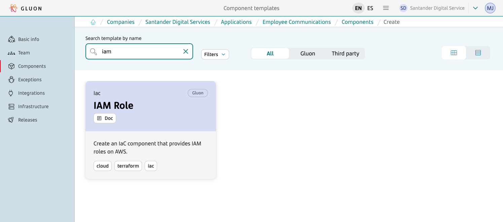

* Fill the template and press **next** button: <br>
  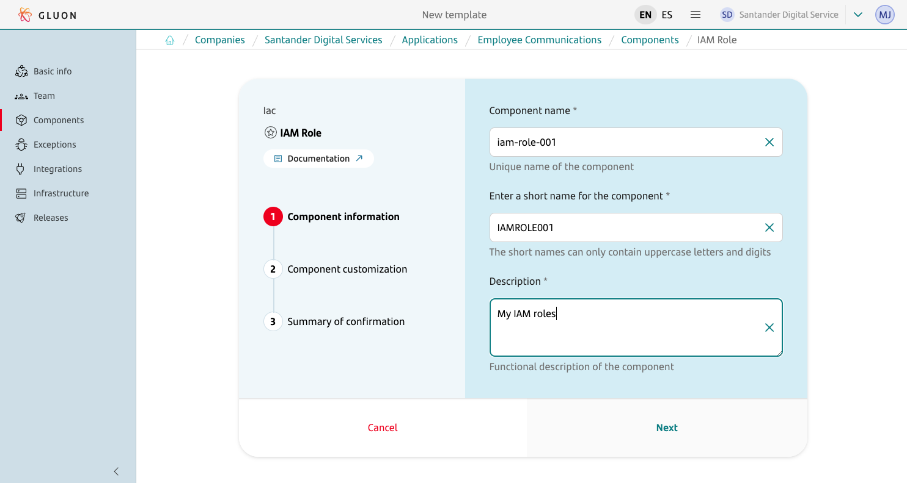

* Click on 'next' and select 'Git Flow' as 'Branch Strategy'. Also some predefined role configuration templates can be included in the component: <br>
  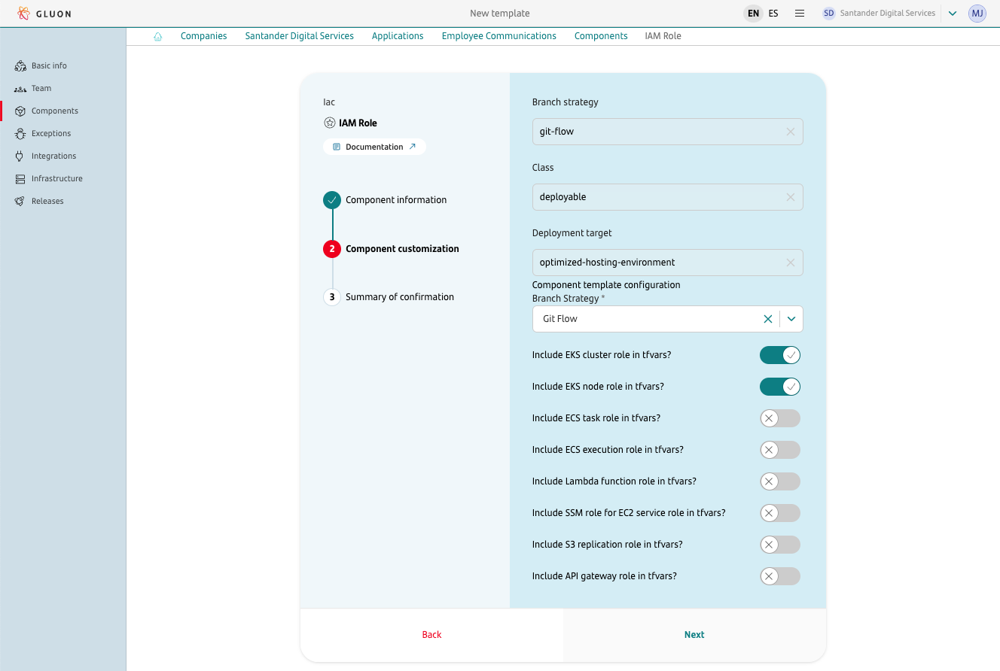

!!! info
    The next role examples could be included in the component:

      * **EKS cluster role**: This role allows Kubernetes clusters managed by Amazon EKS to manage nodes.
      * **EKS Node role**: This role allows EKS node kubelet daemon to make calls to AWS APIs on your behalf. 
      * **ECS Task role**: This role allows your application code (on the container) to use other AWS services.
      * **ECS execution role**: This role allows Amazon ECS to use other AWS services on your behalf.
      * **Lambda function role**: This role allows the Lambda function to access AWS services and resources.
      * **SSM role for EC2 seservice role**: This role applies if EC2 instances with SSM Agent will be created for the project.
      * **S3 replication role**: This role allows S3 to replicate objects between buckets.
      * **API gateway role**: This role allows API Gateway to access Elastic Load Balancing, Amazon Data Firehose, and other service resources on your behalf.

* Click on 'next' again and in the following step, a summary of the component creation request will be shown. Once checked and if everything is correct, click on **Create Component**: <br>
  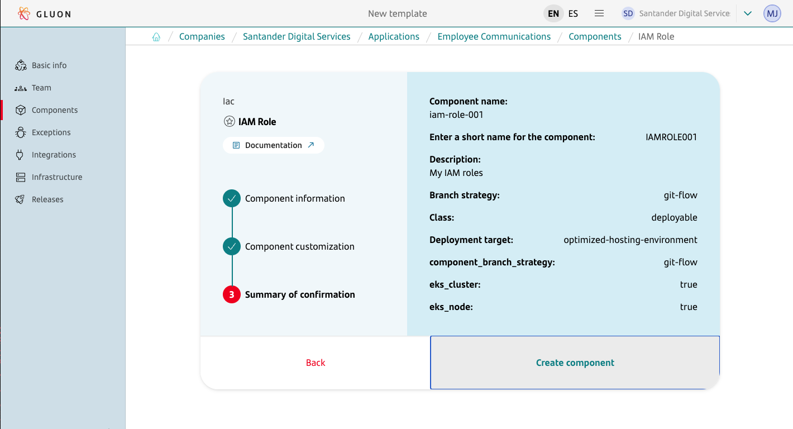

* We will see the component created in the **Component Page** and a pop-up will appear in the lower right corner of the screen stating that the component was successfully created: <br>
  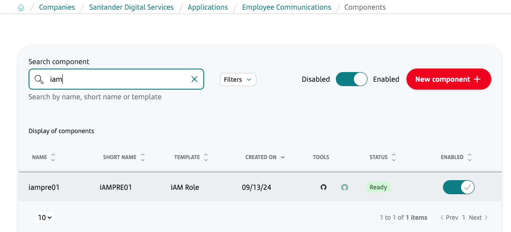

* Click on the Github icon to see the newly created repository for the IAM cluster component:<br>
  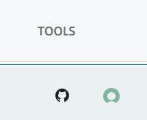

* The new repository only contains an 'init-branch' that must be used by the 'Scaffolding' workflow to initialize the repository: <br>
  

This workflow should be automatically launched on create, but sometimes it gets stuck. So, click on the Github Actions executions to check this. If the workflow was not run, it can be manually started: <br>
  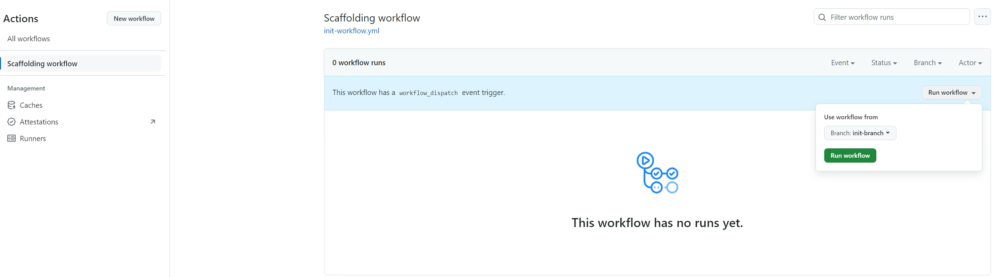

* Once the workflow execution is done, if we go back to the 'code' section of the repository, we will now see the 'main' branch and the repository will be ready to be used. <br>
  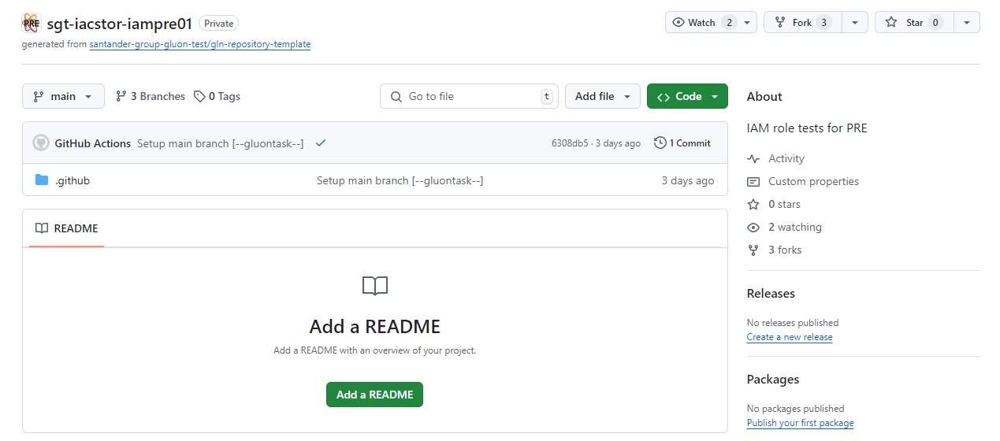

## Component configuration

Once the IAM component repository has been created and initialized, some extra configurations must be done in order to make the Terraform workflows work in the newly created component.
For this, we must follow the step-by-step guide of the [Component Pre-requisites](../../../../application/iac/terraform-workflows/component-prerequisites.md) section.
The IAM component does not need more configuration than the one described on this section.

In summary, the <u><strong>requirements</strong></u> in order to be able to use the Terraform Workflows in the IAM component are:
<ul>
  <li><strong>To have set the PG_CREDENTIALS</strong> secret as organization secret in the newly created component repository. As these are organization secrets, it is very likely that the used organization already has them.
  Please check this before requesting them, since if they're already set, it is not needed to request the addition of these secrets again.
  <li><strong>To have set the IAC_CREDENTIALS_<code>environment</code></strong> secrets as repository secrets in the newly created component repository.
  This is always required, since here the information about the provider that wants to be used for deployment is set and this information is different for each application.
  <li><strong>To have set the Environments protection rules</strong> in the newly created component repository to be able to approve the workflows runs on that environment.
</ul>

## Parameters to create a IAM resources

All the information about what parameters can be used to deploy IAM resources, how to use them or how to build a specific configuration are in the [Cloud Provider](./cloud-provider/index.md) section.

In addition to this, please note that all the tfvars files that must be updated to deploy IAM resources are located in the '.gluon/cd/<code>environment</code>' path of the created IAM component:<br>
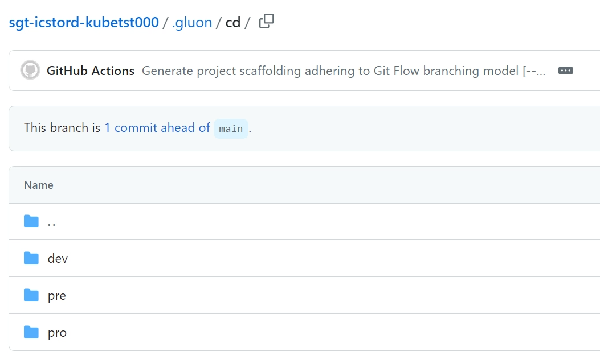

Where <code>environment</code> can be: 'dev', 'pre' or 'pro' and this will define the environment where the resource wants to be deployed.

If you plan to use json files to store pre-defined policies configuration, the files have to be stored in the 'policies' folder for every environment '.gluon/cd/<code>environment</code>/policies/*.json' .
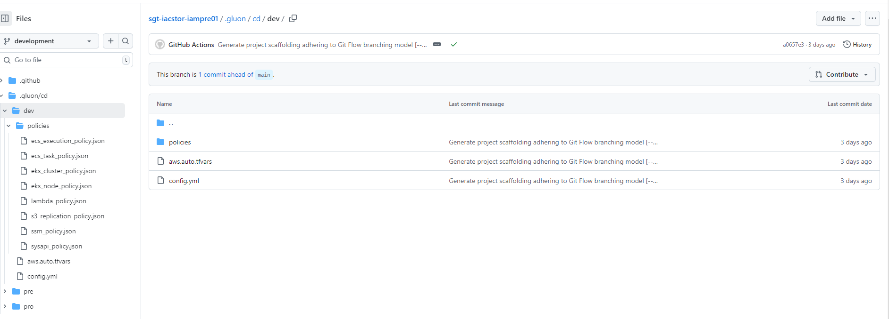

So, in case that the deployment wants to be done on the 'dev' environment, the tfvar and policies files that have to be updated are:

<ul>
<li><strong>.gluon/cd/dev/aws.auto.tfvars</strong> for terraform variables.
<li><strong>.gluon/cd/dev/policies/<code>policy_name</code>.json</strong> for policies files.
</ul>

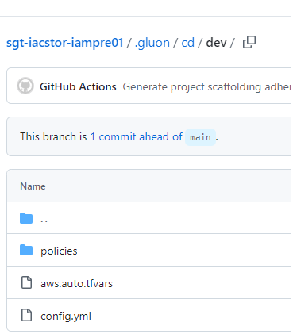

!!! info
    These tfvar and policies files are created by default when the IAM Component is created, and they always contain an example of the parameters needed to deploy IAM roles.
    Most of the time, these examples do not work with the data included there. This data must always be replaced with the real data that should be used for the deployment that wants to be done:<br>
    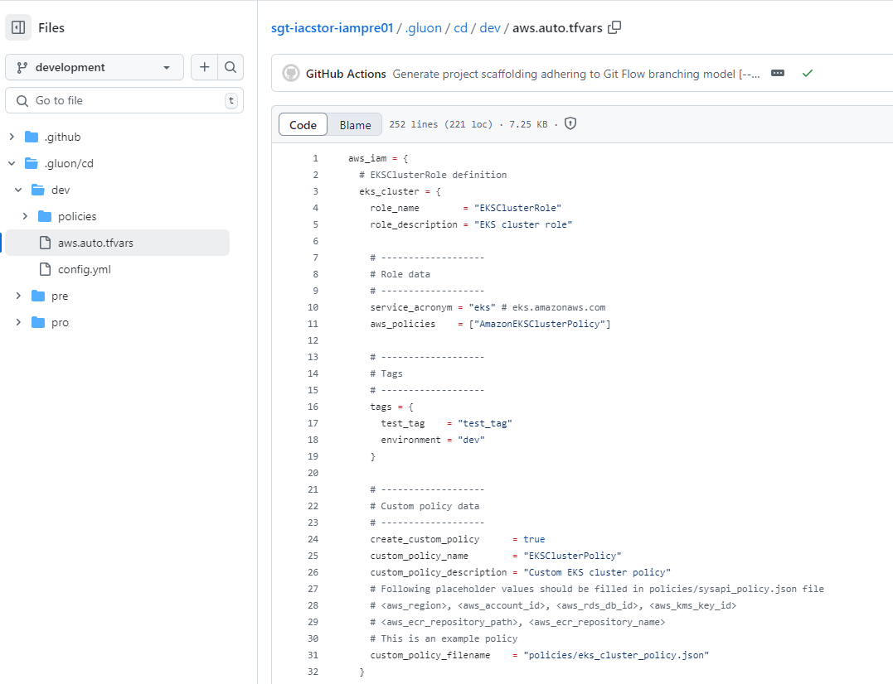<br>
    Policies:<br>
    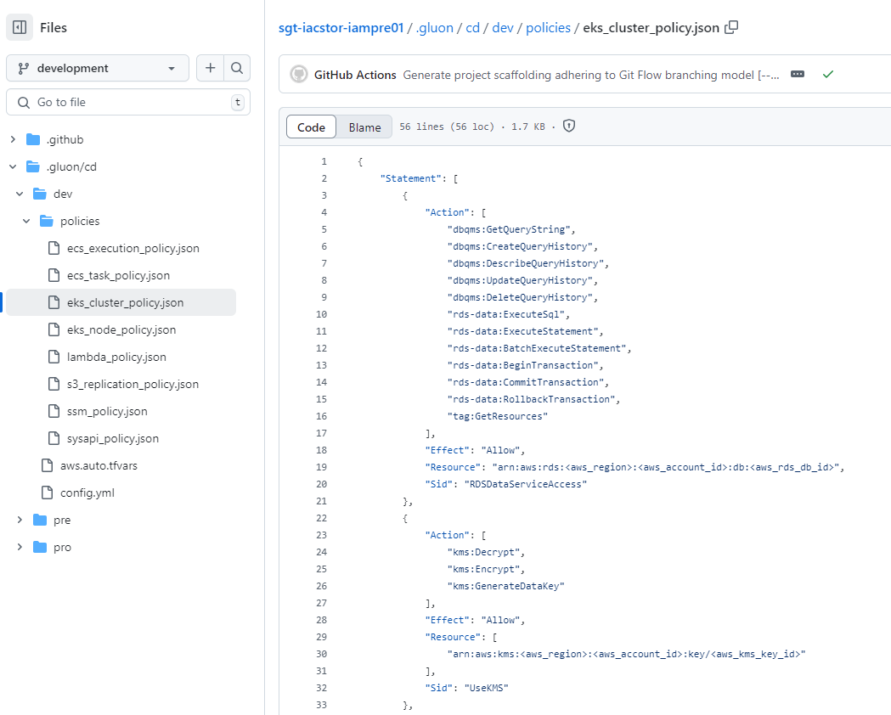

    In SLZ v3, the policy name should end with '_policy' due to an explicit deny policy.

Also, in the 'config.yml' file of the environment that wants to be used, must be set the archetype version to be used to deploy the IAM resources:

```yaml
iam_arch_version: "v1.0.0"
```

or

```yaml
iam_arch_version: "develop"
```

This file is created pointing to the latest version of the archetype by default, but this version can be changed in case this is not the version that wants to be used for the deployment.
If this file is deleted and is not present in the '.gluon/cd/<code>environment</code>' path, the archetype version to be used will also be the latest released version of the archetype.
In addition to this, a message will appear during the execution of the Terraform workflows to warn the user about this situation.

```yaml
"::warning :: iam_arch_version is not provided in the config.yml file for certification environment then, main branch will be used. Please provide the iam_arch_version in the config.yml file for selecting the specific version of the archetype."
```

## Available workflows

Once the component repository and the required configuration files have been properly set, the following Terraform workflows are available for each IAM component:

* [Terraform Plan](../../../../application/iac/terraform-workflows/terraform-plan.md)
* [Terraform Apply](../../../../application/iac/terraform-workflows/terraform-apply.md)
* [Terraform Destroy](../../../../application/iac/terraform-workflows/terraform-destroy.md)
* [Terraform List](../../../../application/iac/terraform-workflows/terraform-list.md)
* [Terraform State Import](../../../../application/iac/terraform-workflows/terraform-state-import.md)
* [Terraform State Remove](../../../../application/iac/terraform-workflows/terraform-state-remove.md)

In the links listed above, can be found the input parameters required for each one, as well as all the information about how to use them.
