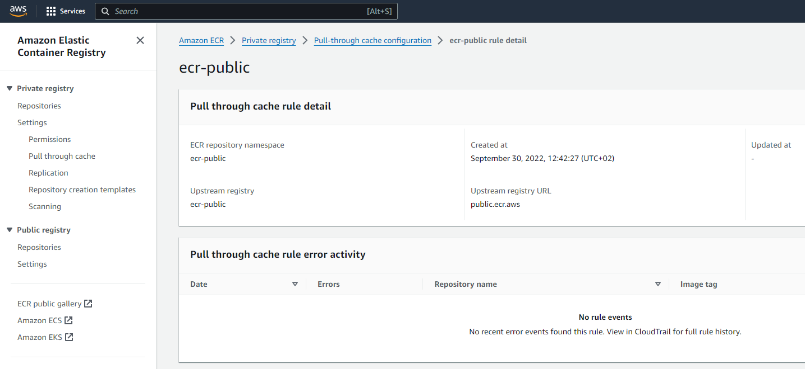
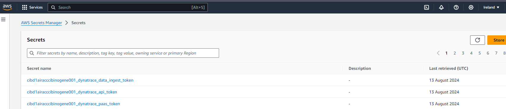
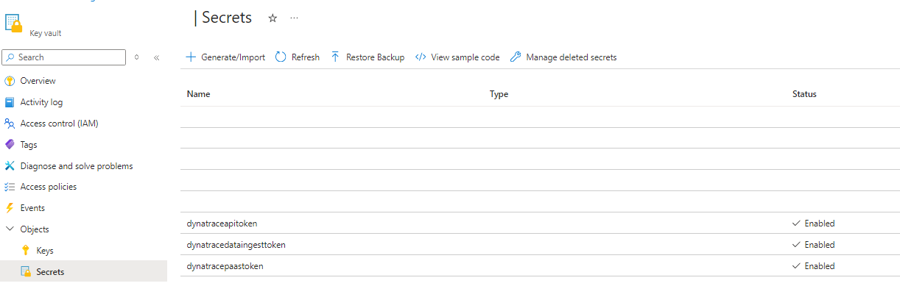
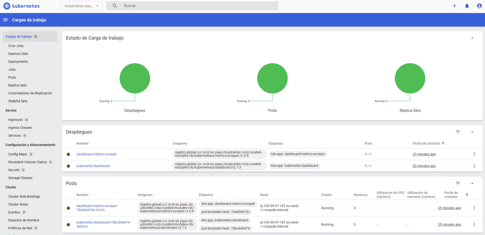

# Post - Configuration

## Introduction

Post-configuration tasks are essential steps that follow the creation of a Kubernetes cluster. These tasks ensure that the cluster is fully operational and tailored to meet the requirements.

Please, remember that every configuration from this page must be placed in the **config.yml** file placed in this path **.gluon/cd/{environment}/config.yml** under your Kubernetes component repository.
The file should have this base structure that will be described point by point in the next sections:

```yaml
kubernetes_arch_version: "<kubernetes_archetype_version>"
kubernetes_conf_version: "<kubernetes_postconfiguration_version>"

resources:
  eks_default:
      flavour_name: <flavour_name>
      flavour_params:
        <flavour_param_1>
        <flavour_param_2>
      plugins:
        <plugin_params>
  <tfvars_key>:
      flavour_name: <flavour_name>
      flavour_params:
        <flavour_param_1>
        <flavour_param_2>
```

!!! Warning
    Note that the key under the 'resources' section must be the key used on the tfvars (either aws, azure, or both). Example: 'eks_default'.

The main idea here is to have postconfiguration flavours defined with certain plugins to be able to use them easily out of the box. Just filling required parameters for predefined plugins of the flavour.

For example aws_default flavour will have Certificate, Dynatrace, Sysdig, Dashboard and AWS Load Balancer Controller plugins predefined so the user will provide required parameters by predefined plugins (flavour_params).

In case some falvour does not implement any plugin needed, there is a possibility to define them in "plugins" section of the "config.yml" file.
For example if selected flavour does not have Dynatrace plugin implemented inside, it could be added in "plugins" section. So every plugin should be used inside a flavour or from "plugins" section in "config.yml".

!!! info
    What is flavour: The definition of a set of default plugins.

!!! info
    What is a plugin: It can be as complex as a set of action that ends on a installation of an operator (like Dynatrace or Dashboard among others) or as simple as a creation of Kubernetes resources (like a Service, Role, Secrets, Namespaces...)

## Setup Blocks

Post-configuration is organized using flavours data and parameters to be able to consider different ways of setting up similar Kubernetes Clusters.

| Name | Description | Example Values |
|------|-------------|-----------------|
| kubernetes_arch_version | (Required) The version of the kubernetes archetype used. | "v1.1.0" |
| kubernetes_conf_version | (Required) The version of the kubernetes postconfiguration used. If you want to know more about postconf code check it out the [repository](https://github.com/santander-group-shared-assets/gln-iac-kubernetes-postconf) | "v1.2.0" |
| no_proxy | (Optional) Domains separated by comma that are not going to use any proxy. Only applies if you need to override the runner proxy configuration for postconf. | ".tlzproject.com,localhost,gsnet.corp,gsnetcloud.corp,cloudcenter.corp,cloud.corp,cloudstorage.corp,.corp,.bsch,.eks.amazonaws.com,azmk8s.io" |
| http_proxy | (Optional) URL of the proxy that manages communications, using an insecure protocol. Only applies if you need to override the runner proxy configuration for postconf. | "http://proxy.sig.umbrella.com:443" |
| https_proxy | (Optional) URL of the proxy that manages communications, using the secure SSL protocol. Only applies if you need to override the runner proxy configuration for postconf. | "http://proxy.sig.umbrella.com:443" |
| flavour_name | (Required) Base configurations name that define different ways of running the post-configuration, may change the required/optional features depending on the choice of a specific flavour. | aws_default |
| flavour_params | (Required) Base configurations parameters depending on the flavour. | cert_daemonset_image_init, cert_daemonset_image_pause, cert_custom_ca, enable_standard_dashboard, custom_dashboard_image, custom_metrics_scraper_image, dynatrace_set_host_group, dynatrace_paas_token_secret, dynatrace_api_token_secret, dynatrace_data_ingest_token_secret, sysdig_access_key_secret, sysdig_auth_token_secret, sysdig_api_token_secret, sysdig_ca_crt_secret, sysdig_tls_crt_secret, sysdig_tls_key_secret |
| plugins | (Optional) Each flavour allows you to configure predefined plugins directly like Cert, Dynatrace, Dashboard, Sysdig and AWS Load Balancer Controller in the case of aws_default flavour, but each of them can be configured by the user according to their needs, it can be included within the "plugins" section. | **[Plugins](#plugins)** |

## Flavours

These are the existing flavours.

* **[aws_default](#aws_default)**

### aws_default

This flavour contains the following features:

* Santander CA (**REQUIRED** for AWS EKS clusters): [CA](#SantanderCASupport).
* Dynatrace Operator (**REQUIRED**): [Dynatrace](#DynatraceOperator).
* Dashboard (**OPTIONAL**): [Dashboard](#Dashboard).
* Sysdig (**REQUIRED**): [Sysdig](#Sysdig).
* AWS Load Balancer Controller (**OPTIONAL**): [AWS Load Balancer Controller](#AWSLoadBalancerController).

#### Structure

This is the example structure of the config.yml for only one resource **tfvars_key_1**, using **aws_default** flavour and the flavour params for all the plugins defined in the aws_default flavour by default.
Uncommented params are required and the commented are optional.

```yaml
kubernetes_arch_version: "<kubernetes_archetype_version>"
kubernetes_conf_version: "<kubernetes_postconfiguration_version>"

# Only applies if you need to override the runner proxy configuration for postconf
# no_proxy: "<no_proxy>"
# http_proxy: "<http_proxy>"
# https_proxy: "<https_proxy>"

resources:
  tfvars_key_1:
    flavour_name: aws_default
    flavour_params:
      # Cert
      cert_daemonset_image_init: <aws_account_id>.dkr.ecr.eu-west-1.amazonaws.com/ecr-public/docker/library/bash:latest
      cert_daemonset_image_pause: <aws_account_id>.dkr.ecr.eu-west-1.amazonaws.com/ecr-public/eks-distro/kubernetes/pause:v1.21.14-eks-1-21-18
      # cert_custom_ca: H4sIALvnBWMAA+1Yyb...

      # Dynatrace
      dynatrace_set_host_group: "<dynatrace_host_group>"
      ### Please, provide AWS secrets manager names for the following secrets
      dynatrace_paas_token_secret: "<dynatrace_paas_token_secret_manager_name>"
      dynatrace_api_token_secret: "<dynatrace_api_token_secret_manager_name>"
      dynatrace_data_ingest_token_secret: "<dynatrace_data_ingest_token_secret_manager_name>"
      ### Uncomment the following lines to use custom dynatrace images
      # dynatrace_aws_operator_image: "<custom_operator_image_url>"
      # dynatrace_aws_oneagent_image: "<custom_oneagent_image_url>"
      # dynatrace_activegate_image: "<custom_activegate_image_url>"
      # dynatrace_api_url: "<custom_api_url>"
      # dynatrace_proxy: "<custom_proxy>"

      # Dashboard
      enable_standard_dashboard: true
      ### Uncomment the following lines to use custom dashboard and metrics scraper images
      # custom_dashboard_image: "<custom_dashboard_image_url>"
      # custom_metrics_scraper_image: "<custom_metrics_scraper_image_url>"

      # Sysdig
      ### Please, provide AWS secrets manager names for the following secrets
      sysdig_access_key_secret: "<postconf_sysdig_access_key_name>"
      sysdig_auth_token_secret: "<postconf_sysdig_auth_token_name>"
      sysdig_api_token_secret: "<postconf_sysdig_api_token_name"
      sysdig_ca_crt_secret: "<postconf_sysdig_ca_crt_name>"
      sysdig_tls_crt_secret: "<postconf_sysdig_tls_crt_name>"
      sysdig_tls_key_secret: "<postconf_sysdig_tls_key_name>"
      ### # Optional, Uncomment the following lines to use custom Sysdig values
      # sysdig_custom_values:
      #   region: "eu1"
      #   http_proxy: "http://proxy.sig.umbrella.com:443"
      #   https_proxy: "http://proxy.sig.umbrella.com:443"
      #   http_proxy_host: "proxy.sig.umbrella.com"
      #   http_proxy_port: 443
      #   no_proxy: "localhost,.svc,.corp.com,svc.cluster.local,180.0.0.0/8,172.20.0.0/16"
      #   ssl_verify_certificate: false
      #   image_registry: "registry.global.ccc.srvb.bo.paas.cloudcenter.corp/curated-modules-cib"
      #   agent_image_tag: "13.0.3"
      #   node_analyzer_runtime_scanner_image_tag: "1.6.10"
      #   node_analyzer_host_scanner_image_tag: "0.8.0"
      #   node_analyzer_kspm_analyzer_image_tag: "1.42.5"
      #   kspm_collector_image_tag: "1.38.5"
      #   admision_controller_webhook_image_tag: "3.9.41"

      # AWS Load Balancer Controller
      ### Optional, Uncomment the following lines to use custom chart values
      # custom_alb_chart_url: "<custom_alb_chart_url>"
      # custom_alb_chart_ref: "<custom_alb_chart_ref>"
      # custom_alb_chart_version: "<custom_alb_chart_version>"
      # custom_alb_controller_image: "<custom_alb_controller_image>"

    ## This is just an example of how a plugin can be defined. You can delete it!
    # plugins:
    #   service:
    #     - name: "test-nlb"
    #       namespace: "default"
    #       annotations:
    #         service.beta.kubernetes.io/aws-load-balancer-type: "nlb"
    #         service.beta.kubernetes.io/aws-load-balancer-scheme: "internal"
    #         service.beta.kubernetes.io/aws-load-balancer-subnets: subnet-05f24bf7589748005,subnet-068e368e6c7dd46aa
    #         service.beta.kubernetes.io/aws-load-balancer-ssl-cert: arn:aws:acm:eu-west-1:<aws_account_id>:certificate/xxxxxxx-4ac7-a350-yyyyyyyy
    #         service.beta.kubernetes.io/aws-load-balancer-backend-protocol: "tcp"
    #         service.beta.kubernetes.io/aws-load-balancer-ssl-ports: "443"
    #       specs:
    #         type: LoadBalancer
    #         ports:
    #           - name: "https"
    #             port: 443
    #             targetPort: 8443
    #             protocol: TCP
    #         selector:
    #           app: kubernetes-dashboard
```

## Prerequisites

To be able to access the registry of images that are going to be used in plugin deployments, be aware of firewall rules needed.

## Plugins

As it is mentioned before, plugins are defined by default inside flavours or it can be defined as needed in "plugins" section. Take a look to available plugins and parameters needed for their execution or customization.

!!! info
    Each plugin is defined internally as an ansible role, so throughout the next sections there may be references to plugins such as roles.

!!! warning
    Pay attention to pamarameter used in plugins, they are similar to the parameters used in flavours but no the same.

!!! warning
    Next plugin code examples must go under "plugins" parameters in "config.yml" file.

<a name = "SantanderCASupport"></a>

### Santander CA Support

Role responsible for distributing the necessary certificates to be able to access the private registry (CCC) through a daemonset. This is required for other configurations in this postconf to be able to retrieve docker images from .corp repositories.

First the secret is created with the CA certificates (compressed in a zip file) within the cluster, then the DaemonSet is created for each cloud provider (AWS and Azure) that mounts the certificates on the nodes.

#### Prerequisites

!!! note
    For Azure Clusters, this feature does **NOT** have to be specified as the daemonset installation is done with images pulled directly from mcr.microsoft.com.

For AWS Clusters, in order to be able to get the images without error, they must be uploaded in the account's ECR of the project that is going to be used. This can be achieved in two ways:

<ul>
  <li><strong>Create a private repository in the Account's ECR and upload bash and pause images.</strong> Then get the uri and set those up into the config.yml.
  <li><strong>In AWS Web Console, create a "Pull through cache" alias under Private Registry with the following configuration:</strong><br>
</ul>

  

!!! warning
    Note that the *ecr:BatchImportUpstreamImage* permission is needed in the EKSNodeRole in order to grant permission to retrieve the external image and import into your private registry.

#### Required Inputs

| Name | Description |
|:---:|:---:|
| daemonset_image_init | Bash image needed to run the AWS daemonset. |
| daemonset_image_pause | Pause image needed to run the AWS daemonset. |

#### Optional Inputs

| custom_ca | CA Certificate to verify the authenticity for a secure communication. | default_ca_cert defined in cert plugin defaults. |

#### Structure

```yaml
      cert:
        # Required parameters
        daemonset_image_init: 173280323207.dkr.ecr.eu-west-1.amazonaws.com/ecr-public/docker/library/bash:latest
        daemonset_image_pause: 173280323207.dkr.ecr.eu-west-1.amazonaws.com/ecr-public/eks-distro/kubernetes/pause:v1.21.14-eks-1-21-18
        # Optional parameter
        # custom_ca: H4sIALvnBWMAA+1YybKDRrL1mq/wnujHIJBgWcU8D...
```

<a name = "DynatraceOperator"></a>

### Dynatrace Operator

Role responsible for being able to integrate cluster with Dynatrace tenant. Both metrics and pod logs are sent to Dynatrace. Kubernetes monitoring is not enabled by default so this configuration is **REQUIRED** for every cluster.

Note that Agent needs some information that can be obtained from **Backup & Monitoring Team** (see Inputs).<br>
You will also need to provide your AWS account ID to that team so they can integrate Dynatrace with the account.

Once you have the three tokens called:

* paas_token
* api_token
* data_ingest_token

In AWS, Three Secrets Manager must be created, each containing the corresponding token.

In Azure, Three secrets must be created in a Key Vault, each containing the corresponding token.

It is possible to determine the Key Vault to search for secrets in three different ways:

* Specifying <code>az_keyvault_uri</code> parameter within this flavour_params.
* Specifying <code>az_keyvault_name</code> parameter within this flavour_params.
* Don't specify anything, so default Key Vault created in the project workload will be used.

#### Required Inputs

| Name | Description |
|:---:|:---:|
| set_host_group | Host group given by Backup&Monitoring Team. |
| paas_token_secret | Name of the created secret either in AWS in the Secret Manager or in Azure in the Key Vault with the Paas Token given by Backup&Monitoring Team. |
| api_token_secret | Name of the created secret either in AWS in the Secret Manager or in Azure in the Key Vault with the Api Token given by Backup&Monitoring Team. |
| data_ingest_token_secret | Name of the created secret either in AWS in the Secret Manager or in Azure in the Key Vault with the Data Ingest Token given by Backup&Monitoring Team. |

#### Optional Inputs

| Name | Description | Default |
|:---:|:---:|:---:|
| custom_akv_uri | Custom Key Vault URI used to search secrets with tokens. |default Key Vault created in the project workload will be used|
| custom_akv_name | Custom Key Vault Name used to search secrets with tokens. |default Key Vault created in the project workload will be used|
| custom_chart_url | Custom Helm Chart Operator URL. |""|
| custom_chart_version | Custom Helm Chart Operator Version. |""|
| custom_chart_ref | Custom Helm Chart Operator Reference. |""|
| aws_custom_operator_image | Custom AWS Operator Image. |"registry.global.ccc.srvb.bo.paas.cloudcenter.corp/curated-modules-cib/dynatrace/dynatrace-operator:v4.0.1"|
| az_custom_operator_image | Custom Azure Operator Image. |"registry.global.ccc.srvb.bo.paas.cloudcenter.corp/curated-modules-cib/dynatrace/dynatrace-operator:v4.0.1"|
| aws_custom_oneagent_image | Custom AWS OneAgent Image. |"registry.global.ccc.srvb.bo.paas.cloudcenter.corp/curated-modules-cib/dynatrace/oneagent:latest"|
| az_custom_oneagent_image | Custom AWS OneAgent Image. |"registry.global.ccc.srvb.bo.paas.cloudcenter.corp/curated-modules-cib/dynatrace/oneagent:latest"|
| custom_activegate_image | Custom ActiveGate Image. |"registry.global.ccc.srvb.bo.paas.cloudcenter.corp/curated-modules-cib/dynatrace/activegate:latest"|
| custom_api_url | Custom Dynatrace apiUrl. |"<https://zwk60401.live.dynatrace.com>"|
| custom_proxy | Custom Dynatrace proxy. |"<http://proxy.sig.umbrella.com:443>"|

#### Structure

```yaml
      dynatrace:
        set_host_group: AW.CIB.INNOVA.DEV
        paas_token_secret: "cibd1airacccibinogene001_dynatrace_paas_token"
        api_token_secret: "cibd1airacccibinogene001_dynatrace_api_token"
        data_ingest_token_secret: "cibd1airacccibinogene001_dynatrace_data_ingest_token"
```

<a name = "Dashboard"></a>

### Dashboard

The Dashboard tool is a web-based Kubernetes user interface with which it's possible to deploy containerized applications to a Kubernetes cluster, troubleshoot your containerized application, and manage the cluster resources.

It is also used to get an overview of the applications running on your cluster, as well as to create or modify individual Kubernetes resources (such as Deployments, Jobs, DaemonSets, etc).
To be able to install the Dashboard, it has been used a recommended template based on Dashboard Github repository to deploy needed resources.
<https://raw.githubusercontent.com/kubernetes/dashboard/v2.7.0/aio/deploy/recommended.yaml>

#### How to access dashboard

To be able to access to the feature, a kubeconfig file or a token is needed.

To get a token, Dashboard feature creates by default a Service Account, Secret and Role Binding to finally save a useful token to access to Dashboard. This token will be saved in the Secret Manager and the name of the secret will be <kubernetes_cluster_name>-k8s-dashboard-user-token'

1. **Service Account**: A Service Account provides an identity for processes that run in a Pod.

2. **Secret**: The Secret created by Kubernetes for a Service Account contains a token that the processes in the Pod can use to authenticate themselves to the Kubernetes API.

3. **ClusterRoleBinding**: A ClusterRoleBinding grants the permissions defined in a ClusterRole to a user, group, or Service Account.
In the case of a `cluster-read-only` role, the ClusterRoleBinding would grant the Service Account the permission to read resources in the cluster but not modify them.

To access the UI, follow [official documentation](https://kubernetes.io/docs/tasks/access-application-cluster/web-ui-dashboard/#accessing-the-dashboard-ui).



#### Required Inputs

| Name | Description |
|:---:|:---:|

#### Optional Inputs

| Name | Description | Default |
|:---:|:---:|:---:|
| enable_standard_dashboard | Enables the installation of the standard Dashboard | true |
| custom_dashboard_image | URL of the dashboard image to be used in the deployments. | registry.global.ccc.srvb.bo.paas.cloudcenter.corp/curated-modules-cib/kubernetesui/dashboard:v2.7.0 |
| custom_metrics_scraper_image | URL of the metrics scraper image to be used in the deployments. | registry.global.ccc.srvb.bo.paas.cloudcenter.corp/curated-modules-cib/kubernetesui/metrics-scraper:v1.0.8 |

#### Structure

If no custom parameter are going to be added but we want to install dashboard it should be defined as empty dict as it appear in the example.

```yaml
      dashboard: {}
        # custom_dashboard_image: "registry.global.ccc.srvb.bo.paas.cloudcenter.corp/curated-modules-cib/kubernetesui/dashboard:v2.7.0"
        # custom_metrics_scraper_image: "registry.global.ccc.srvb.bo.paas.cloudcenter.corp/curated-modules-cib/kubernetesui/metrics-scraper:v1.0.8"
```

<a name = "Sysdig"></a>

### Sysdig

Sysdig is a monitoring, security, and troubleshooting platform designed for containerized environments and Kubernetes.
It provides deep, granular visibility into the behavior of applications running in containers, enabling DevOps and security teams to observe key metrics, logs, and security events in real time.
Specifically for Kubernetes, Sysdig offers features such as:

1. **Performance Monitoring**: It provides detailed metrics for containers, nodes, pods, and services within Kubernetes. This helps users identify performance issues and optimize resource usage.

2. **Security Incident Detection and Response**: Sysdig integrates security rules to detect suspicious activities and potential threats within the Kubernetes environment. This allows teams to quickly respond to security incidents.

3. **Troubleshooting**: With detailed logs and system activity, Sysdig allows for quick identification of issues, reducing the time spent on troubleshooting complex container-based applications.

4. **Compliance and Policy Enforcement**: Sysdig can enforce compliance policies and ensure that Kubernetes deployments meet required standards, by providing continuous security and compliance monitoring.

Overall, Sysdig helps to improve the visibility, security, and operational efficiency of Kubernetes clusters, making it easier to manage complex containerized workloads.

#### Prerequisites

Sysdig operator requires a t3.medium machine or larger for optimal performance.

#### Required Inputs

| Name | Description |
|:---:|:---:|
| access_key_secret | Sysdig access key secret name saved in AWS Secret Manager. Value saved in base64 |
| auth_token_secret | Sysdig auth token secret name saved in AWS Secret Manager. Value saved in base64|
| api_token_secret | Sysdig API token secret name saved in AWS Secret Manager. Same value as auth_token_secret. Value saved in base64|
| ca_crt_secret | CA certificate secret name saved in AWS Secret Manager. |
| tls_crt_secret | TLS certificate secret name saved in AWS Secret Manager. |
| tls_key_secret | TLS key secret name saved in AWS Secret Manager.|

#### Optional Inputs

| Name | Description | Default |
|:---:|:---:|:---:|
| custom_values | Sysdig Helm Chart custom values object. | {} |
| custom_values.region | Region to deploy. | "eu1" |
| custom_values.http_proxy | Proxy to redirect http traffic | "http://proxy.sig.umbrella.com:443" |
| custom_values.https_proxy | Proxy to redirect https traffic | "http://proxy.sig.umbrella.com:443" |
| custom_values.http_proxy_host | Proxy host definition | "proxy.sig.umbrella.com" |
| custom_values.http_proxy_port | Proxy port | 443 |
| custom_values.no_proxy | domains and IPs that that are not going to use proxy | "localhost,.svc,.corp.com,svc.cluster.local,180.0.0.0/8,172.20.0.0/16" |
| custom_values.ssl_verify_certificate | Define id ssl certification validation is needed | false |
| custom_values.image_registry | Image registry where images defined in Helm Chart are going to be get  | "registry.global.ccc.srvb.bo.paas.cloudcenter.corp/curated-modules-cib" |
| custom_values.agent_image_tag | Agent image version | "13.0.3" |
| custom_values.node_analyzer_runtime_scanner_image_tag | Node analyzer runtime scanner image version. | "1.6.10" |
| custom_values.node_analyzer_host_scanner_image_tag | Node analyzer host scanner image version. | "0.8.0" |
| custom_values.node_analyzer_kspm_analyzer_image_tag | Node analyzer kspm analyzer image version. | "1.42.5" |
| custom_values.kspm_collector_image_tag | kspm collector image version. | "1.38.5" |
| custom_values.admision_controller_webhook_image_tag | admission controller webhook image version. | "3.9.41" |

#### Structure

```yaml
      sysdig:
        access_key_secret: "postconf_test_sysdig_access_key"
        auth_token_secret: "postconf_test_sysdig_auth_token"
        api_token_secret: "postconf_test_sysdig_api_token"
        ca_crt_secret: "postconf_test_sysdig_ca_crt"
        tls_crt_secret: "postconf_test_sysdig_tls_crt"
        tls_key_secret: "postconf_test_sysdig_tls_key"
        # Optional parameters
        custom_values:
          region: "eu1"
          http_proxy: "http://proxy.sig.umbrella.com:443"
          https_proxy: "http://proxy.sig.umbrella.com:443"
          http_proxy_host: "proxy.sig.umbrella.com"
          http_proxy_port: 443
          no_proxy: "localhost,.svc,.corp.com,svc.cluster.local,180.0.0.0/8,172.20.0.0/16"
          ssl_verify_certificate: false
          image_registry: "registry.global.ccc.srvb.bo.paas.cloudcenter.corp/curated-modules-cib"
          agent_image_tag: "13.0.3"
          node_analyzer_runtime_scanner_image_tag: "1.6.10"
          node_analyzer_host_scanner_image_tag: "0.8.0"
          node_analyzer_kspm_analyzer_image_tag: "1.42.5"
          kspm_collector_image_tag: "1.38.5"
          admision_controller_webhook_image_tag: "3.9.41"
```

<a name = "AWSLoadBalancerController"></a>

### AWS Load Balancer Controller

The AWS Load Balancer Controller is a controller that integrates with Amazon Elastic Kubernetes Service (EKS) and Kubernetes clusters running on AWS.
It manages the provisioning and lifecycle of AWS Elastic Load Balancers (ELBs), including Application Load Balancers (ALBs) and Network Load Balancers (NLBs), to expose Kubernetes services to the internet or internal networks.

Key Features:

1. **Automatic Load Balancer Provisioning**: The controller automatically creates and configures ALBs and NLBs based on the specifications provided in Kubernetes Service objects.
This simplifies the process of exposing Kubernetes applications to external or internal clients.

2. **Support for Annotations**: Users can customize the behavior of the load balancers by adding specific annotations to Kubernetes services.
These annotations enable advanced configurations such as SSL termination, sticky sessions, cross-zone load balancing, and more.

3. **Integration with EKS**: The controller is designed to work seamlessly with Amazon EKS, providing a managed solution for load balancing in Kubernetes environments on AWS.

#### Required Inputs

| Name | Description |
|:---:|:---:|

#### Optional Inputs

| Name | Description | Default |
|:---:|:---:|:---:|
| custom_alb_chart_url | AWS Load Balancer Helm Chart URL | "https://registry.global.ccc.srvb.bo.paas.cloudcenter.corp/chartrepo/curated-modules-cib" |
| custom_alb_chart_ref | AWS Load Balancer Helm Chart reference | eks-alb/aws-load-balancer-controller |
| custom_alb_chart_version | AWS Load Balancer Helm Chart version | "1.6.2" |
| custom_alb_controller_image | AWS Load Balancer Controller image | "<code>aws_account_id</code>.dkr.ecr.<code>aws_region</code>.amazonaws.com/ecr-public/eks/aws-load-balancer-controller" |

#### Structure

If no custom parameter are going to be added but we want to install alb it should be defined as empty dict as it appear in the example.

```yaml
      alb: {}
        #   custom_alb_chart_url: "https://registry.global.ccc.srvb.bo.paas.cloudcenter.corp/chartrepo/curated-modules-cib"
        #   custom_alb_chart_ref: "eks-alb/aws-load-balancer-controller"
        #   custom_alb_chart_version: "1.6.2"
        #   custom_alb_controller_image: "<aws_account_id>.dkr.ecr.<aws_region>.amazonaws.com/ecr-public/eks/aws-load-balancer-controller"
```

#### NLB Use case

To deploy Network Load Balancers (NLBs) in a Kubernetes cluster, the AWS Load Balancer Controller is necessary because it interprets and processes the Service objects with specific annotations that define the NLB configuration. Here's how it works:

Service Type: To create an NLB, you need to specify the service type as LoadBalancer in your Kubernetes Service manifest. This tells the AWS Load Balancer Controller to provision a Network Load Balancer for that service.

!!! info
      Service plugin can be call more than once to create as much as needed services, that is why is defined as a list.

This piece of code should go under plugins parameter:

```yaml
    service:
      - name: "test-nlb"
        namespace: "default"
        annotations:
          service.beta.kubernetes.io/aws-load-balancer-type: "nlb"
          service.beta.kubernetes.io/aws-load-balancer-scheme: "internal"
          service.beta.kubernetes.io/aws-load-balancer-subnets: subnet-05f24bf7589748005,subnet-068e368e6c7dd46aa
          service.beta.kubernetes.io/aws-load-balancer-ssl-cert: arn:aws:acm:eu-west-1:<aws_account_id>:certificate/xxxxxxx-4ac7-a350-yyyyyyyy
          service.beta.kubernetes.io/aws-load-balancer-backend-protocol: "tcp"
          service.beta.kubernetes.io/aws-load-balancer-ssl-ports: "443"
        specs:
          type: LoadBalancer
          ports:
            - name: "https"
              port: 443
              targetPort: 8443
              protocol: TCP
          selector:
            app: kubernetes-dashboard
```

The controller relies on annotations to apply specific configurations to the NLB. For example:

* service.beta.kubernetes.io/aws-load-balancer-type: "nlb":
Specifies that a Network Load Balancer should be created instead of an Application Load Balancer.

* service.beta.kubernetes.io/aws-load-balancer-internal: "true":
Configures the NLB to be internal (private), meaning it will not be accessible from the public internet. This is useful for internal services that should only be accessible within your VPC.

* service.beta.kubernetes.io/aws-load-balancer-subnets:
Specifies which subnets the NLB should be deployed in. This allows you to control where the load balancer is created within your VPC. The subnets should be listed by their IDs, separated by commas.

* service.beta.kubernetes.io/aws-load-balancer-ssl-cert:
Indicates the Amazon Resource Name (ARN) of an SSL certificate stored in AWS Certificate Manager (ACM). This is used for enabling SSL termination on the NLB, allowing it to handle HTTPS traffic.

* service.beta.kubernetes.io/aws-load-balancer-ssl-ports: "443":
Specifies which ports should use the SSL certificate for encrypted traffic. In this example, port 443 (HTTPS) is configured for SSL termination.

* service.beta.kubernetes.io/aws-load-balancer-backend-protocol: "tcp":
Defines the protocol used between the load balancer and the backend services (pods). In this case, tcp is used, which is typical for NLBs. You can use http or https for ALBs, but NLBs typically stick with TCP due to their lower-level networking focus.

These annotations allow fine-grained control over how the NLB behaves. Without the AWS Load Balancer Controller, Kubernetes clusters running on AWS would not be able to automatically provision NLBs based on Service specifications.
