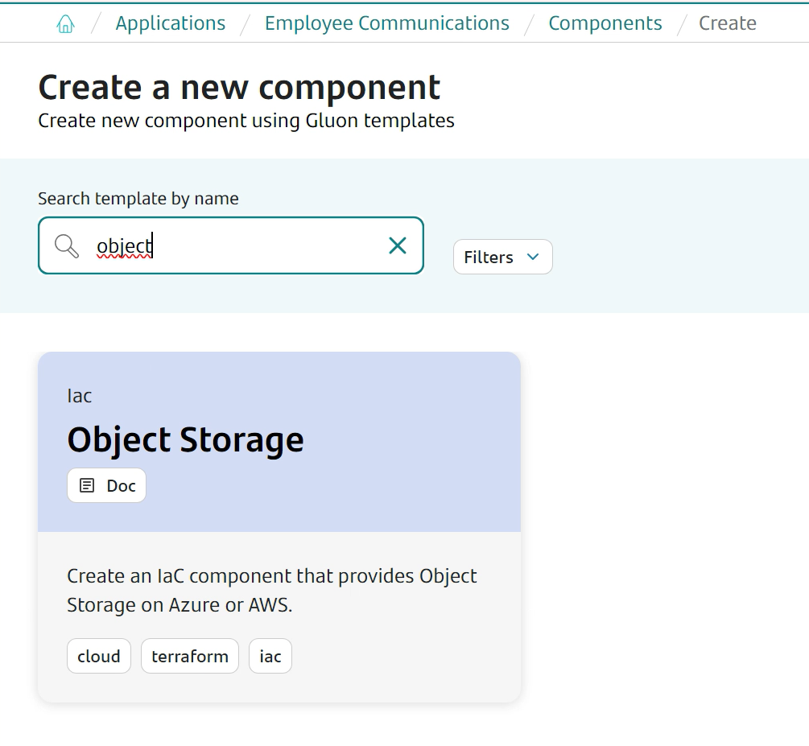
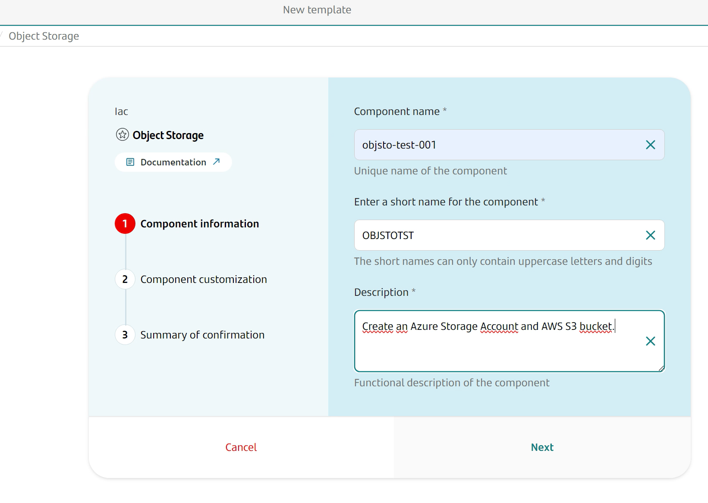
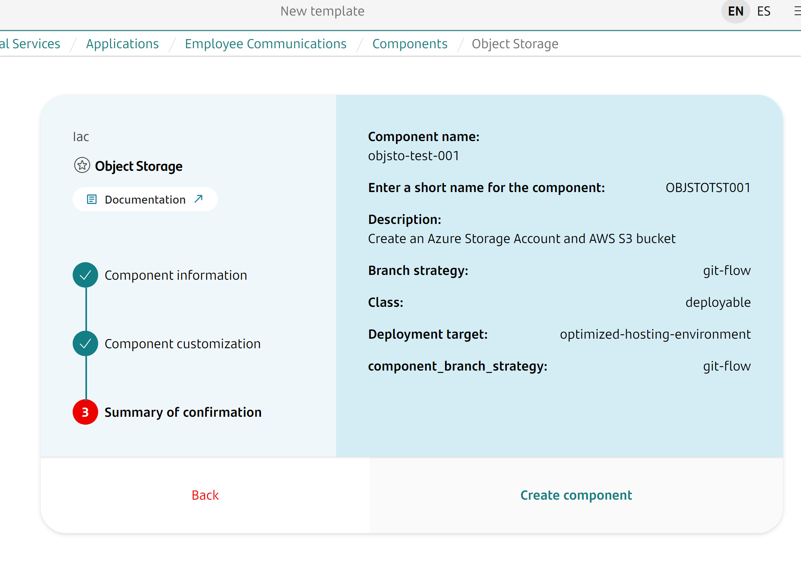
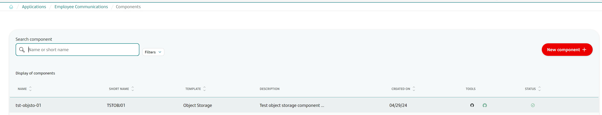
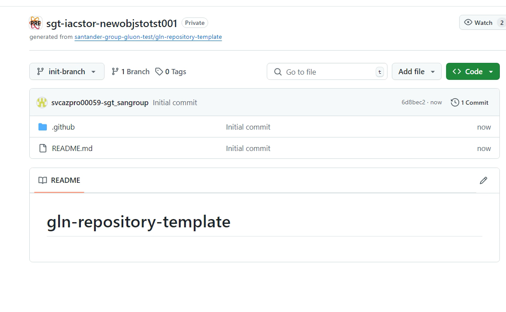
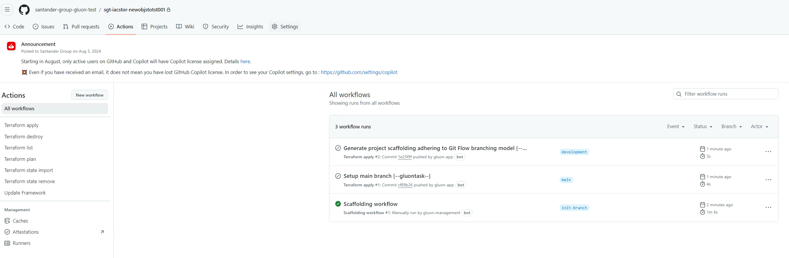
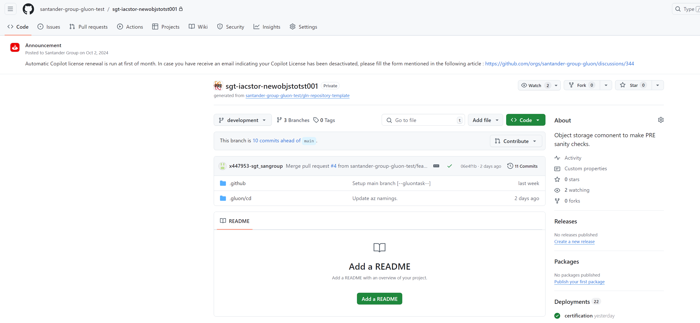
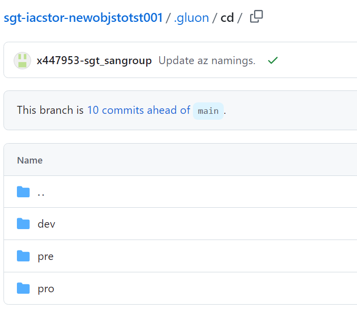
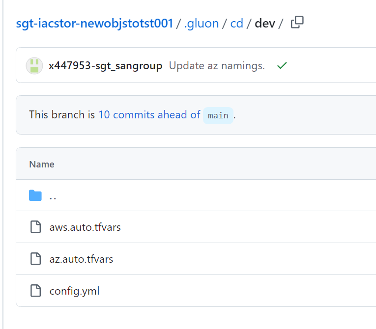
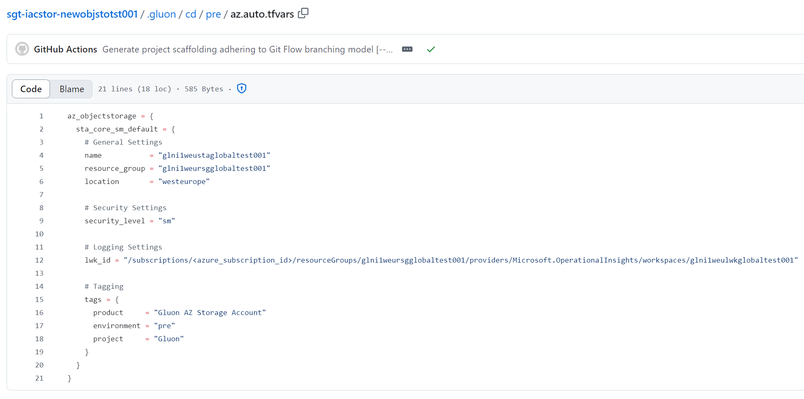

# Object Storage Journey

## Introduction

The purpose of this documentation is to provide a step-by-step guide on how to deploy an Object Storage component on the GLUON platform, as well as explain the tools available on each Object Storage component and how to use them.

!!! note
    This component can be used by any team member of an application, being that application allowed to deploy Object Storage Components.

## What is Object Storage?

Object storage is a technology that stores and manages data in an unstructured format called objects. Modern organizations create and analyze large volumes of unstructured data such as photos, videos, email, web pages, sensor data, and audio files.
Cloud object storage systems distribute this data across multiple physical devices but allow users to access the content efficiently from a single, virtual storage repository.
Object storage solutions are ideal for building cloud native applications that require scale and flexibility, and can also be used to import existing data stores for analytics, backup, or archive.
The IaC Object Storage component was created for the teams that require to use an Object Storage solution in AWS or Azure.
This component allows the provisioning and configuration of the AWS and Azure Object storage service with full compliance with Cloud Security Control Framework.

## How to create an Object Storage component in Gluon

In order to create a new Object Storage component in the Gluon platform, the next steps must be followed:

* Once logged in the Gluon portal, the first thing that needs to be done is to ensure that the **Company** that we're using is the one that wants to be used to deploy the Object Storage Component:<br>
  

* Now, select **Applications**, to see all the available applications within this company:<br>
  

* Choose the desired application and select the **Components** option from the menu located on the left side of the screen:<br>
  

* Click on **New Component**:<br>
  

* Search for **Object Storage** component and click on it:<br>
  

* Fill the template and press **next** button:<br>
  

* Click on 'next' again and in the following step, a summary of the component creation request will be shown. Once checked and if everything is correct, click on **Create Component**:<br>
  

* We will see the component created in the **Component Page** and a pop-up will appear in the lower right corner of the screen stating that the component was successfully created:<br>
  

* Click on the Github icon to see the newly created repository for the Object Storage component:<br>
  

* The new repository only contains an 'init-branch' that must be used by the 'Scaffolding' workflow to initialize the repository: <br>
  

This workflow should be automatically launched on create, but sometimes it gets stuck. So, click on the Github Actions executions to check this. If the workflow was not run, it can be manually started: <br>
  

* Once the workflow execution is done, if we go back to the 'code' section of the repository, we will now see the 'main' branch and the repository will be ready to be used. <br>
  

## Component configuration

Once the Object Storage component repository has been created and initialized, some extra configurations must be done in order to make the Terraform workflows work in the newly created component.
For this, we must follow the step-by-step guide of the [Component Pre-requisites](../../../../application/iac/terraform-workflows/component-prerequisites.md) section.
The Object Storage component does not need more configuration than the one described on this section.

In summary, the <u><strong>requirements</strong></u> in order to be able to use the Terraform Workflows in the Object Storage component are:
<ul>
  <li><strong>To have set the PG_CREDENTIALS</strong> secret as organization secret in the newly created component repository. As these are organization secrets, it is very likely that the used organization already has them.
  Please check this before requesting them, since if they're already set, it is not needed to request the addition of these secrets again.
  <li><strong>To have set the IAC_CREDENTIALS_<code>environment</code></strong> secrets as repository secrets in the newly created component repository.
  This is always required, since here the information about the provider that wants to be used for deployment is set and this information is different for each application.
  <li><strong>To have set the Environments protection rules</strong> in the newly created component repository to be able to approve the workflows runs on that environment.
</ul>

!!! warning
    Please, note that if only the Azure part wants to be deployed, the secrets needed are only the Azure ones. This also applies to the AWS part. If both providers should be used, the secrets for both providers would be required.

## Parameters to create an Object Storage resource

All the information about what parameters can be used to deploy an Object Storage resource, how to use them or how to build a specific configuration are in the [Cloud Provider](./cloud-provider/index.md) section.
Here all the information about the parameters that can be used to deploy an Object Storage resource can be found for both providers, Azure and AWS.

In addition to this, please note that all the tfvars files that must be updated to deploy Object Storage resources are located in the '.gluon/cd/<code>environment</code>' path of the created Object Storage component:<br>


Where <code>environment</code> can be: 'dev', 'pre' or 'pro' and this will define the environment where the resource wants to be deployed.
So, in case that the deployment wants to be done on the 'dev' environment, the tfvar files that have to be updated are:
<ul>
<li><strong>.gluon/cd/dev/aws.auto.tfvars</strong> if the AWS provider wants to be used.
<li><strong>.gluon/cd/dev/az.auto.tfvars</strong> if the Azure provider wants to be used.
</ul>


!!! info
    These tfvar files are created by default when the Object Storage Component is created, and they always contain an example of the parameters needed to deploy a basic and default resource for that component and that provider.
    Most of the time, these examples do not work with the data included there. This data must always be replaced with the real data that should be used for the deployment that wants to be done.
    

Also, in the 'config.yml' file of the environment that wants to be used, must be set the archetype version to be used to deploy the Object Storage resources:

```yaml
objectstorage_arch_version: "v1.0.0"
```

or

```yaml
objectstorage_arch_version: "develop"
```

This file is created pointing to the latest version of the archetype by default, but this version can be changed in case this is not the version that wants to be used for the deployment.
If this file is deleted and is not present in the '.gluon/cd/<code>environment</code>' path, the archetype version to be used will also be the latest released version of the archetype.
In addition to this, a message will appear during the execution of the Terraform workflows to warn the user about this situation.

```yaml
"::warning ::objectstorage_arch_version is not provided in the config.yml file for certification environment then, main branch will be used. Please provide the objectstorage_arch_version in the config.yml file for selecting the specific version of the archetype."
```

## Available workflows

Once the component repository and the required configuration files have been properly set, the following Terraform workflows are available for each Object Storage component:

* [Terraform Plan](../../../../application/iac/terraform-workflows/terraform-plan.md)
* [Terraform Apply](../../../../application/iac/terraform-workflows/terraform-apply.md)
* [Terraform Destroy](../../../../application/iac/terraform-workflows/terraform-destroy.md)
* [Terraform List](../../../../application/iac/terraform-workflows/terraform-list.md)
* [Terraform State Import](../../../../application/iac/terraform-workflows/terraform-state-import.md)
* [Terraform State Remove](../../../../application/iac/terraform-workflows/terraform-state-remove.md)

In the links listed above, can be found the input parameters required for each one, as well as all the information about how to use them.

!!! info
    For components created before Gluon [v4.3.0](https://san-sgt-basic.atlassian.net/wiki/spaces/GLNPLTFRM/pages/744882638/GLUON+v4.3.0), in order to use the new terraform state import and remove workflows, it would be needed to add them manually.
