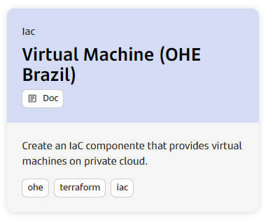
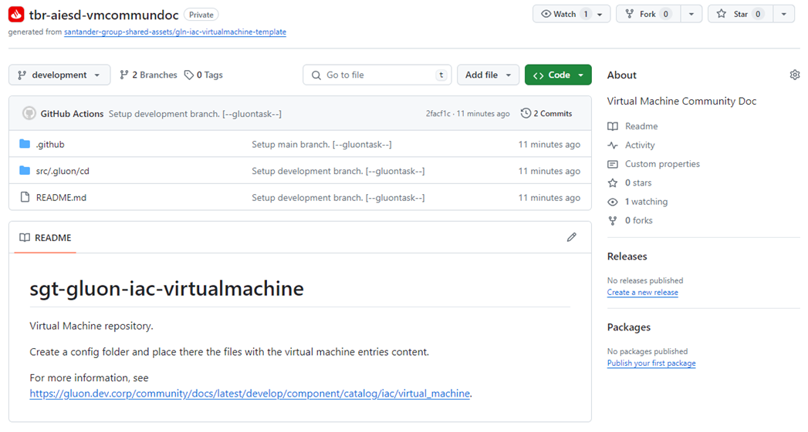
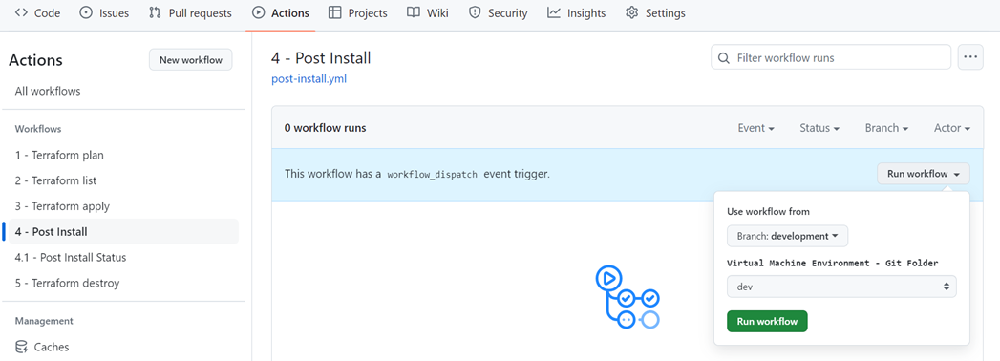
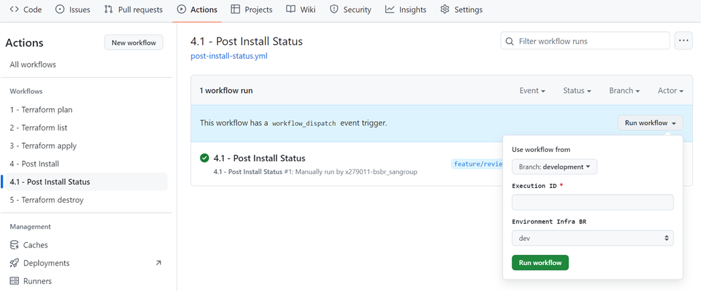
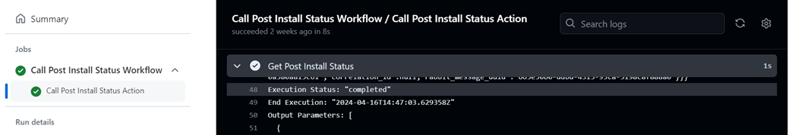

## Introduction

The purpose of this documentation is to provide a *step-by-step guide* on how to deploy a *Virtual Machine* component on the GLUON platform, as well as explain the tools available on each Virtual Machine component and how to use them.

??? Info

    In version 4.0 of Gluon, only the creation of Virtual Machines in the private cloud (OHE) in Brazil is available.

## Create Component

### Gluon Portal

First you have to [**onboard your application.**](../../../..//index.md)
Once you have your application created, you can start creating your component.

To create a component, follow the steps described in [**Componnet Management**](../../../../application/component-management/create-component.md), searching for the component to be created.

You have to select the type of component you want to create, in this case you are going to create a **Virtual Machine (OHE Brazil)**.

  

???+ Remember

    To follow the naming convention visit [Repository Naming Convention](../../../../application/component-management/create-component.md#repository-naming-convention).


??? warning "Virtual Machine Types"

    In version 4.0 of Gluon, you will not be able to customize Virtual Machine parameters..


??? warning " Availability Zone and Network Tier "

The Availability Zone and Network Tier values in the form are valid only for the Production environment.
For Development and Homologation environments, the Availability Zone will be automatically calculated based on the availability of the Data Center and the Network Tier will always be “Tier 2 – Safe”.

Once the component is created you will be able access it into the component list, where you can find a direct link to the GitHub repository.


### Virtual Machine template

#### Branches

When you create the component from the Gluon Portal, the component is created with the default values of the template the scaffolding workflow.

* Creates a **main** branch which contains just the workflow file for the created component.
* Creates a **development** branch with an initial structure and content for a Virtual Machine.



#### Structure

The generated Namespaces has a structure similar to the following:

``` bash
📂.github
 ┣ 📂workflows
 ┃ ┗ apply.yml
 ┃ ┗ destroy.yml
 ┃ ┗ list.yml
 ┃ ┗ plan.yml
 ┃ ┗ post-install-status.yml
 ┃ ┗ post-install.yml
 ┗ 📜CODEOWNERS
 📂src/.gluon/cd
 ┣ 📂dev
 ┃ ┣ 📂.controller
 ┃ ┃ ┗ 📜CODEOWNERS
 ┃ ┗ 📜config.yml
 ┃ ┗ 📜values.yml
 ┣ 📂pre
 ┃ ┣ 📂.controller
 ┃ ┃ ┗ 📜CODEOWNERS
 ┃ ┗ 📜config.yml
 ┃ ┗ 📜values.yml
 ┣ 📂pro
 ┃ ┣ 📂.controller
 ┃ ┃ ┗ 📜CODEOWNERS
 ┃ ┗ 📜config.yml
 ┃ ┗ 📜values.yml
 📜README.md

```

### Inspect your component in your local environment

??? abstract "Cloning your repository"

    Once you have the device properly configured, the first step is to clone the project locally.

    To do so, visit [**Cloning a repository**](../../../../application/component-management/create-component.md#cloning-a-repository).

## Configure your component

Once created the component into GitHub repository, you can proceed deployment setup.

??? warning "Customization"

    In version 4.0 of Gluon, you will not be able to customize Virtual Machine parameters.

### Configure your repository secrets

Before you start running Actions, you need to configure the repository so that workflows have access to the necessary credentials.
Please follow the documentation in the [**Component Pre-requisites**](../../../../application/iac/terraform-workflows/component-prerequisites.md) section to know how credentials must be set in the Component repository.

In addition to this, for private cloud (OHE), the Infoblox and Vsphere providers are needed and in order to use them,
the required parameters must be added in the <strong>'IAC_CREDENTIALS_<code>environment</code>'</strong> secret
as explained in the [**Component Pre-requisites**](../../../../application/iac/terraform-workflows/component-prerequisites.md) section:  
<ul>
<li><strong>Vshpere:</strong>
    <ul>
    <li><strong>VSPHERE_USER:</strong> Vsphere user that must be used to provide a virtual machine on OHE.
    <li><strong>VSPHERE_PASSWORD:</strong> Vspere user password that must be used for that user.
    </ul>
<li><strong>Infoblox:</strong>
    <ul>
    <li><strong>INFOBLOX_USERNAME:</strong> Infoblox user that must be used to provide network to a virtual machine.
    <li><strong>INFOBLOX_PASSWORD:</strong> Infoblozzxser password that must be used for that user.
    </ul>
</ul>

## Run Terraform Plan

Once the credentials have been added, the first step is to run the Plan workflow. Please follow the documentation: [**Terraform Plan Workflow**](../../../../application/iac/terraform-workflows/terraform-plan.md)

## Run Terraform Apply

After checking the output of the plan and validating that it is in agreement, it is time to create the infrastructure object. Please follow the documentation: [**Terraform Apply Workflow**](../../../../application/iac/terraform-workflows/terraform-apply.md)

## Run Post-Install Action

Once terraform Apply has been successfully finalized, i.e. your Virtual Machine is already created, but not yet ready to be used.
To do this, it is necessary to run the Post-Install workflow that will make the necessary configurations so that the created VM is functional and ready for use.

Go to the "Action" menu and select the "4 - Post Install" workflow, select the branch and Virtual Machine Environment, as shown in the table below:

| Use worklow from | Use worklow from |
| --- | --- |
| development | dev |
| main | pre |
| main | pro |



??? Info

    The workflow will trigger an API to perform the post-install on an external service. The entire post-install run takes approximately 40 minutes.

To check the execution status, the user can run the "4.1 - Post Install Status" workflow at any time.



??? Info

    The Execution ID can be found by searching for the term "executionAutomationEngine" in the execution log of the "4 - Post Install" workflow.

At the end of the post-install execution, the "Post-install Status" workflow will be automatically started with the result of the execution.



At the end of the automatic execution of the post-install status, the Virtual Machine is ready to be used.
