# VPC Journey

## Introduction

The purpose of this documentation is to provide a step-by-step guide on how to deploy a VPC Lite component on the GLUON platform.

## What is VPC Lite?

VPC lite allows you deploy VPC resources: endpoint, security group.

## How to create a VPC Lite component in Gluon

In order to create a new VPC Lite component in the Gluon platform, the next steps must be followed:

* Once logged in the Gluon portal, the first thing that needs to be done is to ensure that the **Company** that we're using is the one that wants to be used to deploy the VPC Lite Component:
    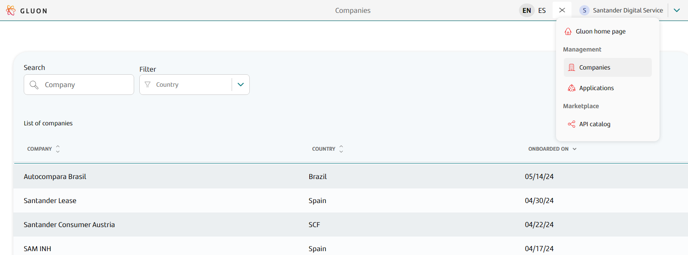

* Now, select **Applications**, to see all the available applications within this company:
    

* Choose the desired application and select the **Components** option from the menu located on the left side of the screen:<br>
  

* Click on **New Component**:<br>
  

* Search for **VPC Lite** component and click on it:<br>
  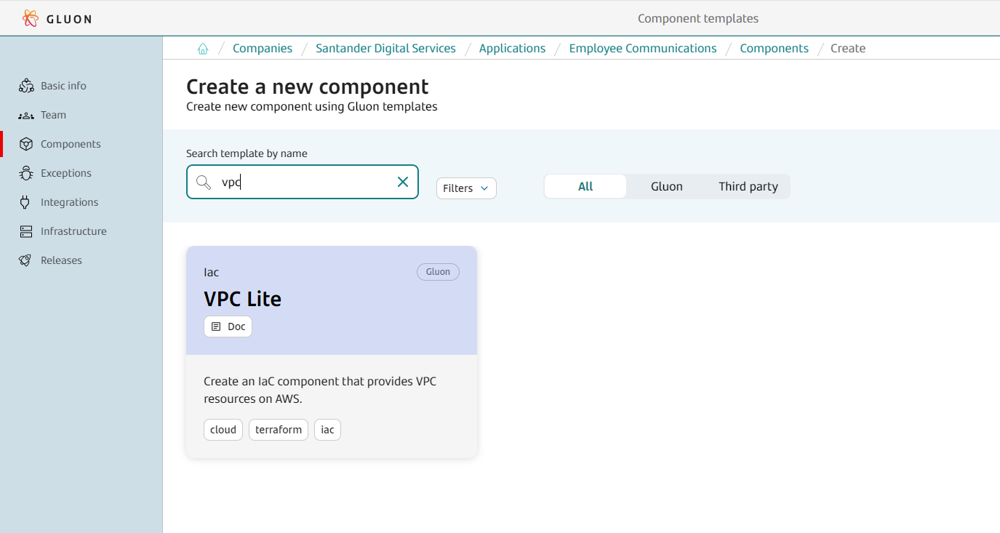

* Fill the template and press **next** button: <br>
  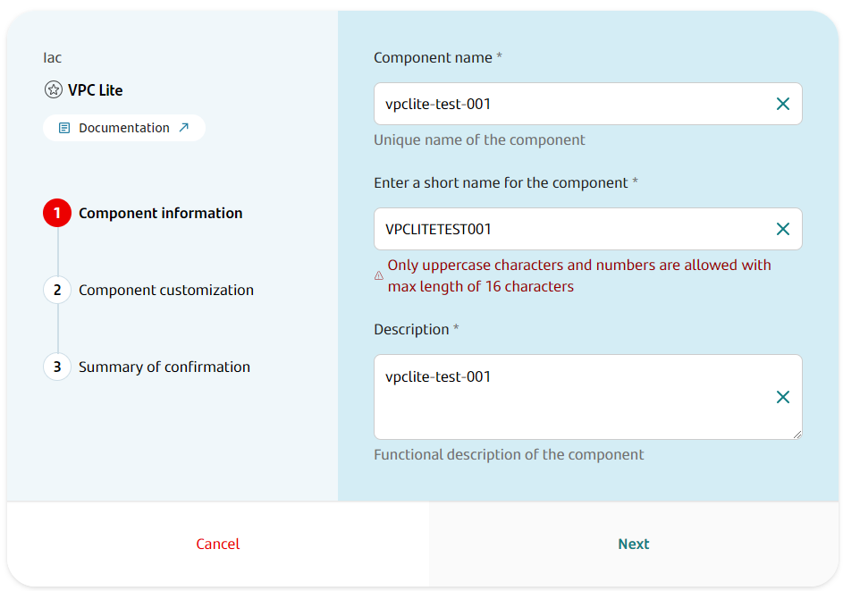

* Click on 'next' and select 'Git Flow' as 'Branch Strategy':
  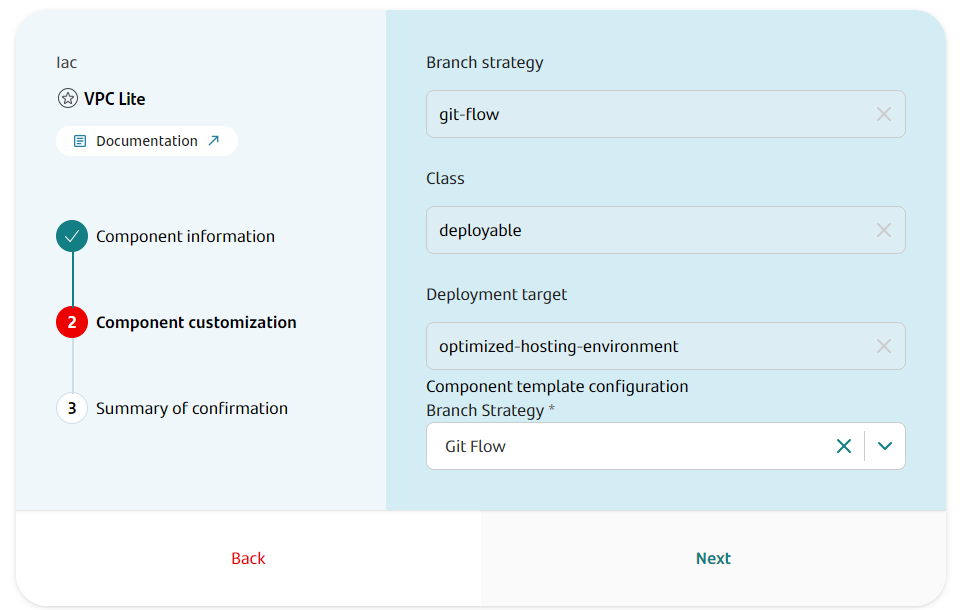

* Click on 'next' again and in the following step, a summary of the component creation request will be shown. Once checked and if everything is correct, click on **Create Component**:
  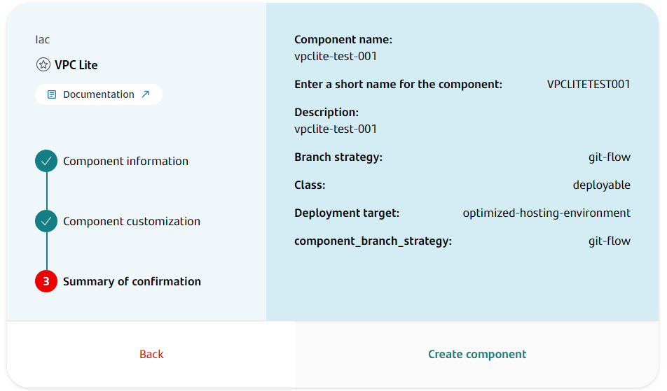

* We will see the component created in the **Component Page** and a pop-up will appear in the lower right corner of the screen stating that the component was successfully created:
  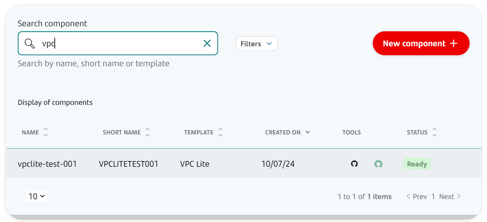

* Click on the Github icon to see the newly created repository for the VPC Lite component:<br>
  

* The new repository only contains an 'init-branch' that must be used by the 'initialization repository' workflow to initialize the repository:
  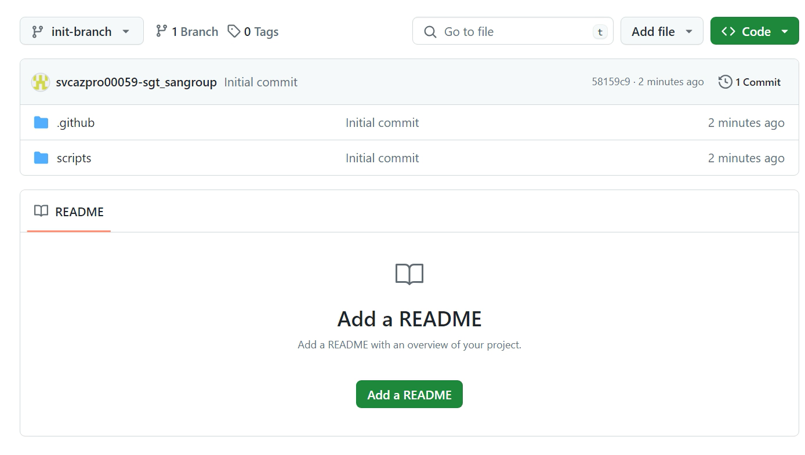

This workflow should be automatically launched on create, but sometimes it gets stuck. So, click on the Github Actions executions to check this. If the workflow was not run, it can be manually started:
  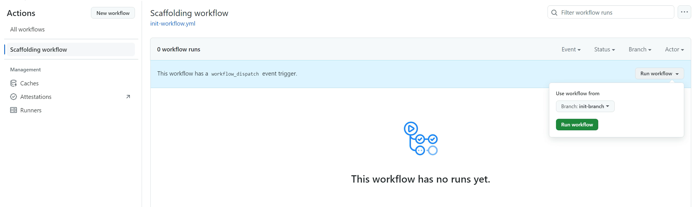

* Once the workflow execution is done, if we go back to the 'code' section of the repository, we will now see the 'main' branch and the repository will be ready to be used.
  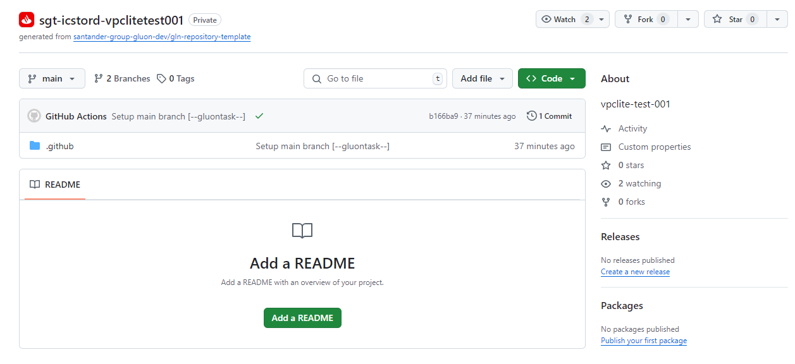

## Component configuration

Once the VPC Lite component repository has been created and initialized, some extra configurations must be done in order to make the Terraform workflows work in the newly created component.
For this, we must follow the step-by-step guide of the [Component Pre-requisites](../../../../application/iac/terraform-workflows/component-prerequisites.md) section.
The VPC Lite component does not need more configuration than the one described on this section.

In summary, the <u><strong>requirements</strong></u> in order to be able to use the Terraform Workflows in the VPC Lite component are:
<ul>
  <li><strong>To have set the PG_CREDENTIALS</strong> secret as organization secret in the newly created component repository. As these are organization secrets, it is very likely that the used organization already has them.
  Please check this before requesting them, since if they're already set, it is not needed to request the addition of these secrets again.
  <li><strong>To have set the IAC_CREDENTIALS_<code>environment</code></strong> secrets as repository secrets in the newly created component repository.
  This is always required, since here the information about the provider that wants to be used for deployment is set and this information is different for each application.
  <li><strong>To have set the Environments protection rules</strong> in the newly created component repository to be able to approve the workflows runs on that environment.
</ul>

## Parameters to create a VPC resources

All the information about what parameters can be used to deploy a VPC resources, how to use them or how to build a specific configuration are in the [Cloud Provider](./cloud-provider/index.md) section.

In addition to this, please note that all the tfvars files that must be updated to deploy VPC resources are located in the '.gluon/cd/<code>environment</code>' path of the created VPC Lite component:<br>
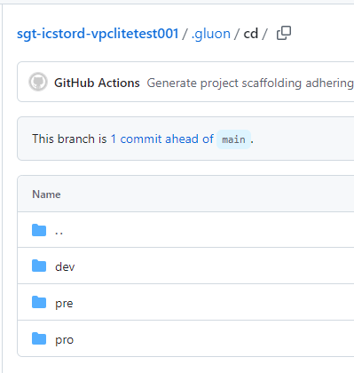

Where <code>environment</code> can be: 'dev', 'pre' or 'pro' and this will define the environment where the resource wants to be deployed.

So, in case that the deployment wants to be done on the 'dev' environment, the tfvar file that have to be updated is:

<ul>
<li><strong>.gluon/cd/dev/aws.auto.tfvars</strong> for terraform variables.
</ul>

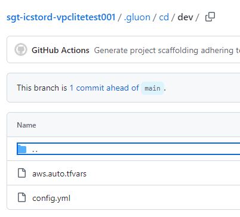

!!! info
    These tfvar files are created by default when the VPC Lite Component is created, and they always contain an example of the parameters needed to deploy VPC subresources.
    Most of the time, these examples do not work with the data included there. This data must always be replaced with the real data that should be used for the deployment that wants to be done, tfvars:
    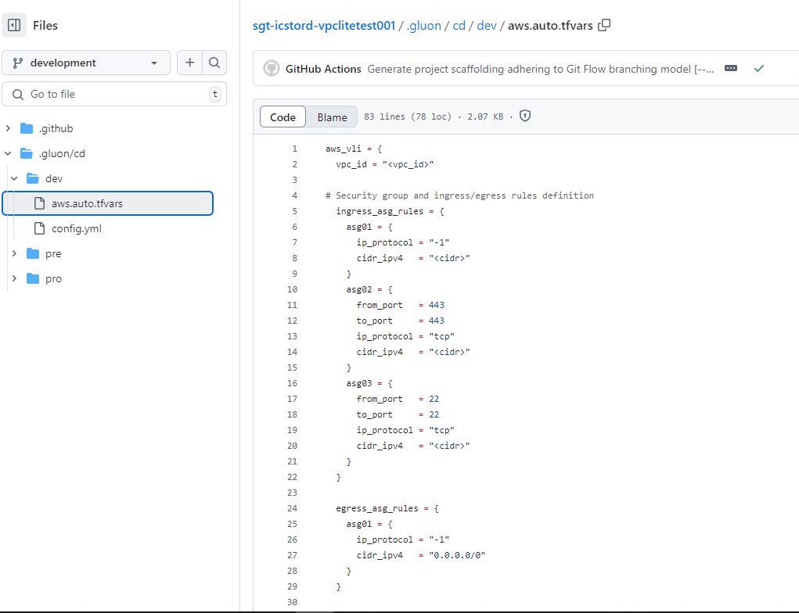

Also, in the 'config.yml' file of the environment that wants to be used, must be set the archetype version to be used to deploy the VPC resources:

```yaml
vpclite_arch_version: "v1.0.0"
```

or

```yaml
vpclite_arch_version: "develop"
```

This file is created pointing to the latest version of the archetype by default, but this version can be changed in case this is not the version that wants to be used for the deployment.
If this file is deleted and is not present in the '.gluon/cd/<code>environment</code>' path, the archetype version to be used will also be the latest released version of the archetype.
In addition to this, a message will appear during the execution of the Terraform workflows to warn the user about this situation.

```yaml
"::warning :: vpclite_arch_version is not provided in the config.yml file for certification environment then, main branch will be used. Please provide the vpclite_arch_version in the config.yml file for selecting the specific version of the archetype."
```

## Available workflows

Once the component repository and the required configuration files have been properly set, the following Terraform workflows are available for each VPC Lite component:

* [Terraform Plan](../../../../application/iac/terraform-workflows/terraform-plan.md)
* [Terraform Apply](../../../../application/iac/terraform-workflows/terraform-apply.md)
* [Terraform Destroy](../../../../application/iac/terraform-workflows/terraform-destroy.md)
* [Terraform List](../../../../application/iac/terraform-workflows/terraform-list.md)
* [Terraform State Import](../../../../application/iac/terraform-workflows/terraform-state-import.md)
* [Terraform State Remove](../../../../application/iac/terraform-workflows/terraform-state-remove.md)

In the links listed above, can be found the input parameters required for each one, as well as all the information about how to use them.
