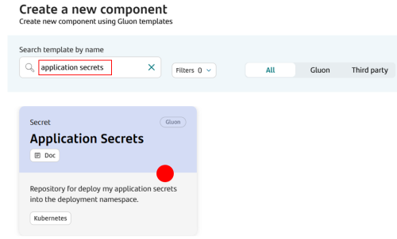
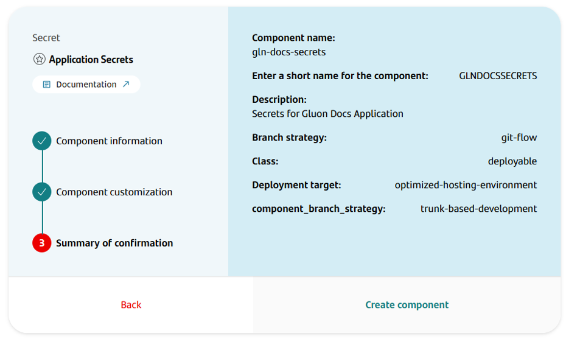
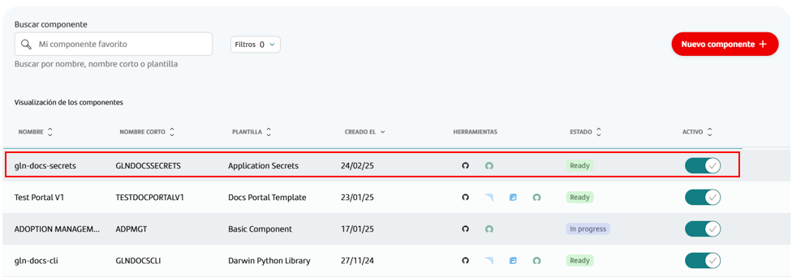
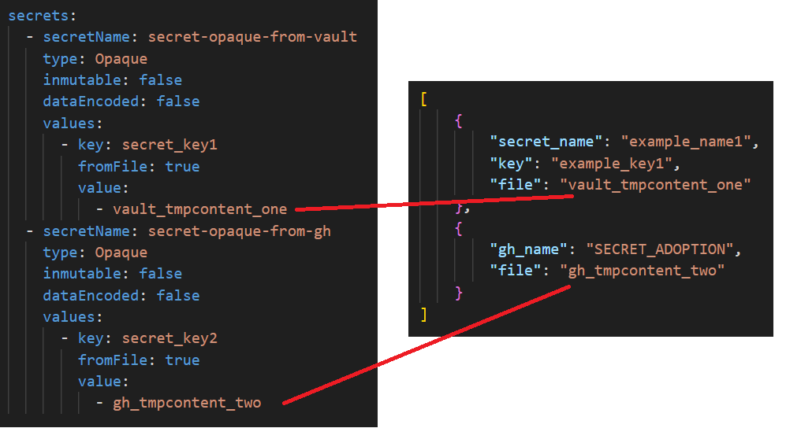

## Introduction

The purpose of this documentation is to provide a step-by-step guide on how you can orchestrate the deployment of Secrets to your Kubernetes project. This component has the ability to deploy secrets from Github and Hashicorp Vault to a kubernetes cluster.

Application Secrets components use the **Gluon Application Model** component defeined at the Gluon Technical Application to manage the setup of the deployment.
 Compared to the previous version of the Application Secrets component (known as *Kubernetes Secrets*), the deployment setup file *deployment.yaml* contents are moved into the environments setup definition under *.gluon* folder.
 Details will be covered into [Build and Deploy section](#build-and-deploy-your-secrets-component).

## Create Component

### Gluon Portal

In order to create a component, an application needs to be onboarded, following [**onboard your application.**](../../../index.md) process.

In order to create a component, follow the steps described in [**Create a Component**](../../../application/component-management/create-component.md), searching for the component to be created.
 In this case, **Application Secrets**.



To follow the naming convention visit [Repository Naming Convention](../../../application/component-management/create-component.md#repository-naming-convention).

The user can customize the type of application that they want to create. For this example we have created a Application Secrets component with the following characteristics:

- **Branch Strategy**: git-flow
- **Class**: deployable
- **Deployment target**: optimized-hosting-environment

{: style="width:50%"}

Once created, the component can be accessed through the application components list, where you can find a direct link to the GitHub repository.



We have the following links in:

| Item | Link | Role Permission |
| --- | --- | --- |
| GitHub Repository | Link to the repository created in GitHub | Developer (RW) /Technical Lead (Maintain) [All roles explained](https://docs.github.com/es/organizations/managing-user-access-to-your-organizations-repositories/managing-repository-roles/repository-roles-for-an-organization) |
| Sonar Project | Disabled | N/A |
| Fortify Project | Disabled | N/A |

???+ warning

    The **Fortify icon**, although active, will not be used.

<br>

### Secrets Template

#### Branches

Once the component repository is created, the **scaffolding** GitHub workflow is launched to generate the component structure.

<br>

#### Repository Structure

The generated Application Secrets has a structure similar to the following:

``` bash

📂.github
 ┣ 📂workflows
 ┣ ┣ 📜cd.yml
 ┃ ┣ 📜create-release-branch.yml
 ┃ ┗ 📜update-component-workflow.yml
 ┗ 📜CODEOWNERS
 📂.gluon
 ┣ 📂cd
 ┃ ┣ 📂cert
 ┃ ┃ ┣ 📜cd.yml
 ┃ ┃ ┣ 📜values-cert.yml
 ┃ ┃ ┗ 📜vaultinfo.json
 ┃ ┣ 📂pre
 ┃ ┃ ┣ 📜cd.yml
 ┃ ┃ ┣ 📜values-pre.yml
 ┃ ┃ ┗ 📜vaultinfo.json
 ┃ ┣ 📂pro
 ┃ ┃ ┣ 📜cd.yml
 ┃ ┃ ┣ 📜values-pro.yml
 ┃ ┃ ┗ 📜vaultinfo.json
 ┗ ┗ 📜values.yml
 📜README.md


```

- **.github/workflows/**: Workflows related to the component lifecycle.
- **.gluon/cd/**Environment setup for each defined environment (default: cert, pre, pro) and common configuration (file *values.yml*).
- **README.md** Repo doc.

### Inspect your component in your local environment

??? abstract "Cloning your repository"

    Once you have the device properly configured, the first step is to clone the project locally.

    To do so, visit [**Cloning a repository**](../../../application/component-management/create-component.md#cloning-a-repository).

## Infrastructure

{!
   include-markdown "../../snippets/infrastructure/kubernetes-configmap-secrets.md"
!}

### How to configure the Infrastructure

The company
used to create the components must have been provided the [Gluon Open Application Model](../../../application/ci-cd/cd/cd-rm/index.md).
The deployment model uses the [`oam-application-definition.yaml`](../../../application/ci-cd/cd/cd-rm/gluon-application-model-oam/oam-config-and-params/oam-example.md) file
to manage infrastructure and registries in a standardized way across different platforms.

#### OAM Configuration

To deploy a Application Secrets, the parameters of the target infrastructure must be configured in the **Gluon Application Model** component of the technical application,
[**configuring the data**](../../software/backend/snippets/oam-configuration.md) necessary depending on the type of Kubernetes Cluster used.

#### Configure environments

By default, the component is created with the folders cert, pre, and pro, which cover the most common use case.
Each of these folders corresponds to an environment in which
you want to deploy a Application Secrets.
If, for example, you want to deploy in two production environments called pre-pro and back-pro,
the folder structure that should be created in the
cd folder is dev, pre, pre-pro, and back-pro, each with the `cd.yml` file where the infrastructure to be deployed must be configured.

For it to work correctly,
the name of the folder must exactly match the name of the "name" property (in the example shown below,
it would be the cert value) of the oam-application-definition.yml file of the Gluon Application Model component.

So, to define a deployment environments,
it is necessary to describe the `name` and `type` fields:

- `name`: The name of the environment. Each Application could give a different name to the environments. It must be
  unique in the oam file.
- `type`: The type of the environment. The values allowed are `certification`, `preproduction`, and `production`.

Below is an example of the configuration of a certification environment, called cert, where one infrastructure have been configured to deploy for
Amazon Elastic-Kubernetes Service Cluster. Many properties have been omitted for this example, but for it to work correctly, the rest of the
mandatory data must be configured.

``` yaml title="oam-application-definition.yml"
environments:
  - name: cert
    type: certification
    infrastructures:
      - id: CI00000000001
        properties:
          type: KUBERNETES
          apiServer: https://12345asdfg67890hjkl.sk1.eu-west-1.eks.amazonaws.com
          namespace: gluon-back-java
          credentialUserId: AWS_ACCESS_KEY_ID
          credentialPassId: AWS_SECRET_ACCESS_KEY_ID
          provider: eks
          cloud: aws
          account: 123456789012
          role: AccountAutomationNonPro
          region: eu-west-1
          clusterName: sgtd1aireksgluondeksd111
          artifact-store: CI000000000002
          (...)
```

!!! info "Cluster Authentication"

    There are three ways to authenticate against a Cluster:
    
      - **credentialsId**: Use property credentialsId setting the name of the github secret storing the token. **This is the recommended method**.
      - **credentialUserId** / **credentialPassId**: Use properties credentialsUserId/credentialsPassId placing there github secret names with username and password to use to authenticate with server.
      - **Using Hashicorp Vault**: The system will automatically search in the Hashicorp Vault for the deployment secret

The next step is to configure the `cd.yml` file,
where you can set up the infrastructures where the Application Secrets will be deployed for that environment.
For each one, the following properties must be configured:

| **Property**       | **Description**                                                             | **Example**                    |
|--------------------|-----------------------------------------------------------------------------|--------------------------------|
| ci_id              | Identifier of the infrastructure in the oam-application-definition.yml file | CI00000000097                  |
| configurationFiles | Path to the Helm configuration file in that environment                     | .gluon/cd/cert/values-cert.yml |

Following the previous example from the oam-application-definition.yml file,
the content of the `cd.yml` file to deploy on Amazon Elastic-Kubernetes Service (EKS)  would be as follows:

``` yaml title="cd.yml"
- ci_id: CI00000000001
  configurationFiles:
  - .gluon/cd/cert/values-cert.yaml
```

> !IMPORTANT - Considerations:
>
> - The workflow will deploy on all infrastructures that are included in the cd.yml file of the environment in which it is going to be executed.
> - The infrastructures included in the cd.yml file must be registered in the environment in the oam-application-definition.yml file.
> - These values indicate where the Application Secrets will be deployed. They do not depend on **GLUON**. They are specific to the application to be deployed.

For getting
to know
how to configure the `Gluon Open Application Model` repository
associated with the company where the component is generated,
the following documentation is available:

- [How-to-config the Gluon Application Model(OAM)](../../../application/ci-cd/cd/cd-rm/gluon-application-model-oam/oam-config-and-params/oam-example.md)
- [Parameters available by type of infrastructure component](../../../application/ci-cd/cd/cd-rm/gluon-application-model-oam/oam-config-and-params/gluon-application-model-oam-params.md)

???+ info

    There are 4 different ways to define access to the Kubernetes cluster namespace:

      - **credentialsId**: Use property credentialsId setting the name of the github secret storing the token. **This is the recommended method**.
      - **credentialUserId** / **credentialPassId**: Use properties credentialsUserId/credentialsPassId placing there github secret names with username and password to use to authenticate with server.
      - **Using Hashicorp Vault**: The system will automatically search in the Hashicorp Vault for the deployment secret

???+ danger "Important"

    Before using Hashicorp Vault, make sure that your application structure and secrets have been created correctly in Hashicorp Vault by the authorized person. For more details see the [**security capability**](../../../application/security/index.md)

## Configure your component

Once created the component into GitHub repository, you can proceed deployment setup.

### Branches

{!
   include-markdown "../../snippets/configuration/maven-configuration.md"
   start="<!--Start Gitflow Branches-->"
   end="<!--End Gitflow Branches-->"
!}

<br>

### Configure your repository secrets

{!
   include-markdown "../../snippets/configuration/kubernetes-secrets.md"
   start="<!--Start Github Secrets-->"
   end="<!--End Github Secrets-->"
!}

### Configuration Files

#### Continuous Deployment files

In that set of files, we are going to define the necessary infrastructure references, so that the helm chart can deploy the secrets component correctly in the configured environment.
 The Continuous Deployment file (`cd.yml`) must contain the target deployment configuration that we want to use for deploying the component.
For each environment (cert, pre, pro), we have a folder with the `cd.yml` file, and there, we can define several infrastructures to deploy in as many regions as we need.
Remember that `cd.yml` files are empty, and the developer is responsible for filling them with the necessary deployment information.

``` bash
📂.gluon
┣ 📂cd
┃ ┣ 📂cert
┃ ┃ ┣ 📜cd.yml
┃ ┣ 📂pre
┃ ┃ ┣ 📜cd.yml
┃ ┣ 📂pro
┃ ┃ ┗ 📜cd.yml
```

For that purpose, it will only be necessary to add the `ci_id` identifiers defined by environment type in the `oam-application-definition.yml` file inside **Gluon Open Application Model repository** associated with the company of the component.
Keep in mind that **`ci_id` must be the same as we have in OAM the config file**. The `configuration_files` key allows
setting the `values` chart files that they are necessary to be able to deploy in the infrastructures to which they refer.

| **Property**       | **Description**                                                             | **Example**                    |
|--------------------|-----------------------------------------------------------------------------|--------------------------------|
| ci_id              | Identifier of the infrastructure in the oam-application-definition.yml file | CI00000000097                  |
| configurationFiles | Path to the Helm configuration file in that environment                     | .gluon/cd/cert/values-cert.yml |

The following template shows an example of the structure that the `cd.yml` file should have:

```yaml
# Kubernetes cluster in AWS
- ci_id: CI00000000001
  configuration_files:
    - .gluon/cd/values.yml
    - .gluon/cd/{environment}/values-{environment}.yml
# Kubernetes cluster in Azure
- ci_id: CI00000000002
  configuration_files:
    - .gluon/cd/values.yml
    - .gluon/cd/{environment}/values-{environment}.yml
```

[See the full list of examples of how to set up your deployment infrastructure here](../../software/backend/snippets/oam-configuration.md)

For getting more information about how-to-configure the deployment environment files,
please refer to the [Continuous Deployment file documentation](../../../application/ci-cd/cd/cd-rm/cd-workflow/cd-envs-configuration.md).

The following table shows the name of the branch, the value of the environment parameter in the deployment.yaml and the target environment in the cluster:

| **Branch name**                      | **Environment parameter** | **Target env** |
|--------------------------------------|---------------------------|----------------|
| main or development or certification | cert                      | certification  |
| pre or preproduction                 | pre                       | preproduction  |
| pro or production                    | pro                       | production     |

<br>

#### File values-[env].yaml

This file contains the definition of the secrets types to add to the project.

Below there is an example with two secrets called *secret-opaque-from-vault* and *secret-opaque-from-gh*.

```yaml title="values[env].yaml example" linenums="1"

secrets:
  - secretName: secret-opaque-from-vault
    type: Opaque
    inmutable: false
    dataEncoded: false
    values:
      - key: secret_key1
        fromFile: true
        value:
          - vault_tmpcontent_one
  - secretName: secret-opaque-from-gh
    type: Opaque
    inmutable: false
    dataEncoded: false
    values:
      - key: secret_key2
        fromFile: true
        value:
          - gh_tmpcontent_two

```

#### File vaultinfo.json

This component is capable of deploying secrets from Hashicorp Vault and from Github. You can use either option separately or together. Below is an example file.

```json title="vaultinfo.json" linenums="1"

[
    {
        "secret_name": "example_name1",
        "key": "example_key1",
        "file": "vault_tmpcontent_one"
    },
    {
        "gh_name": "SECRET_ADOPTION",
        "file": "gh_tmpcontent_two"
    }
]

```

???+ info "Tip"

    In the previous example, for Github secrets, *gh_name* field will contain the ID of the secret to be added to the repository and  *file* field the ID of the reference into *values-cert.yaml* file.
    
    For Hashicorp Vault secrets, *secret_name* field will contain the secret name in Vault, *key* field will contain the secret key in Vault and *file* field the ID of the reference into *values-cert.yaml* file.



## Build and Deploy your Secrets component

We will now describe the steps you need to take in order to be able to deploy your Secrets component through the CERT, PRE and PRO environments.

As we commented in previous points, the scaffolding process in the creation of the repository will create a init-branch branch, a main branch, and will create a Pull Request from init-branch to main.

We recommend you to approve this Pull Request, delete init-branch, create the integration branch (develop or development) and from here create your feature branches.

### Secrets component Deploy

To learn how the common deployment workflow works, applicable to all technologies, you can refer to the [Common CD Workflow](../../../application/ci-cd/cd/cd-rm/cd-workflow/index.md) section of the documentation.

Once the workflow has finished, we can see that it has successfully deployed the Application Secrets correctly in our Kubernetes project.
