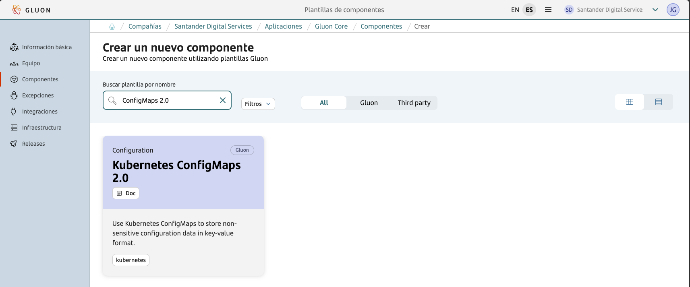
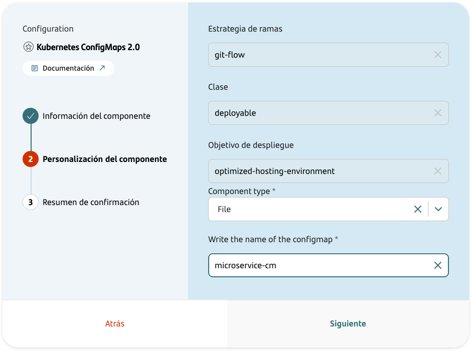
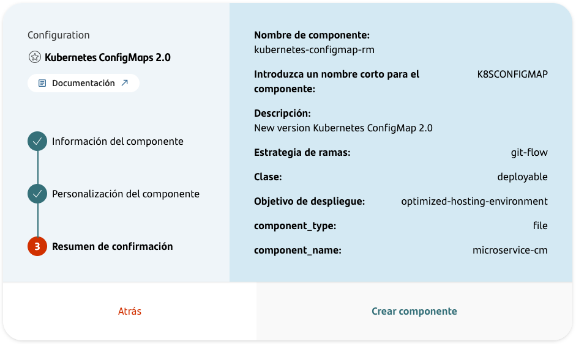
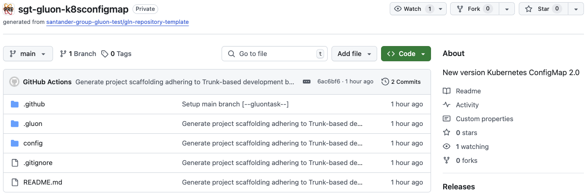
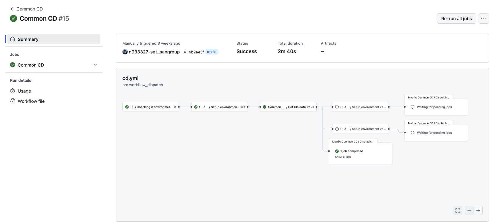
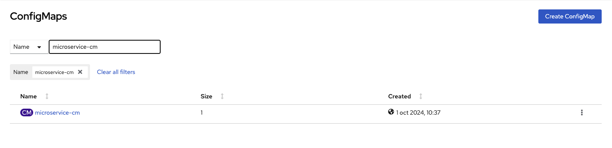

## Introduction

The purpose of this documentation is to provide a step-by-step guide on how to orchestrate the deployment of your ConfigMaps.
It allows you to create a ConfigMap component, configure it, and deploy it in the desired environment.
There are two ways to deploy the ConfigMap: **ConfigMap to file** and **ConfigMap to environment variables**.

### ConfigMap to file

When you map a ConfigMap to a file, you are essentially creating a volume from the ConfigMap and mounting it into your pod.
Each key-value pair in the ConfigMap is represented as a file within a directory.
The key becomes the file name, and the value becomes the file content.

### ConfigMap to environment variables

This method allows your application to access configuration data through standard environment variables.
Each key-value pair in the ConfigMap is transformed into an environment variable in the pod.
The key serves as the environment variable name, and the corresponding value is assigned to it.

## Create Component

### Gluon Portal

First, you have to [**onboard your application**](../../../index.md). Once you have your application created, you can start creating your component.

To create a component, follow the steps described in [**Component Management**](../../../application/component-management/create-component.md), searching for the component to be created.

You have to select the type of component you want to create, in this case you are going to create a **Kubernetes ConfigMaps**.



The user can customize the type of component that they want to create. But for Kubernetes ConfigMap components, we can't change the default characteristics:



- **Branch Strategy**: git-flow
- **Class**: deployable.
- **Deployment target**: optimized-hosting-environment.
- **Component type**: Kind of data to deploy: file or environment variables.
- **ConfigMap name**: name to deploy the ConfigMap.

Once the component is created, we will be able to see it in the component list, where we will have a direct link to the GitHub repository.

???+ remember

    The repository will be created following the [Repository Naming Convention](../../../application/component-management/create-component.md#repository-naming-convention).



We have the following links in:

| Item              | Link                                     | Role Permission                                                                                                                                                                                                                  |
|-------------------|------------------------------------------|----------------------------------------------------------------------------------------------------------------------------------------------------------------------------------------------------------------------------------|
| GitHub Repository | Link to the repository created in GitHub | Developer (RW) /Technical Lead (Maintain) [All roles explained](https://docs.github.com/es/organizations/managing-user-access-to-your-organizations-repositories/managing-repository-roles/repository-roles-for-an-organization) |
| Sonar Project     | Disabled                                 | N/A                                                                                                                                                                                                                              |
| Fortify Project   | Not used                                 | N/A                                                                                                                                                                                                                              |

???+ warning

    The **Fortify icon**, although active, will not be used in the deployment of our configmaps.

<br>

### ConfigMaps Template

#### Branches

When you create the component from the Gluon Portal, the component is created with the default values of the template from the scaffolding workflow.

- Create a **main** branch which contains just the workflow file for the created component.
- Create a **development** branch with an initial structure and content for a Kubernetes ConfigMap deployed using Helm Chart.



???+ info "Note"

    If in the DEV deployment we don't have the .github/workflows folder in the **main** branch, when we execute the CI/CD pipeline, the deployment will fail.

<br>

#### Structure

The generated ConfigMaps has a structure similar to the following:

``` bash

📂.github
 ┣ 📂workflows
 ┣ ┣ 📜cd.yml
 ┃ ┗ 📜update-component-workflow.yml
 ┗ 📜CODEOWNERS
 📂.gluon
 ┣ 📂cd
 ┃ ┣ 📂cert
 ┃ ┃ ┣ 📜cd.yml
 ┃ ┃ ┗ 📜values-cert.yml
 ┃ ┣ 📂pre
 ┃ ┃ ┣ 📜cd.yml
 ┃ ┃ ┗ 📜values-pre.yml
 ┃ ┣ 📂pro
 ┃ ┃ ┣ 📜cd.yml
 ┃ ┃ ┗ 📜values-pro.yml
 ┃ ┗ 📜values.yaml
 ┗ 📂ci
   ┗ 📜properties.env
 📂config
 ┗ 📜application.yml
 📜deployment.yaml
 📜README.md
 📜values-cert.yaml
 📜values.yaml

```

For more information on the structure and functionality of ConfigMaps component, please refer to the [ConfigMaps Scaffolding documentation](../../../application/ci-cd/technologies/configmap/scaffolding/configmap-scaffolding.md)
and [ConfigMaps CI/CD documentation](../../../application/ci-cd/technologies/configmap/helm-cd-workflow.md).

### Inspect your component in your local environment

??? abstract "Cloning your repository"

    Once you have the device properly configured, the first step is to clone the project locally.

    To do so, visit [**Cloning a repository**](../../../application/component-management/create-component.md#cloning-a-repository).

## Infrastructure

{!
   include-markdown "../../snippets/infrastructure/kubernetes-configmap-secrets.md"
!}

### How to configure the Infrastructure

The company
used to create the components must have been provided the [Gluon Open Application Model](../../../application/ci-cd/cd/cd-rm/index.md).
The deployment model uses the [`oam-application-definition.yaml`](../../../application/ci-cd/cd/cd-rm/gluon-application-model-oam/oam-config-and-params/oam-example.md) file
to manage infrastructure and registries in a standardized way across different platforms.

#### OAM Configuration

To deploy a Kubernetes ConfigMap,
the parameters of the target infrastructure must be configured in the **Gluon Application Model** component of the technical application,
[**configuring the data**](../../software/backend/snippets/oam-configuration.md) necessary depending on the type of Kubernetes Cluster used.

#### Configure environments

By default, the component is created with the folders cert, pre, and pro, which cover the most common use case.
Each of these folders corresponds to an environment in which
you want to deploy a Kubernetes ConfigMap.
If, for example, you want to deploy in two production environments called pre-pro and back-pro,
the folder structure that should be created in the
cd folder is dev, pre, pre-pro, and back-pro, each with the `cd.yml` file where the infrastructure to be deployed must be configured.

For it to work correctly,
the name of the folder must exactly match the name of the "name" property (in the example shown below,
it would be the cert value) of the oam-application-definition.yml file of the Gluon Application Model component.

So, to define a deployment environments,
it is necessary to describe the `name` and `type` fields:

- `name`: The name of the environment. Each Application could give a different name to the environments. It must be
  unique in the oam file.
- `type`: The type of the environment. The values allowed are `certification`, `preproduction`, and `production`.

Below is an example of the configuration of a certification environment, called cert, where one infrastructure have been configured to deploy for
Amazon Elastic-Kubernetes Service Cluster. Many properties have been omitted for this example, but for it to work correctly, the rest of the
mandatory data must be configured.

``` yaml title="oam-application-definition.yml"
environments:
  - name: cert
    type: certification
    infrastructures:
      - id: CI00000000001
        properties:
          type: KUBERNETES
          apiServer: https://12345asdfg67890hjkl.sk1.eu-west-1.eks.amazonaws.com
          namespace: gluon-back-java
          credentialUserId: AWS_ACCESS_KEY_ID
          credentialPassId: AWS_SECRET_ACCESS_KEY_ID
          provider: eks
          cloud: aws
          account: 123456789012
          role: AccountAutomationNonPro
          region: eu-west-1
          clusterName: sgtd1aireksgluondeksd111
          artifact-store: CI000000000002
          (...)
```

!!! info "Cluster Authentication"

    There are three ways to authenticate against a Cluster:
    
      - **credentialsId**: Use property credentialsId setting the name of the github secret storing the token. **This is the recommended method**.
      - **credentialUserId** / **credentialPassId**: Use properties credentialsUserId/credentialsPassId placing there github secret names with username and password to use to authenticate with server.
      - **Using Hashicorp Vault**: The system will automatically search in the Hashicorp Vault for the deployment secret

The next step is to configure the `cd.yml` file,
where you can set up the infrastructures where the Kubernetes ConfigMap will be deployed for that environment.
For each one, the following properties must be configured:

| **Property**       | **Description**                                                             | **Example**                    |
|--------------------|-----------------------------------------------------------------------------|--------------------------------|
| ci_id              | Identifier of the infrastructure in the oam-application-definition.yml file | CI00000000097                  |
| configurationFiles | Path to the Helm configuration file in that environment                     | .gluon/cd/cert/values-cert.yml |

Following the previous example from the oam-application-definition.yml file,
the content of the `cd.yml` file to deploy on Amazon Elastic-Kubernetes Service (EKS)  would be as follows:

``` yaml title="cd.yml"
- ci_id: CI00000000001
  configurationFiles:
  - .gluon/cd/cert/values-cert.yaml
```

> !IMPORTANT - Considerations:
>
> - The workflow will deploy on all infrastructures that are included in the cd.yml file of the environment in which it is going to be executed.
> - The infrastructures included in the cd.yml file must be registered in the environment in the oam-application-definition.yml file.
> - These values indicate where the Kubernetes ConfigMap will be deployed. They do not depend on **GLUON**. They are specific to the application to be deployed.

For getting
to know
how to configure the `Gluon Open Application Model` repository
associated with the company where the component is generated,
the following documentation is available:

- [How-to-config the Gluon Application Model(OAM)](../../../application/ci-cd/cd/cd-rm/gluon-application-model-oam/oam-config-and-params/oam-example.md)
- [Parameters available by type of infrastructure component](../../../application/ci-cd/cd/cd-rm/gluon-application-model-oam/oam-config-and-params/gluon-application-model-oam-params.md)

???+ info

    There are 4 different ways to define access to the Kubernetes cluster namespace:

      - **credentialsId**: Use property credentialsId setting the name of the github secret storing the token. **This is the recommended method**.
      - **credentialUserId** / **credentialPassId**: Use properties credentialsUserId/credentialsPassId placing there github secret names with username and password to use to authenticate with server.
      - **Using Hashicorp Vault**: The system will automatically search in the Hashicorp Vault for the deployment secret

???+ danger "Important"

    Before using Hashicorp Vault, make sure that your application structure and secrets have been created correctly in Hashicorp Vault by the authorized person. For more details see the [**security capability**](../../../application/security/index.md)

## Configure your Component

### Branches

{!
   include-markdown "../../snippets/configuration/maven-configuration.md"
   start="<!--Start Gitflow Branches-->"
   end="<!--End Gitflow Branches-->"
!}

<br>

### Configure your repository secrets

{!
   include-markdown "../../snippets/configuration/kubernetes-secrets.md"
   start="<!--Start Deployment Infra Github Secrets-->"
   end="<!--End Deployment Infra Github Secrets-->"
!}

<br>

### Configuration Files

#### Continuous Deployment files

In that set of files,
we are going
to define the necessary infrastructure references
so that the helm chart can deploy the configmap correctly in the configured environment.
The Continuous Deployment file (`cd.yml`) must
contain the target deployment configuration that we want to use for deploying the component.
For each environment (cert, pre, pro),
we have a folder with the `cd.yml` file, and there,
we can define several infrastructures to deploy in as many regions as we
need.
Remember that `cd.yml` files are empty,
and the developer is responsible for filling them with the necessary deployment information.

``` bash
📂.gluon
┣ 📂cd
┃ ┣ 📂cert
┃ ┃ ┣ 📜cd.yml
┃ ┣ 📂pre
┃ ┃ ┣ 📜cd.yml
┃ ┣ 📂pro
┃ ┃ ┗ 📜cd.yml
```

For that purpose,
it will only be necessary to add the `ci_id` identifiers
defined by environment type in the `oam-application-definition.yml` file inside **Gluon Open Application Model repository**
associated with the company of the component.
Keep in mind that **`ci_id` must be the same as we have in OAM the config file**.
The `configuration_files` key allows
setting the `values` chart files that they are necessary to be able
to deploy in the infrastructures to which they refer.

| **Property**       | **Description**                                                             | **Example**                    |
|--------------------|-----------------------------------------------------------------------------|--------------------------------|
| ci_id              | Identifier of the infrastructure in the oam-application-definition.yml file | CI00000000097                  |
| configurationFiles | Path to the Helm configuration file in that environment                     | .gluon/cd/cert/values-cert.yml |

The following template shows an example of the structure that the `cd.yml` file should have:

```yaml
# Kubernetes cluster in AWS
- ci_id: CI00000000001
  configuration_files:
    - .gluon/cd/values.yml
    - .gluon/cd/{environment}/values-{environment}.yml
# Kubernetes cluster in Azure
- ci_id: CI00000000002
  configuration_files:
    - .gluon/cd/values.yml
    - .gluon/cd/{environment}/values-{environment}.yml
```

[See the full list of examples of how to set up your deployment infrastructure here](../../software/backend/snippets/oam-configuration.md)

For getting more information about how-to-configure the deployment environment files,
please refer to the [Continuous Deployment file documentation](../../../application/ci-cd/cd/cd-rm/cd-workflow/cd-envs-configuration.md).

The following table shows the name of the branch, the value of the environment parameter in the deployment.yaml and the target environment in the cluster:

| **Branch name**                      | **Environment parameter** | **Target env** |
|--------------------------------------|---------------------------|----------------|
| main or development or certification | cert                      | certification  |
| pre or preproduction                 | pre                       | preproduction  |
| pro or production                    | pro                       | production     |

<br>

#### File values-\[env\].yaml

In this file, we define the values to be used in ConfigMap Helm Chart. We have two attributes that we can configure:

- **applicationName**: Name of the application. This name matches with the name of the application.
- **configMapType**: Allows to set the content of the ConfigMap. allows to define the type of ConfigMap to create. Possible values: `file` or `env-var`.

``` bash
📂.gluon
┣ 📂cd
┃ ┣ 📂cert
┃ ┃ ┗ 📜values-cert.yml
┃ ┣ 📂pre
┃ ┃ ┗ 📜values-pre.yml
┃ ┣ 📂pro
┃ ┃ ┗ 📜values-pro.yml
┗ ┗ 📜values.yaml
```

???+ danger "Important: ConfigMap Name"

    The configmap name must be the same as the name that will be configured when deploying the microservice using Helm Chart: `cm-[microservice-name]-micro-java`. In case that the variable *applicationName* is configured in the microservice component, the value here for the ConfigMap has to be `cm-[microservice-applicationName]`.

???+ danger "Important: Configmap Type"

    The ConfigMap type must be the same as the type that will be configured when deploying the microservice using Helm Chart: `file` or `env-var`.
    By default if the attribute is not defined, the ConfigMap type will be `file` to maintain the compatibility with the previous versions.

Example:

```yaml
## @param configMapType Allows to set the content of the ConfigMap.
## It is used to define the type of the ConfigMap to be created.
## Two possible values are allowed:
##  - "file" ConfigMap will be created following the file based ConfigMap structure including in the data node, the name of the file and the content between delimiters.
##  - "env-var" ConfigMap will be created following the environment variables based ConfigMap structure including in the data node, the content of the config files but with no file name and delimiters.
configMapType: file
applicationName: cm-sgt-gluonad-probeconfigmap-micro-java
```

or

```yaml
## @param configMapType Allows to set the content of the ConfigMap.
## It is used to define the type of the ConfigMap to be created.
## Two possible values are allowed:
##  - "file" ConfigMap will be created following the file based ConfigMap structure including in the data node, the name of the file and the content between delimiters.
##  - "env-var" ConfigMap will be created following the environment variables based ConfigMap structure including in the data node, the content of the config files but with no file name and delimiters.
configMapType: env-var
applicationName: cm-probeconfigmap-appName-micro-nodejs-or-python

```

???+ warning "Important"

    Each environment will have its values file (values-cert, values-pre and values-pro) containing only the specific values. 
    The values.yaml file will contain the common values for all environments.

<br>

#### File config/application.yml

In this file, we will configure the environment-dependent properties that are going to be consumed in the microservice's configuration.

##### Configmap Type `file`

Initially, there's an "application.yml" file, but if we use this file **it's going to replace the "application.yml" file from our microservice**.
The solution for this can be create an "application.properties" file instead with the referenced environment-dependent properties from our application.yml.

Example of "application.properties":

```yaml title="application.properties" linenums="1"

env.pkm-endpoint: https://srvnuarintra.santander.dev.corp/pkm/v1/publicKey
env.logging-server: kafkadev.santander.pre.corp:9093
```

##### Configmap Type `env-var`

We use this type of ConfigMap when we want to set environment variables in our microservice.
Creates file(s) with the `.yaml` or `.yml` extension inside the `config` folder of the microservice, with the following structure:

```yaml title="confimap.yaml" linenums="1"

DARWIN_NODEJS_TEST_KEY: AASDFASDF=
DARWIN_NODEJS_TEST_KEY_1: MWYyZDFlMmU2N2Rm
DARWIN_PYTHON_TEST_KEY: YWRtaW4=
DARWIN_PYTHON_TEST_KEY_1: MWYyZDFlMmU2N2Rm

```

???+ warning "Important"

    This type of configuration must be used when we want to configure a Python or NodeJS microservice.

<br>

#### File .gluon/ci/properties.env

This file will be configured almost completely by default with environment properties for CD workflow.

``` bash
📂.gluon
┗ 📂ci
  ┗ 📜properties.env
```

The resulting file will be:

```yaml title="env/properties.env" linenums="1"

DOCKER_BUILD_ARGUMENTS=""
JAVA_VERSION="adoptopenjdk-11.0.11+9"
CHART_VERSION="0.1.2"
DEPLOYMENT_YAML="deployment.yaml"
```

For getting more information about the properties environment file,
please refer to [Continuous Integration file documentation](../../../application/ci-cd/cd/cd-rm/cd-workflow/ci-envs-configuration.md).

<br>

## Build and Deploy your ConfigMap

We will now describe the steps you need to take to be able to deploy your ConfigMap through the CERT, PRE and PRO environments.

???+ remember

    Remember that, as we mentioned previously, the name of the branch determines the environment to which we are going to deploy.

### ConfigMap Deploy

The **Deploy Workflow** can be called manually to deploy to all environments.

To learn how the common deployment workflow works, applicable to all technologies, you can refer to the [Common CD Workflow](../../../application/ci-cd/cd/cd-rm/cd-workflow/index.md) section of the documentation.



Once the workflow has finished, we can see that it has successfully deployed the configmap correctly in our Kubernetes project.



## Repository Example

If you need an example of a repository with a microservice created with Gluon, you can visit the following [link](https://github.com/santander-group-sds-gln/sgt-gluonad-probeconfigmap).
