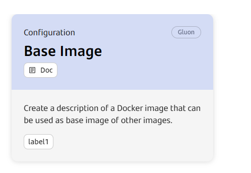
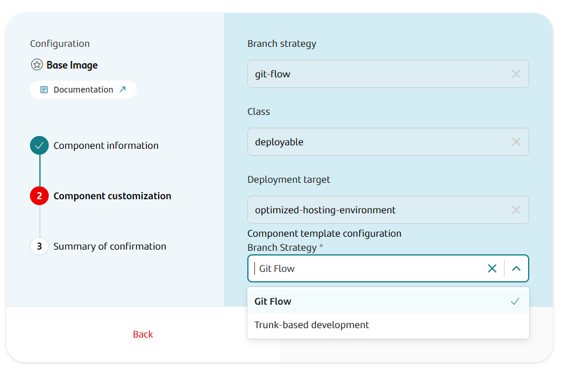

## Introduction

The purpose of this documentation is to provide a **step-by-step guide** on how to build and push a Docker Base within the GLUON platform.

This guide will allow you to understand how to build our Docker Base through a CI/Release process.

## Create Component

### Gluon Portal

First you have to [**onboard your application.**](../../../../..//index.md)
Once you have your application created, you can start creating your component.

To create a component, follow the steps described in [**Component Management**](../../../../../application/component-management/create-component.md),
searching for the component to be created.

You have to select the type of component you want to create, in this case you are going to create a **Base Image**.



???+ remember

    To follow the naming convention visit [Repository Naming Convention](../../../../../application/component-management/create-component.md#repository-naming-convention).

The user can customize the type of application that they want to create. For this example we have created a Base Image with the following characteristics:



- **Branch Strategy**: git-flow (By default) or Trunk Based
- **Class**: deployable
- **Deployment target**: optimized-hosting-environment

We have the following links in:

| Item | Link | Role Permission |
| --- | --- | --- |
| GitHub Repository | Link to the repository created in GitHub | Developer (RW) /Technical Lead (Maintain) [All roles explained](https://docs.github.com/es/organizations/managing-user-access-to-your-organizations-repositories/managing-repository-roles/repository-roles-for-an-organization) |
| Sonar Project | Link to the Sonar project created (in this case do not have it)| All Users (Read) |
| Fortify Project | Link to the Fortify project created (in this case do not have it) | All Users (Read) |

### Base Image Template

#### Branches

When you create the component from the Gluon Portal, the component is created with the default values of the template from the scaffolding workflow.

GFW case

Create an empty main branch
Create a development branch with the structure of files and folders to configure and build and push yor Docker Base Image.

TBD case

Create a main branch with the structure of files and folders to configure and build and push yor Docker Base Image.

#### Structure

The generated Base Image Repository has a structure similar to the following:

Git Flow

``` bash

📂.github
 ┣ 📂workflows
 | ┣ 📜ci-gfw.yml
 | ┣ 📜release-gfw.yml
 | ┣ 📜security.yml
 | ┣ 📜create-release-branch.yml
 | ┣ 📜release-fix-gfw.yml
 | ┣ 📜update-component-workflow.yml
 | ┗ 📜version-validation.yml
 ┗ 📜CODEOWNERS
📂.gluon
 ┗ 📂cd
    ┗ 📂cert
      ┗ 📜cd.yml
    ┗ 📂pre
      ┗ 📜cd.yml
    ┗ 📂pro
      ┗ 📜cd.yml
 ┗ 📂ci
    ┗ 📜properties.env
📜Dockerfile
📜README.md
📜VERSION
```

Trunk Based

``` bash

📂.github
 ┣ 📂workflows
 | ┣ 📜ci-tbd.yml
 | ┣ 📜release-tbd.yml
 | ┣ 📜security.yml
 | ┣ 📜create-release-branch.yml
 | ┣ 📜update-component-workflow.yml
 | ┗ 📜version-validation.yml
 ┗ 📜CODEOWNERS
📂.gluon
 ┗ 📂cd
    ┗ 📂cert
      ┗ 📜cd.yml
    ┗ 📂pre
      ┗ 📜cd.yml
    ┗ 📂pro
      ┗ 📜cd.yml
 ┗ 📂ci
    ┗ 📜properties.env
📜Dockerfile
📜README.md
📜VERSION
```

## Local Running

??? abstract "Cloning your repository"

    ### Cloning your repository

    Once we have the device properly configured, the first step is to clone the project locally.

    To do so, visit [**How to clone the project**](../../../../../application/component-management/create-component.md#cloning-a-repository).

## Infrastructure

All build-push will be done in Registry Infrastructure you define in your [OAM](../../../../../application/ci-cd/cd/cd-rm/gluon-application-model-oam/index.md){:target="_blank"}.

## Component Configuration

### Branches

It will depends on the strategy applied. Git Flow or Trunk Based, you have both options.

In GFW strategy you will have main as default and development with all scaffolding build in here.

In TBD strategy you will have main branch with all scaffolding build in here.

## Build and Push your image

Now we are going to describe the steps that a user has to perform in order to make a complete cycle.

The cycle explained below is based on **GitFlow**.

### Push to Feature

We will start working on the "Feature" branches of our GitHub repository and later, we will be integrating our changes into the integration branch (develop or development).
The first step is to create a new branch from the integration branch (develop or development) and push the changes to this branch.

When we push the changes to the "Feature" branch, the ci-gfw.yml workflow will be executed automatically.

### **ci-gfw.yml workflow**

When you are ready to do integration cycle with your Docker images to certification environments type, you can use this ci-gfw.yml workflow:

- **Setup environment variables**: Load the properties defined in properties.env file and in the configuration project.
- **Resolve version**: Retrieve the version of the pom.xml.
- **Container Build and Push**: It will make the build but not the push in feature branches.

??? info "ci-gfw workflow code"

```yaml linenums="1"
name: Integration
on:
    push:
        branches:
            - development
            - develop
            - feature/*

jobs:
    call-reusable-workflow:
        name: Integration
        uses: santander-group-shared-assets/gln-workflows/.github/workflows/docker-ci-gfw.yml@v1
        secrets: inherit
```

Your images will have a combination of SNAPSHOT version and a short SHA (e.g., 1.1.1-SNAPSHOT-123abCd123), version will be obtained from the VERSION file. This will help you track and identify the specific version of your images.

### Pull Request from Feature to Develop

When we create the Pull Request event from our "Feature" branch to the integration branch (develop or development), the security.yml (Sysdig), version-validation.yml (Version Release validation) workflows will be executed automatically.

### **Security workflow**

- **Setup environment variables**:Load the properties defined in properties.env file and in the configuration project.
- **Get current version from VERSION file**: Obtain current version from VESION file.
- **container-build-and-push**: It will execute Sysdig analysis.
- **Send information to Elasticsearch**:Send data to elasticsearch related with Sysdig analysis.
Security workflow code

??? info "security workflow code"

```yaml linenums="1"
name: Security
on:
  pull_request:
    branches:
      - development
      - develop
      - main
      - master

jobs:
  call-reusable-workflow:
    name: Security
    uses: santander-group-shared-assets/gln-workflows/.github/workflows/docker-security-image.yml@v1
    secrets: inherit
```

### **Version validation workflow**

- **Setup environment variables**:Load the properties defined in properties.env file and in the configuration project.
- **Get version**: Obtain current version from VERSION file.
- **Check release**: Check for duplicated versions in the repository.

??? info "version-validation workflow code"

```yaml linenums="1"
name: Maven version release validation
on:
  pull_request:
    branches:
      - development
      - develop
      - main
      - master

jobs:
  call-reusable-workflow:
    name: Version release validation
    uses: santander-group-shared-assets/gln-workflows/.github/workflows/version-release-validation.yml@v1
    with:
      version_file: 'VERSION'
    secrets: inherit
```

### Push to Develop

When approving the Pull Request of the previous step on the integration branch (development/develop) we will generate a push event on this branch. This will be triggering ci-gfw.yml workflow and it will push the image but not scan it.

### Pull Request from develop to main

When we are ready to promote our docker image to production, we will create a Pull Request from the integration branch (develop or development) to the main branch.

This event will launch the security.yml workflows (Sysdig) and the version-validation.yml workflow (Version Release validation).

### Push to main

When we approve the PR of the previous step on the main branch, we will generate a push event on this branch and therefore the release-gfw.yml workflow will be executed automatically.

This workflow will create a commit with the release version in the main branch.

### **release-gfw.yml workflow**

This workflow contains all the steps from ci-gfw.yml workflow. When you are ready to release your Docker images to all environments (cert, pre, pro), you can use this release-gfw.yml workflow:

- **Setup environment variables**:Load the properties defined in properties.env file and in the configuration project.
- **Preparing release version**: Get the release version.
- **Generate tag and release**: Generate a tag and release in the repository.
- **Container Build and Push**: Push the image to the registry.
- **Send Data to Elastic**: Send data info about push to ElasticSearch.

??? info "release-gfw workflow code"

```yaml linenums="1"
name: Release
on:
    push:
        branches:
            - main
            - master
jobs:
    call-reusable-workflow:
        name: Release
        uses: santander-group-shared-assets/gln-workflows/.github/workflows/docker-release-gfw.yml@v1
        with:
            technology: 'Java_Maven'
        secrets: inherit
```

Your images will have a tag with a specific version number obtained from the VERSION file (e.g., 1.1.1).
