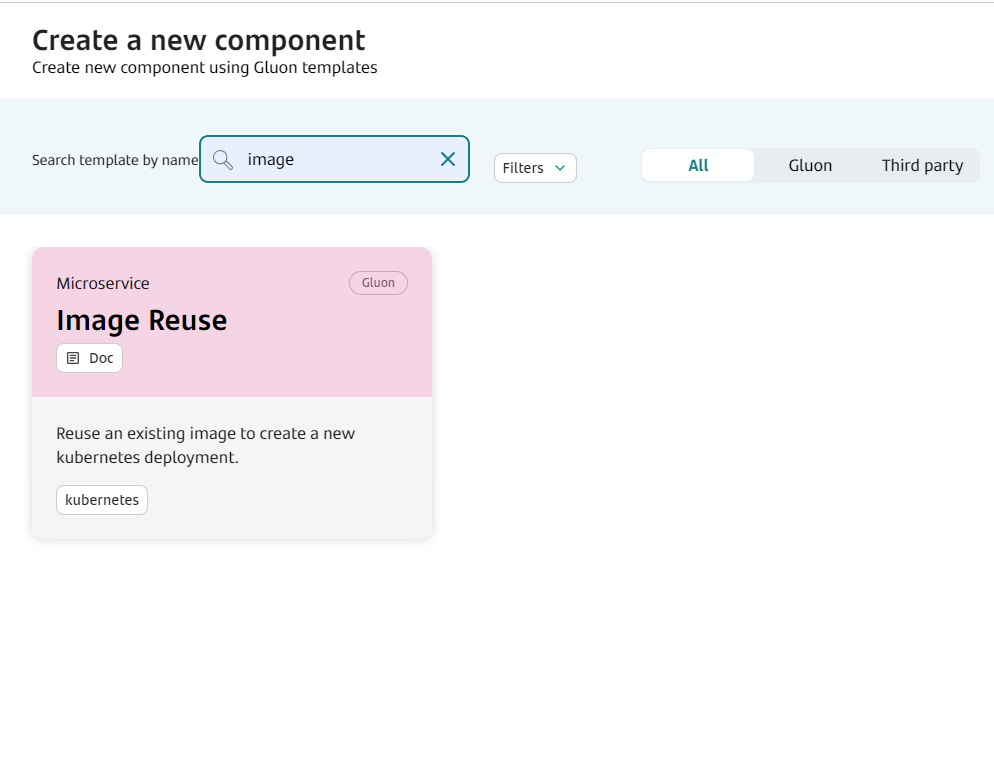
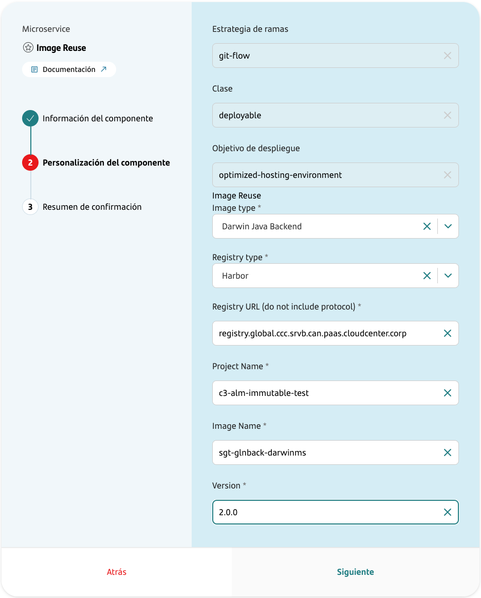
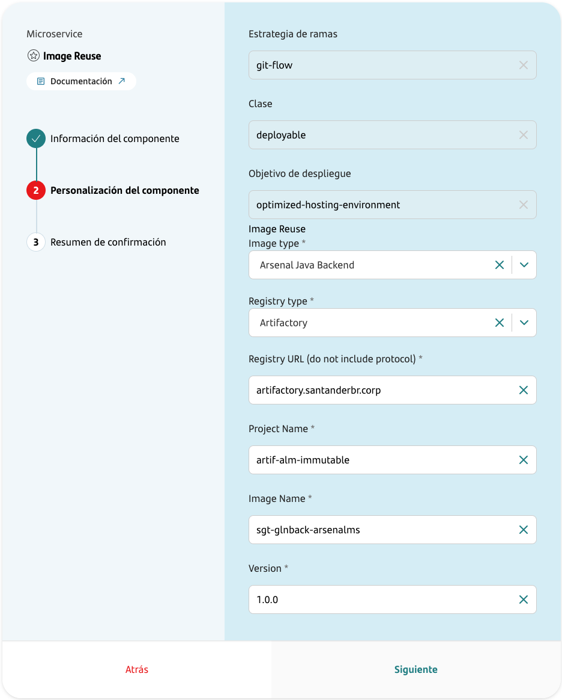
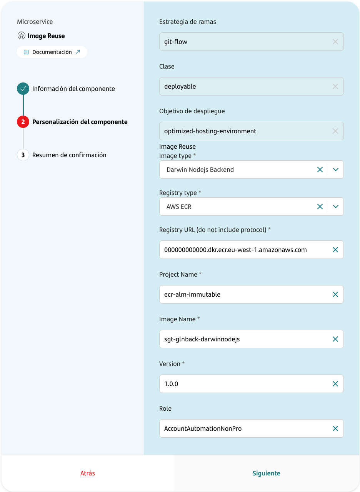
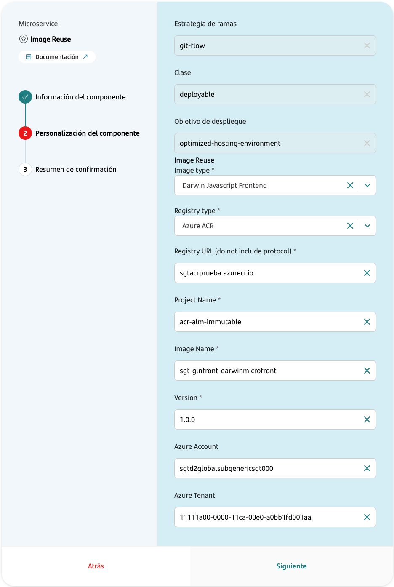
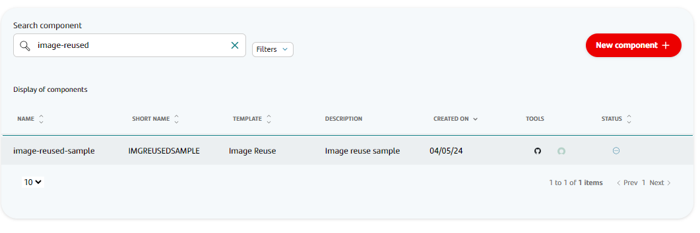
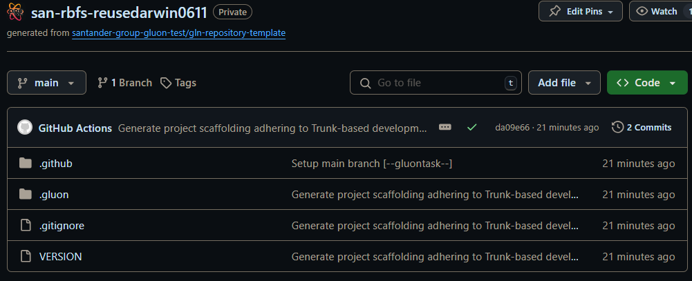

## Introduction

The purpose of this documentation is to provide a **step-by-step guide** on how to orchestrate the deployment of an existing image in other destination entity within the GLUON platform.

This guide will allow you to understand how read an image from one registry, copy to another registry and deploy it through a CD process.

All deployments will be done in a Kubernetes cluster from an immutable image that must be already uploaded to a registry (Harbor/Artifactory/AWS ECR/Azure ACR).

## Prerequisites

In the version 2.0 of the Image Reuse Journey, the following prerequisites are required:

### Available Technologies

#### Backend

  - [Santander Spring Boot Microservice](../../software/backend/java/santander/ms.md)
  - Arsenal Microservice
  - Darwin Java Microservice
  - [Darwin Python Microservice](../../software/backend/python/darwin/darwin-python-journey.md)
  - [Darwin NodeJs Microservice](../../software/backend/nodejs/darwin/darwin-node-journey.md)
  - [Banksphere](../../software/banksphere/banksphere-journey.md)

#### Frontend Web

  - [Darwin](../../software/front/index.md)
  - [React](../../software/front/index.md)

  To be able to reuse an image, the following prerequisites must be met:

  - The reused image must be a Release, meaning that the version must be a Release version `x.x.x` following the [Semantic Versioning](https://semver.org/) standard.
  - Additionally, in order to deploy to production environments, a Functional Testing component will also be required to cover the CD cycle at the image's destination.

???+ warning "Important"

    In some cases, a configuration ConfigMap must be created in the target environments prior to deployment. We strongly recommend to check the documentation located in the component that you are going to create.

## Create Component

### Gluon Portal

First, you have to [**onboard your application**](../../..//index.md). Once you have your application created, you can start creating your component.

To create a component, follow the steps described in [**Component Management**](../../../application/component-management/create-component.md), searching for the component to be created.

You have to select the type of component you want to create, in this case you are going to create an **Image Reuse** component.



The user must provide the location of the image to be reused.
Here there are several examples of component configurations, one by each registry type:

#### Harbor example



#### Artifactory example



#### AWS ECR example



#### Azure ACR example



Image Reuse Template Parameters:

| **Input**             | **Required** |       **Default value**       | **Description**                                                                                                                                                 |
|-----------------------|:------------:|:-----------------------------:|-----------------------------------------------------------------------------------------------------------------------------------------------------------------|
| **Image Type**        |     true     |              N/A              | Indicates the type of image to be reused.                                                                                                                       |
| **Registry type**     |     true     |              N/A              | Kind of the registry supported: `Harbor`, `Artifactory`, `AWS ECR`, `Azure ACR`                                                                                 |
| **Registry URL**      |     true     |              N/A              | URL of the registry where the origin image is currently stored. Do not include protocol in this parameter.                                                      |
| **Project Name**      |     true     |              N/A              | Name of the registry project where the image is stored.                                                                                                         |
| **Image Name**        |     true     |              N/A              | Name of the image to be reused.                                                                                                                                 |
| **Version**           |     true     |              N/A              | Version of the image to be reused.                                                                                                                              |
| **Role**              |     true     |              N/A              | States the role associated with the AWS User. Only available for AWS ECR Image Type                                                                             |
| **Azure Account**     |     true     |              N/A              | Account identity to access to Azure Cloud services. Only available for Azure ACR Image Type                                                                     |
| **Azure Tenant**      |     true     |              N/A              | Id associated with the Tenant of the organization that it is necessary to use. Only available for Azure ACR Image Type                                          |

Once the component is created, we will be able to see it in the component list, where we will have a direct link to the GitHub repository.

???+ remember

    The repository will be created following the [Repository Naming Convention](../../../application/component-management/create-component.md#repository-naming-convention).



We have the following links in:

| Item              | Link                                               | Role Permission                                                                                                                                                                                                                  |
|-------------------|----------------------------------------------------|----------------------------------------------------------------------------------------------------------------------------------------------------------------------------------------------------------------------------------|
| GitHub Repository | Link to the repository created in GitHub           | Developer (RW) /Technical Lead (Maintain) [All roles explained](https://docs.github.com/es/organizations/managing-user-access-to-your-organizations-repositories/managing-repository-roles/repository-roles-for-an-organization) |
| Catalog           | Link to the component catalog in Service Now (APM) | N/A                                                                                                                                                                                                                              |

### Reuse Image Template



#### Structure

The generated Image Reuse component has a structure similar to the following:

```text
📂.github
┣ 📂registry
┃ ┗ 📜reused-image-infos.yml
┣ 📂workflows
┃ ┣ 📜cd.yml
┃ ┣ 📜ci-tbd.yml
┃ ┣ 📜release-tbd.yml
┃ ┗ 📜update-component-workflow.yml
┗ 📜CODEOWNERS
📂.gluon
┣ 📂cd
┃ ┣ 📂cert
┃ ┃ ┣ 📜cd.yml
┃ ┃ ┗ 📜values-cert.yml
┃ ┣ 📂pre
┃ ┃ ┣ 📜cd.yml
┃ ┃ ┗ 📜values-pre.yml
┃ ┣ 📂pro
┃ ┃ ┣ 📜cd.yml
┃ ┃ ┗ 📜values-pro.yml
┃ ┗ 📜values.yaml
┗ 📂ci
┗  ┗ 📜properties.env
📜VERSION
```

???+ warning "Important"

    - The version located in the `VERSION` file must be the same that the version located in `.gluon/ci/properties.env` file.
    - For the Banksphere technology, the **CLIENT** property must be specified in the `.gluon/ci/properties.env` file as detailed in [Banksphere journey](../../software/banksphere/banksphere-journey.md#configuration-files)

## Local Development

??? abstract "Cloning your repository"

    ### Cloning your repository

    Once we have the device properly configured, the first step is to clone the project locally.

    To do so, visit [**How to clone de project**](../../../application/component-management/create-component.md#cloning-a-repository).

??? abstract "Configuring image reuse"

    ### Configuring image reuse

    When creating the component the origin image parameters has been set in .github/registry/reused-image-infos.yaml. Only version parameter can be adjusted later by developer modifying the value stored in *properties.env* file.

## Infrastructure

{!
   include-markdown "../../snippets/infrastructure/kubernetes-configmap-secrets.md"
!}

???+ warning "Important"

    In some cases to get the **Origin Image** you have to configure the **Username** and **Password**.
    You can set them using environment variables. The key names are `ORIGIN_REUSED_CREDENTIAL_USER` and `ORIGIN_REUSED_CREDENTIAL_PASSWORD`.

### How to configure your deployment environment

{!
   include-markdown "../../snippets/configuration/oam/snippet-oam.md"
   start="<!--Start Infrastructure 2.0-->"
   end="<!--End Infrastructure 2.0-->"
!}

## Component Configuration

### Branches

When you create the component from the Gluon Portal, the component is created with the default values of the template from the scaffolding workflow.

- Creates a **main** branch which contains an initial structure and content for reusing an existing image and deploying it an existing image in other Application/Entity.
- You can create a **feature** branch from the **main** branch to add new features or fix bugs.

This is because we are using the Trunk Based Development (TBD) branching strategy.

### Deployment

#### Introduction to Technology-Specific Configuration

In our deployment configuration, we have introduced an additional level of indentation to specify the type of technology being used for deployment.
This allows for more organized and clear configuration files,
making it easier to manage and customize deployments based on the specific technology stack.

#### Example Configuration

Below is an example configuration using `darwinsb`:

```yaml
darwinsb:
    enabled: true # Do not change this value
    ########################################################################################################################################
    # Important information for the deployment of the image.                                                                               #
    # See Documentation for more information:                                                                                              #
    # Chart path:https://registry.global.ccc.srvb.can.paas.cloudcenter.corp/harbor/projects/3068/repositories/micro-java/artifacts-tab     #
    # version: 3.4.1                                                                                                                       #
    # The following attributes can be used to customize the deployment.                                                                    #
    # image                                                                                                                                #
    # replicaCount                                                                                                                         #
    # lifecycle                                                                                                                            #
    # extraContainerPorts                                                                                                                  #
    # livenessProbe                                                                                                                        #
    # readinessProbe                                                                                                                       #
    # initContainers                                                                                                                       #
    # service                                                                                                                              #
    # extraEnvVars                                                                                                                         #
    # extraEnvVarsCM                                                                                                                       #
    # extraEnvVarsSecret                                                                                                                   #
    # extraVolumes                                                                                                                         #
    # extraVolumeMounts                                                                                                                    #
    # And more...                                                                                                                          #
    ########################################################################################################################################
    image:
        ## @param image.registry micro image registry to fill
        repository: ${PROJECT}/sgt-gluonad-mcrdarw53
        ## @param image.registry micro image registry to fill
        registry: ${REGISTRY}
        ## @param image.tag micro image tag
        ## Use ${TAG_VERSION} for the value will use the same version of the component.
        tag: ${TAG_VERSION}
    darwin:
        technologyVersion: 17
        configType: cm
        gitRepo: https://kubernetes.io/docs/user-guide/images.git
```

- Technology-Specific Key: The top-level key (darwinsb in this example) specifies the technology being used. The key name is specific to the technology and should be used to group the technology-specific settings.
- Enabled Flag: The enabled flag indicates whether this configuration should be applied. Do not change this value.
- Image Configuration: The image section contains details about the image repository, registry, and tag.
- Technology-Specific Settings: The darwin section includes settings specific to the Darwin technology, such as technologyVersion, configType, and gitRepo.

???+ warning "Important"

    The naming convention for objects in Kubernetes includes a `darwinsb` suffix, as it affects the creation of configmaps in the cluster.

### Helm Configuration

For Helm Chart configuration, please refer to the specific image Helm Chart configuration:

#### Backend

  - [Santander Spring Boot Microservice](../../software/backend/java/santander/ms.md#helm-configuration)
  - Arsenal Microservice
  - Darwin Java Microservice
  - [Darwin Python Microservice](../../software/backend/python/darwin/darwin-python-journey.md#helm-configuration)
  - [Darwin NodeJs Microservice](../../software/backend/nodejs/darwin/darwin-node-journey.md#helm-configuration)
  - [Banksphere](https://github.com/santander-group-shared-assets/gln-back-bks-chart-java/blob/main/README.md){:target="_blank"}

#### Frontend Web

  - [Darwin](../../software/front/index.md)
  - [React](../../software/front/index.md)

???+ warning "Important"

    Put special attention to required configuration parameters for the deployment of the image. They
    could be different depending on the technology stack.

### Secrets Configuration

{!
   include-markdown "../../snippets/configuration/maven-configuration.md"
   start="<!--Start Github Secrets 2.0 - secret type no vault-->"
   end="<!--End Github Secrets 2.0 - secret type no vault-->"
!}

???+ warning "Important"

    Environment secrets are only for deployments

{!
   include-markdown "../../snippets/configuration/maven-configuration.md"
   start="<!--Start Github Secrets 2.0 - secrets-->"
   end="<!--End Github Secrets 2.0 - secrets-->"
!}

???+ warning "Important"

    Registries Infrastructure does not support Vault secrets

## Deploy your application

{!
   include-markdown "../../snippets/lifecycle/tbd-image-reuse.md"
!}

## Changelog

### Version 1.0.0

Initial version from which changes are recorded in changelog
