## Introduction

The purpose of this documentation is to provide a step-by-step guide on how to orchestrate the namespace creation and harbor space.

???+Warning "Scope"

     This solution is for companies that have cluster OCP with CCC. If you, as a company, want have clusters CCC you should
     contact with CCC, the documentation for a company made to get clusters is the next, 
     [CCC](https://santandernet.sharepoint.com/sites/C3-CaaS) and the contact is felipe.hernandez@gruposantander.com

## Prerrequisites and considerations to taken into account

### Prerrequisites

If you want to use the functionality related to the creation namespace and harbor space, you, as a company, should send
the data of namespace and harbor related, to try to get the relationship between clusters OCP and harbors associated.
This information, can manage by your Gluon Champions follow the next link [Gluon Portal](../../../getting-started/support/index.md#portal-cluster-onboarding),
you should create a request with the information appear it.

Another prerequisite is that you, as an application, should create the folder structure in vault before using this
functionality, otherwise you would get an error when using the functionality.

### Considerations

There are some considerations to be taken into account as:

???+Info "Related to who users can create namespaces"

     This functionality can use for all members of application until accept the creation of namespace. 
     Only this point can accept the application owner.

???+Info "Related to the harbor's users"

     The process of this functionality will not create the credentials related to the harbor.
     How generate this credentials with this process? As the company are doing in this moment.
     In the future versions, the process automate this situation too, but in 3.0 still not.

???+Info "Related to credential in vault"

     The process of this functionality will create the service account, give a role inside of namespace, and create a secret
     with token for deploy in vault for application.

???+Info "Related to network policies"

     The process of this functionality will create a egressnetworkpolicy with deny all traffic by CISO's suggestions, only
     add the harbor to let download the images. With the new version, 5.0 of gluon, you can manage the egressnetworkpolicy
     but as a prerrequisite to use this solution is that you, as an application, should create before the request of 
     firewall rule, Once the firewall rule is satisfactory then you can manage the destinations of your application 
     through the egressnetworkpolicy file.

???+Info "Related to the flow modification"

     With the new version of this functionality, now the application can change the limits related to the namespace as
     the limits of number of pods, request of cpu by pod or container,...

???+Info "Related to the harbor.yaml"

     With the new version, this file will be removed. The components created previously to this new version, the linter
     or PR will say you that this file must remove of repository. The process will get the harbor internally.

???+Info "Related to the what applications are supported"

     This functionality is, for this moment, for to new applications and companies that have clusters OCP with CCC,
     old applications in the future versions can be inside of plat360 and operate, manage his namespace by plat360. 

???+Info "Related to select sizing of namespace when create the component"

     Now, the values of quotas and limits can be different

???+Info "Mapping of roles in Openshift"

     | Environment | Role | Team | Description |
     | --- | --- | --- | --- |
     | DEV | Edit | GR_ALMNXTGN_NGGLUON_*team-name*_TL | Technical-lead |
     | DEV | View | GR_ALMNXTGN_NGGLUON_*team-name*_DEV | Developers |
     | PRE | View | GR_ALMNXTGN_NGGLUON_*team-name*_TL | Technical-lead |
     | PRE | View | GR_ALMNXTGN_NGGLUON_*team-name*_DEV | Developers |
     | PRO | View | GR_ALMNXTGN_NGGLUON_*team-name*_TL | Technical-lead |
     | PRO | View | GR_ALMNXTGN_NGGLUON_*team-name*_DEV | Developers |

## Create Component

### Gluon Portal

First you have to [**onboard your application**](../../..//index.md). Once you have your application created, you can start creating your component.

To create a component, follow the steps described in [**Component Management**](../../../application/component-management/create-component.md), searching for the component to be created.

You have to select the type of component you want to create, in this case you are going to create a **Openshift Namespace Creation**.

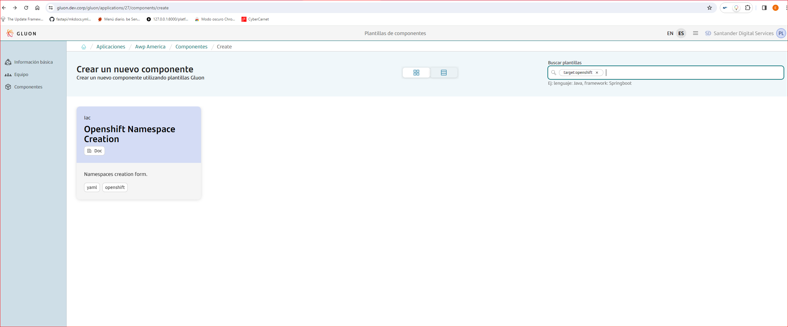

The user can customize the limits and quotas of project.

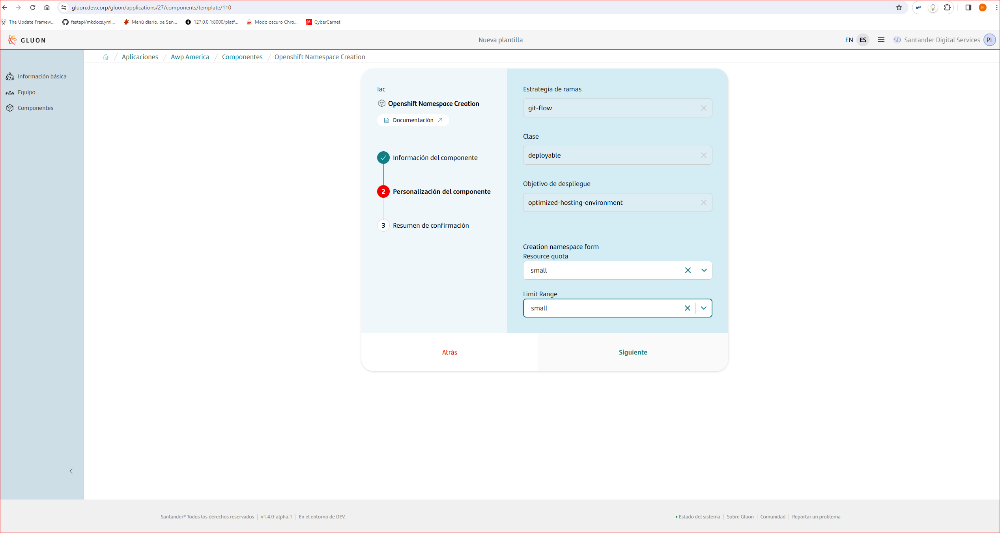

There are 3 possibles limits and quotas in this moment that are:

* Small
* Medium
* Large

What means these 3 possible values? We try to answer this question with the following table:

??? info "Table of limits"

     | Company | Value | Pods Memory | Pods CPU | Container memory | Container CPU | Number of Volumes |
     | --- | --- | --- | --- | --- | --- | --- |
     | Santander Spain | Small | 2 | 1 | 2 | 1 | 10 |
     | Santander Spain | Medium | 4 | 2 | 4 | 2 | 20 |
     | Santander Spain | Large | 4 | 2 | 4 | 2 | 40 |
     | Santander CIB | Small | 2 | 1 | 2 | 1 | 10 |
     | Santander CIB | Medium | 4 | 2 | 4 | 2 | 20 |
     | Santander CIB | Large | 4 | 2 | 4 | 2 | 40 |
     | Santander Totta | Small | 2 | 1 | 2 | 1 | 10 |
     | Santander Totta | Medium | 4 | 2 | 4 | 2 | 20 |
     | Santander Totta | Large | 4 | 2 | 4 | 2 | 40 |
     | Santander Digital Services | Small | 2 | 1 | 2 | 1 | 10 |
     | Santander Digital Services | Medium | 4 | 2 | 4 | 2 | 20 |
     | Santander Digital Services | Large | 4 | 2 | 4 | 2 | 40 |

??? info "Table of quotas"

     | Company | Value | Memory | Storage_quotas | Configmaps | Cronjobs | Deployment Config | Deployments | Jobs | Pods | ReplicaSets | ReplicationController | Secrets | Services | StatefulSets |
     | --- | --- | --- | --- | --- | --- | --- | --- | --- | --- | --- | --- | --- | --- | --- |
     | Santander Spain | Small | 30 | 10 | 20 | 5 | 20 | 20 | 5 | 75 | 20 | 20 | 10 | 20 | 10 |
     | Santander Spain | Medium | 60 | 20 | 40 | 10 | 40 | 40 | 10 | 150 | 40 | 40 | 20 |40 | 20 |
     | Santander Spain | Large | 120 | 40 | 80 | 80 | 80 | 80 | 80 | 40 | 300 | 80 | 80 | 40 | 40 |
     | Santander CIB | Small | 30 | 10 | 20 | 5 | 20 | 20 | 5 | 75 | 20 | 20 | 10 | 20 | 10 |
     | Santander CIB | Medium | 60 | 20 | 40 | 10 | 40 | 40 | 10 | 150 | 40 | 40 | 20 |40 | 20 |
     | Santander CIB | Large | 120 | 40 | 80 | 80 | 80 | 80 | 80 | 40 | 300 | 80 | 80 | 40 | 40 |
     | Santander Totta | Small | 30 | 10 | 20 | 5 | 20 | 20 | 5 | 75 | 20 | 20 | 10 | 20 | 10 |
     | Santander Totta | Medium | 60 | 20 | 40 | 10 | 40 | 40 | 10 | 150 | 40 | 40 | 20 |40 | 20 |
     | Santander Totta | Large | 120 | 40 | 80 | 80 | 80 | 80 | 80 | 40 | 300 | 80 | 80 | 40 | 40 |
     | Santander Digital Services | Small | 30 | 10 | 20 | 5 | 20 | 20 | 5 | 75 | 20 | 20 | 10 | 20 | 10 |
     | Santander Digital Services | Medium | 60 | 20 | 40 | 10 | 40 | 40 | 10 | 150 | 40 | 40 | 20 |40 | 20 |
     | Santander Digital Services | Large | 120 | 40 | 80 | 80 | 80 | 80 | 80 | 40 | 300 | 80 | 80 | 40 | 40 |

<br>

### Namespace template

#### Branches

When you create the component from the Gluon Portal, the component is created with the default values of the template the scaffolding workflow.

* Creates a **main** branch which contains just the workflow file for the created component.
* Creates a **development** branch with an initial structure and content for a namespace and harbor space.

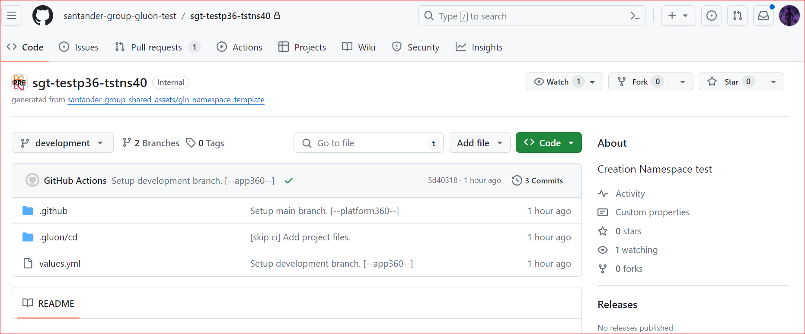

<br>

#### Structure

The generated Namespaces has a structure similar to the following:

``` bash
📂.github
 ┣ 📂workflows
 ┃ ┗ deployment-namespace.yml
 ┃ ┗ release.yml
 ┃ ┗ scqa.yml
 ┗ 📜CODEOWNERS
 📂.gluon
 ┣ 📂cd
 ┃ ┣ 📂dev
 ┃ ┃ ┃ ┗ 📜deployment.yaml
 ┃ ┃ ┃ ┗ 📜custom_values.yaml
 ┃ ┃ ┃ ┗ 📜egressnetworkpolicy.yaml
 ┃ ┣ 📂pre
 ┃ ┃ ┃ ┗ 📜deployment.yaml
 ┃ ┃ ┃ ┗ 📜custom_values.yaml
 ┃ ┃ ┃ ┗ 📜egressnetworkpolicy.yaml
 ┃ ┣ 📂pro
 ┃ ┃ ┃ ┗ 📜deployment.yaml
 ┃ ┃ ┃ ┗ 📜custom_values.yaml
 ┃ ┃ ┃ ┗ 📜egressnetworkpolicy.yaml
 📜README.md
 📜values.yaml

```

For more information on the structure and functionality of ConfigMaps component, please refer to the
[Namespace Scaffolding documentation](../../../application/ci-cd/technologies/configmap/scaffolding/configmap-scaffolding.md)
and [Namespace CI/CD documentation](../../../application/ci-cd/technologies/configmap/helm-cd-workflow.md).

### Inspect your component in your local environment

??? abstract "Cloning your repository"

    Once you have the device properly configured, the first step is to clone the project locally.

    To do so, visit [**Cloning a repository**](../../../application/component-management/create-component.md#cloning-a-repository).

## Configure your component

### Branches

{!
   include-markdown "../../snippets/configuration/maven-configuration.md"
   start="<!--Start Gitflow Branches-->"
   end="<!--End Gitflow Branches-->"
!}

<br>

### Configuration Files

#### File .gluon/cd/\[env\]/deployment.yaml

In this file we are going to define the necessary parameters so that the github action can deploy
the namespace correctly.

The variables to be modify by the developer or by any member of the application are:

* **CI_ID**: Required, component Item of CMDB, this value is the identifier related to the cluster openshift and this value is obtained by viewing
the infra authorized table in the gluon portal 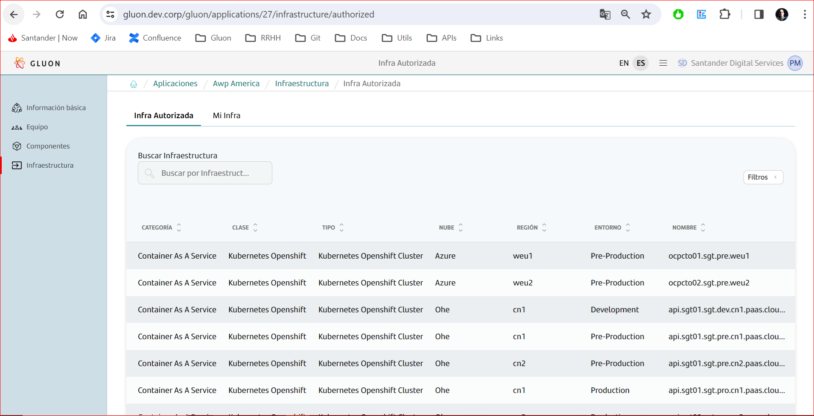
As the pictures shows, the type of this CI must be "Kubernetes Openshift Cluster ".
* **item.displayName**: Not required, the default value is "test", if you dont change this value, the process will get the displayName of
namespace component but if you change this value, the value will be appear in the name of namespace in the console of cluster openshift.
* **item.description**: Not required, the description of namespace, the default value is "prueba", if you dont change this value, the process will get the
description of namespace component but you can change the value if you want.
* **item.valuesFile**: Required, now can be "values.yml" that are the basic values or "custom_values.yaml".

Example:

```yaml
infrastructure:
    - CI_ID: "CI0000000057"
      items:
      - displayName: "Cards"
        description: "Project related to the santander cards"
        valuesFile: values.yml
      - displayName: "Accounts"
        description: "Project related to the santander accounts"
        valuesFile: custom_values.yaml
```

???+ info "Info of production environment"

     In the production environment we will have two CI_ID section, because in the production environment we have a twin cluster model.

#### File .gluon/cd/\[env\]/custom_values.yaml

In this file the application can use one or all items. If you want create a namespace for first time with custom_values, all items or
data must be uncommented. If you want change something related of sizing of namespace you can uncommented one or all items that have
the file. The file is:

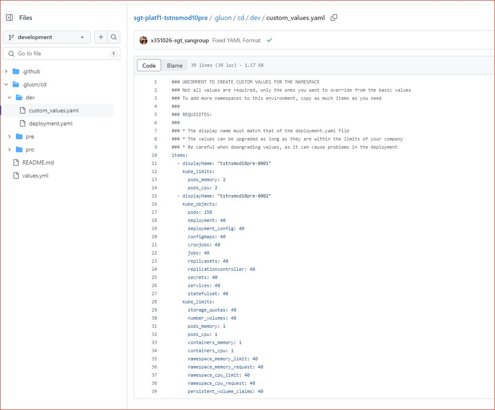

Example:

```yaml
### UNCOMMENT TO CREATE CUSTOM VALUES FOR THE NAMESPACE
### Not all values are required, only the ones you want to override from the basic values
### To add more namespaces to this environment, copy as much items as you need
###
### REQUISITES:
###
### * The display name must match that of the deployment.yaml file
### * The values can be upgraded as long as they are within the limits of your company
### * Be careful when downgrading values, as it can cause problems in the deployment
items:
  - displayName: "tstnsmod10pre-0001"
    kube_limits:
      pods_memory: 2
      pods_cpu: 2
  - displayName: "tstnsmod10pre-0002"
    kube_objects:
      pods: 150
      deployment: 40
      deployment_config: 40
      configmaps: 40
      cronjobs: 40
      jobs: 40
      replicasets: 40
      replicationcontroller: 40
      secrets: 40
      services: 40
      statefulset: 40
    kube_limits:
      storage_quotas: 40
      number_volumes: 40
      pods_memory: 1
      pods_cpu: 1
      containers_memory: 1
      containers_cpu: 1
      namespace_memory_limit: 40
      namespace_memory_request: 40
      namespace_cpu_limit: 40
      namespace_cpu_request: 40
      persistent_volume_claims: 40
```

???+Info "Related to the how use this file"

     At the beginning, all items will be commented. You can uncommented all items if you want create the namespace
     for first time. If you can change from basic values to custom_values one or all data can be uncommented. 
     There will be a limit, and this limit is the limit related to CCC let for each company.

???+Warning "Components created before the new version"

     You must put the file content in your repository created by the namespace component in all environments that
     you want create/modify namespace. The file is [custom_values](downloads/custom-values.yaml) **Please, the name of file
     is "custom_values.yaml" not with "-", please take in a account.

#### File .gluon/cd/\[env\]/egressnetworkpolicy.yaml

In this file the application can manage the egress network policy related to your own namespace. There are
two possibilities:

* CIDR: This is a range of ips, if you only have 1 IP the format in CIDR is XXX.XXX.XXX.XXX/32
* DNS: This option is only the dns without "http" or "https" and without the port. Only the DNS name.

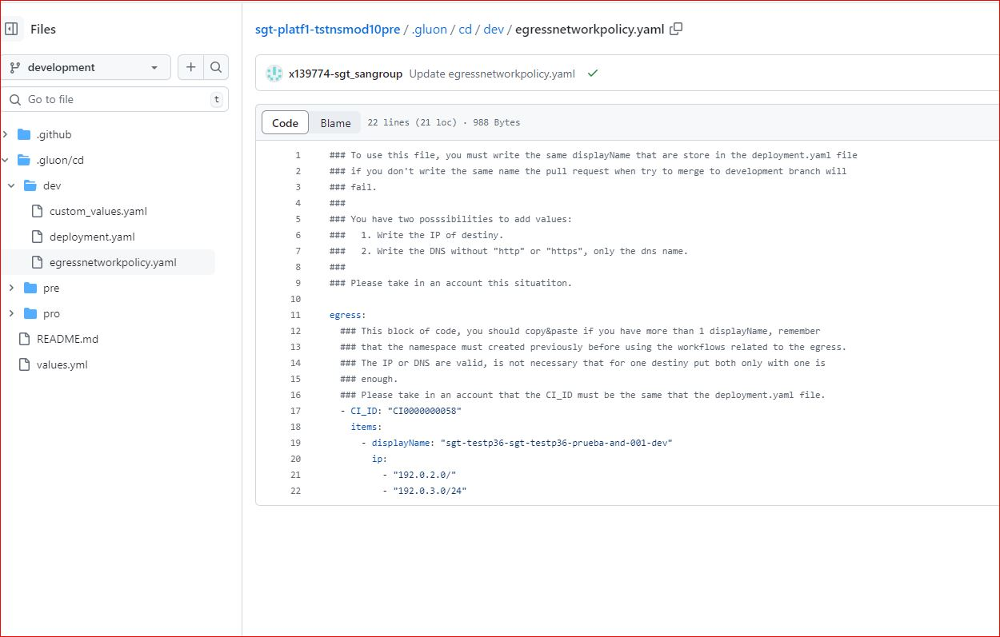

Example:

```yaml
### To use this file, you must write the same displayName that are store in the deployment.yaml file
### if you don't write the same name the pull request when try to merge to development branch will
### fail.
###
### You have two posssibilities to add values:
###   1. Write the IP of destiny.
###   2. Write the DNS without "http" or "https", only the dns name.
###
### Please take in an account this situatiton.

egress:
  ### This block of code, you should copy&paste if you have more than 1 displayName, remember
  ### that the namespace must created previously before using the workflows related to the egress.
  ### The IP or DNS are valid, is not necessary that for one destiny put both only with one is
  ### enough.
  ### Please take in an account that the CI_ID must be the same that the deployment.yaml file.
  - CI_ID: "CI0000000000"
    items:
      - displayName: "test"
        ip:
          - "127.0.0.1"
          - "192.168.1.1" # Example of other IP
        dns:
          - "gluon.gs.corp"
          - "api.example.com" # Example of other DNS
```

#### File values.yaml

In this file we are going to define the necessary parameters so that the github action can create
the namespace correctly.

The variables to be modify by the developer or by any member of the application are:

* **Quota**: The possible values are defined in the component, you should cannot change the value
that you introduce when you create the component.
* **Limits**: The possible values are defined in the component, you should cannot change the value
that you introduce when you create the component.
* **Quota Advanced settings**: In this version, this option is not available, in future versions
you can change all or one or part of all keys.
* **Limits advanced settings**: In this version, this option is not available, in future versions
you can change all or one or parte of all keys.

Example:

```yaml
quota:
    basic:
        value: small
limits:
    basic:
        value: small

```

<br>

## Build and Deploy your Namespace & Harbor Space

We will now describe the steps you need to take in order to be able to deploy your Namespace & Harbor Space
through the CERT, PREP and PRO environments.

???+ danger "Important"

     It's important to mention that only the application_owner role will be able to execute the namespace creation workflow, the other
     members of the application will be able to create the component, modify the data, create the pull request, ... but the execution
     can only perform the application_owner

The steps that all application must follow are the next:

1. Create a feature branch and configure the component for namespace and Harbor creation. Then, create a Pull Request to development branch.
2. When the PullRequest is created, there are a action that validate the data in the files.
3. When is OK the execution in the point before, you can merge your changes in the development branch.
4. When the data is merged, only the application_owner in the app, can execute the workflow dispatch to create the namespace.
5. With the namespace created, now you can execute the workflow related to the egress for to manage the egressnetworkpolicy related
to your application.
6. When the namespace is created, if you want, you can execute the release workflow.

### Build your configuration

We will now describe what happens when you create the pull request.

When the pull request is created from a feature branch vs development branch (the default branch and integration branch),
the scqa.yml workflow execute the checks to try to validate the data if is correct or not. The data should be correct for your application
for belonging to company or business unit. We try to explain the validation of data:

* Check if get data related to the app is truth for example, if the app have the folder correctly in vault, the app exists in gluon
related to an entity exists in gluon too,...
* Check if egressnetworkpolicy.yaml exists on the repository. If not, the PR will be rejected.
* Check if the harbor.yaml exists on the repository. If exists, the PR will be rejected.
* Check if the custom_values.yaml exists on the repository. If not, the PR will be rejected.
* Check if the entries on yaml, "infrastructure" and "CI_ID" exists in the deployment.yaml file on
the repository. If not, the PR will be rejected.
* Check if on the deployment.yaml in the PRO environment dont have 2 CIs, if not have it, the PR
will be rejected.
* Check if on the deployment.yaml in the DEV or PRE environment, have more than 1 CI, if have it, the PR
will be rejected.
* Check if the CI of cluster if default value, the other values on the deployment.yaml will be default too,
if not, the PR will be rejected.
* Check if the namespaces created by the app are the same that have deployment.yaml, in other words, the
deployment.yaml, by each environment, that have the same that the namespace related to the application. Example,
the app, "cards", with ID 2, have 4 namespace in dev environment, 2 in pre environment, and 1 in pro environment
and the deployment.yaml have a displayName in dev environment different related to that 4 namespaces,
The process will understand that you are trying to delete namespaces and that operation is not available for now, so
the PR will be rejected.
* Check if the egressnetworkpolicy.yaml file have values related to a namespace that is not create it, if the
namespace is not created yet, the PR will be rejected because before you manage the egress, you need the namespace
created.
* Check if the displayName in egressnetworkpolicy.yaml file is the same, at least, one of the deployment.yaml, if not
the PR will be rejected.
* Check the valuesFile, check the name of the file that are two possibilities "values.yml" and "custom_values.yaml",
the result of check is not matched with the before names of file the PR will be rejected.
* Check on dev and pre environment, if there are duplicate displayNames in the deployment.yaml file. If have it,
the PR will be rejected.
* Check on the pro environment, if the displayName is different, if is different, the PR will be rejected.
* Check if each in all displayName on the deployment.yaml file has "values.yml" as valuesFile, so the process check
if there are an uncommented lines on the custom_values.yaml file if have it, the PR will be rejected.
* Check if in displayName on the deployment.yaml file has custom_values.yaml file as valuesFile, if have it, check
if at least one item is uncommented, if not the PR will be rejected.
* Check if the number of displayNames on the deployment.yaml file is different on the custom_values.yaml file, if
not the same number the PR will be rejected.
* Check if the displayName will create a NEW namespace and is selected custom_values.yaml file as valuesFile for that
displayName, if we are in this case, all elements in the custom_values.yaml file must be set, if there are a item commentted
the PR will be rejected.
* Check if for each set in the custom_values.yaml file is a values that exceeds the maximum value allowed
for the entity's tenant.
* Check if the cluster selected by the CI_ID is authorized for you application, for your business unit and for
your entity if not the PR will be rejected, and if you selected a cluster, for example, the PRE environment, but you selected
it in the dev/pro folder if all these situations occurs the PR will be rejected.

### Namespace & Harbor Space deploy

To deploy follow the steps below:

<div class="steps" markdown>

* From the **Actions** tab, select the workflow **Namespace creation & harbor space**.

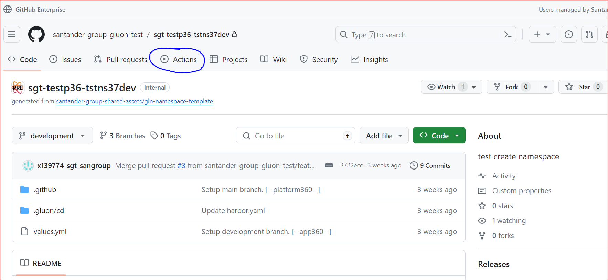

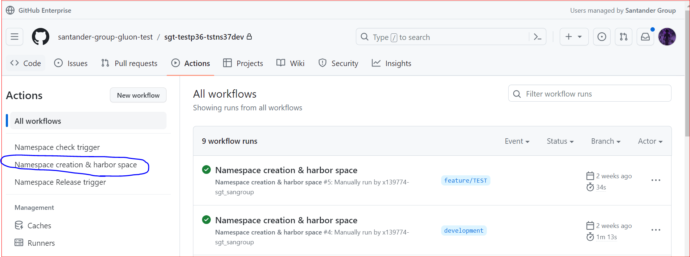

* On the right side of the screen, click on **Run workflow**.


* And finally, select the environment, that you want create the namespace. The only valid branch is development, if you select an another
the process will be rejected.

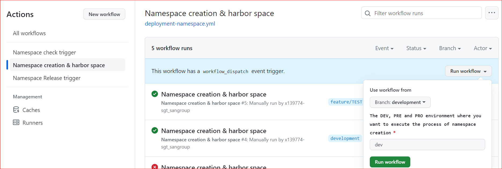

</div>

???+ warning

     From 4.3.0 version, you can modify the sizing of namespace.

Once created the namespace and harbor space you can see if was created or not, accessing to gluon portal and go to the table
of "my infra", as the following capture:

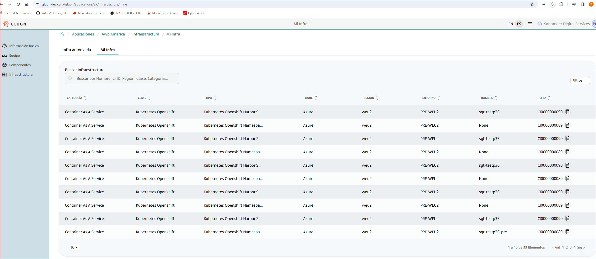

You can see the details of the namespace and harbor space created but in the futures versions, the data related to the details will be:

???+ Info

     The name of namespace will be "***company_short_name***-***app_short_name***-***display_name***-***env***, where:

     * **company_short_name**: It is the company short name related to the company onboarded in gluon
     * **app_short_name**: It is the app short name related to the application onboarded in gluon
     * **display_name**: It is the value of display name related to the component but if you change the default value "test"
     in deployment.yaml the value will be that you store in the deployment.yaml
     * **env** Environment where the project or namespace was created.

???+ Info

     The name of harbor space will be the pattern. This pattern is different and depends by company but usually will be
     ***company-short-name***-***app_short_name***-***tenant***

* **Namespace**: You can see 3 values "namespace name", "console_url" and "api_url".

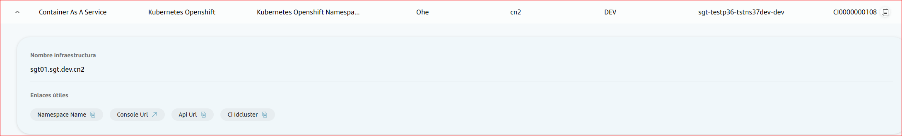

* **HarborSpace**: You can see 3 values "harbor space", "registry url" and the CI cluster that harbor is related to it.

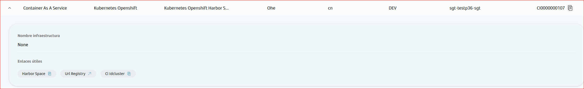

### EgressNetworkPolicy

To deploy follow the steps below:

<div class="steps" markdown>

* From the **Actions** tab, select the workflow **Namespace creation & harbor space**.


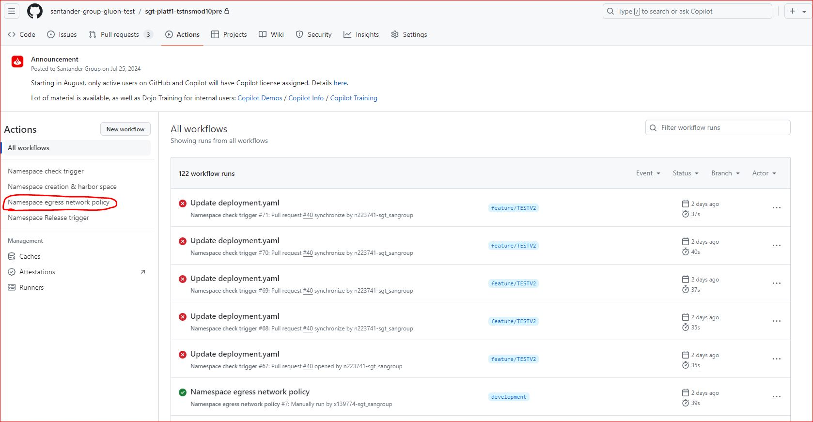

* On the right side of the screen, click on **Run workflow**.

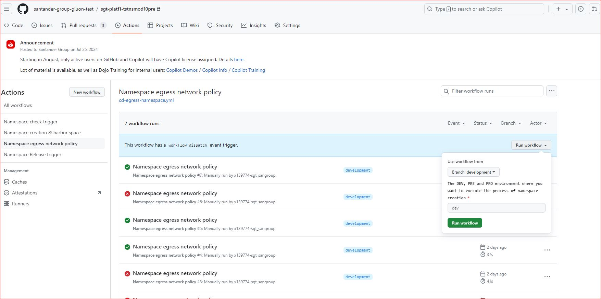

* And finally, select the environment, that you want manage your egressnetworkpolicy. The only valid branch is development, if you select an another
the process will be rejected.

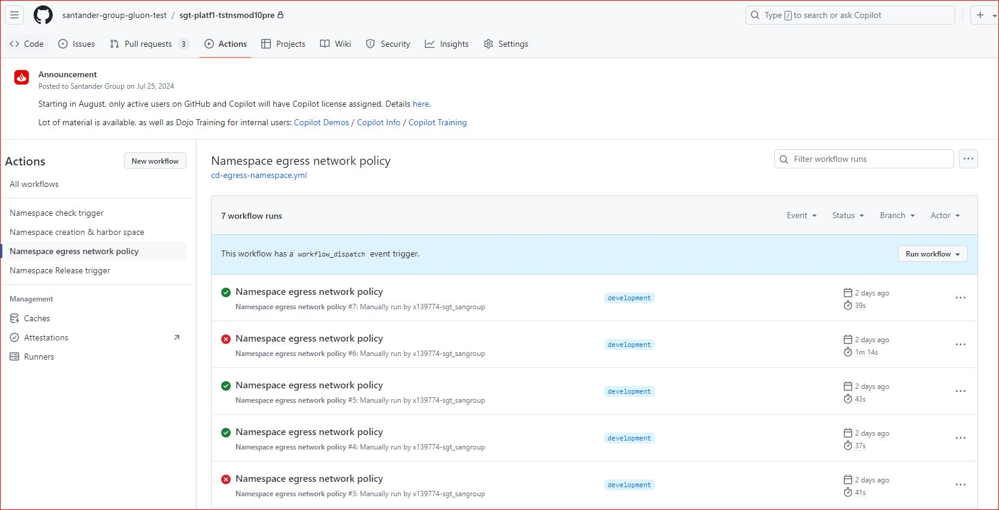

</div>

### Namespace & Harbor Space Release

To create a release when you decide are:

<div class="steps" markdown>

* From the **Actions** tab, select the workflow **Namespace release trigger**.


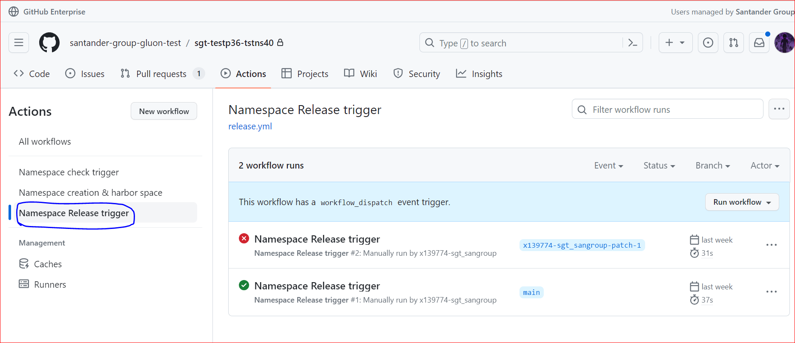

* On the right side of the screen, click on **Run workflow**.

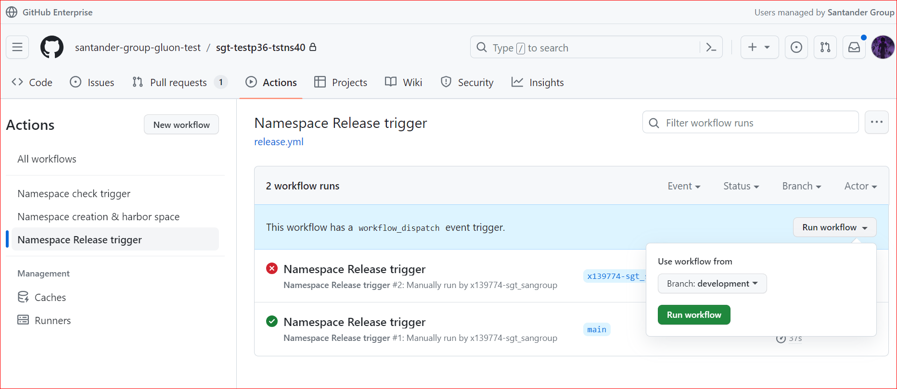

* And finally you can only select the branch but only development is a valid branch. An another value will be rejected.

</div>

### Pull request from Feature to Develop

As a prerrequisite, is that, sometimes the initialization repository is not executed automatically, is a thing related
to github.com, in any case, if it is not executed automatically you can go to the actions section and execute the repository
initialization dispatch workflow manually. For more clear we can see the follow image:

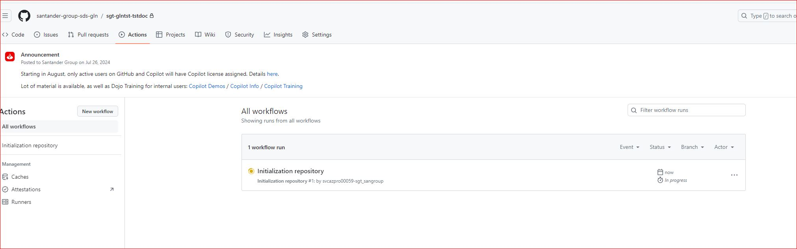

We will start working on the "Feature" branches of our GitHub repository and we will be integrating our changes into the
integration branch (develop or development).

When we create the Pull Request event from our "Feature" branch to the integration branch (develop or development),
the namespace_check_trigger.yml (SCQA related to the data in the repository) workflow will be executed automatically.

As we can see in the next image, when se create the pull request the SCQA workflow will be executed automatically,

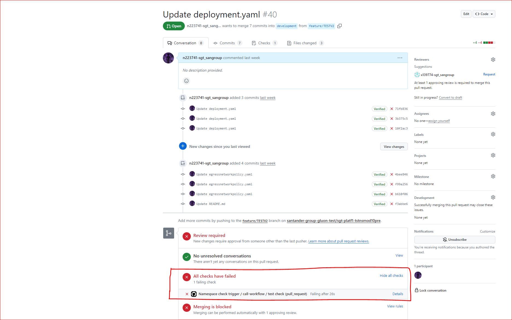

Any member of the application can generate the pull request.

### Push to develop

When approving the Pull Request, by any member of the application, the pull request integrate the data in the integration branch
(develop or development)

### Execute creation of namespace

You can follow the steps in the section below [Creation-Namespace](./namespace_harbor.md#execute-creation-of-namespace). Now only the application owner
can execute this workflow.
