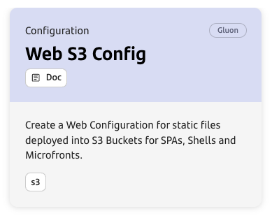
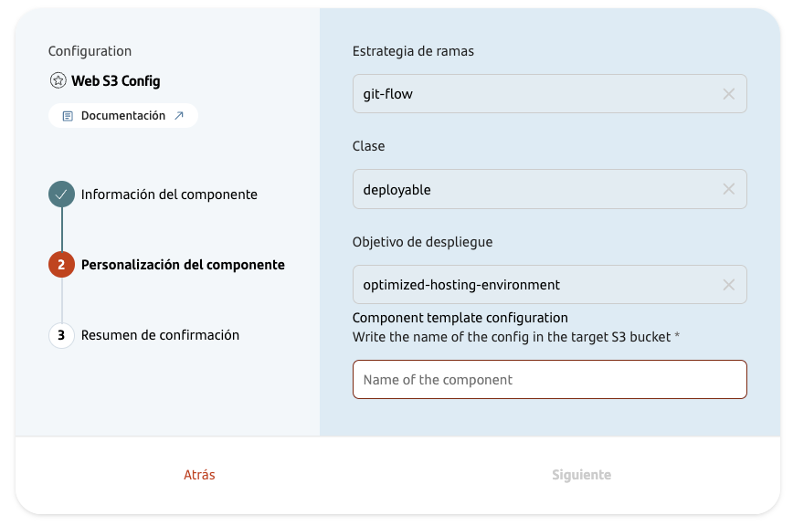
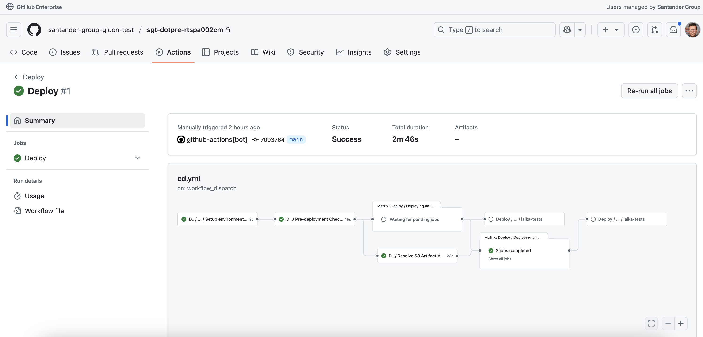
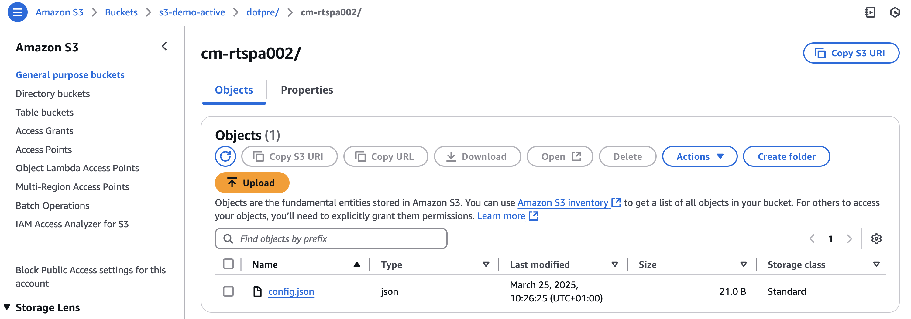

## Introduction

The purpose of this documentation is to provide a step-by-step guide on **how to orchestrate the deployment** of your web application (SPA, Shell or Microfront) **configuration for an S3 environment**.
It allows you to create a **Web S3 Config** component, configure it, and deploy it in the desired environment.
In contrast with a Kubernetes Configmap that can be contain files or variables, this component will only offer the configuration as a file.

### Config as a file

When you provide a configuration file (typically config.json), the file will be published into an artifact repository (typically Nexus or JFrog) in the CI workflow and deployed into an S3 Bucket in the CD workflow.

## Create Component

### Gluon Portal

First, you have to [**onboard your application**](../../../index.md). Once you have your application created, you can start creating your component.

To create a component, follow the steps described in [**Component Management**](../../../application/component-management/create-component.md), searching for the component to be created.

You have to select the type of component you want to create, in this case you are going to create a **Web S3 Config**.



The user can customize the type of component that they want to create:



- **Config name**: Name of the config on the final s3 bucket. It should start with `cm-` ending with the target shrot component name this config will configure.

Once the component is created, we will be able to see it in the component list, where we will have a direct link to the GitHub repository.

???+ remember

    The repository will be created following the [Repository Naming Convention](../../../application/component-management/create-component.md#repository-naming-convention).

We have the following links in:

| Item              | Link                                     | Role Permission                                                                                                                                                                                                                  |
|-------------------|------------------------------------------|----------------------------------------------------------------------------------------------------------------------------------------------------------------------------------------------------------------------------------|
| GitHub Repository | Link to the repository created in GitHub | Developer (RW) /Technical Lead (Maintain) [All roles explained](https://docs.github.com/es/organizations/managing-user-access-to-your-organizations-repositories/managing-repository-roles/repository-roles-for-an-organization) |
| Sonar Project     | Disabled                                 | N/A                                                                                                                                                                                                                              |
| Fortify Project   | Disabled                                 | N/A                                                                                                                                                                                                                              |
| Service Now       | Link to the component catalog            | N/A                                                                                                                                                                                                                              |

<br>

### Web S3 Config Template

#### Branches

When you create the component from the Gluon Portal, the component is created with the default values of the template from the scaffolding workflow.

- Create a **main** branch which contains the Web S3 configuration contents.


<br>

#### Structure

The generated repo has a structure similar to the following:

``` bash

📂.github
 ┣ 📂workflows
 ┣ ┣ 📜bluegreen-switch-workflow.yml
 ┣ ┣ 📜cd.yml
 ┣ ┣ 📜ci-artifact-tbd.yml
 ┃ ┗ 📜update-component-workflow.yml
 ┃ ┗ 📜version-validation.yml
 ┗ 📜CODEOWNERS
 📂.gluon
 ┣ 📂cd
 ┃ ┣ 📂cert
 ┃ ┃ ┗ 📜cd.yml
 ┃ ┣ 📂pre
 ┃ ┃ ┗ 📜cd.yml
 ┃ ┣ 📂pro
 ┃ ┃ ┗ 📜cd.yml
 ┃ ┗ 📜values.yaml
 ┗ 📂ci
   ┗ 📜properties.env
 📂config
 ┣ 📂cert
 ┃ ┗ 📜config.json
 ┣ 📂pre
 ┃ ┗ 📜config.json
 ┗ 📂pro
   ┗ 📜config.json
 📜.gitignore
 📜README.md
 📜package.json
```

### Inspect your component in your local environment

??? abstract "Cloning your repository"

    Once you have the device properly configured, the first step is to clone the project locally.

    To do so, visit [**Cloning a repository**](../../../application/component-management/create-component.md#cloning-a-repository).

## AWS/S3 Infrastructure

This component is designed to be deployed only on S3, with the same functionality that Kubernetes Configmap offers for a SPA/Microfront in a Kubernetes environment.

### How to configure the Infrastructure

{!
   include-markdown "../../software/front/web/snippets/snippet-oam.md"
   start="<!--Start Infrastructure for S3-->"
   end="<!--End Infrastructure for S3-->"
!}

## Configure your Component

### Branches

Gluon works with one branch that will need to be incorporated into our project:

- The main branch (main by default or master in old projects)

You should develop your new features in a `feature branch` and merge them into `main` using Pull Requests.
This is because the workflows works with Trunk-based Development strategy.

<br>

### Configure your repository secrets

{!
   include-markdown "../../snippets/configuration/s3-secrets.md"
   start="<!--Start Deployment Infra Github Secrets-->"
   end="<!--End Deployment Infra Github Secrets-->"
!}

<br>

### Configuration Files

#### Continuous Deployment files

The Continuous Deployment file (`cd.yml`) must contain the target deployment configuration that we want to use for deploying the component.
For each environment (cert, pre, pro), we have a folder with the `cd.yml` file, and there,
we can define several infrastructures to deploy in as many regions as we need.

``` bash
📂.gluon
┣ 📂cd
┃ ┣ 📂cert
┃ ┃ ┣ 📜cd.yml
┃ ┣ 📂pre
┃ ┃ ┣ 📜cd.yml
┃ ┣ 📂pro
┃ ┃ ┗ 📜cd.yml
```

Remember that `cd.yml` files contains examples, and the developer is responsible for filling them with the necessary deployment information.

For that purpose, it will only be necessary to add the `ci_id` identifiers defined by environment type in the `oam-application-definition.yml` file
inside **Gluon Open Application Model repository** associated with the company of the component.

Keep in mind that **`ci_id` must be the same as we have in OAM the config file**.

The `configuration_files` key allows setting the `values` files that they are necessary to be able to deploy in the infrastructures to which they refer.

| **Property**       | **Description**                                                             | **Example**                    |
|--------------------|-----------------------------------------------------------------------------|--------------------------------|
| ci_id              | Identifier of the infrastructure in the oam-application-definition.yml file | CI00000000097                  |
| configurationFiles | Path to the value configuration file in that environment                    | .gluon/cd/cert/values.yml      |

The following template shows an example of the structure that the `cd.yml` file should have:

```yaml
# Kubernetes cluster in AWS
- ci_id: CI00000000001
  configuration_files:
    - .gluon/cd/values.yml
# Kubernetes cluster in Azure
- ci_id: CI00000000002
  configuration_files:
    - .gluon/cd/values.yml
```

**Please, note**: The values.yml follows the same concept that kubernetes, but here there is no Helm Chart neither the need of differencing between environment. Know why in the next section.

<br>

#### File values.yaml

In this file, we define the values to be used in the workflow.

``` bash
📂.gluon
┣ 📂cd
┗ ┗ 📜values.yaml
```

We have just one attribute that we can configure:

- **applicationName**: Name of the config component in the final S3 bucket (this is: the final folder name)

???+ danger "Important: Component Name"

    It must start with `cm-` and end with the component short-name that it configures.

Example:

```yaml
# This is a YAML-formatted file.
# Declare variables to be passed into your templates.

## @param applicationName Allows to set the name of the folder on S3 Bucket
## IMPORTANT: It must start with cm- and end with the component short-name that it configures
## Example: For an SPA with 'myspa' shortname, this value must be 'cm-myspa'
componentName: cm-myspa
```

<br>

#### File config/**/config.json

In this file, we will configure the environment-dependent properties that are going to be consumed in the SPA or Microfront configuration.

#### File .gluon/ci/properties.env

This file will be configured almost completely by default with environment properties for CD workflow.

``` bash
📂.gluon
┗ 📂ci
  ┗ 📜properties.env
```

The resulting file will be:

```yaml title=".gluon/ci/properties.env" linenums="1"

# Properties
NODE_VERSION='18.20.2'
NPM_APPLICATION_DIST_DIRECTORY='config'
NPM_RUN_TEST_COMMAND='echo "Do nothing on test"'
NPM_RUN_BUILD_COMMAND='echo "Do nothing on build"'
NPM_RUN_INSTALL_COMMAND='echo "Do nothing on install"'

# NPM GROUP
NPM_APPLICATION_GROUP=santander-group-gluon-test
```

For getting more information about the properties environment file,
please refer to [Continuous Integration file documentation](../../../application/ci-cd/cd/cd-rm/cd-workflow/ci-envs-configuration.md).

<br>

## Publish and Deploy your Config

We will now describe the steps you need to take to be able to deploy your Web S3 Config through the CERT, PRE and PRO environments.

### Publish to the Artifact Repository (Nexus/JFrog)

When you do a PR to main, the CI/CD workflows will be launched.

The **integration workflow** will compress the config folder of the repo (the one that contains the config.files) and it will publish it to the artifact repository (Nexus/JFrog).

### Deploy to S3

Once the artifact is published, the Deploy workflow will be launched automatically.

The **deploy workflow** will download the artifact from the artifact repository (Nexus/JFrog) and deploy the asset to S3, acquiring the appropriate files from the specific environment.

To learn how the common deployment workflow works, applicable to all technologies, you can refer to the [Common CD Workflow](../../../application/ci-cd/cd/cd-rm/cd-workflow/index.md) section of the documentation.



Once the workflow has finished, we can see that it has successfully deployed the config correctly in our S3 Bucket.



<br>
