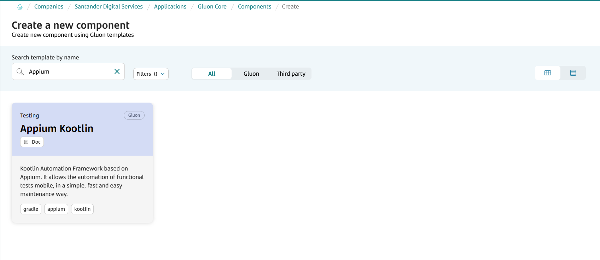
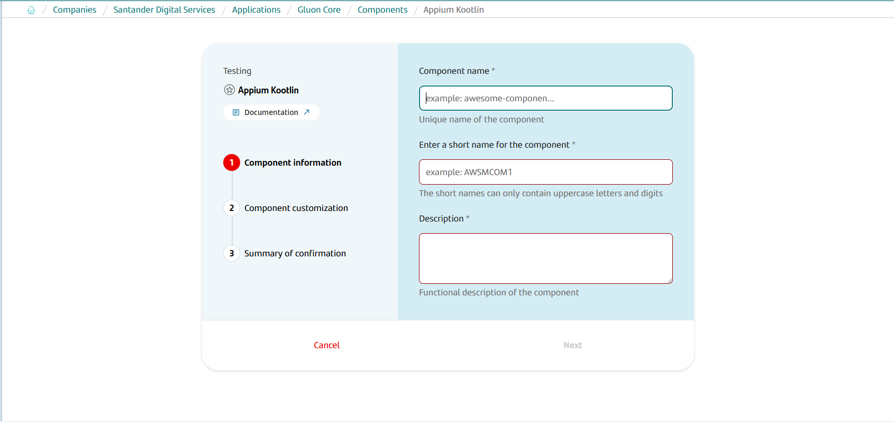
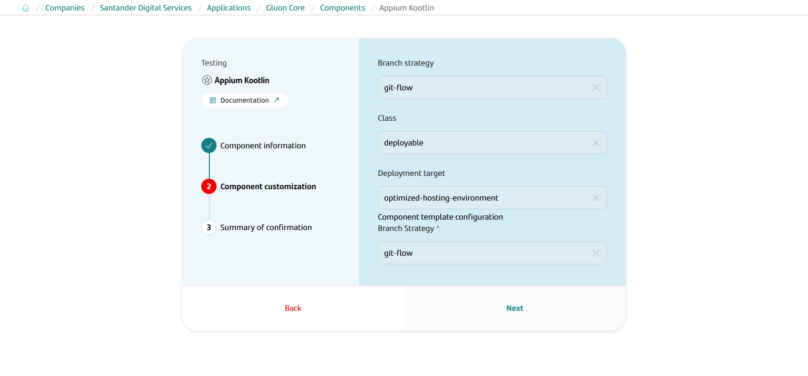
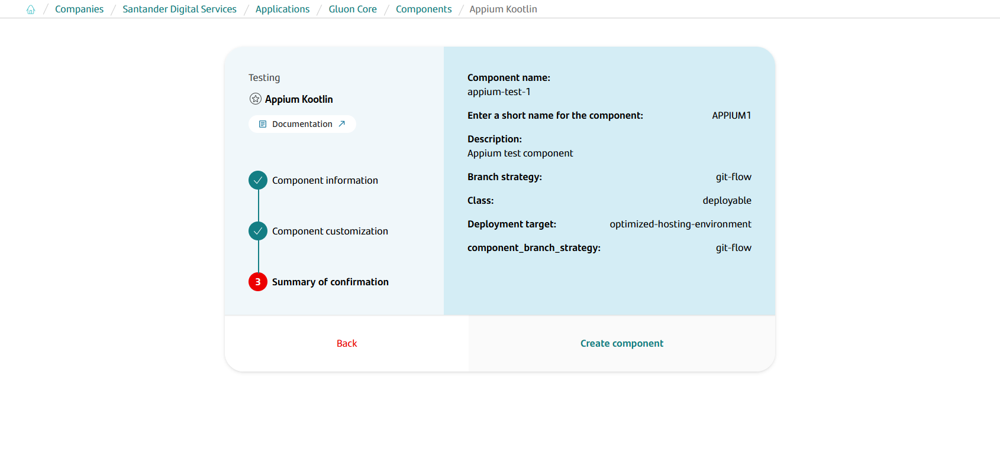
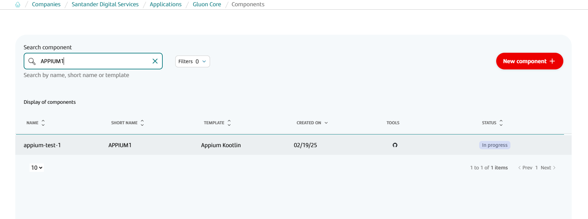
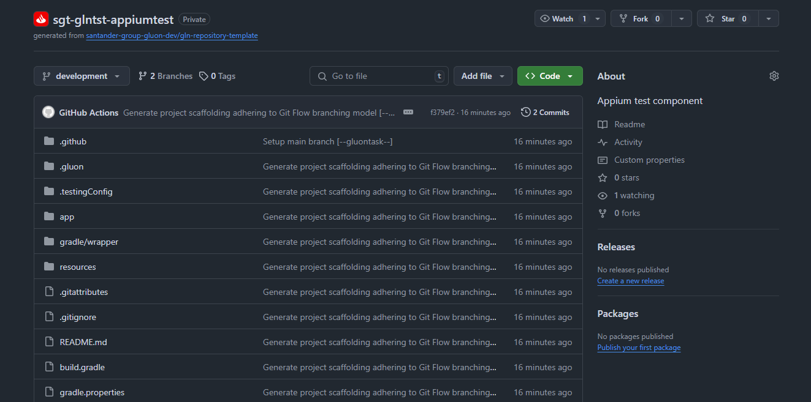
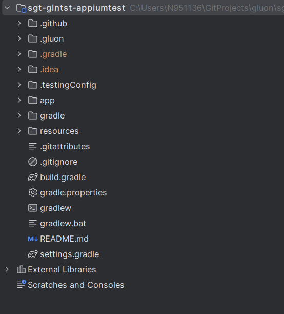

# Appium Journey

## Introduction

{!
   include-markdown "../framework/index.md"
   start="<!--Appium introduction start-->"
   end="<!--Appium introduction end-->"
!}

----

## Create Component

### Gluon Portal

First of all, it is necessary to [**onboard your application.**](../../../../../application/application-management/application-onboard.md)
Once the application has been created, it is possible to start creating the test component.

To create a testing component, follow the steps described in [**Component Management**](../../../../../application/component-management/create-component.md),
searching for the component to be created.

In this case, the type of component to be created is **Appium**.



Next, the user must fill out some fields on the **Appium** component creation flow screen.

???+ remember

    To follow the naming convention visit [Repository Naming Convention](../../../../../application/component-management/create-component.md#repository-naming-convention).

Component information:

- **Component name**: Name of component on Gluon
- **ShortName**: Short name of the component used for creating the git repository
- **Description**: Description of component



Component customization:

- **Branch Strategy**: git-flow
- **Class**: deployable
- **Deployment target**: optimized-hosting-environment



Summary to review your configuration before creating the component:



Once the component is created user can search see under the application that there is a new repository created with the name of the component.



The following links are now available at:

| Item | Link | Role Permission |
| --- | --- | --- |
| GitHub Repository | Link to the repository created in GitHub | Developer (RW) /Technical Lead (Maintain) [All roles explained](https://docs.github.com/es/organizations/managing-user-access-to-your-organizations-repositories/managing-repository-roles/repository-roles-for-an-organization) |
| Sonar Project | Disable | N/A |
| Fortify Project | Disable | N/A |

### Appium Template

Once the Appium component is created, a repository will be generated on Github with the following configuration.

- Creates an **main** and **development** with the structure of files and folders to configure and run your Appium collection. Work will begin on the development branch.



??? abstract "Cloning your repository"

    ### Cloning your repository

    Once the component has been created and the repository is available on GitHub, the first step is to clone the project locally.

    To do so, visit [**How to clone the project**](../../../../../application/component-management/create-component.md#cloning-a-repository).

## Execute

Appium's project can be executed in four ways:

- [Local with IDE](#local-with-ide)
- [Remote with Testing Portal](#remote-with-testing-portal)

### Local with IDE

#### What you need

{!
   include-markdown "../snippets/appium-prerequisites.md"
   start="<!--Appium prerequisites IDE start-->"
   end="<!--Appium prerequisites end-->"
!}

#### Execute with IDE tool

**1)** Import the project into a java IDE tool.
  With this basic template it is possible to begin to understand the structure of Appium test projects. It is enough to open it with the IDE used by the user to see a structure similar to this:

  {:style="border:1px solid grey"}

**2)** Configure Gradle in the development IDE to download the dependencies and build the project

**3)** Run execution
   Configure the ant task localFmwTest and run it.

### Remote with Testing Portal

!!! warning

    This functionality is currently only available to Spain.

Another way to run Appium's project is through the Gluon Testing Portal. To do this, first check that the
[prerequisites](../../../../../application/qatesting/testing/initialstep.md) to use the portal are met.
Second, open a request to Gluon Support team to request the addition of the Gluon Testing profile **Saucelabs** in the Gluon Testing portal.
The request should be in the following form:

```text
Hi, we need to register the following profile in the Gluon Testing Portal:
Profile: Saucelabs
Company: <Company Name>(<companyId>) # If more than one company is provided the role will be added to those companies
Users: <nXXXXXX>,<nYYYYYYY>... # If the user list is empty the role will be added to the entire company
```

For more info on how to open a request check this [link](../../../../../getting-started/support/index.md).
This role can be added to the company or to only the group of users which need access to this feature.
Once this is done, go to [Gluon Testing Portal](https://gluon.gs.corp/testing){:target="_blank"} and create a new configuration for the Appium project as follows.

??? abstract "Example params for Appium template"
     **Test identification**

        Project Reference: Name of new configuration

     **Repository**

         Application: Gluon application where the Appium component has been created
         Testing component: Name of the testing component on Gluon
         Git branch: "main"

     **Configurations**

         Test type: "mobile"
         Framework testing: "Appium"
         Environment: "DEV" or "PRE"
         Device: "Android" or "Ios"
         Device Mode: "Real" or "Emulated"
         Device Model
         Device Version
         App Location: "AppCenter" or "Saucelabs"
         If AppCenter selected:
            Org
            App
            Release
         If Saucelabs:
            App Name
            App Version
         Tags

     **Cloud**

         Cloud: Cluster where your application is located
         Namespace: Namespace where your application is located

     **Report**

        Email: Mailing list where to send the execution results (Optional)

     **Schedule**

        Schedule: Set up scheduled executions (Optional)

{!
   include-markdown "../../../../../application/qatesting/testing/portal/testing-portal/ondemand.md"
   start="<!--Testing portal ondemand functional mobile tests creation start-->"
   end="<!--Testing portal ondemand functional mobile tests creation end-->"
!}
{!
   include-markdown "../../../../../application/qatesting/testing/portal/testing-portal/ondemand.md"
   start="<!--Testing portal ondemand functional tests creation start-->"
   end="<!--Testing portal ondemand functional tests creation end-->"
!}

Once the project is created, it can be executed.

{!
   include-markdown "../../../../../application/qatesting/testing/portal/testing-portal/ondemand.md"
   start="<!--Testing portal ondemand functional tests launch start-->"
   end="<!--Testing portal ondemand functional tests launch end-->"
!}

For more information about use of Gluon Testing Portal got to [Ondemand section](../../../../../application/qatesting/testing/portal/testing-portal/ondemand.md).

### Remote from test component repo

{!
   include-markdown "../../../../../application/qatesting/testing/workflows/snippets/workflows-steps.md"
   start="<!-- ondemand workflow introduction start -->"
   end="<!-- ondemand workflow introduction end -->"
!}

{!
   include-markdown "../../../../../application/qatesting/testing/workflows/ondemand/appium.md"
   start="<!-- ondemand workflows appium execute start -->"
   end="<!-- ondemand workflows appium execute end -->"
!}

#### Steps

{!
   include-markdown "../../../../../application/qatesting/testing/workflows/snippets/workflows-steps.md"
   start="<!-- workflow steps appium start -->"
   end="<!-- workflow steps appium end -->"
!}

{!
   include-markdown "../../../../../application/qatesting/testing/workflows/snippets/workflows-steps.md"
   start="<!-- job report test results start -->"
   end="<!-- job report test results end -->"
!}

#### Results

{!
   include-markdown "../../../../../application/qatesting/testing/workflows/snippets/workflows-steps.md"
   start="<!-- workflow results start -->"
   end="<!-- workflow results end -->"
!}

### Related content

[Appium Documentation](https://appium.io/docs/en/latest/)

[Kotlin Documentation](https://kotlinlang.org/docs/home.html)

[Gradle Documentation](https://docs.gradle.org/current/userguide/userguide.html)

[Appium Documentation](../framework/index.md)

[Testing Portal](../../../../../application/qatesting/testing/portal/testing-portal/index.md)
