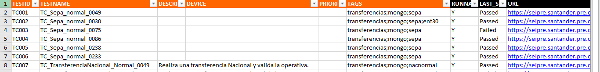
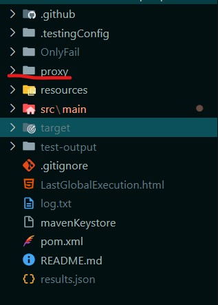

# Cilantrum Documentation

## Introduction

<!--Cilantrum introduction start-->

**Cilantrum** is a testing framework develop for Santander, which unifies the entire process of developing automatic tests under a single work structure. It provides a resource package developed under the same libraries in order to facilitate and unify
the development of tests.

<!--Cilantrum introduction end-->

Before starting to work with Cilantrum, it is essential to know that it is used for both **Web** and **API (backend)** functional testing using Java, Maven and Selenium technologies.

Cilantrum acts as a top layer to different frameworks such as Selenium. This means that aspects such as the configuration of Selenium are simplified to the maximum, reducing the time needed for its implementation in a new project.
Using Selenium alone, for example, limits testing to the web environment and lacks the simplicity and preconfigurations made by Cilantrum.

The benefits of using this framework are:

 - Reusability of code.
 - Easy creation of projects.
 - Possibility to change data for the specific test case without having to modify code.
 - Possibility to launch tests with the same function, but with different data.
 - Easy maintenance of test cases.
 - Integration with other technologies like ALM.

----

## Getting started

To get started, review the prerequisites:

{!
   include-markdown "../../snippets/cilantrum-prerequisites.md"
   start="<!--Cilantrum prerequisites IDE start-->"
   end="<!--Cilantrum prerequisites end-->"
!}

## Options

As mentioned in the introduction, two types of tests can be developed with Cilantrum: Web and Backend. This section will discuss the points to be taken into account to start with the development of TC (Test Case) in each of them.

### Web automation (Web)

The communication between the Java code and the browsers is established by means of drivers. The necessary drivers, compatible with the browser version installed locally, must be downloaded and located in the **resources/drivers** folder.

In Cilantrum there are two types of configuration files, a global one to configure Cilantrum (resources/build-xxx.properties) and a specific one to configure the technology (resources/devices/xxx.properties) to be used in one or several test cases.

Cilantrum makes use of 3 different classes to develop the code in a structured and clean way, reusing as much code as possible. All these classes, for the automation of a web application, have to extend from WebTestCase, WebReusable and WebPageObject.

For web, the way of locating elements is mostly based on XPath. These locators will be used in the files defined for it, which are Standard and Repository, indicating, at the beginning, the locator to use, which will be, in this case, xpath.

Example xpath file:

```json
  #Example of objects in Standard (%% is the way to indicate that it is an external parameter)
  input = xpath//input[@id="%%"]
  #Example with multi-parameter ($1,$2,...)
  input_sin_id = xpath//input[@name="$1" and @class="$2"]
  div = xpath//div[@id="%%"]
```

To start with, the first step would be to create the TC class in which the test case is defined. From there, the POM classes would be created according to the screens of the application to be tested, together with the RE classes if necessary for
the reuse of complete flows.

### Web services automation (Backend)

This type of test differs from the previous ones in that it is not tied to a specific technology, such as the web browser, so it can easily be used on any technology.

In case the tests are exclusively on web services, the use of the SimpleTestCase, SimplePageObject and SimpleReusable classes is recommended, whose difference lies in the fact that their associated .properties file only needs to have the **name** property.
These classes only differ from the rest by the absence of the *lib* variable as they are not linked to a specific technology and, therefore, do not have such a dependency, which makes these classes highly customisable for service and hybrid
testing (through the use of the class CilantrumStarter class).

In Cilantrum there is an implementation of the *RestAssured* library for sending, responding, extracting and validating data from a web service.
In the TC, POM and RE classes, there is a variable called **ws** that will contain two methods:
  
  - **createSOAPRequest**
    With this method, the creation of a request for a SOAP service is initiated.
  - **createRESTRequest**
    With this other method, the creation of a request for a REST service is initiated.

Once one of these methods is called, it will be able to access the different methods that will configure a request, either REST or SOAP.
The testing of a web service has been divided into 4 different parts:

 - Request (CommonRequest)
 - Response (ReqResponse)
 - Extraction (ExtractableResponse - RestAssured native functionality)
 - Validation (Assertions)

Each of these parts will be accessed as the test is configured. For example, in order to access the actions to be performed on the response, it is necessary to call one of the following methods, belonging to the part of the request whose
functionality is to send the request, as configured with the HTTP method of the same name.

 - get
 - put
 - post
 - delete
 - ...

When calling one of these methods, the request will be sent and, if the service responds, the response information will be obtained.

!!! note
    In the template code provided in [Cilantrum Journey](../journey/cilantrum-testing-journey.md), there is a class called **AbstractRequest** that contains the methods already implemented for Rest requests.

These classes are concatenated to themselves, that is, they can be programmed in a single line adding all the necessary information to the request that is sent and validating everything required from the service's response.
This implementation simplifies the creation of a request to a web service and adds reporting and validation functionalities.

The most important parts to know about this implementation are the following:

- **auth()**: Accessible before sending the request, it allows the addition of an automatic authorisation mechanism. The following are currently available:
    - Basic
    - Oauth
    - Oauth2 via token
    - Oauth2 via token and signature token
- **Parameterisation in JSon and XML request bodies**: By pattern {{Parameter name}}.
- **validations()**: Method accessible after sending the request, using methods such as get or post, which allows one or more validations to be performed on the body. Once indicated, the *evaluate()* function must be called to initiate the execution of
these validations, which can also receive a boolean to stop the test if one fails (true) or to continue even if the test fails (false).
- **extract()**: Accessible after sending the request, it allows you to extract information from the response using the Gpath syntax. It will use JsonPath for json documents and XmlPath(Not to be confused with XPath) for html and xml documents.

## Framework features

This section will explain the structure and features for developing cases with the Cilantrum framework.

### Project structure

The code structure will be described in order to know the packages, classes and external resources that are used for its working.

#### **Packages**

In order to have all the classes generated during the development of the project well organised, the following hierarchy of packages has been defined:

To structure the code the following packages will be established:

- **es.santander.pageobjectmodel**: It will contain only Page Object (PO) classes. It is possible to add one more level to the hierarchy if the complexity of the project makes it necessary to subdivide our classes into different functionalities of
the application.

- **es.santander.reusables**: It will contain only classes of type Reusable (RE), it is also possible to add a further level to the hierarchy to subdivide the classes by functionality.

- **es.santander.tests**: It will contain only classes of type Test Case (TC). One more level will be added to the hierarchy corresponding to the test suites identified in the dataset(tc-data.xls).

- **es.santander.main**: contain the main class of the project (Init), it is the one with the main method and it will be used to execute the test cases indicated in the tc-data.xls. It is necessary to have an Init class that will be executed from
testing portal and another InitLocal class that we will execute manually from our team during the development and debugging process of the test cases.

- **es.santander.utils**: Here it is possible define classes that contain common functions that can be used by the rest of the classes. In addition, classes developed by third parties can be incorporated here for reuse.

#### **Classes**

In Cilantrum there are mainly three types of classes that will inherit from three superclasses.

- **Page Object Model (POM)**: These classes should include only the code necessary to define the actions to be automated towards the fields on a single screen.A POM class is designed to develop each of the functionalities of a screen and it must
never contain functionality of different screens.
  
    For each of the actions a public method of the class must be defined and the set of these methods will represent the interface of the class.

    By convention, the name of the classes of this type will start with **POM** (e.g. POMLogin, POMHome, POMProfile).

??? abstract "How to create a POM class?"

    In order for Cilantrum to detect a class as POM and provide it with all the tools, the class must extend from  **WebPageObject**, for web application, or **SimplePageObject**, for a service. Both are included in the package com.indra.cilantrum.framework.api.pageobject.

    There will be a method that must be implemented called **assertScreen()**, whose objective is to validate that we are in the part of the screen associated to this POM.
    Normally it will contain an instruction of type **lib.reportValidation** checking an object/element unique to that part of the screen.

- **Reusable (RE)**: These classes must represent a complete flow and must only contain calls to POM classes. If there is a flow of screens that is repeated regularly (e.g. login and initial search), a reusable can be defined so that reusable screens
are executed in the order set.

    By convention, the name of the classes of this type will start with **RE** and the name of the class following the organisation's identifier convention (p.e. RELogin).

??? abstract "How to create a Reusable class?"

    For a class to be Reusable, it must extend from the abstract **WebReusable** class, for web application, or **SimpleReusable**, for a service and implement the execute() method which will be the only method of the
    class. Both class are included in the package com.indra.cilantrum.framework.api.reusable. 

- **Test Case (TC)**: These classes define the complete test cases to be automated. It will perform the sequential execution of the actions created in the POMs and reusables defined for each of the screens (or screen flows) in the appropriate
order and passing the data retrieved from the tc-data to it.

    By convention, the name of classes of this type shall start with **TC** and the class name following the agreed identifiers of the organisation (e.g. TCMyTest).

??? abstract "How to create a Test Case class?"
  
    For a class to be Test Case type, it must extend from the abstract **WebTestCase** class, for web applications, or **SimpleTestCase** for a service. Both are included in the package com.indra.cilantrum.framework.api.test.

    It requires the implementation of three different methods:

    * preExecute() - What should be executed before the test case (Pre-conditions).
    * execute() - Where the reusable calls will be placed to compose the test case.
    * postExecute() - What should be executed after the test case (Post-conditions).

    It is the only type of class that can read/write in the dataset (tc-data.xls), forcing that it is from this class, exclusively, the only point where the input parameters to be used in the dataset are indicated. For this purpose, within this class exist two types of objects:

    * **info**: This object will allow us to obtain the test case information such as the name, the TCID or the device that is in use.
    * **data**: This is the object that will allow us to obtain the value associated to the current test case by the column name. Here we will have the methods **get** to get the cell value and **set** to write and store data in excel.

#### **Resources (Cilantrum external configuration files)**

The resources folder must be at the same level as the pom.xml file. Inside are the following files and folders:

- tc-data.xls: Excel sheet containing the test plan (cases to be executed) and the data associated to each case. It is possible to have a single tc-data or it is also possible to have several, as in the case of the template, creating one for each environment.
  (DEV, PRE and PRO). In this case, the environment must be included at the end of the name (tc-data-DEV, tc-data-PRE and tc-data-PRO).
  The cases related to the same functionality of the application can be grouped in a test suit (TS) in a tab of the sheet, the name given to this tab should correspond to a package hanging from es.santander.testcases and containing all the related cases.

??? abstract "Configuration"

    The mandatory columns, in order from left to right, that each TS must have are the following:

    * TESTID: It uniquely identifies the test or test case, there cannot be two cases with the same TESTID in the same tc-data.

    * TESTNAME: Identifies one of the test case (TC) classes in the project. Several cases with different TESTID can execute the same TC but with different parameters. A good practice is to parameterise the TCs as much as possible
    so that many cases run with different This avoids duplicity of code and facilitates the maintenance of the TCs.

    * DESCRIPTION: Description of the case. It should be brief, but should uniquely identify the test to avoid confusion with other cases.

    * DEVICE: Indicates the browser with which the test will be performed. If it can be run with several browsers, this will be indicated by separating them with a semicolon.

    * PRIORITY: Tests can be prioritised in order to subsequently decide to run those with a priority below a given priority.

    * TAGS: These are labels that are assigned to the case and are used to be able to execute subsets of cases that have been assigned certain labels. A case may have no or several labels separated by semicolons.

    * RUNNABLE: Indicates whether the case will be executed or not. It can take 2 values:
        * Y: The case can be executed (although it may be filtered by tags).
        * N: The case will never be executed.

    * LASTSTATUS: Result of the last execution of the case. It can take 2 values:
        * Passed: The case was successfully concluded.
        * Faliled: The case failed.

    To the right of these columns, all the variable data of the application for which the functional tests are going to be automated and which will be input parameters of the TCs will be detailed. Each column identifies a single field. That field can be used by one or more of the test suite cases. For example, if a case needs a data that only it needs, the corresponding column will have to be added in the test suite, but for the rest of the cases no value will be assigned in those columns.

    Although most of the data in the tc-data will be input, it is possible to define output fields to store values that are desired to be retained after the execution of the case.
    
    Passwords and keys must be encrypted by including them as **ENC:{&lt;key&lg;}**. In the first execution of the case the value will be encrypted and updated in the tc-data in such a way that the key is not readable by anyone. It is mandatory to encrypt
    all keys used by our cases.

    This configuration allows to make changes in the test plan (which cases are going to be executed) and to update the data used for the cases, manipulating only the tc-data without the need of Java knowledge since it is not necessary to modify the code
    of the cases. That is why it is important to have fully parameterised TC classes.

- build.properties > File with general paths and project configuration parameters.
  > **Note**
  > It is necessary to define some build.properties for local tests that it can call build_local.properties, where these parameters are defined according to the tests to be performed. The call to this file shall be indicated in the Init_local.java,
  in this way:

    ```java
    public static String buildPath = "resources/build_local.properties";
    ```

??? abstract "Parameters"

    The following parameters are defined in these configuration files:

    * tc-data to be used by the project. It is possible too set the priority level (PRIORITY column of the tc-data) and the tags to be run.
    * Default device (browser) to be used for the execution of the application to be tested.
    * Environment in which the test will be executed (DEV, PRE or PRO).
    * Number of parallel threads.
    * If these reports include screenshots or not (in this case, only the final screen at the end of the test will be shown).
    * Set of emails where the reports are sent.
  
- repository.properties: File where fixed Xpaths that do not receive parameters are defined. It is used to find items that cannot be easily identified.
- standard.properties: File with the parameterised locators (xpaths). Expressions common to multiple HTML elements or patterns that are repeated in the application, can be parameterised to be reused to find elements from different parts of the application.
- strings.xls: File with the translations for multi-language testing.
- In **drivers** folder: For local runs, drivers are needed for each browser where TCs need to be tested. The version of the drivers depends on the browser version. Here is where to download each of the drivers for the most commonly used browsers:
    - [Chromedriver](http://chromedriver.chromium.org/){:target="_blank"}
    - [Geckodriver(Firefox)](https://github.com/mozilla/geckodriver/releases){:target="_blank"}
    - [MSEdgedriver](https://developer.microsoft.com/es-es/microsoft-edge/tools/webdriver/?form=MA13LH#downloads){:target="_blank"}
- In **devices** folder: Includes a configuration file for each browser in which the TC's are to be run. They will correspond to the browsers supported by the application.

??? abstract "Parameters"

    The following parameters are defined in these configuration files:

    * Browser driver properties.
    * Different ranges for maximum timeouts to identify an element we want to interact with.
    * Debug mode. In the local executions it allows to identify the validations made with each element of the page.
    * Location of repository.properties, standard.properties and strings.properties files.

#### Others configuration files

  - POM.xml > XML file with the dependencies needed by Maven. Generally, you will not need to touch it.

### Definition of test cases

In Cilantrum, the test cases are defined in Excels sheets which acts as test plans. With this .xls files, the information required for testing is defined, like the url to use, the environment, the tags, etc. The name of this dataset is called tc-data.

{:style="border:1px solid grey"}

The excel is made up of, at least, two sheets, one of which must be called "Failures" and the 2nd (or several) with the name of the functionality where to group our test cases.

The **Failures** sheet allows us to collect a set of checks to be performed each time a test fails in order to automatically categorise the error that may have caused the test to fail. This sheet is composed of three columns:

- **FAILURE:**
  The check to be performed. These checks are similar to those performed with the Keyword exists, in that it looks for the specified object/element to exist on the screen in order to categorise it as, for example, an error message:
  "Not enough privileges text".
  The way to indicate the object/element to be searched follows the same syntax as the objects we have in our Standard repository.
- **LOW LEVEL MESSAGE:**
  The detail of the error. Usually it is a description of the problem: "Error message displayed in section X due to not enough privileges".
- **HIGH LEVEL MESSAGE:**
  The category of the error such as DATA, ENVIRONMENT... in order to be able to group the different types of errors.

!!!note

    It is important to mention that the end of the file must be indicated by indicating the word **END** after all the data.

The rest of the excel sheets will indicate a **suite or functionality** whose purpose will be to group the different test cases so that, for example, in the final report the results are displayed in a much more orderly way.
There can be as many parameters as needed.

This data only can be read/written from TC type classes.[More Info](#classes).

!!!remember
    After the LAST_STATUS column (last mandatory column) there will be as many columns as input data we need in each of the test cases.

On the other hand, to facilitate its adoption, each time a test plan in excel format is started, an identical copy of the test plan in json format will be generated in the same directory. The file name is tc-data-autogenerated.json and will be replaced
each time a new run is started.

This test plan, in JSon format, brings a series of new functionalities to reduce its size and to favour its maintainability. to reduce its size and make it more maintainable.
These functionalities allow us to test data at 3 different levels:

  - At test case level, whereby it would work in the same way as in excel.
  - At the suite/grouping level, where the data would be shared between all the tests grouped together.
  - At run level, the most global level whereby the data would be shared between all tests in the test plan.

It should be noted that data will be chosen at the most specific level possible. That is to say, if at run level a USER data is available, and at test case level another one, it shall choose the one of the test case.

For the rest, the test plan in json format has all the functionalities and features that the excel.

!!! note

        The default format used is Excel.

### Encryption of sensitive data in dataset

Another thing to mention is that Cilantrum allow encryption of sensitive data with a mechanism in the dataset, however, it is necessary to indicate in any case which fields are to be encrypted.
To do this, put the data to be encrypted with this pattern
**ENC:{Data to encrypt}**. This will indicate to the framework that, when starting the execution and reading the dataset, it has to encrypt and save the updated value.

It should be noted that if this data is used in the test case, with the method *get(Column name)*, it will not return the decrypted data, so actions like logging in with the encrypted password will fail. In order to write the decrypted data, there is
a function called **writeEncryptedValue(EncryptedData)** that will decrypt the value and write it, without showing its decrypted value at any time.

### Properties

The properties for configuring Cilantrum will be detailed here.

??? abstract "Global properties (build.properties)"
    #### Global properties:

    **Locating resources and configurations**

    * testplan.file.path > Path to the test plan to be used. Example: resources/tc-data.xlsx
    * testplan.file.type > Type of Excel to use. It can receive two values:
        * **excel**: This is the default value and indicates that the format is excel.
        * **json**: json format.
    * globaldata.file.path  -> Path to the global data file for the test plan.
    * testplan.tags -> List of tags to be executed, separated by **;**.
    * testplan.suites -> List of suites to be executed separated by **;** .
    * testplan.criticality.column -> If we set this property to true, a new column will need to be added to the dataset, always before the RUNNABLE column. This column will allow us to indicate whether a case is critical or not by means of **Y**, if it is critical, or **N** otherwise.
    * testplan.priority -> Priority of the cases to be executed. If we indicate priority 5, for example, it will execute all the cases with the same number or less. The lower the number, the higher the priority.
    * device.default -> Device to be used in case the DEVICE column is empty.
    * device.properties.path -> Path of the device configuration. Only if the above property is defined.
    * retry.attempts -> Number of retries of a test case if it fails. Re-execution is performed at the time of failure.
    * encryption.password -> Password that we want to use as a two-factor data encryption. It is automatically encrypted after the first execution.
  
    **Report configurations**

    * report.folder.path -> Path where the reports generated by Cilantrum will be saved. If left  left blank, the default will be test-output in the root of the project.
    * report.folder.pattern -> Pattern that will have the folder that will store the reports. Useful for organising a structure of daily, weekly, monthly packages...
    * report.global.path -> Path where the global Cilantrum report will be generated.
    * report.global.file.pattern -> Pattern that the global report will have. In case it is empty, each time an execution is performed, the report shall be replaced by a new one.
    * report.lite -> Receives a boolean (true/false). If true, it will generate a report whose test cases will only contain the last capture made. Mainly used to reduce file size.

    **Configurations for parallel execution**

    * execution.parallel -> Receives a boolean (true/false) to enable or disable parallel execution.
    * execution.parallel.exceptions.suites -> Receive a list of Suite names (Separated by ; ) exempted from running in parallel.
    * execution.parallel.suites.threads -> Number of threads (Suites) to be executed at a time.
    * execution.parallel.threads -> Number of threads (Test Cases) to be executed at a time.

    **Logger configuration**

    * log.level -> Level on which we want to show the trace of Cilantrum. The possible values are (From the lowest to the highest exposed trace):
        * ERROR
        * WARNING
        * INFO
        * DEBUG
        * TRACE
    * log.pattern -> Pattern that the displayed trace will have. Default is **{date:HH:mm:ss} [{thread}] {level}: {message}**.

    **Integration with ALM**
    
    * alm.report -> Receives a boolean (true/false) activating or deactivating the report in ALM.
    * alm.report.type -> Specifies how to report in ALM. It can receive the following values:
        * **existent**: Reports on previously created entities.
        * **deploy**: Create the entities, if not already created, and report on them.
    * alm.type -> ALM type to use. The possible values are:
      * alm1
      * alm3
    * alm.user -> ALM user. You must have access to the domain where you want to report.
    * alm.password -> ALM user password.
    * alm.host -> ALM host.
    * alm.subfolder -> Name of sub-folder to be created. Normally the name of the project is used.
    * alm.software.delivery -> Delivery software to be used in the new entities.
    * alm.domain -> ALM domain.
    * alm.project -> ALM project.
    * alm.testlab.path -> Only for **existent** type. Path in Test Lab where to look for the entities to report on. 
    * alm.testplan.path -> Only for **existent** type. Path in Test Plan where to look for the entities to report to.
    * alm.datasource.column.test.id -> Only for **existent** type. Column name in excel to be used to indicate the IDs of the test cases to be used.
    * alm.testlab.path.partial -> Only for **existent** type. Partial path where the Suites where we will report are located.
    * alm.vrapplication -> Versioning of the application in VXXRXXFXXX format. If this field is not reported, the test-set shall be created with the versioning V01R00F000.
    * alm.projectid -> Project code. If this field is not reported, it shall be filled with the default value 1.
    * alm.testcyle -> Test cycle. If this field is not reported, it shall be filled with the default value 1.
    * alm. application -> For alm1 only, value to be used from the **Application** list in the designs.
    * alm.test.type -> For alm1 only, value to be used from the **Test type** list in the designs.
    * alm.environment -> Environment to be specified for new entities (Optional in alm3).
    The value must be one of those listed in the domain itself.
    * alm.qcapplication -> For alm3 only, the Q.C.Application to be specified in the new entities. Default will be default.
    * alm.testname.simple -> In some cases, you may only want to create layouts with the name of the test case, without including the TCID or the technology used. For these cases, this property can be used with the value **true** to achieve this functionality. 

??? abstract "List of properties by technology"

    #### Properties by technology:

    **Commons**

    * name -> Name of the configuration. This is the name we pass to the DeviceConfigurator class to configure the capabilities of the technology.
    * standard -> Path where our standard file is located.
    * repository -> Path where our repository file is located.
    * driver.type -> Type of technology/driver referred to in this configuration. The possible values are as follows:
        * remote
        * firefox
        * chrome
        * ie
        * edge
        * safari
        * opera
        * seetest
        * seetest-grid
        * sap
    * driver.path -> Path to the binary file used in the technology. For example, Chromedriver for Chrome.
    * driver.url -> URL where to connect to use the technology. Address of SeleniumGrid,...
    * driver.screenshot.quality -> Quality % of the image between 0-100. The lower the number, the lower the quality and weight.
    * driver.screenshot.path -> Path where screenshots will be saved. By default "Screenshots".
    * driver.continue.on.fail -> Boolean (true/false) where we indicate if we want to continue the test even if a step fails. The default is false.
    * debug -> Boolean (true/false) to activate object highlighting. It slows down the execution of the case, perfect for presentations.
    * highlight.color -> Colour to be used for highlighting objects. Example: ret.
    * highlight.width -> Width of the object highlight in pixels. Example: 4px.
    * driver.capabilities -> Special prefix to indicate device capabilities through properties : driver.capabilities.noReset = true.

    **Excel translations**

    * excel.strings.path -> Path to our translations file. Example: resources/translations.xls.
    * excel.strings.sheet -> Excel sheet to be used.
    * excel.strings.column -> Column (Normally indicates the language) to be used.

    **Time variables**

    * time.shortest -> It represents the "minimum" time in milliseconds that we will use in our code.
    * time.short -> It represents the "short" time in milliseconds that we will use in our code.
    * time.long -> It represents the "long" time in milliseconds that we will use in our code.
    * time.longest -> It represents the "maximum" time in milliseconds that we will use in our code.

### Reports and results

When run the first time, the following files and folders are generated:

  - LastGlobalExecution.html -> Report with the test results of the last local execution. This reports contain images and information of the environment and execution so it can be used to verify and check the results of the tests.
  - results.json -> json with the results of the execution.
  - test-output -> It generates a folder per local execution day and stores the execution report (similar to LastGlobalExecution.html) but historical.
  - Screenshots -> It is a folder with the screenshots executed from the script and incorporated in the reports.

!!! remember
    Do not upload to GitHub repository this files and folders.

### Configuring the proxy

!!! warning

    This has been tested and verified for Cilantrum version 2.1.9.7. Make sure you are using this version when applying these changes.

Sometimes, a test requires connectivity to both internet and intranet urls. In these cases the proxy can be configured as described below.
First, create a new folder in the root of your cilantrum project called **proxy**.

{:style="border:1px solid grey"}

In this folder create these two files:

***manifest.json***

```json
{
  "manifest_version": 2,
  "name": "Authentication for ...",
  "version": "1.0.0",
  "permissions": ["<all_urls>", "webRequest", "webRequestBlocking"],
  "background": {
    "scripts": ["background.js"]
  }
}
```

***background.js***

```js

var username = "%s";
var password = "%s";
var retry = 3;

chrome.webRequest.onAuthRequired.addListener(
  function handler(details) {
    if (--retry < 0)
      return {cancel: true};
    return {authCredentials: {username: username, password: password}};
  },
  {urls: ["<all_urls>"]},
  ['blocking']
);


```

Then go to the file *src/main/java/es/santander/main/Init.java*.
Add the following functions as shown:

```java
private static void addProxyToChrome(ChromeOptions options, String proxyUrlString, String proxyUsername, String proxyPassword) throws IOException {
  // bypassList: dominios para los que no es necesario usar el proxy
  // formato *.corp,*.com,localhost
  // Dejar bypassList = ""; si todo tiene que ir por proxy
  String bypassList = "*.corp";

  // NO TOCAR NADA POR DEBAJO DE ESTA LINEA -------------------------------------
  if (!proxyUrlString.contains("http")) {
    if (proxyUrlString.contains("443")) {
      proxyUrlString = "https://" + proxyUrlString;
    } else {
      proxyUrlString = "http://" + proxyUrlString;
    }
  }

  final URL proxyUrl = new URL(proxyUrlString);

  String userInfo = proxyUrl.getUserInfo();
  if (StringUtils.isNotBlank(userInfo)) {
    String[] userParts = userInfo.split(":");
    if (userParts.length > 0) {
      proxyUsername = userParts[0];
      if (userParts.length > 1) {
        proxyPassword = userParts[1];
      }
    }
  }
  if (proxyUsername == null) {
    proxyUsername = "";
  }
  if (proxyPassword == null) {
    proxyPassword = "";
  }

  Path folder = Paths.get("proxy");

  String manifestJson = folder.toAbsolutePath() + "/manifest.json";
  String backgroundJs = folder.toAbsolutePath() + "/background.js";

  String backgroundContent = Files.readString(Paths.get(backgroundJs));
  try (final FileOutputStream fos = new FileOutputStream(folder.toAbsolutePath() + "/proxy.zip")) {
    try (final ZipOutputStream zipOut = new ZipOutputStream(fos)) {
      ZipEntry zipEntry = new ZipEntry("manifest.json");
      zipOut.putNextEntry(zipEntry);
      zipOut.write(Files.readAllBytes(Paths.get(manifestJson)));
      zipOut.closeEntry();
      zipEntry = new ZipEntry("background.js");
      zipOut.putNextEntry(zipEntry);
      zipOut.write(backgroundContent.formatted(proxyUsername, proxyPassword).getBytes(StandardCharsets.UTF_8));
      zipOut.closeEntry();
    }
  }

  Proxy proxy = new Proxy();
  proxy.setHttpProxy(proxyUrl.getProtocol() + "://" + proxyUrl.getHost() + ":" + proxyUrl.getPort());
  proxy.setSslProxy(proxyUrl.getProtocol() + "://" + proxyUrl.getHost() + ":" + proxyUrl.getPort());
  proxy.setNoProxy(bypassList);
  options.setCapability(CapabilityType.PROXY, proxy);
  options.addExtensions(new File(folder.toAbsolutePath() + "/proxy.zip"));
}

private static void addProxyToFirefox(FirefoxOptions options, String proxyUrlString) throws IOException {
  // bypassList: dominios para los que no es necesario usar el proxy
  // formato *.corp,*.com,localhost
  // Dejar bypassList = ""; si todo tiene que ir por proxy
  String bypassList = "*.corp";

  // NO TOCAR NADA POR DEBAJO DE ESTA LINEA -------------------------------------
  if (!proxyUrlString.contains("http")) {
    if (proxyUrlString.contains("443")) {
      proxyUrlString = "https://" + proxyUrlString;
    } else {
      proxyUrlString = "http://" + proxyUrlString;
    }
  }

  final URL proxyUrl = new URL(proxyUrlString);
  Proxy proxy = new Proxy();
  proxy.setHttpProxy(proxyUrl.getProtocol() + "://" + proxyUrl.getHost() + ":" + proxyUrl.getPort());
  proxy.setSslProxy(proxyUrl.getProtocol() + "://" + proxyUrl.getHost() + ":" + proxyUrl.getPort());
  proxy.setNoProxy(bypassList);
  options.setCapability(CapabilityType.PROXY, proxy);
}

private static void addProxyEdge(EdgeOptions options, String proxyUrlString, String proxyUsername, String proxyPassword) throws IOException {
  // bypassList: dominios para los que no es necesario usar el proxy
  // formato *.corp,*.com,localhost
  // Dejar bypassList = ""; si todo tiene que ir por proxy
  String bypassList = "*.corp";

  // NO TOCAR NADA POR DEBAJO DE ESTA LINEA -------------------------------------
  if (!proxyUrlString.contains("http")) {
    if (proxyUrlString.contains("443")) {
      proxyUrlString = "https://" + proxyUrlString;
    } else {
      proxyUrlString = "http://" + proxyUrlString;
    }
  }

  final URL proxyUrl = new URL(proxyUrlString);

  String userInfo = proxyUrl.getUserInfo();
  if (StringUtils.isNotBlank(userInfo)) {
    String[] userParts = userInfo.split(":");
    if (userParts.length > 0) {
      proxyUsername = userParts[0];
      if (userParts.length > 1) {
        proxyPassword = userParts[1];
      }
    }
  }
  if (proxyUsername == null) {
    proxyUsername = "";
  }
  if (proxyPassword == null) {
    proxyPassword = "";
  }

  Path folder = Paths.get("proxy");

  String manifestJson = folder.toAbsolutePath() + "/manifest.json";
  String backgroundJs = folder.toAbsolutePath() + "/background.js";

  String backgroundContent = Files.readString(Paths.get(backgroundJs));
  try (final FileOutputStream fos = new FileOutputStream(folder.toAbsolutePath() + "/edge.zip")) {
    try (final ZipOutputStream zipOut = new ZipOutputStream(fos)) {
      ZipEntry zipEntry = new ZipEntry("manifest.json");
      zipOut.putNextEntry(zipEntry);
      zipOut.write(Files.readAllBytes(Paths.get(manifestJson)));
      zipOut.closeEntry();
      zipEntry = new ZipEntry("background.js");
      zipOut.putNextEntry(zipEntry);
      zipOut.write(backgroundContent.formatted(proxyUsername, proxyPassword).getBytes(StandardCharsets.UTF_8));
      zipOut.closeEntry();
    }
  }

  Proxy proxy = new Proxy();
  proxy.setHttpProxy(proxyUrl.getProtocol() + "://" + proxyUrl.getHost() + ":" + proxyUrl.getPort());
  proxy.setSslProxy(proxyUrl.getProtocol() + "://" + proxyUrl.getHost() + ":" + proxyUrl.getPort());
  proxy.setNoProxy(bypassList);
  options.setCapability(CapabilityType.PROXY, proxy);
  options.addExtensions(new File(folder.toAbsolutePath() + "/edge.zip"));
}
```

Each of these functions has a bypassList variable. These tells the browsers which urls do not have to use the proxy when navigating.
By default we have set it to filter out all urls ending in **.corp**.

> **Multiple values in bypassList**
> Separate each entry by **,** as follows: **\*.corp,\*.pru.bsch**

Finally, we change the main function of Init.java as follows:

In the device blocks:

```java
if (deviceDefault.equals("chrome|edge|firefox")) {
  ...
}
```

Substitute the old proxy block for the appropriate ***addProxyX*** function. For example, in chrome:

```java
if (Boolean.parseBoolean(buildconfig.getProperty("exec.setauth"))) {
  proxy.setHttpProxy(proxyUrl);
  proxy.setSslProxy(proxyUrl);
  options.setProxy(proxy);
}
```

would become

```java
addProxyChrome(options, proxyUrl, proxyUser, proxyPass);
```

The variables proxyUrl, proxyUser and proxyPass must be defined and provided by the user.

!!! remember
    The user is responsible to provide all of the proxy information, including the credentials if needed.
    Is also responsibility of the user to ensure the credentials are properly encrypted.

## Related content

[Cilantrum Journey](../journey/cilantrum-testing-journey.md)

[Testing portal](../../../../../application/qatesting/testing/portal/testing-portal/index.md)
