# Cilantrum Journey

## Introduction

{!
   include-markdown "../framework/index.md"
   start="<!--Cilantrum introduction start-->"
   end="<!--Cilantrum introduction end-->"
!}

----

## Create Component

### Gluon Portal

First of all, it is necessary to [**onboard your application.**](../../../../../application/application-management/application-onboard.md)
Once the application has been created, it is possible to start creating the test component.

To create a testing component, follow the steps described in [**Component Management**](../../../../../application/component-management/create-component.md),
searching for the component to be created.

In this case, the type of component to be created is **Cilantrum**.

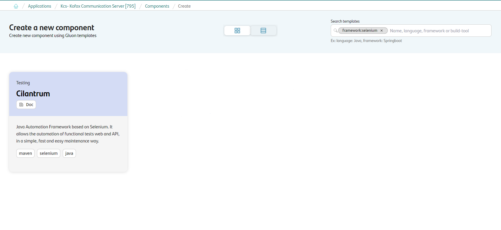

Next, the user must fill out some fields on the **Cilantrum** component creation flow screen.

???+ remember

    To follow the naming convention visit [Repository Naming Convention](../../../../../application/component-management/create-component.md#repository-naming-convention).

Component information:

- **Component name**: Name of component on Gluon
- **ShortName**: Short name of the component used for creating the git repository
- **Description**: Description of component

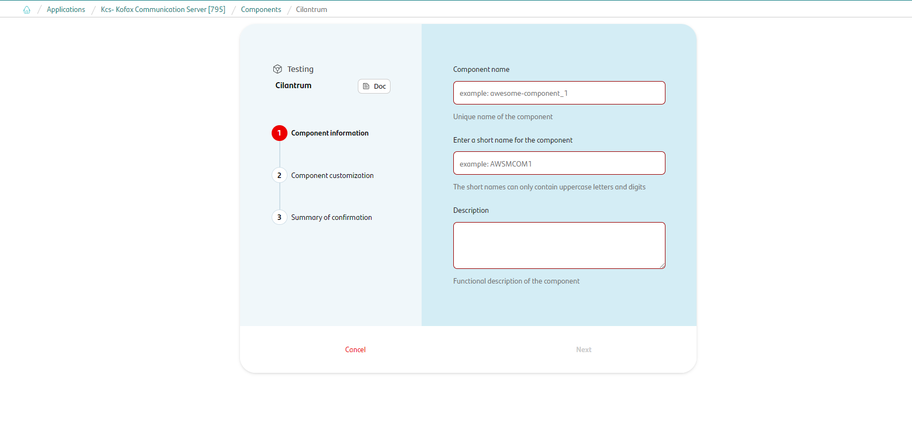

Component customization:

- **Branch Strategy**: git-flow
- **Class**: deployable
- **Deployment target**: optimized-hosting-environment

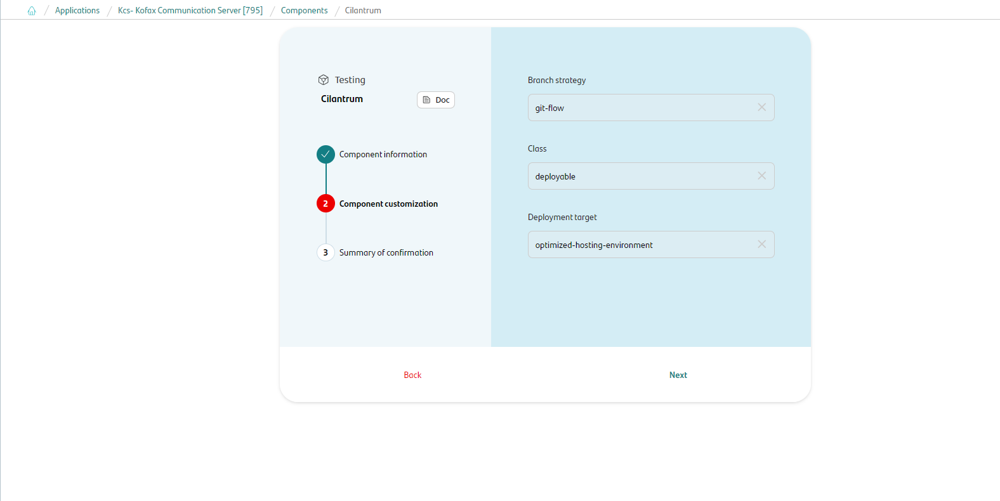

Summary to review your configuration before creating the component:

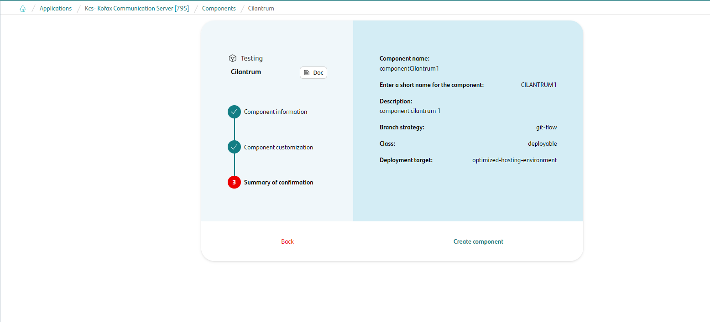

Once the component is created user can search see under the application that there is a new repository created with the name of the component.

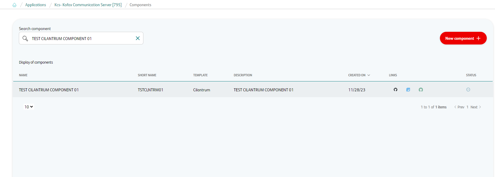

The following links are now available at:

| Item | Link | Role Permission |
| --- | --- | --- |
| GitHub Repository | Link to the repository created in GitHub | Developer (RW) /Technical Lead (Maintain) [All roles explained](https://docs.github.com/es/organizations/managing-user-access-to-your-organizations-repositories/managing-repository-roles/repository-roles-for-an-organization) |
| Sonar Project | Disable | N/A |
| Fortify Project | Disable | N/A |

### Cilantrum Template

Once the Cilantrum component is created, a repository will be generated on Github with the following configuration.

- Creates an **main** and **development** with the structure of files and folders to configure and run your Cilantrum collection. Work will begin on the development branch.

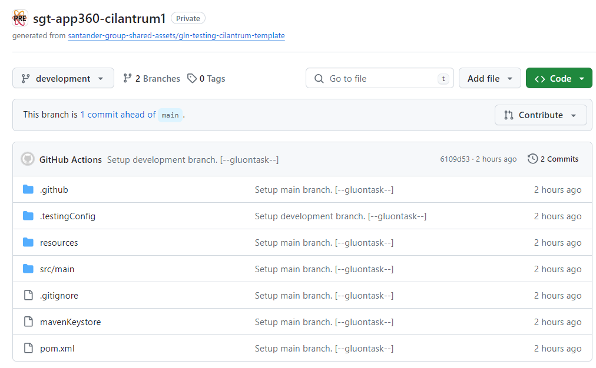

??? abstract "Cloning your repository"

    ### Cloning your repository

    Once the component has been created and the repository is available on GitHub, the first step is to clone the project locally.

    To do so, visit [**How to clone the project**](../../../../../application/component-management/create-component.md#cloning-a-repository).

## Execute

Cilantrum's project can be executed in four ways:

- [Local with IDE](#local-with-ide)
- [Local with CLI](#local-with-cli)
- [Remote with Testing Portal](#remote-with-testing-portal)
- [Remote from test component repo](#remote-from-test-component-repo)

### Local with IDE

#### What you need

{!
   include-markdown "../../snippets/cilantrum-prerequisites.md"
   start="<!--Cilantrum prerequisites IDE start-->"
   end="<!--Cilantrum prerequisites end-->"
!}

#### Execute with IDE tool

**1)** Import the project into a java IDE tool.
  With this basic template it is possible to begin to understand the structure of Cilantrum test projects. It is enough to open it with the IDE used by the user to see a structure similar to this:

  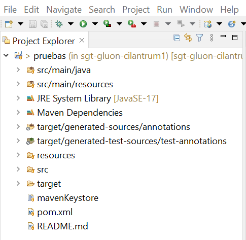{:style="border:1px solid grey"}

**2)** Configure Maven in the development IDE to download the dependencies and build the project:

  - [Configure settings.xml file](../../../../../getting-started/setup-your-environment/technologies/java-maven.md#configuring-settingsxml-file) and reference it in the IDE to make use of it when executing the project.

**3)** Run execution

   In **main folder**, launchers are found. To execute any of them, you must do **Run** as java application in which it will be executed:

   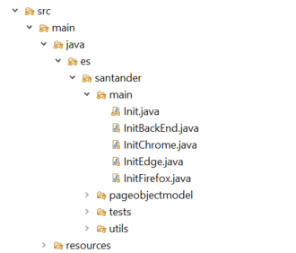{:style="border:1px solid grey"}

   For the **backend test example** it is not necessary to configure anything before running it. Just run the InitBackend.java file.

   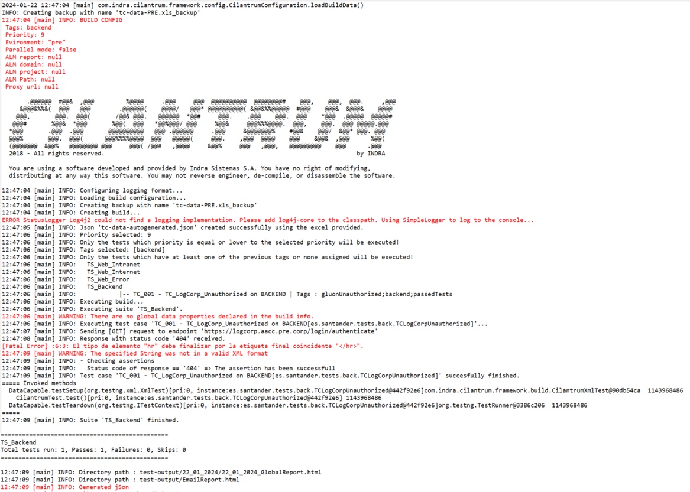{:style="border:1px solid grey"}

   However, for the **web test examples**, it is necessary that the browser is installed and that the drivers are compatible with the browser. Once this is done, the corresponding **main** must be executed.

   For Chrome, if the following error is displayed when running InitChrome.java, it is because the versions are incompatible.

   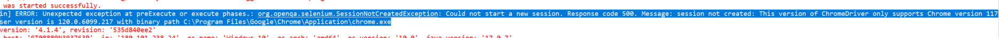{:style="border:1px solid grey"}

   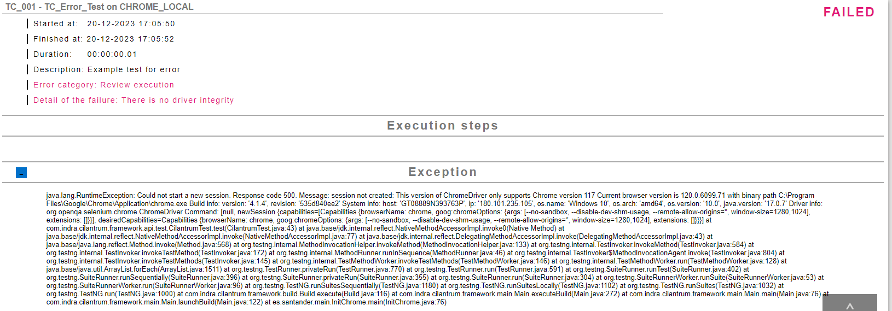{:style="border:1px solid grey"}

   In this case, it is required download the corresponding version from [Chromedriver](http://chromedriver.chromium.org/){:target="_blank"} and replace the one contained in the resource/drivers folder with the same name.
   Once this is done, run the InitChrome.java again.

  In order to run the tests in another browser, the procedure would be the same as for Chrome, but with the corresponding files for that browser.

### Local with CLI

#### What you need

{!
   include-markdown "../../snippets/cilantrum-prerequisites.md"
   start="<!--Cilantrum prerequisites start-->"
   end="<!--Cilantrum prerequisites end-->"
!}

#### Execute CLI

**1)** Once java and maven are installed, the settings.xml file must be configured:

 - [Configure settings.xml file](../../../../../getting-started/setup-your-environment/technologies/java-maven.md#configuring-settingsxml-file).

**2)** Open a command console and move to the local directory where the template clone has been saved.

**3)** Run execution

  For the **backend test example** run the following command:

  ```console
    $mvn clean compile exec:java -Dexec.mainClass=es.santander.main.InitBackEnd -Ddevice=backend -Denvironment=DEV -Djavax.net.ssl.trustStore=mavenKeystore -D setAuth=false
  ```

  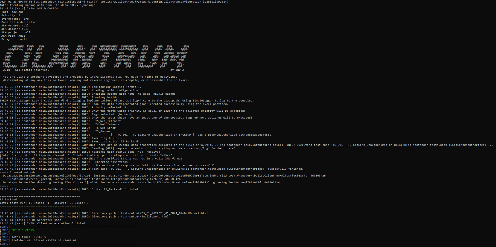{:style="border:1px solid grey"}

  To execute the **examples of web tests** it is necessary that the browser is installed and that the drivers are compatible with the browser.

  For Chrome, run the following command:

  ```console
    $mvn clean compile exec:java -Dexec.mainClass=es.santander.main.InitChrome -Ddevice=chrome_local -Denvironment=DEV -Djavax.net.ssl.trustStore=mavenKeystore -D setAuth=false
  ```

  In case the following error is displayed, the correct driver must be downloaded from [Chromedriver](http://chromedriver.chromium.org/){:target="_blank"} and replace the one contained in the resource/drivers folder with the same name.

  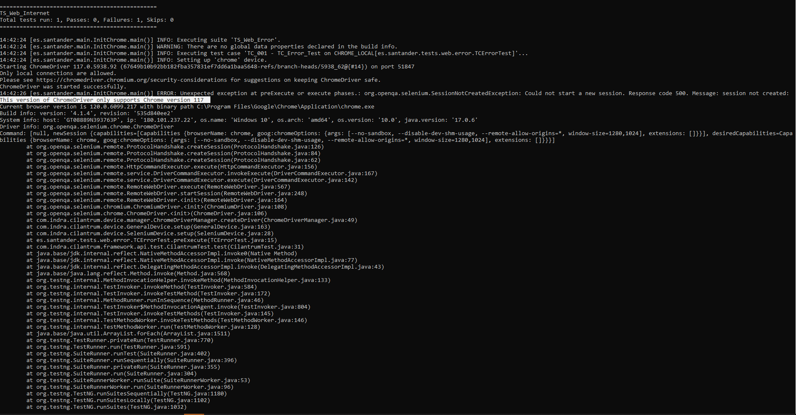{:style="border:1px solid grey"}

The parameters used for this command are explained here:

<table>
 <tr>
  <th>Parameter</td>
  <th>Valid value</td>
  <th>Description</td>
 </tr>
 <tr>
  <td rowspan="4">Ddevice</td>
  <td>backend</td>
  <td rowspan="4">Determines the configuration file that will be taken from: resources/devices</td>
 </tr>
 <tr>
  <td>chrome_local</td>
 </tr>
 <tr>
  <td>edge_local</td>
 </tr>
 <tr>
  <td>firefox_local</td>
 </tr>
 <tr>
  <td rowspan="5">Dexec.mainClass</td>
  <td>es.santander.main.InitBackEnd</td>
  <td rowspan="5">Main class to be executed. <b>Init</b> is the one used for testing portal runs. If used locally, it is recommended to create an InitLocal to ensure that Init main is not changed </td>
 </tr>
  <tr>
  <td>es.santander.main.InitChrome</td>
 </tr>
  <tr>
  <td>es.santander.main.InitEdge</td>
 </tr>
 <tr>
  <td>es.santander.main.InitFirefox</td>
 </tr>
 <tr>
  <td>es.santander.main.Init</td>
 </tr>
 <tr>
  <td rowspan="3">Denvironment</td>
  <td>DEV</td>
  <td rowspan="3">Environment where it is to be deployed. Used to determine which xls file to use (tc-data)</td>
 </tr>
 <tr>
  <td>PRE</td>
 </tr>
 <tr>
  <td>PRO</td>
 </tr>
 <tr>
  <td>Djavax.net.ssl.trustStore</td>
  <td>mavenKeystore</td>
  <td>File needed with maven credentials</td>
 </tr>
 <tr>
  <td rowspan="2">D setAuth</td>
  <td>true</td>
  <td rowspan="2">Data to indicate if proxy settings should be used or not</td>
 </tr>
 <tr>
  <td>false</td>
 </tr>
</table>

### Remote with Testing Portal

Another way to run Cilantrum's project is through the Gluon Testing Portal. To do this, first check that the
[prerequisites](../../../../../application/qatesting/testing/initialstep.md) to use the portal are met.
Once this is done, go to [Gluon Testing Portal](https://gluon.gs.corp/testing){:target="_blank"} and create a new configuration for the Cilantrum project as follows.

??? abstract "Example params for Cilantrum template"
     **Test identification**

        Project Reference: Name of new configuration

     **Repository**

         Application: Gluon application where the Cilantrum component has been created
         Testing component: Name of the testing component on Gluon
         Git branch: "main"

     **Configurations**

         Test type: "web" or "backend"
         Framework testing: "Cilantrum"
         Environment: "DEV" or "PRE"
         Device: "Chrome", "Firefox" or "Edge" (Only if Test type is web)
         Parallel execution: "1"

     **Cloud**

         Cloud: Cluster where your application is located
         Namespace: Namespace where your application is located

     **Report**

        Email: Mailing list where to send the execution results (Optional)

     **Schedule**

        Schedule: Set up scheduled executions (Optional)

{!
   include-markdown "../../../../../application/qatesting/testing/portal/testing-portal/ondemand.md"
   start="<!--Testing portal ondemand functional web and backend tests creation start-->"
   end="<!--Testing portal ondemand functional web and backend tests creation end-->"
!}
{!
   include-markdown "../../../../../application/qatesting/testing/portal/testing-portal/ondemand.md"
   start="<!--Testing portal ondemand functional tests creation start-->"
   end="<!--Testing portal ondemand functional tests creation end-->"
!}

Once the project is created, it can be executed.

{!
   include-markdown "../../../../../application/qatesting/testing/portal/testing-portal/ondemand.md"
   start="<!--Testing portal ondemand functional tests launch start-->"
   end="<!--Testing portal ondemand functional tests launch end-->"
!}

For more information about use of Gluon Testing Portal got to [Ondemand section](../../../../../application/qatesting/testing/portal/testing-portal/ondemand.md).

### Remote from test component repo

{!
   include-markdown "../../../../../application/qatesting/testing/workflows/snippets/workflows-steps.md"
   start="<!-- ondemand workflow introduction start -->"
   end="<!-- ondemand workflow introduction end -->"
!}

{!
   include-markdown "../../../../../application/qatesting/testing/workflows/ondemand/cilantrum.md"
   start="<!-- ondemand workflows cilantrum execute start -->"
   end="<!-- ondemand workflows cilantrum execute end -->"
!}

#### Steps

{!
   include-markdown "../../../../../application/qatesting/testing/workflows/snippets/workflows-steps.md"
   start="<!-- workflow steps cilantrum start -->"
   end="<!-- workflow steps cilantrum end -->"
!}

{!
   include-markdown "../../../../../application/qatesting/testing/workflows/snippets/workflows-steps.md"
   start="<!-- job report test results start -->"
   end="<!-- job report test results end -->"
!}

#### Results

{!
   include-markdown "../../../../../application/qatesting/testing/workflows/snippets/workflows-steps.md"
   start="<!-- workflow results start -->"
   end="<!-- workflow results end -->"
!}

### Related content

[Cilantrum Documentation](../framework/index.md)

[Testing Portal](../../../../../application/qatesting/testing/portal/testing-portal/index.md)
