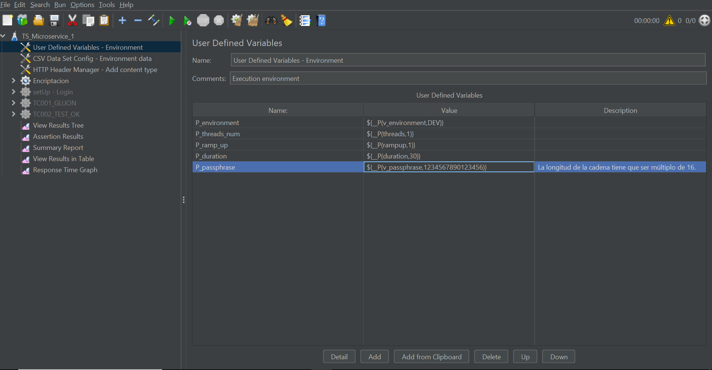
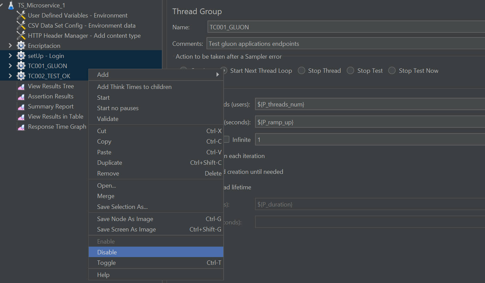
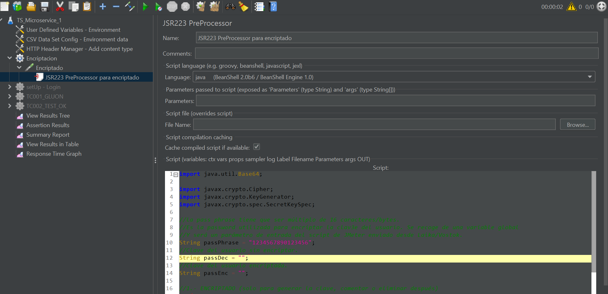
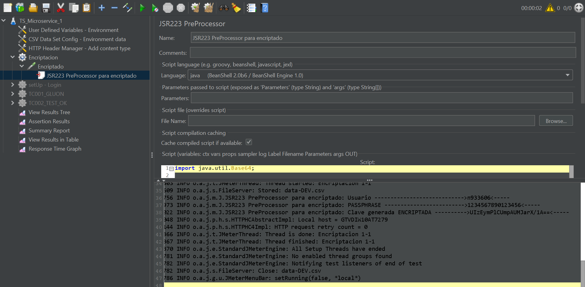
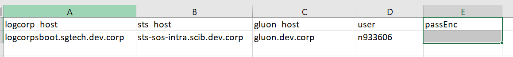
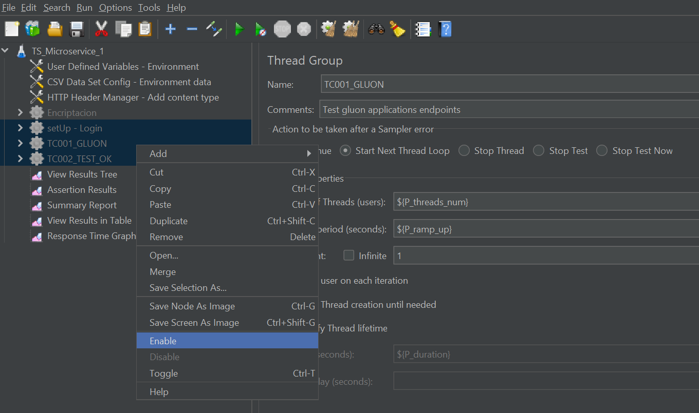

---
hide:
  - toc
---

# JMeter Documentation

## Introduction

{!
  include-markdown "../journey/jmeter-testing-journey.md"
  start="<!--JMeter introduction start-->"
  end="<!--JMeter introduction end-->"
!}

----

## Getting started

To get started, install [Java](../../../../../getting-started/setup-your-environment/technologies/java-maven.md) and JMeter, then run your performance tests. Learn more about [installing and running JMeter](../journey/jmeter-testing-journey.md#execute).

## Encrypting data

There is a secure way to encrypt sensitive data used in JMeter performance testing, such as user passwords, especially for testing in production environments with real data and real users.

For this purpose, a Passphrase field has been added to the performance test configuration screens, which will allow us to pass as a parameter (whose name will be v_passphrase) to the JMeter scripts a
password that we can use directly or to encrypt any data used by our tests that we consider sensitive.
Once entered in the Gluon Testing card, this passphrase cannot be consulted and will not leave any trace in the execution logs, so it will only be able to be modified by assigning a new password.

In order to use encrypted data in JMeter scripts(taking into account that we must first define a passphrase and encrypt the data we consider sensitive) we must get the script ready to receive that passphrase as an input parameter and use it for decryption:

- There is an User Defined Variable with the name v_passphrase. To define this we must use the following syntaxis: ${__P(param_name,value)}

When the jmx is executed from the testing portal, the value entered in the card (ondemand or CI/CD) will be passed through this parameter.

- The first step will be to encrypt our sensitive data. For our example, we are going to encrypt the user's password that we are going to use for our tests included in a CSV file. For this, a value is assigned to the passphrase that is used as the
default value in the declaration of the variable commented in the previous point.

- There is a thread group that is used only for data encryption. To encrypt the password with the passphrase, the group threads must be disabled, except for the "Encriptacion" thread. You must right-click on the other thread groups in the left side
menu and click on the Disable option.

Next, the preprocessor of type JSR223 must be opened. This code does the encryption, you must put the password in the passDec variable and then click Play.

By running the script and consulting the JMeter console(using the exclamation icon in the upper right corner) we can retrieve the key of the user already encrypted (unencrypted key has been hidden for security):

- Open the CSV file and put the encrypted password in the passEnc column.

- Disable the "Encriptacion" thread group and enable the rest of the thread groups. And finally run the tests, clicking on the Play button.

## Related content

[JMeter Journey](../journey/jmeter-testing-journey.md)

[Testing portal](../../../../../application/qatesting/testing/portal/testing-portal/index.md)
