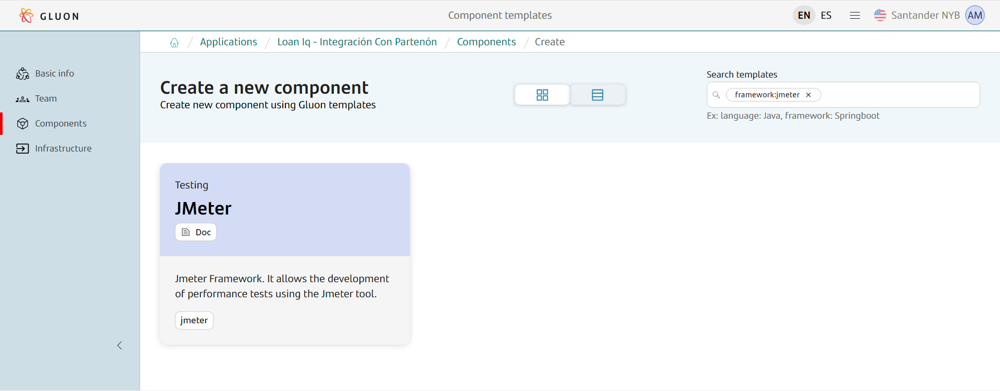
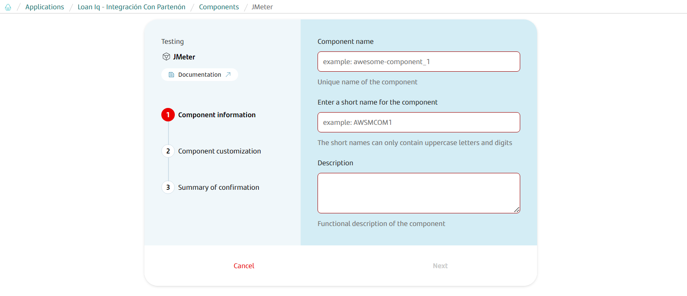
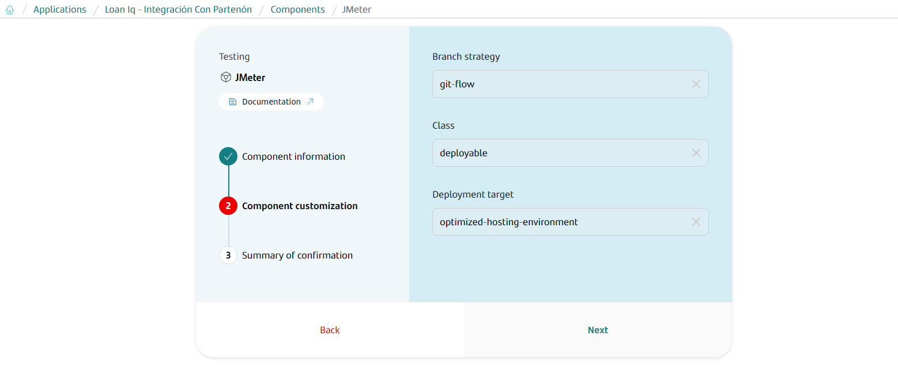
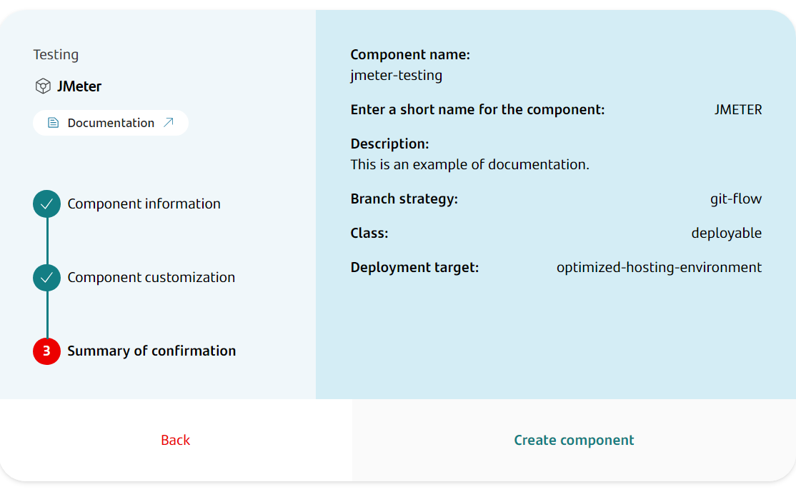
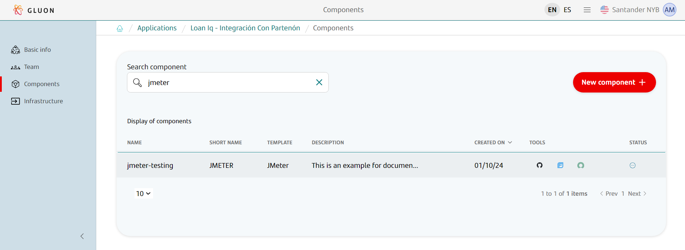
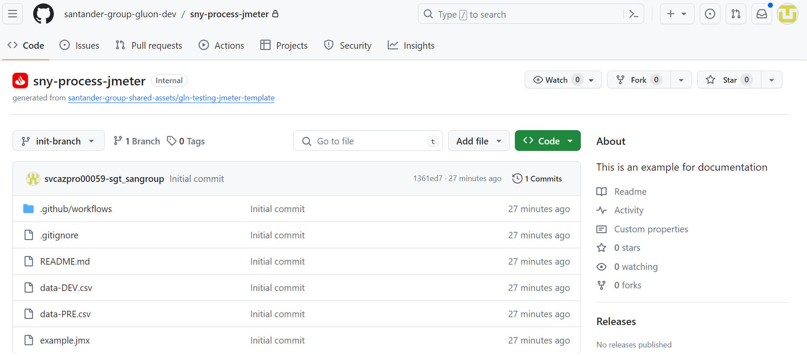
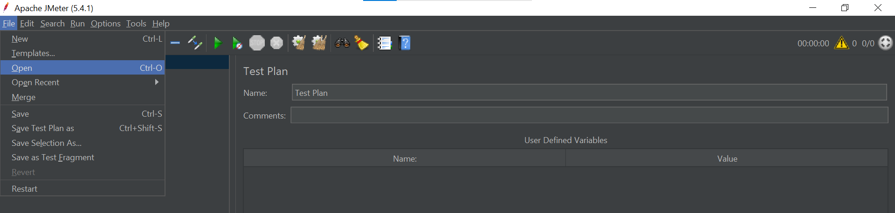
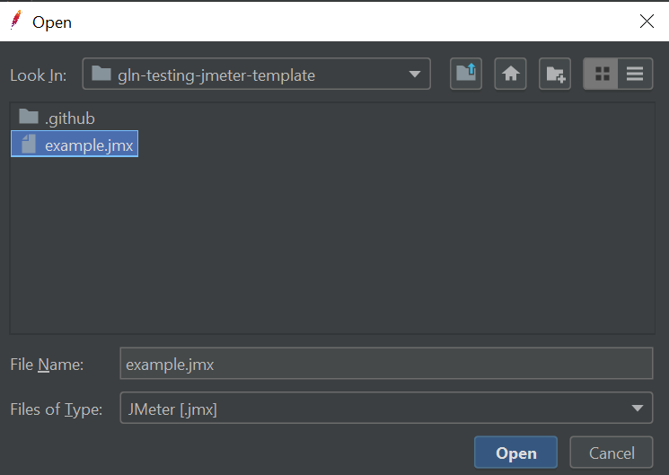
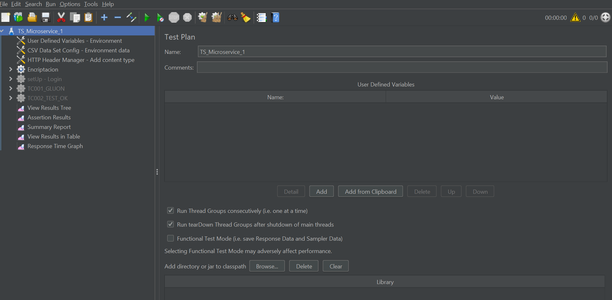

# Jmeter Journey

## Introduction

<!--JMeter introduction start-->

**JMeter** can measure performance and load test static and dynamic web applications.

It can be used to simulate a heavy load on a server, group of servers, network or object to test its strength or to analyze overall performance under different load types.

Apache JMeter (also JMeter) is an open source application developed in Java and designed primarily for load and performance testing for the following types of applications, services and protocols:

- Web applications: HTTP, HTTPS (Java, NodeJS, PHP, [ASP.NET Core](http://asp.net/),...)
- SOAP / REST web services
- FTP
- Database via JDBC
- LDAP
- Message Oriented Middleware (MOM) via JMS
- Mail: SMTP (S), POP3 (S) and IMAP (S)
- Native commands or shell scripts
- TCP
- Java objects

You can find more information and documentation in the [JMeter](https://jmeter.apache.org/usermanual/index.html) page.

<!--JMeter introduction end-->

## Create Component

### Gluon Portal

First you have to [**onboard your application.**](../../../../../application/application-management/application-onboard.md)
Once you have your application created, you can start creating your testing component.

To create a testing component, follow the steps described in [**Component Management**](../../../../../application/component-management/create-component.md),
searching for the component to be created.

You have to select the type of component you want to create, in this case you are going to create a **JMeter**.

Next, the user must fill out some fields on the **JMeter** component creation flow screen.

???+ remember

    To follow the naming convention visit [Repository Naming Convention](../../../../../application/component-management/create-component.md#repository-naming-convention).

Component information:

- **Component name**: Name of component on Gluon
- **ShortName**: Short name of the component used for creating the git repository
- **Description**: Description of component

Component customization:

- **Branch Strategy**: git-flow
- **Class**: deployable
- **Deployment target**: optimized-hosting-environment

Summary to review your configuration before creating the component:

Once the component is created we can see under the application that there is a new repository created with the name of the component.

We have the following links in:

| Item | Link | Role Permission |
| --- | --- | --- |
| GitHub Repository | Link to the repository created in GitHub | Developer (RW) /Technical Lead (Maintain) [All roles explained](https://docs.github.com/es/organizations/managing-user-access-to-your-organizations-repositories/managing-repository-roles/repository-roles-for-an-organization) |
| Sonar Project | Disable | N/A |
| Fortify Project | Disable | N/A

### JMeter Template

When you creates the component from the Gluon Portal, the component is created with the default values of the template from the scaffolding workflow.

- Creates an **init-branch** with the structure of files and folders to configure and run your JMeter Framework.

## Execute

JMeter's project can be executed in two ways:

- [Local with Jmeter](#local-with-jmeter)
- [Remote with testing portal](#remote-with-testing-portal)
- [Remote from test component repo](#remote-from-test-component-repo)

### Local with JMeter

In this section we will see how to develop tests in JMeter and run them in a local environment.

#### What you need

- JMeter (version 5.4).
- Java Interpreter:
    A fully compliant Java 8 Runtime Environment is required for Apache JMeter to execute. A JDK with keytool utility is better suited for Recording HTTPS websites.

#### Import project and execute with JMeter

On JMeter select **Open**.

Select the project that has been cloned from the component created in Gluon.

In the menu on the left side can be seen the thread groups that will be launched. To run this project press the **Play** button.

### Remote with testing portal

Another way to run JMeter's project is through the Gluon testing portal. To do this, first check that the
[prerequisites](../../../../../application/qatesting/testing/initialstep.md) to use the portal are met.
Once this is done, go to [Gluon testing portal](https://gluon.gs.corp/testing){:target="_blank"} and create a new configuration for
the JMeter project as follows.

??? abstract "Example params for JMeter template"
     **Test identification**

        Project Reference: Name of new configuration

     **Repository**

         Application: Gluon application where the JMeter component has been created
         Testing component: Name of the testing component on Gluon
         Git branch: "init-branch"

     **Configurations**

        Environment: "DEV" or "PRE"
        JMeter Version: 5.4
        Application workload: "Web Service"
        Jmx file path: "example.jmx"

     **Cloud**

         Cloud: Cluster where your application is located
         Namespace: Namespace where your application is located

     **Report**

        Email: Mailing list where to send the execution results (Optional)

     **Schedule**

        Schedule: Set up scheduled executions (Optional)

{!
   include-markdown "../../../../../application/qatesting/testing/portal/testing-portal/ondemand.md"
   start="<!--Testing portal ondemand performance tests creation start-->"
   end="<!--Testing portal ondemand performance tests creation end-->"
!}

Once the project is created, it can be executed.

{!
   include-markdown "../../../../../application/qatesting/testing/portal/testing-portal/ondemand.md"
   start="<!--Testing portal ondemand performance tests launch start-->"
   end="<!--Testing portal ondemand performance tests launch end-->"
!}

For more information about use of Gluon Testing Portal got to [Ondemand section](../../../../../application/qatesting/testing/portal/testing-portal/ondemand.md).

### Remote from test component repo

{!
   include-markdown "../../../../../application/qatesting/testing/workflows/snippets/workflows-steps.md"
   start="<!-- ondemand workflow introduction start -->"
   end="<!-- ondemand workflow introduction end -->"
!}

{!
   include-markdown "../../../../../application/qatesting/testing/workflows/ondemand/jmeter.md"
   start="<!-- ondemand workflows jmeter execute start -->"
   end="<!-- ondemand workflows jmeter execute end -->"
!}

#### Steps

{!
   include-markdown "../../../../../application/qatesting/testing/workflows/snippets/workflows-steps.md"
   start="<!-- workflow steps jmeter start -->"
   end="<!-- workflow steps jmeter end -->"
!}

{!
   include-markdown "../../../../../application/qatesting/testing/workflows/snippets/workflows-steps.md"
   start="<!-- job report test results start -->"
   end="<!-- job report test results end -->"
!}

#### Results

{!
   include-markdown "../../../../../application/qatesting/testing/workflows/snippets/workflows-steps.md"
   start="<!-- workflow results jmeter start -->"
   end="<!-- workflow results jmeter end -->"
!}

### Related content

[JMeter Documentation](../framework/index.md)

[Testing Portal](../../../../../application/qatesting/testing/portal/testing-portal/index.md)
