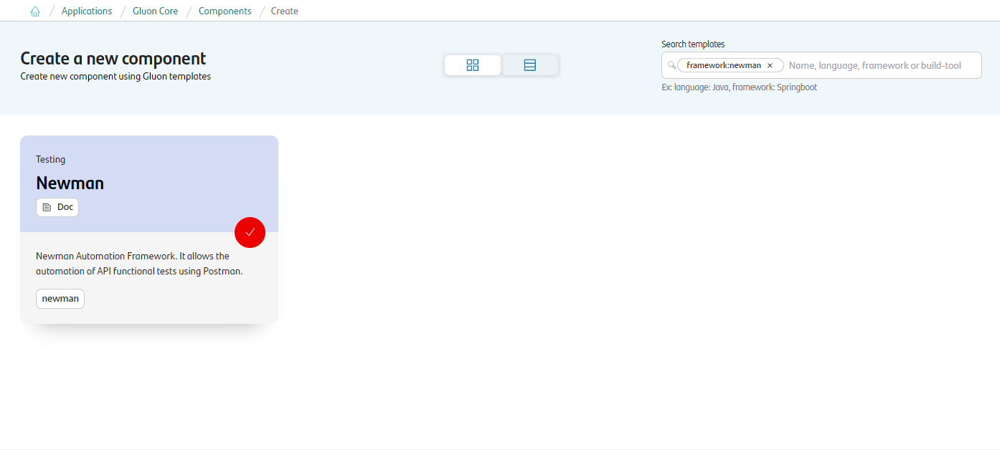
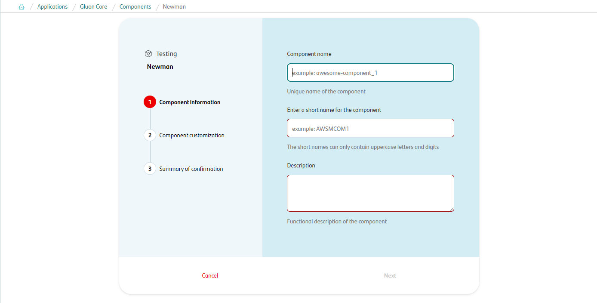
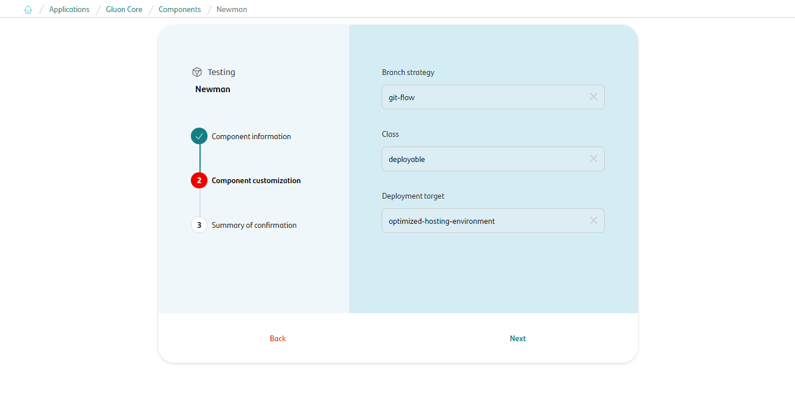
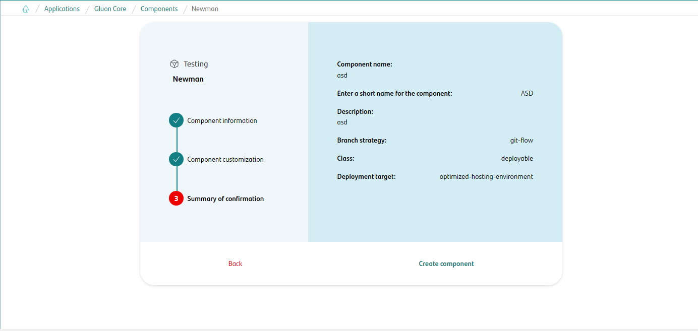
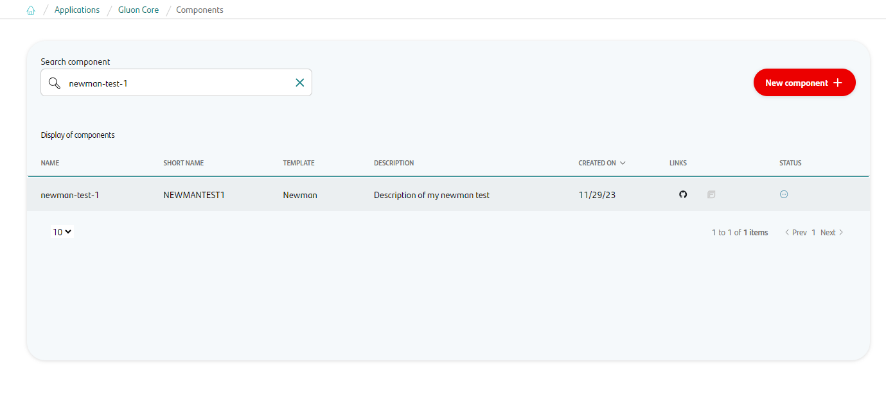
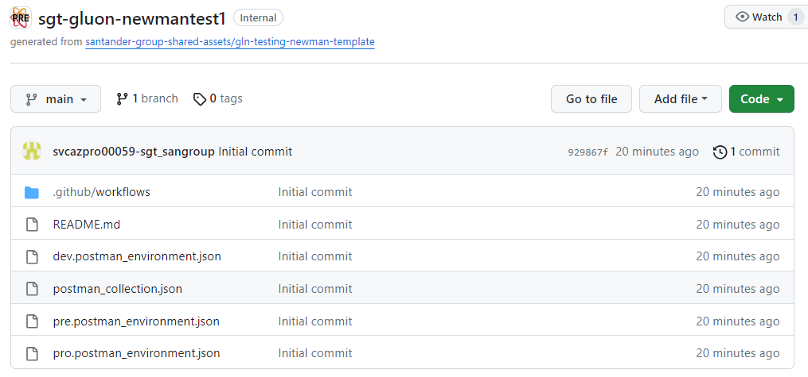
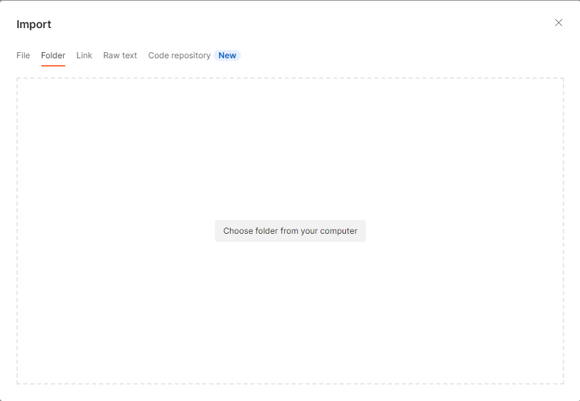
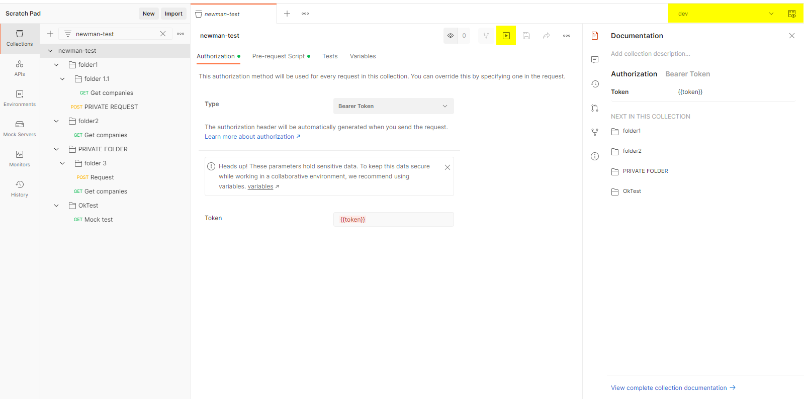
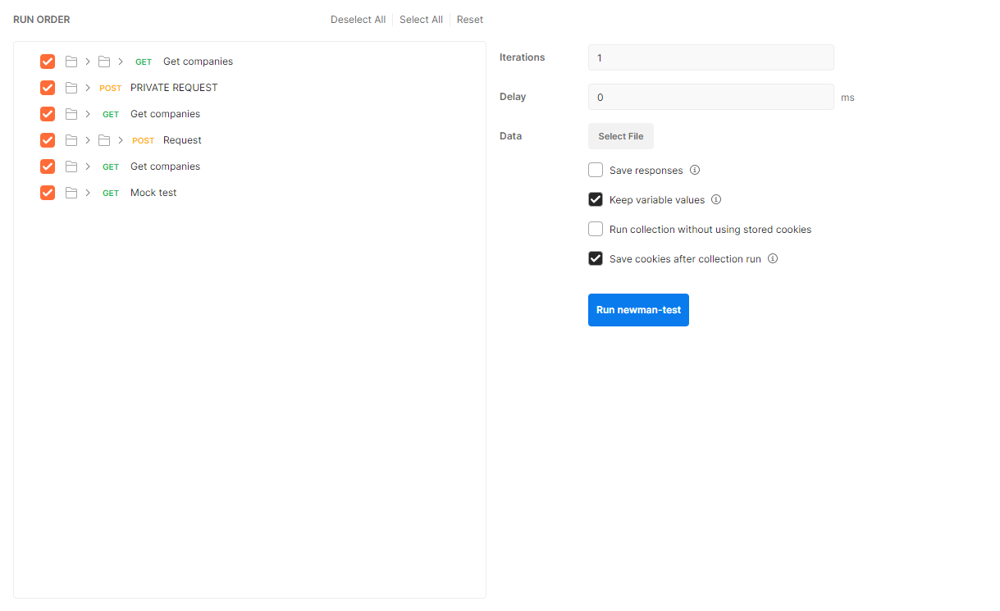

# Newman Journey

## Introduction

{!
   include-markdown "../framework/index.md"
   start="<!--Newman introduction start-->"
   end="<!--Newman introduction end-->"
!}

----

## Create Component

### Gluon Portal

First you have to [**onboard your application.**](../../../../../application/application-management/application-onboard.md)
Once you have your application created, you can start creating your testing component.

To create a testing component, follow the steps described in [**Component Management**](../../../../../application/component-management/create-component.md),
searching for the component to be created.

You have to select the type of component you want to create, in this case you are going to create a **Newman**.



Next, the user must fill out some fields on the **Newman** component creation flow screen.

???+ remember

    To follow the naming convention visit [Repository Naming Convention](../../../../../application/component-management/create-component.md#repository-naming-convention).

Component information:

- **Component name**: Name of component on Gluon
- **ShortName**: Short name of the component used for creating the git repository
- **Description**: Description of component



Component customization:

- **Branch Strategy**: git-flow
- **Class**: deployable
- **Deployment target**: optimized-hosting-environment



Summary to review your configuration before creating the component:



Once the component is created user can search see under the application that there is a new repository created with the name of the component.



Now have the following links in:

| Item | Link | Role Permission |
| --- | --- | --- |
| GitHub Repository | Link to the repository created in GitHub | Developer (RW) /Technical Lead (Maintain) [All roles explained](https://docs.github.com/es/organizations/managing-user-access-to-your-organizations-repositories/managing-repository-roles/repository-roles-for-an-organization) |
| Sonar Project | Disable | N/A |
| Fortify Project | Disable | N/A |

### Newman Template

Once the Newman component is created, a repository will be generated on Github with the following configuration.

- Creates an **main** with the structure of files and folders to configure and run your Newman collection.



In the project template there are four files, the Postman collection where the set of requests is located and three environment files (DEV, PRE and PRO).

??? abstract "Cloning your repository"

    ### Cloning your repository

    Once we have the device properly configured, the first step is to clone the project locally.

    To do so, visit [**How to clone the project**](../../../../../application/component-management/create-component.md#cloning-a-repository).

## Execute

Newman's project can be executed in four ways:

- [Local with Postman](#local-with-postman)
- [Local with Newman CLI](#local-with-newman-cli)
- [Remote with Testing Portal](#remote-with-testing-portal)
- [Remote from test component repo](#remote-from-test-component-repo)

### Local with Postman

#### What you need

- [Postman](../../../../../getting-started/setup-your-environment/tools/install-postman.md) 9 or later.

#### Import project and execute with Postman

On Postman select **Import**

Select folder option and the project that has been cloned from the component created in Gluon. This import four files: The collection with the requests and three environment files (dev, pre and pro).



To run this project, first select the environment in which the test will be run and then open the executor by pressing the **Run** button.



Execution tab displays the cases to execute as well as other configurations for execution: iterations, delay, data file... Once configured, we execute the test.



### Local with Newman CLI

#### What you need

- [Node.js](../../../../../getting-started/setup-your-environment/technologies/javascript-node.md) 16 or later.

Newman is built on Node.js. To run Newman, make sure you have Node.js installed.

Install Newman from npm globally on your system, enabling you to run it from anywhere:

```console
  $npm install -g newman
```

#### Execute Newman CLI

The easiest way to run Newman is to run it with a collection. You can run any collection file from your file system.

```console
  $newman run postman_collection.json
```

If your collection uses environment variables, you must provide a set of environment variables used in your collection. Export the template from Postman and run them with the -e flag.

```console
  $newman run postman_collection.json -e <env>.postman_environment.json
```

### Remote with Testing Portal

Another way to run Newman's project is through the Gluon testing portal. To do this, first check that the
[prerequisites](../../../../../application/qatesting/testing/initialstep.md) to use the portal are met.
Once this is done, go to [Gluon testing portal](https://gluon.gs.corp/testing){:target="_blank"} and create a new configuration for
the Newman project as follows.

??? abstract "Example params for Newman template"
     **Test identification**

        Project Reference: Name of new configuration

     **Repository**

         Application: Gluon application where the Newman component has been created
         Testing component: Name of the testing component on Gluon
         Git branch: "main"

     **Configurations**

         Test type: "backend"
         Framework testing: "Newman"
         Environment: "DEV" or "PRE"
         Parallel execution: "1"
         Tags: "OkTest"

     **Cloud**

         Cloud: Cluster where your application is located
         Namespace: Namespace where your application is located

     **Report**

        Email: Mailing list where to send the execution results (Optional)

     **Schedule**

        Schedule: Set up scheduled executions (Optional)

{!
   include-markdown "../../../../../application/qatesting/testing/portal/testing-portal/ondemand.md"
   start="<!--Testing portal ondemand functional web and backend tests creation start-->"
   end="<!--Testing portal ondemand functional web and backend tests creation end-->"
!}
{!
   include-markdown "../../../../../application/qatesting/testing/portal/testing-portal/ondemand.md"
   start="<!--Testing portal ondemand functional tests creation start-->"
   end="<!--Testing portal ondemand functional tests creation end-->"
!}

Once the project is created, it can be executed.

{!
   include-markdown "../../../../../application/qatesting/testing/portal/testing-portal/ondemand.md"
   start="<!--Testing portal ondemand functional tests launch start-->"
   end="<!--Testing portal ondemand functional tests launch end-->"
!}

For more information about use of Gluon Testing Portal got to [Ondemand section](../../../../../application/qatesting/testing/portal/testing-portal/ondemand.md).

### Remote from test component repo

{!
   include-markdown "../../../../../application/qatesting/testing/workflows/snippets/workflows-steps.md"
   start="<!-- ondemand workflow introduction start -->"
   end="<!-- ondemand workflow introduction end -->"
!}

{!
   include-markdown "../../../../../application/qatesting/testing/workflows/ondemand/newman.md"
   start="<!-- ondemand workflows newman execute start -->"
   end="<!-- ondemand workflows newman execute end -->"
!}

#### Steps

{!
   include-markdown "../../../../../application/qatesting/testing/workflows/snippets/workflows-steps.md"
   start="<!-- workflow steps newman start -->"
   end="<!-- workflow steps newman end -->"
!}

{!
   include-markdown "../../../../../application/qatesting/testing/workflows/snippets/workflows-steps.md"
   start="<!-- job report test results start -->"
   end="<!-- job report test results end -->"
!}

#### Results

{!
   include-markdown "../../../../../application/qatesting/testing/workflows/snippets/workflows-steps.md"
   start="<!-- workflow results start -->"
   end="<!-- workflow results end -->"
!}

### Related content

[Newman Documentation](../framework/index.md)

[Testing portal](../../../../../application/qatesting/testing/portal/testing-portal/index.md)
