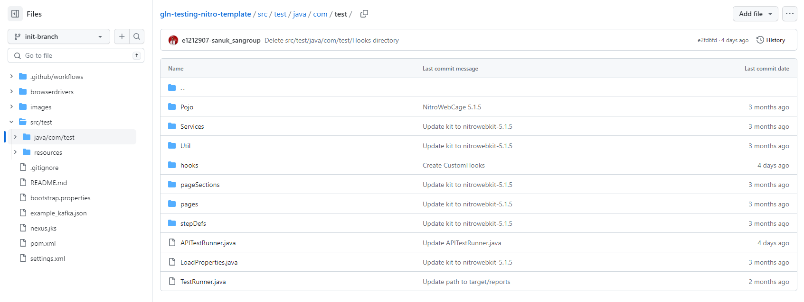
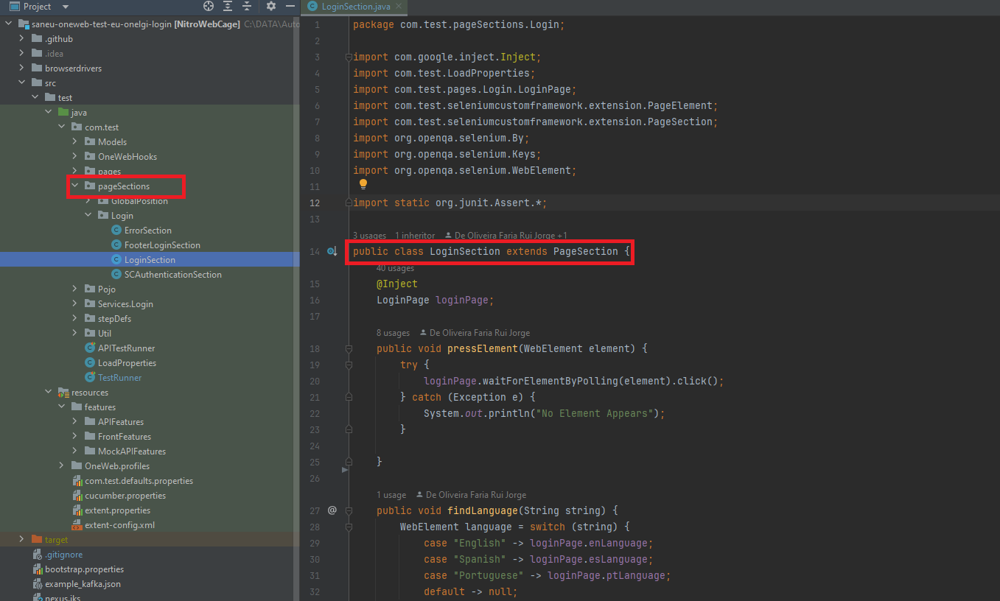
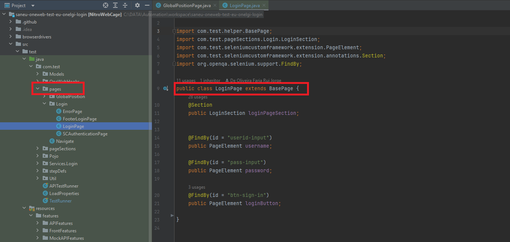
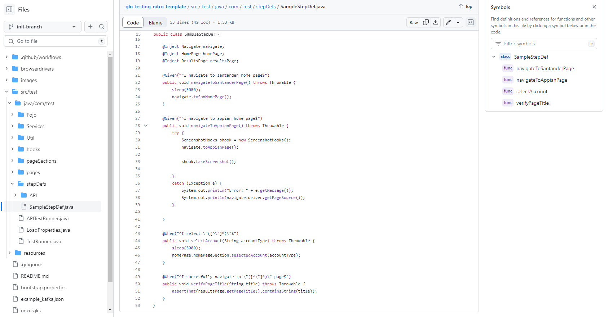
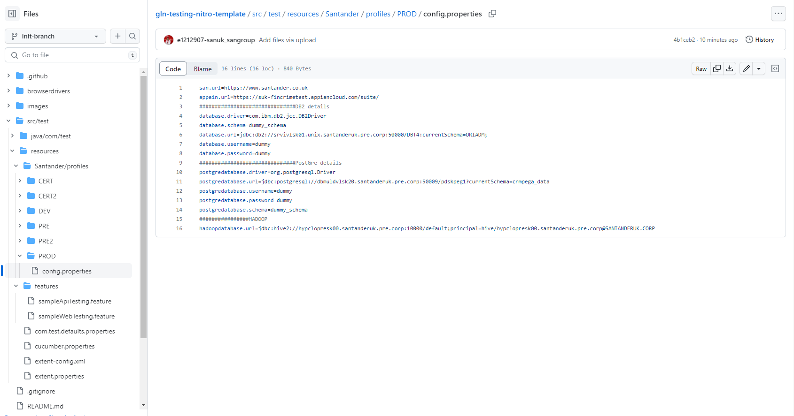

# 

## What is Nitro?

> A framework developed and supported by ***TAASUK - Testing as a Service UK***

**Nitro Framework** is a [JAVA](https://docs.oracle.com/en/java/javase/17/) test automation framework based on the BDD development
methodology. Uses a Gherkin language layer for automated test case development. It allows the automation of functional tests web in a simple, fast and easy maintenance way. Provides common features that are required in UI test automation
like Selenium web driver instantiation, browser handling using Selenium Hub and generate test reports.

Automation Test Framework for the web is being released as a single light weight standalone library which can be easily maintained. It also supports accessibility testing.

We are publishing the framework as a library to provide the users a scalable and portable solution with version control.
Customers/Projects can use the different flavours of the library as per their requirement. The objective is also to capture contributions from different teams to the library.

---

## Nitro is a framework

Maintained by a community of more than 300 people across the globe, therefore it is a living framework, in constant evolution.

- A set of libraries, guidelines, standards, methodologies, etc.

- It provides mechanisms that allow solving different kinds of problems.

- It is extensible through code written by applications.

- Provides ease of development, configuration and implementation.

- It is extensible to other technologies. E.g.: javascript

---

## Other Nitro implementations

NitroWebKit provides a wrapper for other framework modules and provides extension to

- **NitroAppiumKit**: is a keyword framework for testing Appium applications

- **NitroSalesforceKit**: implements strategies for locating elements with ease while testing Salesforce applications

- Test proofed on Pega ecosystem for both frontend, mobile and api

---

## Folder structure

The folder structure is common across all packages and modules of the framework, using standard
java package naming conventions.
In this section we will review the folder structures of the framework for the best experience of
an MVC framework combined with [Page Object Model](https://www.selenium.dev/documentation/test_practices/encouraged/page_object_models/){:target="_blank"} design pattern.
  
???+ info

      MVC (Model-View-Controller) is a pattern in software design commonly used to implement user interfaces,
      data and controlling logic. It emphasizes a separation between the  software's business logic and display. 
      This "separation of concerns" provides for a better division of labor and improved maintenance.
      For more information see https://developer.mozilla.org/en-US/docs/Glossary/MVC.

``` bash

📂.github
 ┣ 📂workflows
 | ┗ 📜mvn-test-j17.yml
 ┗ 📜CODEOWNERS
📂browserdrivers
 ┣ 🖥️ chromedriver.exe
 ┣ 🖥️ geckodriver.exe
 ┣ 🖥️ msedgedriver.exe
 ┗ 🖥️ IEDriverServer.exe
📂images
📂src/test
| ┣ 📂java/com/test
| | ┣ 📂 Pojo
| | ┣ 📂 Services
| | ┣ 📂 Util
| | | ┣ ☕ApiLibrary.java
| | | ┣ ☕ApiServiceEndpoints.java
| | | ┗ ☕TestConstants.java
| | ┣ 📂 hooks
| | ┣ 📂 pageSections
| | ┣ 📂 pages
| | ┣ 📂 stepDefs
| | ┣ ☕APITestRunner.java
| | ┣ ☕LoadProperties.java
| | ┗ ☕TestRunner.java
| ┗ 📂 resources
|   ┣ ☕com.test.defaults.properties
|   ┣ ☕cucumber.properties
|   ┣ ☕extent-config.xml
|   ┗ ☕extent.properties
|   ┣ 📂 features
|   | ┗ ☕sampleApiTesting.feature
|   ┗ 📂 Santander/profiles
|     ┗ 📂 {Environment}
|       ┗ 📜config.properties  
📜.gitignore
📜README.md
📜bootstrap.properties
📜kafka.json
📜nexus.jks
📜pom.xml
📜settings.xml

```

`1. .github/workflows`

Enables Github capabilities like reusable workflows, templates, and much more. We have added a sample
workflow test with maven and jdk17 for utilizing github /alm runners.
Please follow the link for more information regarding [Github Actions](https://docs.github.com/en/actions/quickstart){:target="_blank"}.

`2. browserdrivers`

This folder is used for storing the webdrivers for **local execution only** and holds the executables for Internet Explorer 11 (IEDriverServer.exe), Google Chrome (chromedriver.exe), Mozilla Firefox (geckodriver.exe), Microsoft Edge (msedgedriver.exe).
Fore more information on how to setup local drivers, see [local driver configuration](quick-start.md#local-vs-remote-execution).

`3. images`

Can be ignored for project executions, stores static images for Readme.md.

`4. src/test`

Stores static images for Readme.md, can be ignored for project executions.

=== "java/com/test"

    This path of the scaffolding is used by the users to place here their code and logic for testing their own projects and applications by following an organized structured.
    
    
    
    
    * Pojo: Definition of objects for mapping requests/response data
      * Services: Folder containing class files with service/api logic and validations
      * Util
        * ApiLibrary.java: predefined request specifications and gson library functions for easy construction of the rest calls.
        * ApiServiceEndpoint.java: stores the endpoint definition for the urls constructors 
        * TestConstants.java: predefined constants using setter and getters for setting/reading the value of a defined key
      * hooks: user defined custom hooks for advanced functionalities. When used, this needs to be referenced in the glue section inside TestRunner.java class. 
      * pageSection: java class file that extends the Nitro framework PageSection to provide an interactive layer with a DOM to enable the logic of a section of a web page.  **The structure follows the PageObject design pattern!**
    
    ???+ info
    
        1. Naming convention for class file name: PageSectionName+PageSection.java. Example: CurrentAccountPageSection.java
        2. The page section extends PageSection 
        3. The page section injects the @Page
        4. The page section contains functionality logic, validations and actions
        5. Does not contain locators
    
        
    
    * pages: java class files that extends the Nitro framework BasePage to enable selenium capabilities and interactions with the driver. **The structure follows the PageObject design pattern!** 
    
    ???+ info
    
        1. Naming convention for class file name: <PageName>Page.java. Example: HomePage.java
        2. The page extends BasePage 
        3. The page contains @Section and locators of webElements annotated with @FindBy
        4. The page does not hold any logic or validation
        5. Readability when invoked: homePage.section.action
    
        
    
    
    * stepDefs: Gherkin implementation of scenarios using Given/When/Then/And. **The structure follows the PageObject design pattern!** 
    

    * LoadProperties.java: Configuration loader based on environment profiles based on key/value pairs
    
    * TestRunner.class: Cucumber runner based on JUnit, reference the configuration of all components required for running the framework.

=== "resources"

    Under this path, the user can reference all the resources required to run the testing code from java/com/test. This path holds the feature files, configuration properties for each environment, anything else that serves as a user input.

    * Santander/profiles: Possible values DEV/CERT/CERT2/PRE/PRE2/PROD. For each environment the same config.properties will be present with the same key/value pairs across environments.
    * features: location where the .feature files written in gherkin containing the test scenarios are stored.
    * com.test.defaults.properties: default test properties for notation purpose only
    * cucumber.properties: [Cucumber configuration](https://cucumber.io/docs/cucumber/api/?lang=java#options){:target="_blank"}  
    * extent-config.xml: xml template report for Aventstack Extent Reports
    * extent.properties: configuration file for Aventstack Extent Reports

    

`5. .gitignore`

Standard gitignore file to exclude files, folders and extensions from vcs.

`6. Readme.md`

Framework "Read me" file to get started with Nitro Framework.

`7. bootstrap.properties`

Hold the runtime configuration of the framework. Things like:

- in which environment to execute
- what browser to use
- proxy configuration
- etc.

The values of the properties configured here are considered the default ones. However, **these can be overwritten by adding arguments '-D' to mvn command**. Example:

```commandline
mvn test -Dbrowser=firefox -Denvironment=Pre
```

`8. target`

All the compiled sources and class files, as well as the generated testing reports, logs and evidences will be stored here. Do not include folder in version control!

`9. settings.xml`

Configuration settings.xml for maven so that the execution can now from where to resolve the maven dependencies. Usually configured to point to nexus alm europe.

---

## Minimum requirements

- JDK 17

- Maven 3.8.2

---

## Migration from previous releases

Details on how to migrate from previous `Nitro` releases can be found in the [migration guide](migration.md)
