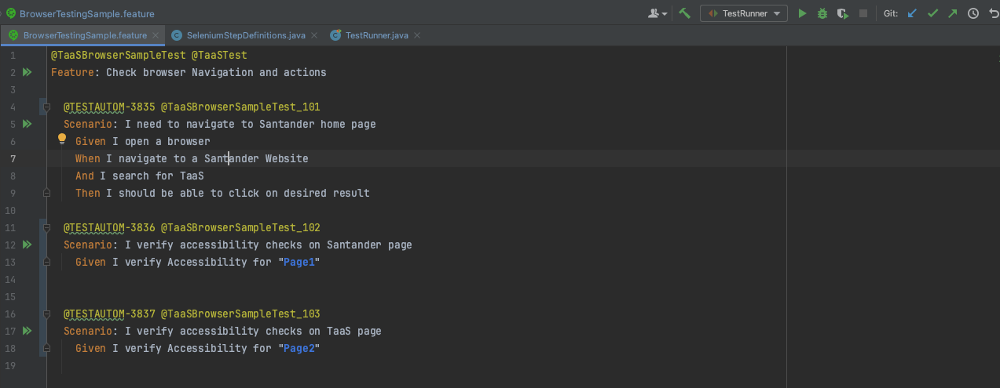
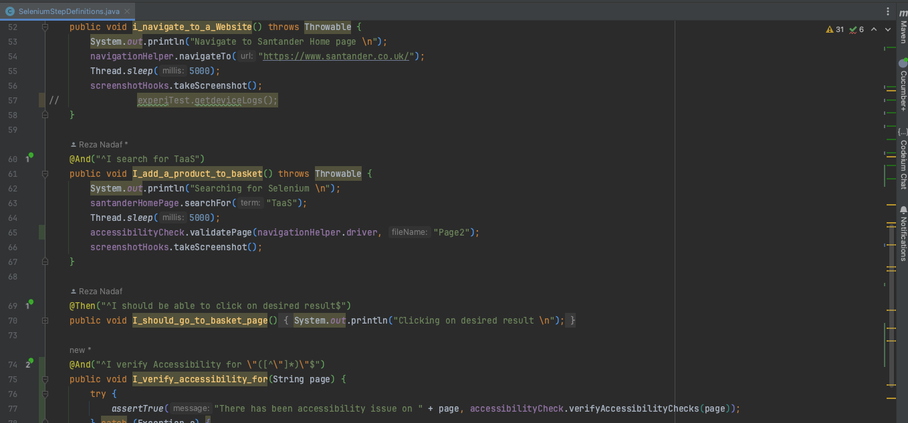
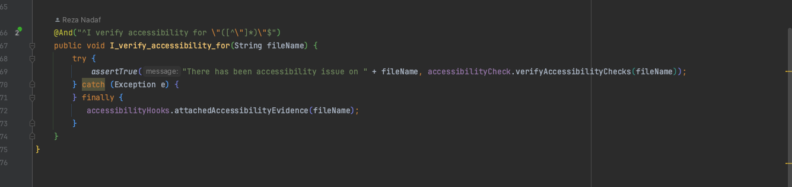

## How to use the library for Accessibility testing

In order to use the accessibility testing in your script, the following steps need to be followed:

- Make sure your feature file has one E2E test and for each page you need accessibility validation, you need to add new test

- You need to inject the following classes into your stepDef classes

```CommandLine
@Inject AccessibilityCheck accessibilityCheck;
@Inject AccessibilityHooks accessibilityHooks;
```

- The methods which you have to use for analysing the accessibility on the page is:

```CommandLine
accessibilityCheck.validatePage(driver, "Page Name")
```

- You have to pass in the driver and define the page name as you will use it later to check violations on the page

```CommandLine
accessibilityCheck.verifyAccessibilityChecks("Page Name")
```

- At the end you have to pass in the following to attach the files generated to the cucumber report for attachment to XRay Jira

```CommandLine
accessibilityHooks.attchedAccessibilityEvidence("Page Name")
```

- The reports will be generated in target/report/accessibility

Feature file Sample:



StepDef - AccessibilityCheck to validate & Verify:



StepDef - Adding AccessibilityCheck's results to Xray (Json & html file)



---

## Lynx Service (UK only)

Various modules across Santander (ex: Retail Internet banking, SBBI etc), feed to Lynx at the end of their transactions.
This framework feature provides the necessary Automation code to check whether transactions are feeding into Lynx or not.

How to use this Lynx Service:

    This new feature exposes the below method.
    Name       :  searchAndVerifyTransactionForAcc()
    Parameters :  Aceepts the below 4 parameters, all are mandatory and of datatype String
              AccountNumber: The account for which the Transaction has done
              Amount: The amount for which the Transaction is done
              TransactionCode: There are some Transaction codes specific to the Lynx application.
              ResponseCode: There will be some Reponse codes specific to Lynx application.
    Return Value: datatype of boolean.
              True,  If the trasaction was found in Lynx Records.
              False, If the trasaction was not found in Lynx Records.

Note:

- Need to call this function immedieatly after performing the transaction, otherwise there will be duplicate values and the function may fail.
- This function will work only for transactions based on accounts.

Usage/Code snippet:

- In your step definition class add the below import statement.

```CommandLine
    import com.test.lynx.LynxUtility;
```

- Create an object for "LynxUtility" class using depedencey injection.

```CommandLine
@Inject private LynxUtility lynxUtility;
```

- Example step definition:

```CommandLine
@Then("^validate the Lynx record$")
public void validateTheMessage() throws Throwable {
   boolean searchResult = lynxUtility.searchAndVerifyTransactionForAcc("09012834955076","5.00","118","000");
   System.out.println("Search Result : " + searchResult);
}
```

Implementation/Code details:

    This function will login into Lynx and search for the transaction based on the account number which you have to provide as one of the parameter.
    Then it will search for the transaction based on the current date and return a boolean value (true or false) based on the other parameters like Amount, Transaction Code and Response code.
    If the transaction is available in Lynx Records it will return true or else it will return as false.
    This result is completely based on the input that which we are passing as parameters.

We have new Package with the name 'lynx' and added the below classes with the package.

    1. LynxUtilityPage  - This class contains the main functions to search a transaction and validate that transactions.
    1. LynxHomePage     - This class contains the functions related to Lynx (PRE) Search for account, verify the flag alert and validate the trasanction.
    2. LynxLoginPage    - This class contains the functions related to Lynx (PRE) login like navigating to the website and login to the application.
    3. PropertyReader   - This class contains all the details like URL, UserName, Password and System to login for Lynx.
