# Nitro Framework Reference Guide

## Introduction

This document will provide an overview on how to design and execute automated test scenarios, both functional and technical, using java and selenium testing framework. It is intended that by reading this document the SDET knows what to do and what not.

## First steps

### Prerequisites

The development environment to work with **Nitro Framework** is the usual one for any type of Java application.

The developer must have:

- **JDK:** OpenJDK version 17.

- **GIT:** git client or IDE plugin that allows communication with the code repository.

- **Maven:** for the application build process. Maven must be configured to use the Nexus of the ALM environment as a dependency repository.

- **IDE:** any Java, IntelliJ, Eclipse, NetBeans development IDE. The framework is not coupled to any specific IDE. The use of the *Lombok* plugin is recommended to speed up java development.

It is important to configure the development IDE with **UTF-8,** as well as adding it to the pom.xml of the maven project.

To avoid SSL communication problems with the ALM services (Nexus, Git), the tools must be configured so that they do not validate the server certificate.

If any service deployed in the PaaS is accessed from the local application, the certificate must be installed within the keystore of the used JDK so that SSL errors do not occur.

## Configuration

We use bootstrap.properties to configure the framework. This file is located in the root folder of the project, and it contains every single configuration that the framework needs to run.
The attributes in this file can be overwritten via command line during mvn build/test by adding **-Dfoo=bar** to the command.

### Environment management

Based on the **environment** property in bootstrap.properties, we load the correspondent configuration.properties for each environment.
For instance, if we set in **bootstrap.properties** the property

    environment=dev 

Then we will load the configuration.properties file located in

    src/test/resources/<project>/profiles/dev/config.properties

This file holds key/value pairs so that we can assign values to properties. These properties are configured in

    src/test/java/com/test/LoadProperties.java

For example:

- We have configured a new property called API_URL in ```src/test/java/com/test/LoadProperties.java```

```CommandLine
public static final String API_URL = "api.url";
```

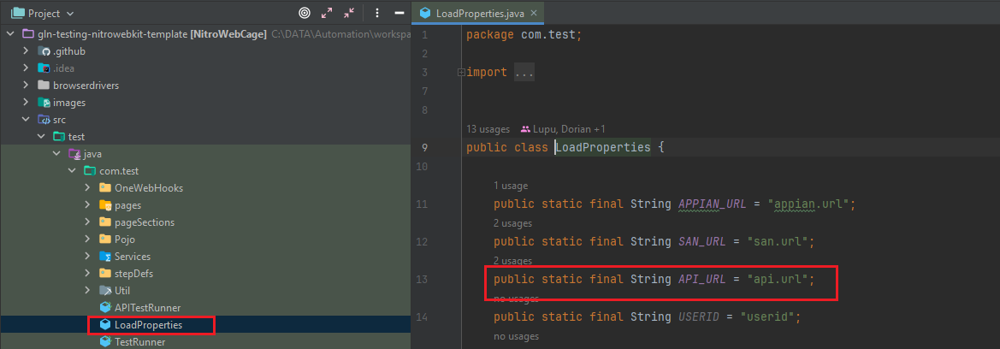

- In the different environment profiles, we have configured the value of api.url

```commandline
DEV:
src/test/resources/santander/profiles/DEV/config.properties
api.url=https://api-dev.santander.com

PRE:
src/test/resources/santander/profiles/PRE/config.properties
api.url=https://api-pre.santander.com
```

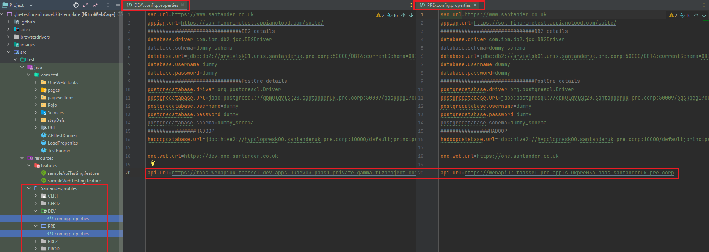

- By changing the value of environment in bootstrap.properties from DEV to PRE, we can change the value of api.url and execute the same test case in other environments.

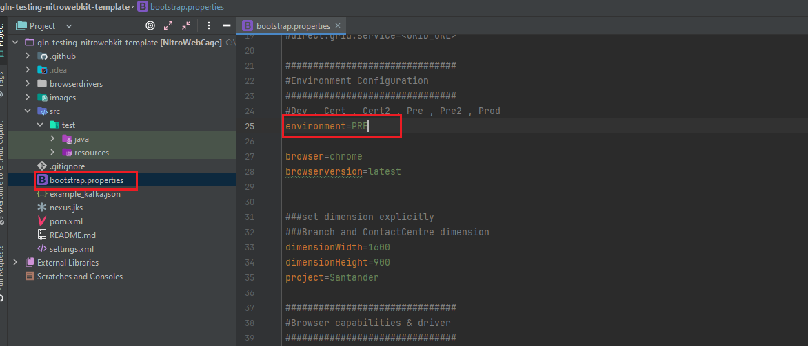

### Test runners

TestRunner is an advanced testing tool that aims to enhance and simplify software testing.
With its comprehensive platform for managing test cases, automating repetitive testing processes,
 and producing valuable reports, it caters to the requirements of software testers, developers, and quality assurance professionals.
By optimizing application quality and streamlining testing efforts, TestRunner contributes significantly to saving time and resources.

We are presented with 2 TestRunner classes, both have the same purpose and a similar configuration, are used for both local and remote executions, however they are used in different scenarios

- **TestRunner**: invokes the cucumber and browser configuration. It is used for browser executions.
- **APITestRunner**: invokes the cucumber and api configuration. It is used for api executions, were a browser is not required

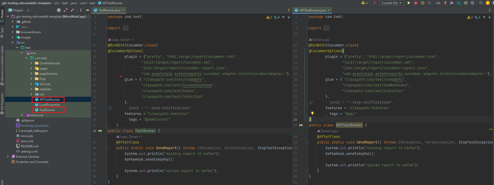

Anatomy of a TestRunner class

1. **@RunWith(Cucumber.class)**: this annotation tells JUnit to run the class as a Cucumber test. The Cucumber class is the runner class for Cucumber. It kicks off Cucumber-JVM to parse the command line options and run the features.
2. **@CucumberOptions**: this annotation provides the same options as the cucumber command line. It is used to provide the feature files location, glue code location, tags, etc.
3. **@BeforeClass**: this annotation is used to execute the code before the first test method in the current class is invoked. It is used to set up the environment before the test execution.
4. **@AfterClass**: this annotation is used to execute the code after all test methods in the current class have been run. It is used to clean up the environment after the test execution.
5. **@Before**: this annotation is used to execute the code before each test method. It is used to set up the environment before each test execution.
6. **@After**: this annotation is used to execute the code after each test method. It is used to clean up the environment after each test execution.

As part of the **@CucumberOptions** annotation, we have the following attributes:

- **features**: this attribute is used to provide the location of the feature files. The value of this attribute is a path,
 and it can be a package or a folder. If it is a package, it will look for all the feature files inside that package. If it is a folder, it will look for all the feature files inside that folder.
- **glue**: this attribute is used to provide the location of the step definitions. The value of this attribute is a path,
and it can be a package or a folder. If it is a package, it will look for all the step definitions inside that package. If it is a folder, it will look for all the step definitions inside that folder.
- **tags**: this attribute is used to provide the tags to be executed. The value of this attribute is a string, and it can be a single
 tag or multiple tags. If it is a single tag, it will execute all the scenarios that have that tag. If it is multiple tags, it will execute all the scenarios that have any of the tags.
- **plugin**: this attribute is used to provide the plugins to be used. The value of this attribute is a string,
 and it can be a single plugin or multiple plugins. If it is a single plugin, it will use that plugin. If it is multiple plugins, it will use all the plugins.
- **monochrome**: this attribute is used to provide the console output in a readable format. The value of this attribute is a boolean,
 and it can be true or false. If it is true, it will provide the console output in a readable format. If it is false, it will provide the console output in a non-readable format.
- **dryRun**: this attribute is used to provide the step definitions that are not implemented.
The value of this attribute is a boolean, and it can be true or false. If it is true, it will provide the step definitions that are not implemented. If it is false, it will not provide the step definitions that are not implemented.

### Hooks

During run time, the framework will execute the hooks which will bind the test case with the corresponding environment. The hooks are located inside the TestRunner classes.

**NOTE**: the configuration hook ```classpath:com/test/injection``` that binds together all the properties from bootstrsap.properties and configuration.properties is located inside the NitroWebKit ```com/test/injection/CucumberHooks```

```CommandLine
@Before(
    order = 1
)
public void beforeScenario(Scenario scenario) throws Exception {
    System.out.printf("Cucumber hook intance: %s", this);
    List<String> tags = new ArrayList(scenario.getSourceTagNames());
    this.scenarioName = getScenarioName(tags);
    PropertiesHelper.loadRunConfigProps();
    if (this.applicationName.contains("mobile")) {
        Configuration.getConfiguration().setApplicationMode("MOBILE");
    } else if (this.applicationName.contains("api")) {
        Configuration.getConfiguration().setApplicationMode("API");
    }

    this.testLevelSetUp(this.scenarioName, tags);
    this.deviceContext.device = this.device.getDeviceType(Configuration.getConfiguration().getApplicatonMode());
}
```

Which calls the loadRunConfigProps() method from the PropertiesHelper class

```CommandLine
public static void loadRunConfigProps() {
    try {
        LOGGER.info("loading.........");
        properties = new Properties();
        String separator = System.getProperty("file.separator");
        String environment = Configuration.getConfiguration().getEnvironment();
        String project = Configuration.getConfiguration().getProjectName();
        LOGGER.info("Environment Types  DEV , CERT , CERT2 , PRE , PRE2 , PROD");
        LOGGER.info("Script running on environment...{}", environment);
        LOGGER.info("project>> {} ", project);
        String profilePath = ABSPATH + separator + "src" + separator + "test" + separator + "resources" + separator + project + separator + "profiles" + separator + environment + separator + "config.properties";
        LOGGER.info("profilePath {} ", profilePath);
        EnvironmentConstants.isCertEnvironment = environment.equalsIgnoreCase(EnvironmentConstants.CERT) || environment.equalsIgnoreCase(EnvironmentConstants.CERT2);
        EnvironmentConstants.isPreEnvironment = environment.equalsIgnoreCase(EnvironmentConstants.PRE) || environment.equalsIgnoreCase(EnvironmentConstants.PRE2);
        EnvironmentConstants.isDevEnvironment = environment.equalsIgnoreCase(EnvironmentConstants.DEV);
        EnvironmentConstants.isProdEnvironment = environment.equalsIgnoreCase(EnvironmentConstants.PROD) || environment.equalsIgnoreCase(EnvironmentConstants.PRO);

        try {
            InputStream input = Files.newInputStream(Paths.get(profilePath));

            try {
                properties.load(input);
            } catch (Throwable var8) {
                if (input != null) {
                    try {
                        input.close();
                    } catch (Throwable var7) {
                        var8.addSuppressed(var7);
                    }
                }

                throw var8;
            }

            if (input != null) {
                input.close();
            }
        } catch (IOException var9) {
            LOGGER.error("Error while loading properties file: {}", var9.getMessage());
        }
    } catch (StopTestException var10) {
        LOGGER.error("StopTestException Occurred.{} ", var10.getMessage());
    }

}
```

### Custom hooks

The user has the ability to define their own custom hooks. We have configured the below custom hook and add it to APITestRunner class inside the glue parameter.

    glue = { "classpath:com/test/stepDefs",
             "classpath:com/test/OneWebHooks",
             "classpath:com/test/injection"
    }


### Local vs Remote execution

This framework is designed to run both locally and remotely. The user can choose to run the test cases locally or remotely by changing the value of the **grid.run** property in bootstrap.properties.

- If the value of **grid.run** is false, the test cases will be executed locally.
- If the value of **grid.run** is true, the test cases will be executed remotely and the parameter **direct.grid.run** will be used to inform the grid url.

**NOTE**: for UK ```direct.grid.service``` will be commented out and webservice will be used instead with the following properties:

```CommandLine
    grid.run=true

    webservice=<WEBAPI_URL>
    token=<YOUR_TOKEN>

    browser=<BROWSER>
    browserversion=latest
    applicationtype=<ubi/dia2/debug>

    ###############################
    #PLP information (UK ONLY)
    ###############################
    projectname=<PLP_PROJECT_NAME>
    plpprojectname=<PLP_PROJECT_NAME>
    plpurl=https://governance.santanderuk.corp/productlandingpage/<PROJECT_NUMBER>
    platform=<YOUR_PLATFORM>
    release=<YOUR_RELEASE>
    sprintname=<YOUR_SPRINT>
    workarea=<YOUR_WORKAREA>
```

When running locally, we need to ensure the appropriate drivers are available in the machine. The drivers are located in the **browserdrivers** folder in the root of the project.

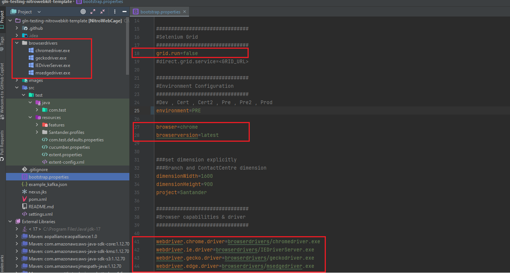

### Browser

The framework is designed to run in different browsers. The user can choose the browser by changing the value of the **browser** property in bootstrap.properties as mentioned above.
The framework supports the following browsers and custom capabilities:

1. **Chrome**: this browser is used to execute the test cases in Chrome. The value of this ```browser=chrome```.
2. **Firefox**: this browser is used to execute the test cases in Firefox. The value of this ```browser=firefox```.
3. **Edge**: this browser is used to execute the test cases in Edge. The value of this ```browser=MicrosoftEdge``` or ```browser=Edge```.
4. **Internet Explorer**: this browser is used to execute the test cases in Internet Explorer emulated over MicrosoftEdge. The value of this ```browser=internetexplorer```, ```browser=internet explorer``` or ```browser=ie```.
5. **Safari**: this browser is used to execute the test cases in Safari. The value of this ```browser=safari```.

Based on the version of each browser, you can download drivers from the following links:

1. **Chrome** driver from [GoogleChromeLabs](https://googlechromelabs.github.io/chrome-for-testing/){:target="_blank"}
2. **Firefox** drivers from [Mozilla GitHub](https://github.com/mozilla/geckodriver/releases){:target="_blank"}
3. **Edge** driver from [Microsoft Edge Developer](https://developer.microsoft.com/en-us/microsoft-edge/tools/webdriver/){:target="_blank"}
4. **Internet Explorer** driver via [Selenium website](https://www.selenium.dev/downloads/){:target="_blank"}
5. **Safari**: does not require drivers, but some advance configuration and enabling developer mode on Safari

Each browser has its own capabilities, and they are configured in the bootstrap.properties file and can be changed by the user according their needs.

    chrome.custom.cap=[{"CapabilityType.ACCEPT_SSL_CERTS":true},{"CapabilityType.ACCEPT_INSECURE_CERTS":true},{"args":"--disable-infobars, --enable-automation, --no-sandbox, --disable-dev-shm-usage, --enable-javascript, --disable-gpu, --test-type, --disable-extensions"}]
    ie.custom.cap=[{"browserAttachTimeout": "10000"}, {"ie.edgechromium": true},{"ie.edgepath": "C:/Program Files (x86)/Microsoft/Edge/Application/msedge.exe"},{"platformName":WINDOWS},{"requireWindowFocus":true},{"ie.ensureCleanSession": true},{"ignoreZoomSetting": true},{"nativeEvents": true},{"ignoreProtectedModeSettings": true},{"disable-popup-blocking": true},{"enablePersistentHover": true}]
    edge.custom.cap=[{"CapabilityType.ForSeleniumServer.ENSURING_CLEAN_SESSION":true},{"CapabilityType.ACCEPT_SSL_CERTS":true}]
    safari.custom.cap=[{"CapabilityType.ACCEPT_SSL_CERTS":true}]
    firefox.custom.cap=[{"network.proxy.type":5},{"network.http.phishy-userpass-length":255}]

For more information, the available capabilities for each browser can be found on each browser's website/project.

### Dependency injection

Java Dependency Injection design pattern allows us to remove the hard-coded dependencies and make our application loosely coupled, extendable and maintainable.
We can implement dependency injection in java to move the dependency resolution from compile-time to runtime.

Benefits of Java Dependency Injection

Some of the benefits of using Dependency Injection in Java are:

- Separation of Concerns
- Boilerplate Code reduction in application classes because all work to initialize dependencies is handled by the injector component
- Configurable components makes application easily extendable
- Unit testing is easy with mock objects

Disadvantages of Java Dependency Injection

Java Dependency injection has some disadvantages too:

- If overused, it can lead to maintenance issues because the effect of changes are known at runtime.

- Dependency injection in java hides the service class dependencies that can lead to runtime errors that would have been caught at compile time.

```commandline
    @Inject
    TokenService tokenService;

    public class InjectMeSomewhere {
        ...
    }
```

You can inject a model, a page, a class, a field, etc into another class. The only requirement is that the class to be injected must be annotated with **@Inject**.

### Lombok usage

Lombok allows creating POJOs (Plain Old Java Object) avoiding the tedious task of writing *getters,* *setters,* *constructors,* etc. It is one of the Basic utilities recommended when developing in Java.

Turns into this simple POJO using Lombok:

    package com.santander.darwin.common.clientprofile;

    import java.io.Serializable;

    import lombok.AllArgsConstructor;
    import lombok.Data;
    import lombok.NoArgsConstructor;

    /**
     * POJO contains Person information
     */
    @Data
    @NoArgsConstructor
    @AllArgsConstructor
    public class Person implements Serializable {

        private static final long serialVersionUID = 7161386585076362579L;

        private String uid;
        private String type;
        private int code;
        private String nif;
        private Contract contract;
        private String name;
        private String documentType;
        private String lastNames;

        private PersonBasicData basicData;
    }

- The **@Data** annotation generates *getters* for all fields as well as *setters* for fields other than final. Generate a constructor for all final fields and for non-final fields annotated with @NotNull. Also, the method *toString (), hashCode
    () and equals () .* All this Code generation is done at compilation time.

- The annotation **@NoArgsConstructor** generates a constructor with no arguments.

- The **@AllArgsConstructor** annotation generates a constructor with all fields.

- Annotation **@Slf4j** creates an instance of *Logger* that can be used in the code with the name *log.*

- Last but not least, the **@Builder** annotation generates the code necessary to be able to build complex objects applying the pattern *builder.*

!!! info "Important"

    For small **immutable data** objects, we recommend using the ***record*** keyword instead of using lombok functionalities.

The reader is encouraged to see all the possibilities Lombok has to offer by looking at the [project documentation.](https://projectlombok.org/features/all)

### Gson usage

Gson is a Google library that helps us parse api responses into POJOs automatically without the need of using getters and setters.

The dependency is provided with the Nitro Framework, however anyone can import it in their project by adding the dependency into the pom.xml file.

    <dependency>
        <groupId>com.google.code.gson</groupId>
        <artifactId>gson</artifactId>
        <version>2.10.1</version>
    </dependency>

In the class file will map the response with gson against the class file of the created POJO object to map the fields.

The response will be mapped against the actual response object List of GassFormattedData objects

    import com.fasterxml.jackson.annotation.JsonIgnoreProperties;
    import lombok.AccessLevel;
    import lombok.Builder;
    import lombok.Data;
    import lombok.experimental.FieldDefaults;
    
    import java.util.List;
    
    @FieldDefaults(level = AccessLevel.PUBLIC)
    @JsonIgnoreProperties(ignoreUnknown = true)
    @Builder
    @Data
    public class GassResponse {
        List<GassFormattedData> gassFormattedDataList;
    }

Sample POJO for GASS records, looks like this:

    import com.fasterxml.jackson.annotation.JsonIgnoreProperties;
    import lombok.AccessLevel;
    import lombok.Data;
    import lombok.experimental.FieldDefaults;
    
    @FieldDefaults(level = AccessLevel.PUBLIC)
    @JsonIgnoreProperties(ignoreUnknown = true)
    @Data
    public class GassFormattedData {
    
        String formatedData;
        String userId;
        String sourceUserSystem;
        String applicationSystem;
        String transactionGroup;
        String transactionName;
        String status;
        String amount;
        String globalTrnId;
        String clientReference;
        String holdingReference;
        String userIdSecondary;
        String cashierUid;
        String organisation;
        String orgUnitType;
        String orgUnitId;
        String device;
        String deviceId;
        String deviceLocation;
        String machineName;
        String transactionDatetime;
        String auditDatetime;
    
    }

**Note:** the fields defined in the POJO needs to match with the response fields and structure. In the below example we are mapping the response against a List of GassFormattedData objects.

    public class GassService {

        List<GassFormattedData> gassResult = null;

        public void verifyGetGassService() {
            assertThat("GASS Service did not return with SUCCESS status", String.valueOf(response.getStatusCode()), equalTo(Token.STATUS_CODE_OK));
    
            try {
                gassResult = Arrays.asList(apiLibrary.getGson().fromJson(response.getBody().asString(), GassFormattedData[].class));
    
            } catch (Exception ex) {
                throw new AssertionError("Expected response payload and actual response payload do not match");
            }
        }
    }

## Create your first API test

### Creating the feature file

Start by creating a new feature file in the **src/test/resources/features** folder. The feature file is a text file that contains the description of the test case in a language called Gherkin. The feature file is composed of three main sections:

- **Feature:** this section is used to describe the feature that is being tested.
- **Scenario:** this section is used to describe the scenario that is being tested.
- **Given, When, Then:** this section is used to describe the steps of the scenario.

???+ remember
    The feature file name must end with **.feature** and must not contain spaces. The feature file name must be the same as the feature name.

```CommandLine
Feature: Sample api testing

Scenario: Verify happy path for api
  Given I have launched the api url
```

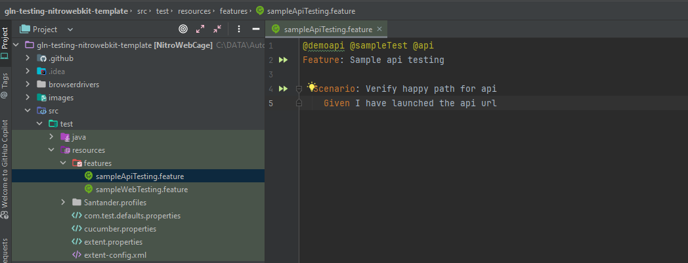

### Creating the step definitions

Once the feature file is created, we need to create the step definitions. The step definitions are the glue between the feature file and the code. The step definitions are located in the **src/test/java/com/test/stepDefs** folder.

In this example we are creating an additional folder "API" to organize by functionality or type.

???+ remember
    The step definitions file name must end with **StepDefs** and must not contain spaces.

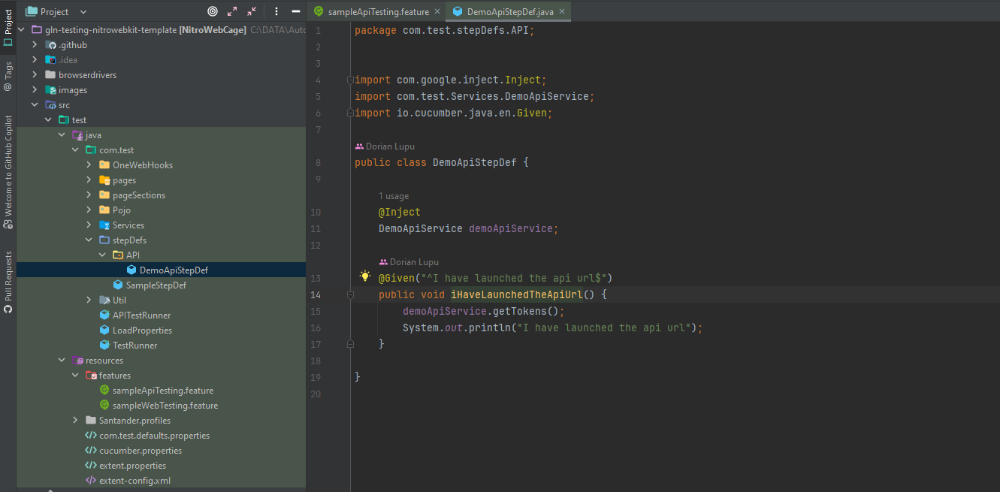

We inject the class with the logic to execute the step into the step definitions class to be able to use the methods from the class with the logic to execute the step.

    @Inject
    DemoApiService demoApiService;

Here we create a method that will be called when the step "**Given I have launched the api url**" is executed. The method will be annotated with **@Given** and will have a regular expression that will match the step.

    @Given("^I have launched the api url$")
    public void iHaveLaunchedTheApiUrl() {
        apiLibrary.launchApiUrl();
    }

### Creating the class with the logic to execute the step

Once the step definitions are created, we need to create the class with the logic to execute the step.

???+ remember
    Because this is a service/backend call, the class with the logic to execute the step is located in the **src/test/java/com/test/Services** folder.
    The class name must end with **Service** and must not contain spaces.

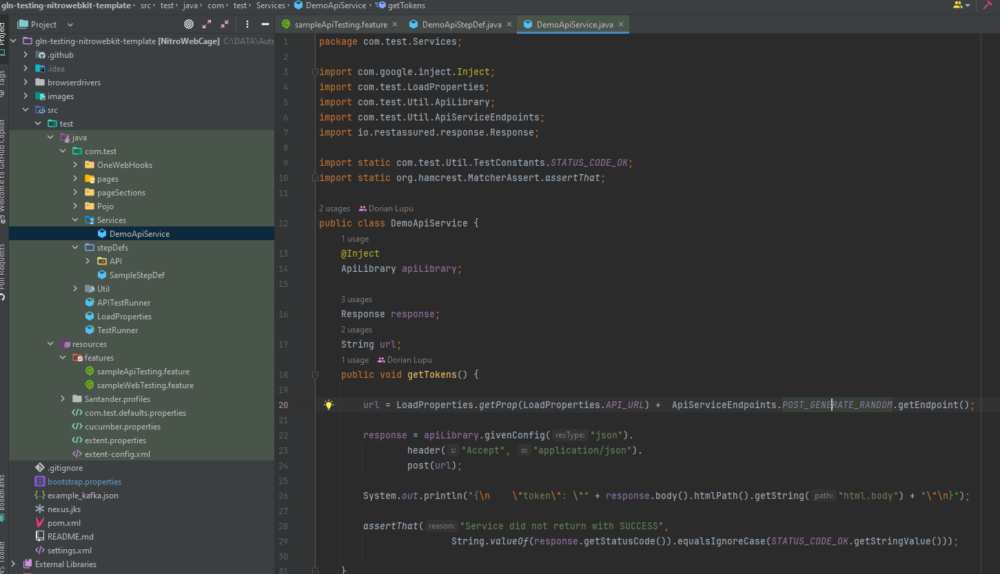

We inject the apiLibrary into the class to be able to use the methods from the ApiLibrary class. Already provided sample rest assured requests are available in the ApiLibrary class to avoid having to write the same code over and over again.

??? abstract "ApiLibrary rest assured requests sample"

    ```
    public RequestSpecification getRestxAPIRequestSpecification(String baseURI) {
        return given()
                .baseUri(baseURI)
                .urlEncodingEnabled(false)
                .header("Content-Type", "application/xml; charset=UTF-8")
                .header("User-Agent", "qa-automation")
                .accept(ContentType.XML)
                .log()
                .all();
    }
    
    public RequestSpecification givenConfig(String resType) {
        RequestSpecification rs = null;
    
        String baseURI = LoadProperties.getProp(LoadProperties.API_URL);
        RestAssured.useRelaxedHTTPSValidation();
        if ("json".equalsIgnoreCase(resType)) {
            rs = given().baseUri(baseURI).urlEncodingEnabled(false)
                    .header("Content-Type", "application/json; charset=UTF-8")
                    .header("User-Agent", "qa-automation")
                    .accept(ContentType.JSON)
                    .log()
                    .all();
        }
        if ("urlencoded".equalsIgnoreCase(resType)) {
            rs = given().baseUri(baseURI).urlEncodingEnabled(false)
                    .header("Content-Type", "application/x-www-form-urlencoded; charset=UTF-8")
                    .header("User-Agent", "qa-automation")
                    .accept(ContentType.URLENC)
                    .log()
                    .all();
        }
        [...]
    }
    ```

```CommandLine
@Inject
ApiLibrary apiLibrary;
```

We define the response object from RestAssured to be able to use the response from the api call.

    Response response;

We define a new entry in LoadProperties.java to be able to use the api url from the configuration.properties file across different environments.

    public static final String API_URL = "api.url";

We add the entry api.url in the configuration.properties file for each environment. Example:

    DEV:
    src/test/resources/santander/profiles/DEV/config.properties
    api.url=https://taas-webapiuk-taassel-dev.apps.ukdev03.paas1.private.gamma.tlzproject.com

    PRE:
    src/test/resources/santander/profiles/PRE/config.properties
    api.url=https://webapiuk-taassel-pre.appls-ukpre03a.paas.santanderuk.pre.corp

We use the enum ApiServiceEndpoint to define the endpoint of the api call.

???+ remember
    The enum ApiServiceEndpoint is located in the **src/test/java/com/test/Util** folder and is used as a library to define different resources for the same base url. This is useful when we have different endpoints for the same base url.

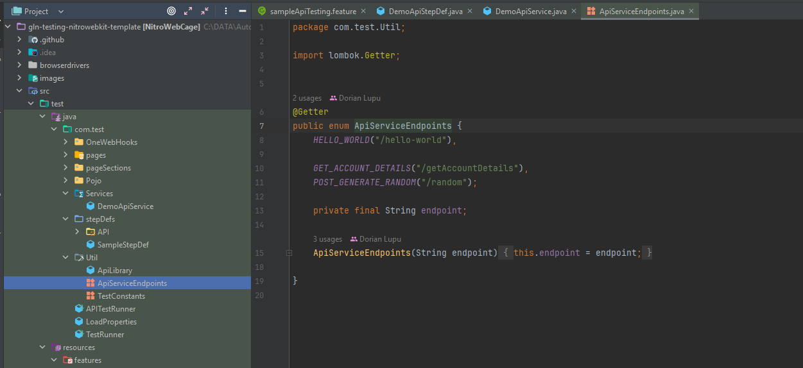

### Executing the API test

Next step is to execute the test, making sure that we have the correct environment selected in bootstrap.properties, the LoadProperties.java and ApiServiceEndpoint.java are configured correctly and the feature file is created with the correct steps.

We annotate the feature file with the tag @api to be able to execute the test case.

    @api
    Feature: Sample api testing

    Scenario: Verify happy path for api
    Given I have launched the api url

We provide the tag @api in the APITestRunner class to be able to execute the test case.

    tags = "@api"

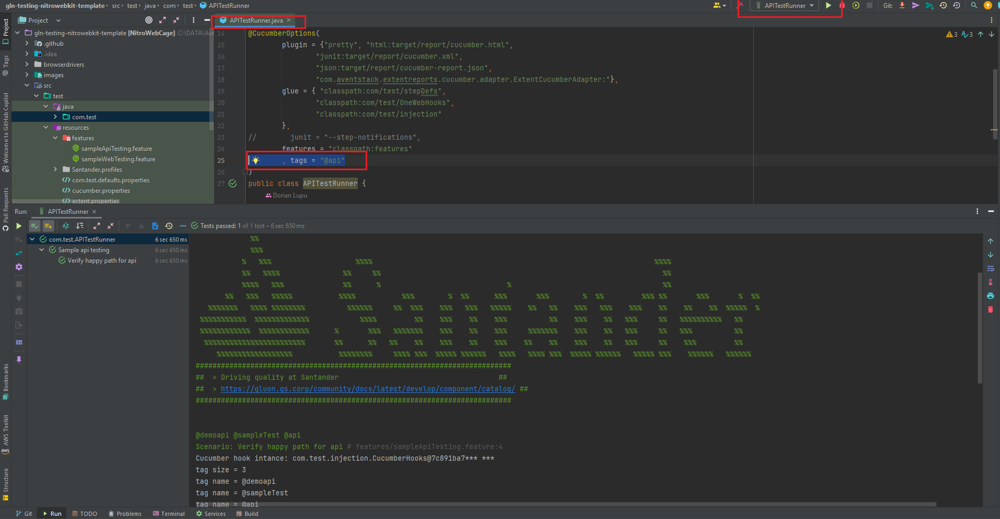

## Create your first WEB test

For this demo we will create a simple script that navigates to santander.co.uk and verifies the current account section.

### Creating the feature file

Start by creating a new feature file in the **src/test/resources/features** folder. The feature file is a text file that contains the description of the test case in a language called Gherkin. The feature file is composed of three main sections:

- **Feature:** this section is used to describe the feature that is being tested.
- **Scenario:** this section is used to describe the scenario that is being tested.
- **Given, When, Then:** this section is used to describe the steps of the scenario.

???+ remember
    The feature file name must end with **.feature** and must not contain spaces. The feature file name must be the same as the feature name.

```CommandLine
Feature: Sample web testing

  Scenario: 01 Verify santander home page works
    Given I navigate to santander home page
    When I select "Current Account"
    And I succesfully navigate to "Current accounts" page
```

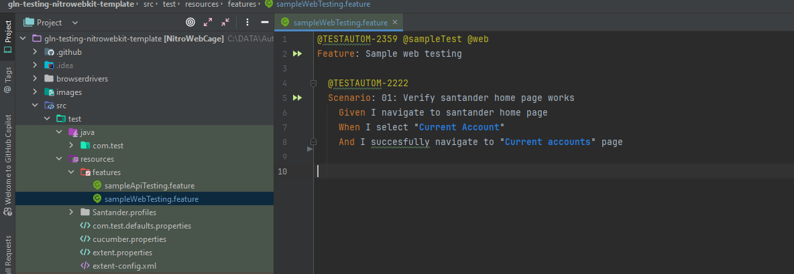

### Creating the step definitions

Once the feature file is created, we need to create the step definitions. The step definitions are the glue between the feature file and the code. The step definitions are located in the **src/test/java/com/test/stepDefs** folder.

???+ remember
    The step definitions file name must end with **StepDefs** and must not contain spaces.

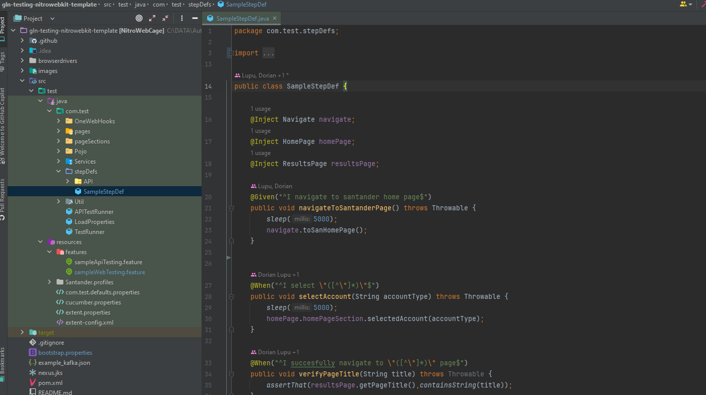

We inject the class with the logic to execute the step into the step definitions class to be able to use the methods from the class with the logic to execute the steps.

    @Inject 
    Navigate navigate;
    @Inject 
    HomePage homePage;
    @Inject 
    ResultsPage resultsPage;

Here we create a method that will be called when the step "**Given I navigate to santander home page**" is executed. The method will be annotated with **@Given** and will have a regular expression that will match the step. Same for all steps.

    @Given("^I navigate to santander home page$")
    public void navigateToSantanderPage() throws Throwable {
        sleep(5000);
        navigate.toSanHomePage();
    }

    @When("^I select \"([^\"]*)\"$")
    public void selectAccount(String accountType) throws Throwable {
        sleep(5000);
        homePage.homePageSection.selectedAccount(accountType);
    }

### Creating the page object

Once the step definitions are created, we need to create the page object. The page object is located in the **src/test/java/com/test/pages** folder.
The page need to follow the POM pattern and extend the BasePage class.

???+ info

    1. Naming convention for class file name: <PageName>Page.java. Example: HomePage.java
    2. The page extends BasePage 
    3. The page contains @Section and locators of webElements annotated with @FindBy
    4. The page does not hold any logic or validation
    5. Readability when invoked: homePage.section.action

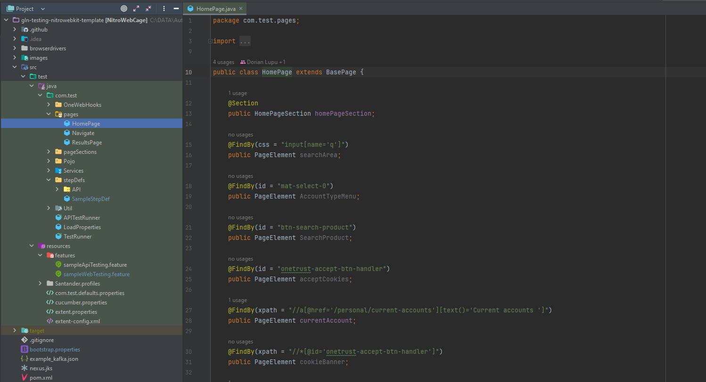

### Creating the page section

Once the page object is created, we need to create the page section. The page section is located in the **src/test/java/com/test/pageSection** folder.

???+ info

    1. Naming convention for class file name: <PageSectionName>PageSection.java. Example: CurrentAccountPageSection.java
    2. The page section extends PageSection 
    3. The page section injects the @Page
    4. The page section contains functionality logic, validations and actions
    5. Does not contain locators

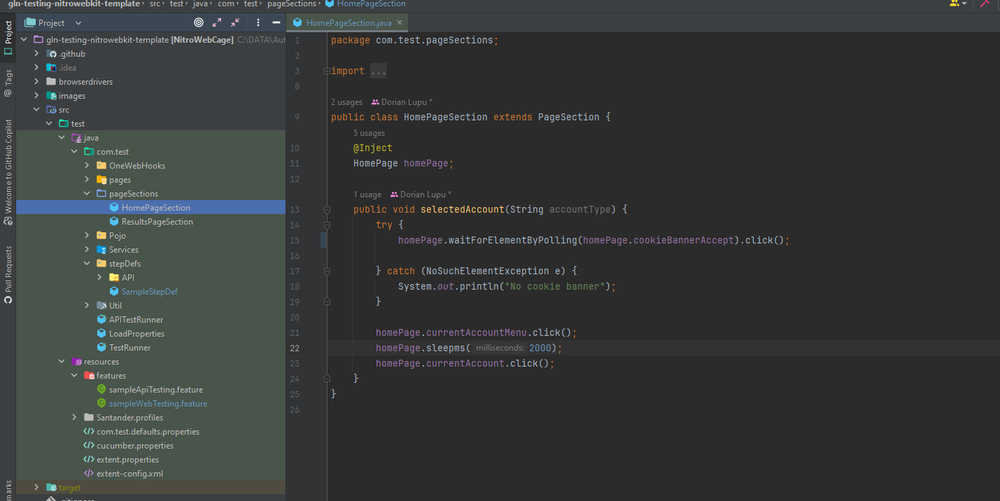

We define a new entry in LoadProperties.java to be able to call the url from the configuration.properties file across different environments.

    public static final String SAN_URL = "san.url";

We add the entry api.url in the configuration.properties file for each environment. Example:

    src/test/resources/santander/profiles/PRO/config.properties
    san.url=https://www.santander.co.uk

### Executing the WEB test

Next step is to execute the test, making sure that we have the correct environment selected in bootstrap.properties, the LoadProperties.java are configured correctly and the feature file is created with the correct steps.

We annotate the feature file with the tag @api to be able to execute the test case.

    @web
    Feature: Sample web testing

    Scenario: 01: Verify santander home page works
        Given I navigate to santander home page
        When I select "Current Account"
        And I succesfully navigate to "Current accounts" page

We provide the tag @web in the TestRunner class to be able to execute the test case.

    tags = "@web"

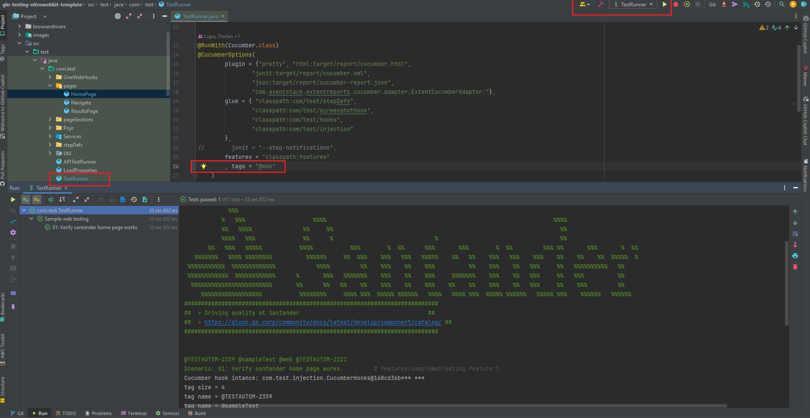
