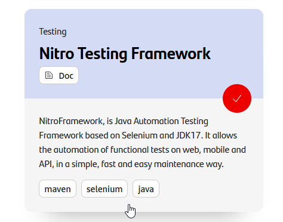
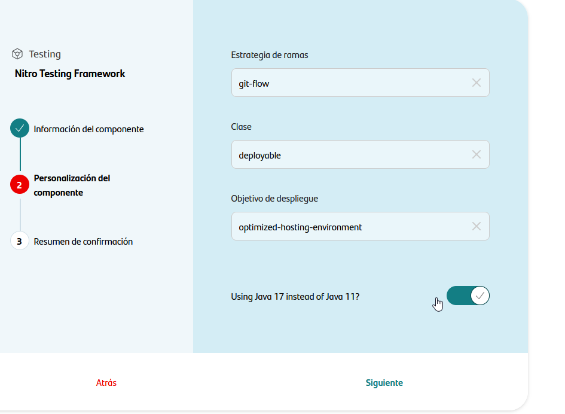
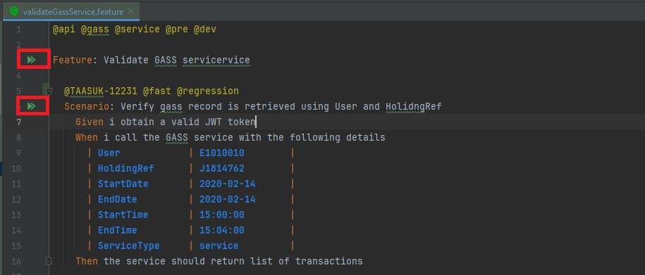
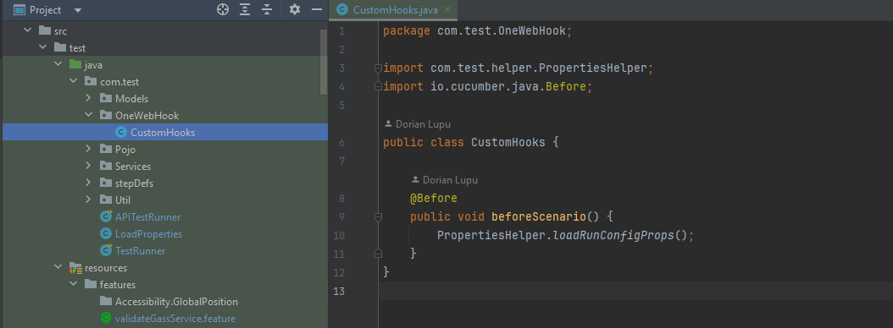
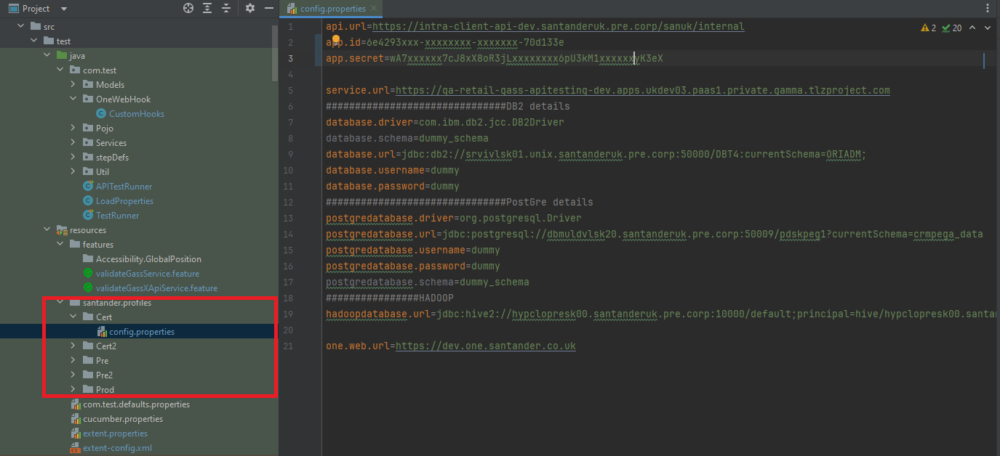
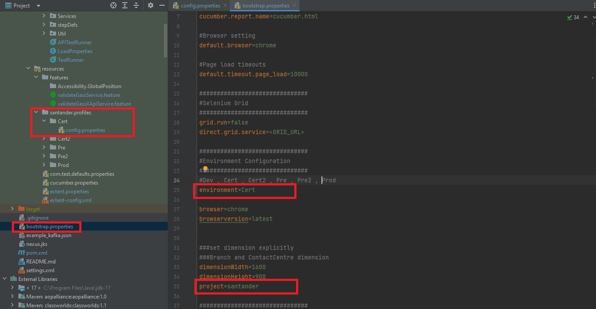
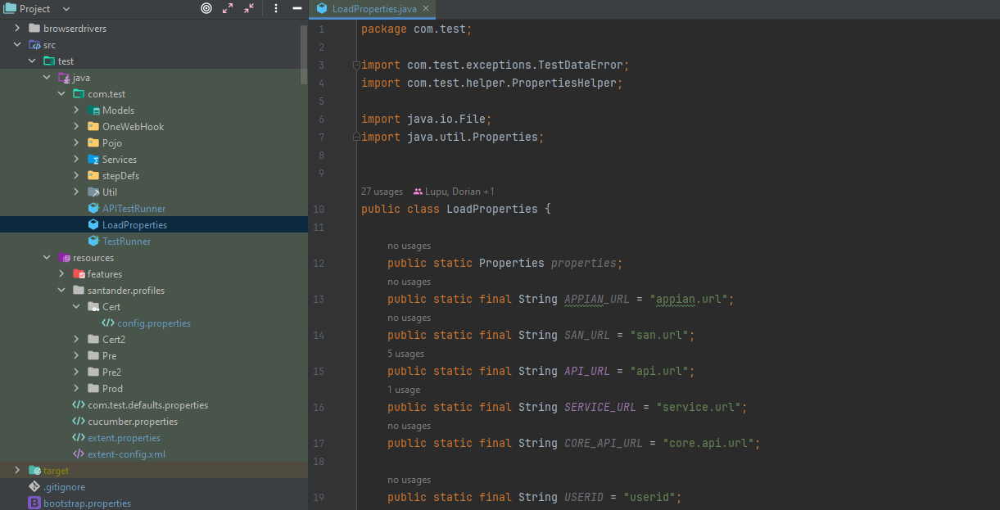

# 

> A framework developed and supported by ***TAASUK - Testing as a Service UK***

**Nitro Framework** is a [JAVA](https://docs.oracle.com/en/java/javase/17/) test automation framework based on the BDD development
methodology. Uses a Gherkin language layer for automated test case development. It allows the automation of functional tests web in a simple, fast and easy maintenance way. Provides common features that are required in UI test automation
like Selenium web driver instantiation, browser handling using Selenium Hub and generate test reports.

Automation Test Framework for the web is being released as a single light weight standalone library which can be easily maintained. It also supports accessibility testing.

We are publishing the framework as a library to provide the users a scalable and portable solution with version control.

The framework provides capabilities and support for Web, API and Mobile testing.

---

## Setup your local environment

{!
   include-markdown "../../../../snippets/setup/maven-setup.md"
!}

- [Git and Github](../../../../../getting-started/setup-your-environment/tools/github-scm/install-scm-access.md)

---

## Create Component

### Gluon Portal

First you have to [**onboard your application.**](../../../../../application/application-management/application-onboard.md)
Once you have your application created, you can start creating your component.

To create a component, follow the steps described in [**Component Management**](../../../../../application/component-management/create-component.md), searching for the component to be created.

You have to select the type of component you want to create, in this case you are going to create a **Nitro Testing Framework**.



???+ remember

    To follow the naming convention visit [Repository Naming Convention](../../../../../application/component-management/create-component.md#repository-naming-convention).

The user can customize the type of application that they want to create. For this example we have created a Nitro testing framework with the following characteristics:



- **Branch Strategy**: git-flow
- **Class**: deployable
- **Java Version**: Java 17

Once the component is created we can see under the application that there is a new repository created with the name of the component, Nitro Testing project.

We have the following links in:

| Item | Link | Role Permission                                                                                                                                                                                                                  |
| --- | --- |----------------------------------------------------------------------------------------------------------------------------------------------------------------------------------------------------------------------------------|
| GitHub Repository | Link to the repository created in GitHub | Developer (RW) /Technical Lead (Maintain) [All roles explained](https://docs.github.com/es/organizations/managing-user-access-to-your-organizations-repositories/managing-repository-roles/repository-roles-for-an-organization) |
| Sonar Project | Link to the Sonar project created | All Users (Disabled)                                                                                                                                                                                                             |
| Fortify Project | Link to the Fortify project created | All Users (Disabled)                                                                                                                                                                                                             |

### Nitro Java Testing Framework Template

#### Branches

{!
   include-markdown "../../../../snippets/setup/init-branch-setup.md"
!}

#### Structure

The generated branch has a structure similar to the following:

``` bash

📂.github
 ┣ 📂workflows
 | ┗ 📜mvn-test-j17.yml
 ┗ 📜CODEOWNERS
📂browserdrivers
 ┣ 🖥️ chromedriver.exe
 ┣ 🖥️ geckodriver.exe
 ┣ 🖥️ msedgedriver.exe
 ┗ 🖥️ IEDriverServer.exe
📂images
📂src/test
| ┣ 📂java/com/test
| | ┣ 📂 Pojo
| | ┣ 📂 Services
| | ┣ 📂 Util
| | | ┣ ☕ApiLibrary.java
| | | ┣ ☕ApiServiceEndpoints.java
| | | ┗ ☕TestConstants.java
| | ┣ 📂 hooks
| | ┣ 📂 pageSections
| | ┣ 📂 pages
| | ┣ 📂 stepDefs
| | ┣ ☕APITestRunner.java
| | ┣ ☕LoadProperties.java
| | ┗ ☕TestRunner.java
| ┗ 📂 resources
|   ┣ ☕com.test.defaults.properties
|   ┣ ☕cucumber.properties
|   ┣ ☕extent-config.xml
|   ┗ ☕extent.properties
|   ┣ 📂 features
|   | ┗ ☕sampleApiTesting.feature
|   ┗ 📂 Santander/profiles
|     ┗ 📂 {Environment}
|       ┗ 📜config.properties
📜.gitignore
📜README.md
📜bootstrap.properties
📜kafka.json
📜nexus.jks
📜pom.xml
📜settings.xml

```

For more information on the structure and functionality of Nitro framework, please refer to the [Nitro framework documentation](../framework/about.md).

---

## Local Running

??? abstract "Cloning your repository"

    **Cloning your repository**

    Once we have the device properly configured, the first step is to clone the project locally.

    To do so, visit [**How to clone de project**](../../../../../application/component-management/create-component.md#cloning-a-repository).

---

Nitro Framework is based on open technologies to offer the necessary functionalities to automate your tests. Among these
technologies are:

- [Selenium](https://www.seleniumhq.org/docs/){:target="_blank"}
- [Appium](http://appium.io/docs/en/about-appium/intro/){:target="_blank"}
- [RestAssured](https://rest-assured.io/){:target="_blank"}
- [Cucumber](https://cucumber.io/docs/cucumber/){:target="_blank"}
- [Junit](https://junit.org/junit5/){:target="_blank"}
- [Deque](https://docs.deque.com/){:target="_blank"}
- [Apache poi](https://poi.apache.org/){:target="_blank"}
- [Google Guice](https://github.com/google/guice/wiki/GettingStarted){:target="_blank"}

**Nitro Framework** is an all-terrain Framework:

- **Multi-platform**
  - Allows execution in Windows, Linux and Mac environments
- **Multi-device**
  - Allows execution of web tests in all browsers, headless, Android and iOS mobile devices in web mode (Seetest or SauceLab), and in
    UBI containers.
- **Multi-environments**
  - Allows easy data management between business environments

---

## IDE Setup

[Intellij](https://www.jetbrains.com/idea/){:target="_blank"} as an IDE is highly recommended. Depending on the version you are in, you might need the following plugins:

- [Cucumber for Java](https://plugins.jetbrains.com/plugin/7212-cucumber-for-java){:target="_blank"}
- [Gherkin](https://plugins.jetbrains.com/plugin/9164-gherkin){:target="_blank"}
- [Lombok](https://plugins.jetbrains.com/plugin/6317-lombok){:target="_blank"}

---

## Project build

To build the project run the below command from the project root directory.

```CommandLine
mvn clean compile -U -s settings.xml -Djavax.net.ssl.trustStore=nexus.jks -Djavax.net.ssl.trustStorePassword=changeit -Dmaven.test.skip=true
```

Confirm project build is successful. Run the sample test by running the below command from the project root directory

```CommandLine
mvn test -U -s settings.xml -Djavax.net.ssl.trustStore=nexus.jks -Djavax.net.ssl.trustStorePassword=changeit -Dtest=TestRunner  –Dbrowser=chrome -Dcucumber.filter.tags="@sampleTest"

(Note: Make sure the right version of chrome driver is in /browserdrivers/chromedriver.exe
Check the compatibility https://googlechromelabs.github.io/chrome-for-testing/ )
```

It will open Chrome browser to execute the sample test.

## How to consume the Library

By adding the Nitro dependency to the pom.xml it will download the jar for the version specified, from nexus artifactory repository to the local .m2 directory {user.home}/.m2/repository. The location of the jar will be in  {user.home}/.m2/repository/com/test/santander/automation/framework/nitrowebkit/

```commandline
    <dependency>
        <groupId>com.test.santander.automation.framework</groupId>
        <artifactId>nitrowebkit</artifactId>
        <version>5.2.3</version>
    </dependency>
```

It’s very simple structure and to add cucumber feature files  follow below steps

```commandline
    Features: Cucumber feature files can be added in resources/features
    Steps: Step Definitions have to be under com/test/stepDefs
    Pages: All the page locators and methods can be written under com/test/pages directory
    PageSections: All the page locators and methods can be written under com/test/pageSections directory
```

The package name of step definitions should be added to com.test.TestRunner

```commandline
@RunWith(Cucumber.class)
@CucumberOptions(
    plugin = {"pretty", "html:target/cucumber.html",
              "junit:target/cucumber.xml",
              "json:target/cucumber-report.json",
              "com.aventstack.extentreports.cucumber.adapter.ExtentCucumberAdapter:"},
    glue = {  "classpath:com/test/stepDefs",
              "classpath:com/test/screenshothook",
              "classpath:com/test/hooks",
              "classpath:com/test/injection"},
    features = "classpath:features",
    tags = "@sampleTest"
)

public class TestRunner {
    @AfterClass
    public static void SendReport() throws IOException, ParseException, StopTestException {
        KafkaHook.sendtokafka();
    }
}
```

And all the directories should be in base package name called com.test

## How to execute

#### Running through TestRunner file

- You can have multiple TestRunner file. e.g APITestRunner, WebTestRunner,CourgetteRunner etc.
- TestRunner should have the glue added for stepDefs, screenshothook, hooks, injection and any customhooks if exists

```commandline
glue = {
    "classpath:com/test/stepDefs",
    "classpath:com/test/screenshothook",
    "classpath:com/test/hooks",
    "classpath:com/test/injection"
}
```

- TestRunner should contain classpath for features

```commandline
features = "classpath:features"
```

- Provide tag you want to execute.

```commandline
tags = "@sampleTest"
```

- It should contain plugins for report generation.

```commandline
plugin = {
    "pretty", "html:target/report/cucumber.html",
    "junit:target/report/cucumber.xml",
    "json:target/report/cucumber-report.json",
    "com.aventstack.extentreports.cucumber.adapter.ExtentCucumberAdapter:"
}
```

- You can right-click on any TestRunner and run the test
- or use below command to run from terminal. Here we are providing web test runner for -DTest

```CommandLine
mvn test -DTest=WebTestRunner –Dbrowser=chrome -Dcucumber.filter.tags="@sampleTest"
```

### Running through feature file

- Open a feature you want to execute.
- Before running do maven clean and build the project.
- Right click on feature file and run the feature.



### Parallel Execution - Courgette Runner

- Courgette Plugin is used to support Parallel Execution.
- Courgette-JVM is an extension of Cucumber-JVM with added capabilities
- All features can be executed in parallel on independent threads.
- All scenarios can be executed in parallel on independent threads.
- Requires only 1 annotated class to run all feature files in parallel.
- Single report generation for all executed features including embedded files (Json and Html reports)

POM dependency: (version may differ)

    <dependency>
        <groupId>io.github.prashant-ramcharan</groupId>
        <artifactId>courgette-jvm</artifactId>
        <version>6.10.0</version>
    </dependency>

Test Runner class update

    import courgette.api.CourgetteAfterAll;
    import courgette.api.CourgetteBeforeAll;
    import courgette.api.CourgetteOptions;
    import courgette.api.CourgetteRunLevel;
    import courgette.api.junit.Courgette;
    import courgette.api.testng.TestNGCourgette;
    import courgette.runtime.CourgetteRunner;
    import cucumber.api.CucumberOptions;
    import org.junit.runner.RunWith;

       @RunWith(Courgette.class)
       @CourgetteOptions(
            threads = 4,
            runLevel = CourgetteRunLevel.FEATURE,
            rerunFailedScenarios = false,
            reportTargetDir = "target/CourgetteHTMLReport",
            showTestOutput = true,
            cucumberOptions = @CucumberOptions(
                    features = "src/test/resources",
                    glue = "com/test/stepDefs",
                    tags = {"@demo1"},
                    plugin = {
                            "pretty",
                            "json:target/courgette-report/courgette.json",
                            "html:target/courgette-report/courgette.html"},
                    strict = true
            ))
    public class TestRunner {

        @CourgetteBeforeAll
        public static void beforeclass()
        {
            System.out.println("Test Execution begins..");
        }

        @CourgetteAfterAll
        public static void tearDown() throws StopTestException {
            PageFactory.tearDown();
            System.out.println("Execution completed");
        }
    }

KeyNotes for parallel execution

1. We can increase/decrease the thread count depending on our requirement and number of browser instances available.
2. In order to execute parallel tests based on Scenarios, we need to update runlevel = CourgetteRunLevel.SCENARIO in test runner class.
3. We have rerunFailedScenarios feature which can be given value to true, if we want to re-execute failed scenarios , parameter's default value is false.
4. Courgette JVM generates one cumulative Report containing details related to Passed scenarios, failed scenarios and Rerun scenarios.

While running it from locally

To build the project run the below command from the project root directory.

```CommandLine
mvn clean compile -DskipTests -s settings.xml -Djavax.net.ssl.trustStore=nexus.jks -Djavax.net.ssl.trustStorePassword=changeit
```

Once the Build is success.
Run the sample test by running the below command from the project root directory

```CommandLine
mvn test -Dcucumber.filter.tags="@sampleTest" –Dbrowser=chrome
```

If running parallel tests

```CommandLine
mvn test -f pom.xml -Dcourgette.threads="${Threads}" -Dcucumber.tags="${ExecutingTag}"'
```

If running on grid using courgette

```CommandLine
mvn test -f pom.xml -Dgrid.run=true -Dbrowser="chrome" -Dcourgette.threads="${Threads}" -Dcucumber.tags="${ExecutingTag}"'
```

## Configuring projects

### Configuring existing projects

- After completing all the above steps move, the existing features, steps and pages to the relevant directory as specified in the structure.
Split the page into pageSections and copy the logic inside pageSections folder. Minified suggested folder structure:

```CommandLine
    |browserdrivers
    |   |_ {chromedriver}
    |   |_ {firefoxdriver}
    |   |_ {geckodriver}
    |   |_ {iedriver}
    |images
    |src
    |   |_test
    |     |_ java.com.test
    |     |              |_ stepDefs
    |     |              |  |_ {step_definitions}
    |     |              |_ pages
    |     |              |   |_{page classes}
    |     |              |
    |     | _ {com.test.TestRunner class}
    |     |
    |     |_resources
    |        |_features
    |          |_{feature files}
    |        |{projectName}.profiles
    |          |_{Environment}
    |            |_{config.properties}
    |
    |kafka.json
    |bootstrap.properties
    |settings.xml
```

- Existing property files should be moved into resources/{project}/profiles/{properties}

- How to use your customHooks

  - You can create you custom hooks if required
  - You can place your custom hooks under path - com/test/{projectHooks}/CustomHooks
  - Methods inside hooks should be either annotated with @Before or @After hooks.



### How to use profiles configuration

- All profiles should follow path
```resources/{projectname}/profiles/{Environment}/{config}.properties```
- The projectname folder should match with the value provided on bootstrap.properties file. ```project=santander```
- Environment folder should also match with the value provided on bootstrap.properties file. ```environment=Cert```
- Config.properties should contain properties related to specific environment.

Profile structure



Bootstrap properties



LoadProperties.java

Define the key/value pair for the properties you want to use in your project. add the key in the enum and use the key to get the value from the config.properties based on the environment configured.



### How to create Page Objects

- All pages should resides under com/test/pages
- Each page object extends BagePage
- Webelement should be annotated by @FindBy
- You can use @Inject to inject any page dependency if required. Refer page section snapshot where HomePage is injected and the object is used to call the methods.
- On page section you can use annotation @Section above that page
- All page sections should resides under com/test/pageSections
- All selenium functionality can be found under BasePage.

Page


Page Section


### Bootstrap Configuration

For common configuration please use bootstrap.properties file

| Key | Value                                                                                                                                                                                                                                                                                                                                                                                               | Description |
| -- |-----------------------------------------------------------------------------------------------------------------------------------------------------------------------------------------------------------------------------------------------------------------------------------------------------------------------------------------------------------------------------------------------------| --- |
| country | UK/ES/DE/PT etc ISO format                                                                                                                                                                                                                                                                                                                                                                          | Location where execution take place. Stores metadata for test execution based on the location. |
| test.application | Web/API/MOBILE                                                                                                                                                                                                                                                                                                                                                                                      | This is used to provide application under test.|
| default.browser | chrome                                                                                                                                                                                                                                                                                                                                                                                              | This is used to supply the default browser |
| default.timeout.page_load | In milliseconds (e.g. 10000)                                                                                                                                                                                                                                                                                                                                                                       | This is used to supply a default timeout for any page to load. |
| environment | Pre/Pro/Cert/Dev                                                                                                                                                                                                                                                                                                                                                                                    | This is used to provide the environment value and based on which the profile is picked. |
| project | santander                                                                                                                                                                                                                                                                                                                                                                                           | This is the project name and should be similar to profile directory. |
| dimensionWidth | 1600                                                                                                                                                                                                                                                                                                                                                                                                | Provide custom width to the browser. |
| dimensionHeight | 900                                                                                                                                                                                                                                                                                                                                                                                                 | Provide custom height to the browser. |
| grid.run | true/false                                                                                                                                                                                                                                                                                                                                                                                          | If the value is false, the execution take place locally else take place on selenium grid. |
| browser | chrome/internet explorer/firefox/MicrosoftEdge                                                                                                                                                                                                                                                                                                                                                      | Execution browser. |
| browserversion | latest                                                                                                                                                                                                                                                                                                                                                                                              | This is picked automatically just supply value - latest |
| chrome.custom.cap | ```[{"CapabilityType.ACCEPT_SSL_CERTS":true},{"CapabilityType.ACCEPT_INSECURE_CERTS":true},{"args":"--disable-infobars, --enable-automation, --no-sandbox, --disable-dev-shm-usage, --enable-javascript, --disable-gpu, --test-type, --disable-extensions"}]```                                                                                                                                     |  |
| ie.custom.cap | ```[{"browserAttachTimeout": "10000"}, {"ie.edgechromium": true},{"ie.edgepath": "C:/Program Files (x86)/Microsoft/Edge/Application/msedge.exe"},{"platformName":WINDOWS},{"requireWindowFocus":true},{"ie.ensureCleanSession": true},{"ignoreZoomSetting": true},{"nativeEvents": true},{"ignoreProtectedModeSettings": true},{"disable-popup-blocking": true},{"enablePersistentHover": true}]``` |  |
| edge.custom.cap | ```[{"CapabilityType.ForSeleniumServer.ENSURING_CLEAN_SESSION":true},{"CapabilityType.ACCEPT_SSL_CERTS":true},{"ms:edgeOptions.args":"enable-automation;--disable-infobars;--disable-popup-blocking;--no-sandbox;--disable-dev-shm-usage;"}]```                                                                                                                                                     |  |
| firefox.custom.cap | ```[{"network.proxy.type":5},{"network.http.phishy-userpass-length":255}]```                                                                                                                                                                                                                                                                                                                        |  |

#### Bootstrap properties (UK Only)

| Key             | Value                                                                 | Description                                                                                                                                                                                                                                                                                                                                                                                                                                                                                                                                                                                                                                                                                                                                                                   |
|-----------------|-----------------------------------------------------------------------|-------------------------------------------------------------------------------------------------------------------------------------------------------------------------------------------------------------------------------------------------------------------------------------------------------------------------------------------------------------------------------------------------------------------------------------------------------------------------------------------------------------------------------------------------------------------------------------------------------------------------------------------------------------------------------------------------------------------------------------------------------------------------------|
| platform        | Corporate/Retail etc                                                  | This provides the information on the platform you are working.                                                                                                                                                                                                                                                                                                                                                                                                                                                                                                                                                                                                                                                                                                                |
| release         | Cycle2                                                                | Metadata for test execution.                                                                                                                                                                                                                                                                                                                                                                                                                                                                                                                                                                                                                                                                                                                                                  |
| sprintname      | Sprint20                                                              | Metadata for test execution.                                                                                                                                                                                                                                                                                                                                                                                                                                                                                                                                                                                                                                                                                                                                                  |
| workarea        | corporateBank                                                         | Metadata for test execution.                                                                                                                                                                                                                                                                                                                                                                                                                                                                                                                                                                                                                                                                                                                                                  |
| projectname     | TaaS                                                                  | Metadata for test execution.                                                                                                                                                                                                                                                                                                                                                                                                                                                                                                                                                                                                                                                                                                                                                  |
| plpurl          | [PLP_URL](https://governance.santanderuk.corp/productlandingpage/480) | URL for the project landing page.                                                                                                                                                                                                                                                                                                                                                                                                                                                                                                                                                                                                                                                                                                                                             |
| webservice      | [WebAPU](https://taassel-pre.santanderuk.pre.corp/taas-webapiuk)      | Web API to access grid service. Required if grid.run is true                                                                                                                                                                                                                                                                                                                                                                                                                                                                                                                                                                                                                                                                                                                  |
| token           | {taasToken}                                                           | To access webapi the token is required. To get this please connect taas support.                                                                                                                                                                                                                                                                                                                                                                                                                                                                                                                                                                                                                                                                                              |
| applicationType | ubi/EdgeIEmode/dia2                                                   | UBI- This should be the default choice for the majority of product teams. Infrastructure is provided on Linux boxes running in Openshift securely and with resilience, into multiple availability zones. EdgeIEmode - It runs infrastructure on Edge using the IE driver to enable Edge in IE11 emulation mode for the application that don't fully support edge native. Infrastructure is provisioned on VDIs, can be impacted by windows patching and auto restarts. DIA2 -Its infrastructure deployed into VDIs. The infrastructure is behind dia2 proxy to ensure access to both internet and intranet. This implements a limited number of nodes available and should only be used as an interim solution or with justification if applicationtype=ubi is not available. |

#### Bootstrap properties related to Mobile devices

| Key                           | Value                                                   | Description                                                        |
|-------------------------------|---------------------------------------------------------|--------------------------------------------------------------------|
| appium.cloud.provider         | saucelab/seetest                                        | To run test on cloud services (seetest or saucelab)                |
| mobileservice                 | {GRID_URL}                                              | Required if you want to run tests on seetest                       |
| sauce.options.username        | {USERNAME}                                              | Sauce username                                                     |
| sauce.options.accessKey       | {ACCESSKEY}                                             | Sauce access key                                                   |
| appium.url                    | {SAUCELAB_URL}                                          | Required if want to run test on saucelab                           |
| sauce.options.build           | {YOUR_BUILD_NAME_VERSION}                               | Build option                                                       |
| sauce.options.cacheId         | KeepDevice                                              | Required if want to run test on saucelab                           |
| appium.platformName           | Android or IOS                                          | IOS if want to on IOS device else Android to run on android device |
| appium.Android.deviceQuery    | @serialnumber='RF8M515LMSJ'                             | Device serial number                                               |
| appium.Android.automationName | UiAutomator2                                            |                                                                    |
| appium.Android.browserName    | chrome                                                  | Browser to be used on device                                       |
| appium.IOS.deviceQuery        | @os='ios' and @serialnumber='00008101-000349C01AE9003A' | Device serial number                                               |
| appium.IOS.browserName        | safari                                                  | Browser to be used on device                                       |

#### Bootstrap properties for proxy

| Key | Value | Description |
| -- | --- | --- |
| http_proxy | b2bproxy.santanderuk.corp | Proxy URL |
| http_proxy_port | 8080 | Proxy Port |
| https_proxy | b2bproxy.santanderuk.corp | Proxy URL |
| https_proxy_port | 8080 | Proxy Port |
| no_proxy | localhost,127.0.0.1,*.santander.co.uk |  |

## Related Content

- **[User Manual](https://santander-group-uk.atlassian.net/wiki/spaces/TAAS/pages/229016212/TaaS+Services+-+User+Guide){:target="_blank"}**
- [Nitro Framework Confluence](https://santander-group-uk.atlassian.net/wiki/spaces/TAAS/pages/229015789/Automation+Frameworks){:target="_blank"}
- [Performance Test Service Confluence](https://santander-group-uk.atlassian.net/wiki/spaces/TAAS/pages/229018837/TaaS+-+Performance+Services){:target="_blank"}
- [Nitro Testing Workflow](../../../../../application/qatesting/testing/workflows/ondemand/nitro.md)

## Support

    For any support please contact TaaS at TaaSSupport@santander.co.uk
