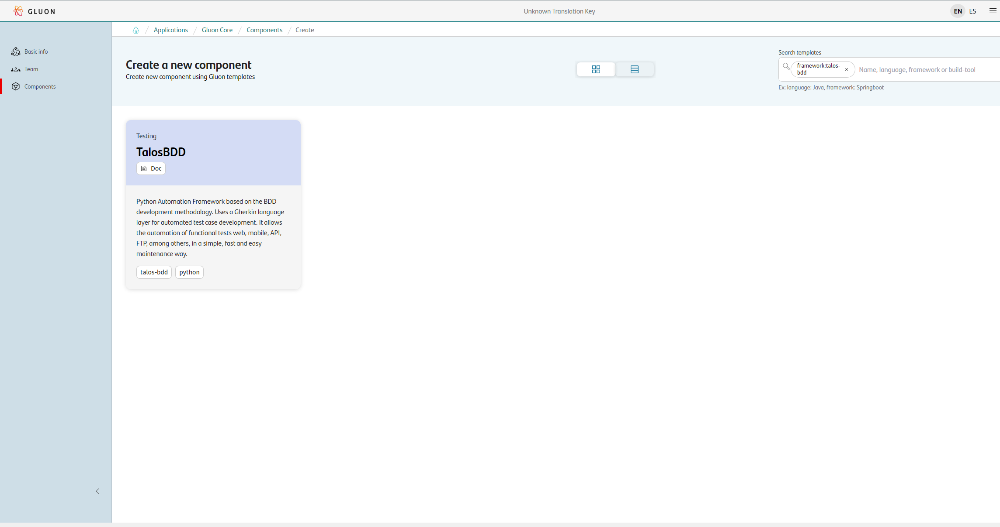
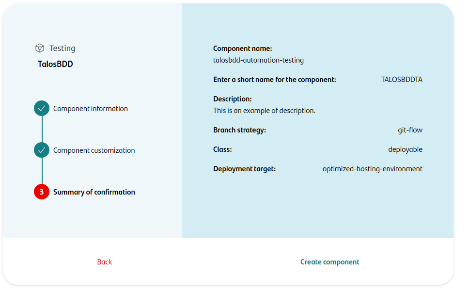
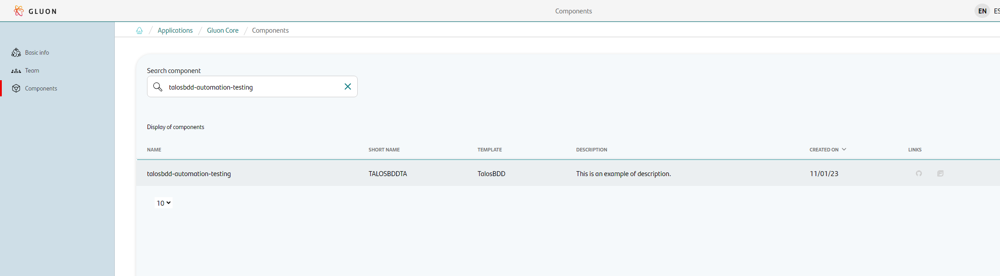
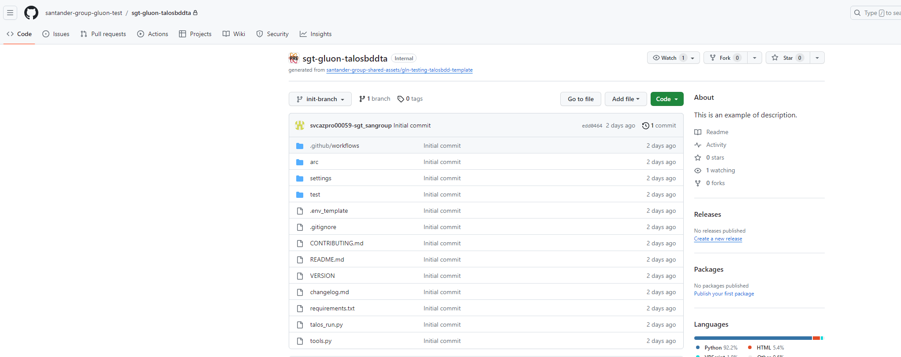

# TalosBDD Journey

## Introduction

**TalosBDD** is a [Python](https://devdocs.io/python~3.6/) test automation framework based on the BDD development
methodology. Uses a Gherkin language layer for automated test case development. It allows the automation of functional
tests web, mobile, API, FTP, among others, in a simple, fast and easy maintenance way.

**You can find more information and documentation in the Sharepoint space of
the [CoE Testing Automation - Talos Ecosystem](https://santandernet.sharepoint.com/sites/Talos-Ecosystem/SitePages/es/Home.aspx)**

----

## Setup your local environment

- [Install Python](../../../../../getting-started/setup-your-environment/technologies/python.md)
- [Install your JDK](../../../../../getting-started/setup-your-environment/technologies/java-maven.md#installing-jdk) (Optional: If you want to run the Talos Connector integrated in TalosBDD).
- **Browsers** (The type of browser is optional, but the one to be used must be installed).
- **Pycharm** (Optional: highly recommended IDE).

## Create Component

### Gluon Portal

First you have to [**onboard your application.**](../../../../../application/application-management/application-onboard.md)
Once you have your application created, you can start creating your component.

To create a component, follow the steps described in [**Componnet Management**](../../../../../application/component-management/create-component.md),
searching for the component to be created.

You have to select the type of component you want to create, in this case you are going to create a **TalosBDD Framework**.



Next, the user must fill out some fields on the **TalosBDD** component creation flow screen.

???+ remember

    To follow the naming convention visit [Repository Naming Convention](../../../../../application/component-management/create-component.md#repository-naming-convention).



- **Branch Strategy**: git-flow
- **Class**: deployable
- **Deployment target**: optimized-hosting-environment

Once the component is created we can see under the application that there is a new repository created with the name of the component.



We have the following links in:

| Item | Link | Role Permission |
| --- | --- | --- |
| GitHub Repository | Link to the repository created in GitHub | Developer (RW) /Technical Lead (Maintain) [All roles explained](https://docs.github.com/es/organizations/managing-user-access-to-your-organizations-repositories/managing-repository-roles/repository-roles-for-an-organization) |
| Sonar Project | Disable | N/A |
| Fortify Project | Disable | N/A |

### TalosBDD Template

When you creates the component from the Gluon Portal, the component is created with the default values of the template from the scaffolding workflow.

- Creates an empty **main** branch
- Creates an **develop** with the structure of files and folders to configure and run your TalosBDD Framework.



#### Structure

The generated TalosBDD Framework has a structure similar to the following:

``` bash

📂.github
┗ 📂workflows
┃ ┗ 📜talosbdd-scaffolding.yml
📂arc
📂settings
┣ 📂conf
┃ ┣ 📜android-properties.cfg
┃ ┣ 📜backend-properties.cfg
┃ ┣ 📜chrome-properties.cfg
┃ ┗ 📜properties.cfg
┣ 📂drivers
┃ ┗ 📜chromedriver.exe
┣ 📂profiles
┃ ┗ 📂cer
┃ ┃ ┗ 📜datas.json
┣ 📂repositories
┃ ┣ 📜elements.yaml
┃ ┗ 📜literals.yaml
┣ 📜settings.py
┗ 📜talosbdd-alm-config.csv
📂test
┣ 📂features
┣ 📂helpers
┃ ┣ 📂page_objects
┃ ┗ 📜hooks.py
┣ 📂steps
  ┣ 📂examples
  ┗ 📜import_steps.py
📜.env_template
📜.gitignore
📜changelog.md
📜CONTRIBUTING.md
📜README.md
📜requirements.txt
📜talos_run.py
📜tools.py
📜VERSION
```

For more information on the structure and functionality of TalosBDD Framework, please refer to the [TalosBDD Documentation](https://santandernet.sharepoint.com/sites/Talos-Ecosystem/SitePages/es/Home.aspx) provided by the framework.

## Local Running

??? abstract "Cloning your repository"

    ### Cloning your repository

    Once we have the device properly configured, the first step is to clone the project locally.

    To do so, visit [**How to clone de project**](../../../../../application/component-management/create-component.md#cloning-a-repository).

??? abstract "Install Dependencies"

    ```batch
    pip install -r requirements.txt
    ```

    If installing the dependencies gives you any errors related to the proxy or SSL, you must configure Pip so that the dependency repository is the Nexus of your organization.

??? abstract "Initial Considerations"

    1- When you run TalosBDD for the first time, you may get an error due to a version conflict between the driver and the browser installed on your computer. To fix this you can update the driver manually or use the built-in driver updater in TalosBDD.

    To activate the automatic updater of TalosBDD you must go to the settings/settings.py file and look for the variable
    “PYTALOS_GENERAL”

    In this variable you will find many general TalosBDD settings but the one you need to enable is the "update_driver"
    setting by setting the value "enabled_update" to True.

    ```python
    PYTALOS_GENERAL = {
        'update_driver': {
                'enabled_update': True, # Set to True to enable automatic driver updater
                'enable_proxy': False,
                'proxy': PROXY
            }
    }
    ```

    2- It is possible that you will also get an error that you must fill in some mandatory configuration fields related to the project information.

    To fix this you should fill in the following variables in the settings/settings.py file as reliably as possible:

    ```python
    # PROJECT INFO IS REQUIRED. PLEASE COMPLETE THESE FIELDS WITH THE PROJECT INFORMATION
    PROJECT_INFO = {
        'application': '',  # application being tested
        'business_area': '',  # application business area
        'entity': '',  # your department
        'user_code': ''  # your LDAP-ID
    }
    ```

    3- If in any previous step you have crashed, got an error or have any questions, please feel free to write to
    the [TalosBDD support channel](https://teams.microsoft.com/l/channel/19%3a81ededf4d389425f92d3ff4bcf49f7b5%40thread.skype/Talos%2520BDD?groupId=66e4a0f7-e684-4a3a-b47e-e583edfe295b&tenantId=35595a02-4d6d-44ac-99e1-f9ab4cd872db)
    about the problem or question you have.

??? abstract "Run TalosBDD"

    To run TalosBDD you have to run the file talos_run.py.

    For that you can execute the following command (you must have the virtual environment activated):

    ```batch
    python talos_run.py
    ```

    This command will run an example test already introduced in the TalosBDD template.

## Gluon Testing

### Configuring pip

By default, when launching an execution with Gluon Testing using Legacy Mode pip will download the dependencies from this [nexus url.](https://nexus.alm.europe.cloudcenter.corp/repository/pypi-public)

The pip.conf file for legacy execution is as following:

``` { .conf }
      [global]
      index = https://nexus.alm.europe.cloudcenter.corp/repository/pypi-public
      index-url = https://nexus.alm.europe.cloudcenter.corp/repository/pypi-public/simple
      trusted-host = pypi.python.org
                pypi.org
                files.pythonhosted.org
                nexus.alm.europe.cloudcenter.corp
```

If this configuration does not work for your project, or you simply want to use another nexus or similar dependency repository, then you can add a pip.conf file to the root of your TalosBDD project.
In the Gluon Testing execution, we will use the PIP_CONFIG_FILE environment variable to point to the pip.conf file of your project. In doing so, it will overwrite the default pip configuration as indicated in the [official pip documentation.](https://pip.pypa.io/en/stable/topics/configuration/#pip-config-file)

## Component Configuration

### Branches

{!
   include-markdown "../../../../snippets/configuration/maven-configuration.md"
   start="<!--Start Gitflow Branches-->"
   end="<!--End Gitflow Branches-->"
!}

## Repository Example

If you need an example of a repository with a microservice created with Gluon, you can visit [the following link](https://github.com/santander-group-gluon-test/sgt-gluon-talosbddta).

## Related Content

- [TalosBDD Testing Workflow](../../../../../application/qatesting/testing/workflows/ondemand/talos.md)
