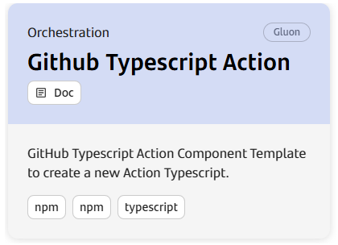

## Introduction

The purpose of this documentation is to provide a **step-by-step guide** on how to build and create tags and releases in the Github repository for Typescript Actions built with NPM.

## Create Component

### Gluon Portal

First you have to [**onboard your application.**](../../../index.md)
Once you have your application created, you can start creating your component.

To create a component, follow the steps described in [**Component Management**](../../../application/component-management/create-component.md),
searching for the component to be created.

You have to select the type of component you want to create, EXAMPLE.



???+ remember

    To follow the naming convention visit [Repository Naming Convention](../../../application/component-management/create-component.md#repository-naming-convention).

The user can customize the type of application that they want to create. For this example we have created a Typescript Action with the following characteristics:

- **Branch Strategy**: branching model that involves the use of feature branches and multiple primary branches.  Values: Git Flow by default.

Once the component is created we can see under the application that there is a new repository created with the name of the component, Sonar project and Fortify project (if applicable to the created component)

We have the following links in:

| Item | Link | Role Permission |
| --- | --- | --- |
| GitHub Repository | Link to the repository created in GitHub | Developer (RW) /Technical Lead (Maintain) [All roles explained](https://docs.github.com/es/organizations/managing-user-access-to-your-organizations-repositories/managing-repository-roles/repository-roles-for-an-organization) |
| Sonar Project | Link to the Sonar project created | All Users (Read) |
| Fortify Project | Link to the Fortify project created | All Users (Read) |

### Typescript Action

#### Branches

##### Git Flow

When you create the component from the Gluon Portal, the component is created with the default values of the template from the scaffolding workflow.

Create an empty main branch
Create a develop branch with the structure of files and folders to configure your typescript action.

The generated repository (git flow branch strategy) has a structure similar to the following:

``` bash

📂.github
 ┣ 📂workflows
 | ┣ 📜ci-gfw.yml
 | ┣ 📜markdown-check.yml
 | ┣ 📜quality.yml
 | ┣ 📜release-gfw.yml
 | ┣ 📜security.yml
 | ┣ 📜update-component-workflow.yml
 | ┗ 📜version-validation.yml
 ┗ 📜CODEOWNERS
📂.gluon
 ┗ 📂ci
    ┗ 📜properties.env
📂dist
📂src
📂test
📜README.doc
📜action.yml
📜jest.config.js
📜package.json
📜tsconfig.json

```

## Local Running

??? abstract "Cloning your repository"

    ### Cloning your repository

    Once we have the device properly configured, the first step is to clone the project locally.

    To do so, visit [**How to clone the project**](../../../application/component-management/create-component.md#cloning-a-repository).

## Component Configuration

The user has a file (properties.env) to configure the properties of the CI cycle. The location of the properties.env is:

``` bash
📂.gluon
┗ 📂ci
  ┗ 📜properties.env
```

``` bash
# if applicable, sonar properties
SONAR_PROJECT_KEY="real-sonar-project-key"

# if applicable, fortify properties
FORTIFY_PROJECT="real-fortify-project-key"

```

## Build and Upload to Nexus/Jfrog your application (Git Flow Branch strategy)

Now we are going to describe the steps that a user has to perform in order to make a complete cycle, from the construction process (CI) to create a tag and release in Github.

The cycle explained below is based on **GitFlow**.

### Quality Gates

We want our artifacts to have the maximum quality in Gluon prior to deployments to production environments, so it will be necessary to have the OK in:

- **Sonar**: Code Quality and test coverage.
- **Fortify**: Analysis of the vulnerabilities of our source code.
- **Sonatype**: Analysis of the vulnerabilities of our dependencies.

!!! warning "Quality Gates"

    Without these QG resolved we will only be able to deploy snapshot versions, being subject to these validations the release version.

### Push to Feature

We will start working on the "Feature" branches of our GitHub repository and later, we will be integrating our changes into the integration branch (develop or development).
The first step is to create a new branch from the integration branch (develop or development) and push the changes to this branch.

When we push the changes to the **"Feature"** branch, the **ci-gfw.yml** (Npm build) workflow will be executed automatically.

#### CI-gfw workflow

- **Setup environment variables**: Load the properties defined in properties.env file and in the configuration project.
- **Resolve version**: Retrieve the version of the package.json
- **Npm build & SonarQube**: Executes the default commands of NPM_RUN_BUILD_COMMAND: npm run build

??? info "CI-gfw workflow code"

    ```yaml linenums="1"
    name: Integration
    on:
        push:
            branches:
                - development
                - develop
                - feature/*
    
    jobs:
        call-reusable-workflow:
            name: Integration
            uses: santander-group-shared-assets/gln-workflows/.github/workflows/npm-build-action.yml@v1
            secrets: inherit
    ```

### Pull Request from Feature to Develop

When we create the **Pull Request** event from our **"Feature" branch to the integration branch** (develop or development), the quality.yml (Sonar), security.yml (Fortify & Sonatype),
version-validation.yml (Version Release validation) workflows will be executed automatically.

Next we detail which steps are executed in each of these workflows:

#### Quality workflow

- **Setup environment variables**: Load the properties defined in properties.env file and in the configuration project.
- **Npm build & SonarQube**: Executes the default commands of NPM_RUN_BUILD_COMMAND: npm run build

??? info "Quality workflow code"

    ```yaml linenums="1"
    name: Quality
    on:
      pull_request:
        branches:
          - development
          - develop
          - main
          - master
          - release-v[0-9]+.[0-9]+.[xX]
     
    jobs:
      call-reusable-workflow:
        name: Quality
        uses: santander-group-shared-assets/gln-workflows/.github/workflows/npm-quality.yml@v1
        secrets: inherit
    ```

#### Security workflow

- **Setup environment variables**:Load the properties defined in properties.env file and in the configuration project.
- **Get current version from package**: Obtain current version from package.json.
- **SSDLC Onboarding Check**:Check component and version in Fortify and create it in case it does not exist.
- **SAST**: Executes the reusable Fortify SAST workflow to perform a SAST scan with Fortify and validate the quality gates.
- **SCA**:Executes the reusable The Sonatype SCA workflow to perform a Sonatype SCA scan and analyze third party components from a repository.
- **Send information to Elasticsearch**:Send data to elasticsearch related with SAST and SCA analysis.

??? info "Security workflow code"

    ```yaml linenums="1"
    name: Security
    on:
      pull_request:
        branches:
          - development
          - develop
          - main
          - master
          - release-v[0-9]+.[0-9]+.[xX]
     
    jobs:
      call-reusable-workflow:
        name: Security
        uses: santander-group-shared-assets/gln-workflows/.github/workflows/npm-security-image.yml@v1
        secrets: inherit
    ```

#### Version validation workflow

- **Setup environment variables**:Load the properties defined in properties.env file and in the configuration project.
- **Get version**: Obtain current version from package.json.
- **Check release**: Check for duplicated versions in the repository.

??? info "Version validation workflow code"

    ```yaml linenums="1"
    name: Npm version release validation
    on:
      pull_request:
        branches:
          - development
          - develop
          - main
          - master
          - release-v[0-9]+.[0-9]+.[xX]
     
    jobs:
      call-reusable-workflow:
        name: Version release validation
        uses: santander-group-shared-assets/gln-workflows/.github/workflows/version-release-validation.yml@v1
        with:
          version_file: 'package.json'
        secrets: inherit
    ```

### Push to Develop

When approving the Pull Request of the previous step on the integration branch (development/develop) we will generate a push event on this branch.
This will be triggering **ci-gfw.yml workflow** (Npm build) and therefore the version is deployed in an artifact repository.

If everything works correctly, we will have our Typescript Action uploaded to an artifact repository we will have the information in Sonar and Fortify.

#### Integration workflow

- **Setup environment variables**:Load the properties defined in properties.env file and in the configuration project.
- **Resolve version**: Resolve the version of the component.
- **Npm build & SonarQube**: Executes the default commands of NPM_RUN_BUILD_COMMAND: npm run build
- **Fortify SAST** Executes the reusable Fortify SAST workflow to perform a SAST scan with Fortify and validate the quality gates.
- **Sonatype SCA**:Executes the reusable The Sonatype SCA workflow to perform a Sonatype SCA scan and analyze third party components from a repository.
- **Send information to Elasticsearch**: Send data to elasticsearch related with SAST and SCA analysis.
- **Npm artifact upload**: Then execute the command 'npm run build' to build the application artifact.
- **Create and merge PR**: Create Pull Request and merge with build changes

### Pull Request from develop to main

When we are ready to promote our library to production, we will create a Pull Request from the integration branch (develop or development) to the main branch.

This event will launch the **quality.yml workflow** (Sonar), the **security.yml workflows** (Fortify & Sonatype) and the **version-validation.yml workflow** (Version Release validation).

### Push to main

When we approve the PR of the previous step on the main branch, we will generate a push event on this branch and therefore the **release-gfw.yml** workflow will be executed automatically.

This workflow will create a commit with the release version in the main branch.

#### Release-gfw workflow

- **Setup environment variables**:Load the properties defined in properties.env file and in the configuration project.
- **Resolve version**: Resolve the version of the component.
- **Npm build & SonarQube**: Executes the default commands of NPM_RUN_BUILD_COMMAND: npm run build
- **Fortify SAST** Executes the reusable Fortify SAST workflow to perform a SAST scan with Fortify and validate the quality gates.
- **Sonatype SCA**:Executes the reusable The Sonatype SCA workflow to perform a Sonatype SCA scan and analyze third party components from a repository.
- **Send information to Elasticsearch**: Send data to elasticsearch related with SAST and SCA analysis.
- **Npm artifact upload**: Then execute the command 'npm run build' to build the application artifact.
- **Getting release id**: Get release version from package.json.
- **Generate tag and release**: Create the tag and publish the release.

??? info "Release-gfw workflow code"

    ```yaml linenums="1"
    name: Release
    on:
        push:
            branches:
                - main
                - master
    jobs:
        call-reusable-workflow:
            name: Release
            uses: santander-group-shared-assets/gln-workflows/.github/workflows/npm-rl-action.yml@v1
            secrets: inherit
    ```
